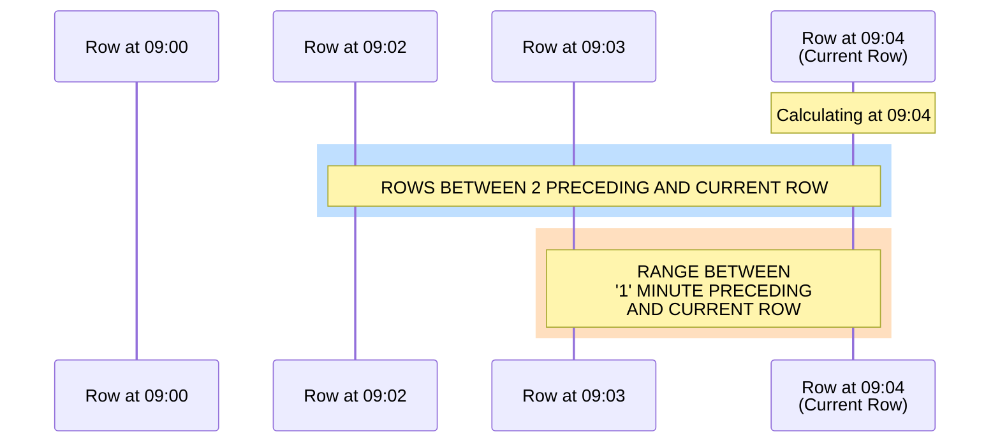
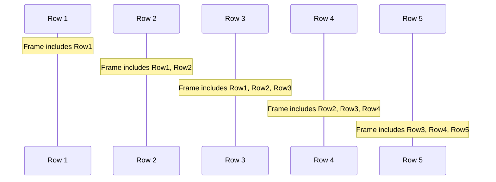
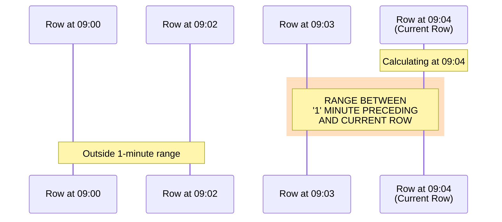
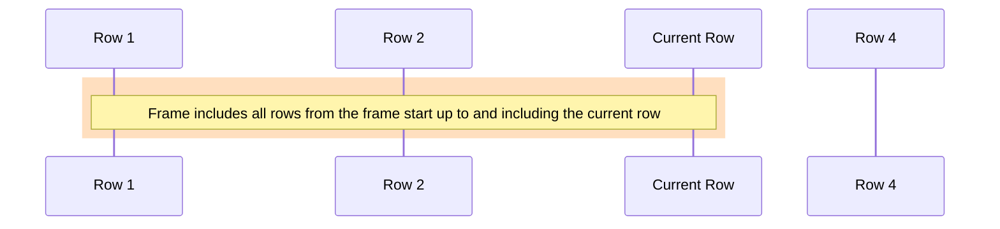
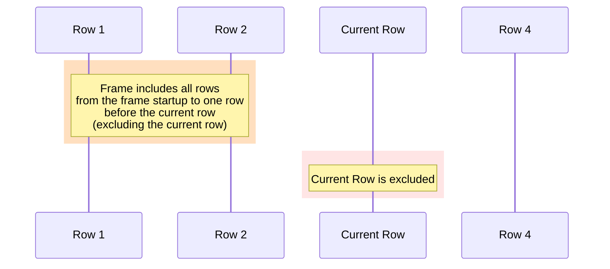
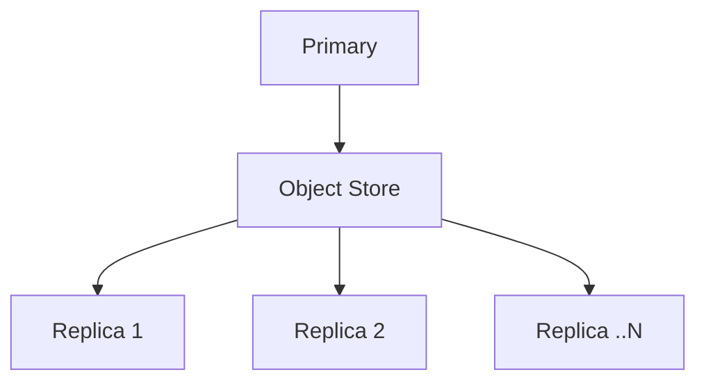
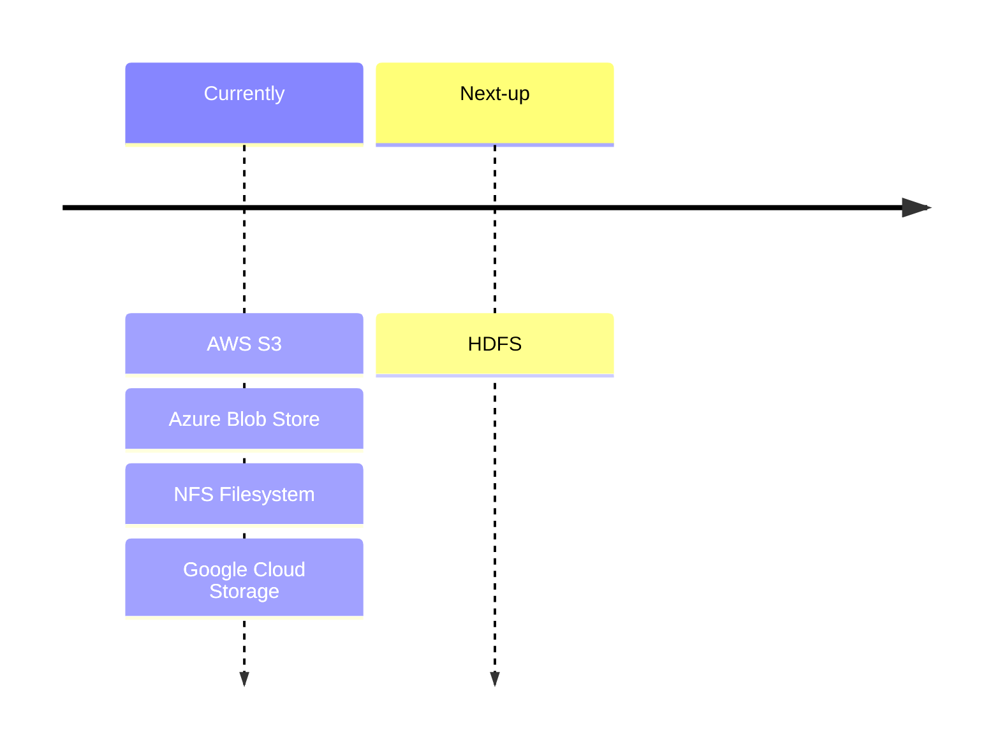

# Functions

## Aggregate functions
**Description**: Aggregate functions reference documentation.

This page describes the available functions to assist with performing aggregate
calculations.

### approx_count_distinct

`approx_count_distinct(column_name, precision)` - estimates the number of
distinct non-`null` values in `IPv4`, `int`, or `long` columns using the
[HyperLogLog](/glossary/HyperLogLog/) data structure, which provides an
approximation rather than an exact count.

The precision of HyperLogLog can be controlled via the optional `precision`
parameter, typically between 4 and 16. A higher precision leads to more accurate
results with increased memory usage. The default is 1.

This function is useful within [high cardinality](/glossary/high-cardinality/)
datasets where an exact count is not required. Thus consider it the higher
cardinality alternative to
[`count_distinct`](/docs/reference/function/aggregation/#count_distinct).

##### Parameters

- `column_name`: The name of the column for which to estimate the count of
  distinct values.
- `precision` (optional): A number specifying the precision of the
  [HyperLogLog](/glossary/hyperloglog/) algorithm, which influences the
  trade-off between accuracy and memory usage. A higher precision gives a more
  accurate estimate, but consumes more memory. Defaults to 1 (lower accuracy,
  high efficiency).

##### Return value

Return value type is `long`.

##### Examples

_Please note that exact example values will vary as they are approximations
derived from the HyperLogLog algorithm._

```questdb-sql title="Estimate count of distinct IPv4 addresses with precision 5"
SELECT approx_count_distinct(ip_address, 5) FROM logs;
```

| approx_count_distinct |
| :-------------------- |
| 1234567               |

---

```questdb-sql title="Estimate count of distinct user_id (int) values by date"
SELECT date, approx_count_distinct(user_id) FROM sessions GROUP BY date;
```

| date       | approx_count_distinct |
| :--------- | :-------------------- |
| 2023-01-01 | 2358                  |
| 2023-01-02 | 2491                  |
| ...        | ...                   |

---

```questdb-sql title="Estimate count of distinct product_id values by region"
SELECT region, approx_count_distinct(product_id) FROM sales GROUP BY region;
```

| region | approx_count_distinct |
| :----- | :-------------------- |
| North  | 1589                  |
| South  | 1432                  |
| East   | 1675                  |
| West   | 1543                  |

---

```questdb-sql title="Estimate count of distinct order_ids with precision 8"
SELECT approx_count_distinct(order_id, 8) FROM orders;
```

| approx_count_distinct |
| :-------------------- |
| 3456789               |

---

```questdb-sql title="Estimate count of distinct transaction_ids by store_id"
SELECT store_id, approx_count_distinct(transaction_id) FROM transactions GROUP BY store_id;
```

| store_id | approx_count_distinct |
| :------- | :-------------------- |
| 1        | 56789                 |
| 2        | 67890                 |
| ...      | ...                   |

### approx_percentile

`approx_percentile(value, percentile, precision)` calculates the approximate
value for the given non-negative column and percentile using the
[HdrHistogram](http://hdrhistogram.org/) algorithm.

##### Parameters

- `value` is any numeric non-negative value.
- `percentile` is a `double` value between 0.0 and 1.0, inclusive.
- `precision` is an optional `int` value between 0 and 5, inclusive. This is the
  number of significant decimal digits to which the histogram will maintain
  value resolution and separation. For example, when the input column contains
  integer values between 0 and 3,600,000,000 and the precision is set to 3,
  value quantization within the range will be no larger than 1/1,000th (or 0.1%)
  of any value. In this example, the function tracks and analyzes the counts of
  observed response times ranging between 1 microsecond and 1 hour in magnitude,
  while maintaining a value resolution of 1 microsecond up to 1 millisecond, a
  resolution of 1 millisecond (or better) up to one second, and a resolution of
  1 second (or better) up to 1,000 seconds. At its maximum tracked value (1
  hour), it would still maintain a resolution of 3.6 seconds (or better).

##### Return value

Return value type is `double`.

##### Examples

```questdb-sql title="Approximate percentile"
SELECT approx_percentile(latency, 0.99) FROM request_logs;
```

| approx_percentile |
| :---------------- |
| 101.5             |

### approx_median

`approx_median(value, precision)` calculates the approximate median (50th percentile) of a set of non-negative numeric values using the [HdrHistogram](http://hdrhistogram.org/) algorithm. This is equivalent to calling `approx_percentile(value, 0.5, precision)`.

The function will throw an error if any negative values are encountered in the input. All input values must be non-negative.

##### Parameters

- `value` is any non-negative numeric value.
- `precision` (optional) is an `int` value between 0 and 5, inclusive. This is the number of significant decimal digits to which the histogram will maintain value resolution and separation. Higher precision leads to more accurate results with increased memory usage. Defaults to 1 (lower accuracy, high efficiency).

##### Return value

Return value type is `double`.

##### Examples

```questdb-sql title="Calculate approximate median price by symbol" demo
SELECT symbol, approx_median(price) FROM trades GROUP BY symbol;
```

| symbol  | approx_median |
| :------ | :----------- |
| BTC-USD | 39265.31     |
| ETH-USD | 2615.46      |

```questdb-sql title="Calculate approximate median with higher precision" demo
SELECT symbol, approx_median(price, 3) FROM trades GROUP BY symbol;
```

| symbol  | approx_median |
| :------ | :----------- |
| BTC-USD | 39265.312    |
| ETH-USD | 2615.459     |

### avg

`avg(value)` calculates simple average of values ignoring missing data (e.g
`null` values).

##### Parameters

- `value` is any numeric value.

##### Return value

Return value type is `double`.

##### Examples

```questdb-sql title="Average transaction amount"
SELECT avg(amount) FROM transactions;
```

| avg  |
| :--- |
| 22.4 |

```questdb-sql title="Average transaction amount by payment_type"
SELECT payment_type, avg(amount) FROM transactions;
```

| payment_type | avg   |
| :----------- | :---- |
| cash         | 22.1  |
| card         | 27.4  |
| null         | 18.02 |

### corr

`corr(arg0, arg1)` is a function that measures how closely two sets of numbers
move in the same direction. It does this by comparing how much each number in
each set differs from the average of its set. This calculation is based on
[Welford's Algorithm](https://en.wikipedia.org/wiki/Algorithms_for_calculating_variance#Welford's_online_algorithm).

- If the numbers in both sets tend to be above or below their average values at
  the same time, the function will return a value close to 1.

- If one set of numbers tends to be above its average value when the other set
  is below its average, the function will return a value close to -1.

- If there's no clear pattern, the function will return a value close to 0.

##### Parameters

- `arg0` is any numeric value representing the first variable
- `arg1` is any numeric value representing the second variable

##### Return value

Return value type is `double`.

##### Examples

```questdb-sql title="Correlation between price and quantity"
SELECT corr(price, quantity) FROM transactions;
```

| corr |
| :--- |
| 0.89 |

```questdb-sql title="Correlation between price and quantity grouped by payment type"
SELECT payment_type, corr(price, quantity) FROM transactions GROUP BY payment_type;
```

| payment_type | avg  |
| :----------- | :--- |
| cash         | 0.85 |
| card         | 0.92 |
| null         | 0.78 |

### count

- `count()` or `count(*)` - counts the number of rows irrespective of underlying
  data.
- `count(column_name)` - counts the number of non-null values in a given column.

##### Parameters

- `count()` does not require arguments.
- `count(column_name)` - supports the following data types:
  - `double`
  - `float`
  - `integer`
  - `character`
  - `short`
  - `byte`
  - `timestamp`
  - `date`
  - `long`
  - `long256`
  - `geohash`
  - `varchar`
  - `string`
  - `symbol`

##### Return value

Return value type is `long`.

##### Examples

Count of rows in the `transactions` table:

```questdb-sql
SELECT count() FROM transactions;
```

| count |
| :---- |
| 100   |

Count of rows in the `transactions` table aggregated by the `payment_type`
value:

```questdb-sql
SELECT payment_type, count() FROM transactions;
```

| payment_type | count |
| :----------- | :---- |
| cash         | 25    |
| card         | 70    |
| null         | 5     |

Count non-null transaction amounts:

```questdb-sql
SELECT count(amount) FROM transactions;
```

| count |
| :---- |
| 95    |

Count non-null transaction amounts by `payment_type`:

```questdb-sql
SELECT payment_type, count(amount) FROM transactions;
```

| payment_type | count |
| :----------- | :---- |
| cash         | 24    |
| card         | 67    |
| null         | 4     |

:::note

`null` values are aggregated with `count()`, but not with `count(column_name)`

:::

### count_distinct

`count_distinct(column_name)` - counts distinct non-`null` values in `varchar`,
`symbol`, `long256`, `UUID`, `IPv4`, `long`, `int` or `string` columns.

##### Return value

Return value type is `long`.

##### Examples

- Count of distinct sides in the transactions table. Side column can either be
  `BUY` or `SELL` or `null`.

```questdb-sql
SELECT count_distinct(side) FROM transactions;
```

| count_distinct |
| :------------- |
| 2              |

- Count of distinct counterparties in the transactions table aggregated by
  `payment_type` value.

```questdb-sql
SELECT payment_type, count_distinct(counterparty) FROM transactions;
```

| payment_type | count_distinct |
| :----------- | :------------- |
| cash         | 3              |
| card         | 23             |
| null         | 5              |

### covar_pop

`covar_pop(arg0, arg1)` is a function that measures how much two sets of numbers
change together. It does this by looking at how much each number in each set
differs from the average of its set. It multiplies these differences together,
adds them all up, and then divides by the total number of pairs. This gives a
measure of the overall trend.

- If the numbers in both sets tend to be above or below their average values at
  the same time, the function will return a positive number.

- If one set of numbers tends to be above its average value when the other set
  is below its average, the function will return a negative number.

- The closer the result is to zero, the less relationship there is between the
  two sets of numbers.

##### Parameters

- `arg0` is any numeric value representing the first variable
- `arg1` is any numeric value representing the second variable.

##### Return value

Return value type is `double`.

##### Examples

```questdb-sql title="Population covariance between price and quantity"
SELECT covar_pop(price, quantity) FROM transactions;
```

| covar_pop |
| :-------- |
| 15.2      |

```questdb-sql title="Population covariance between price and quantity grouped by payment type"
SELECT payment_type, covar_pop(price, quantity) FROM transactions GROUP BY payment_type;
```

| payment_type | covar_pop |
| :----------- | :-------- |
| cash         | 14.8      |
| card         | 16.2      |
| null         | 13.5      |

### covar_samp

`covar_samp(arg0, arg1)` is a function that finds the relationship between two
sets of numbers. It does this by looking at how much the numbers vary from the
average in each set.

- If the numbers in both sets tend to be above or below their average values at
  the same time, the function will return a positive number.

- If one set of numbers tends to be above its average value when the other set
  is below its average, the function will return a negative number.

- The closer the result is to zero, the less relationship there is between the
  two sets of numbers.

##### Parameters

- `arg0` is any numeric value representing the first variable.
- `arg1` is any numeric value representing the second variable.

##### Return value

Return value type is `double`.

##### Examples

```questdb-sql title="Sample covariance between price and quantity"
SELECT covar_samp(price, quantity) FROM transactions;
```

| covar_samp |
| :--------- |
| 15.8       |

```questdb-sql title="Sample covariance between price and quantity grouped by payment type"
SELECT payment_type, covar_samp(price, quantity) FROM transactions GROUP BY payment_type;
```

| payment_type | covar_samp |
| :----------- | :--------- |
| cash         | 15.4       |
| card         | 16.8       |
| null         | 14.1       |

### first/last

- `first(column_name)` - returns the first value of a column.
- `last(column_name)` - returns the last value of a column.

Supported column datatype: `double`, `float`, `integer`, `IPv4`, `character`,
`short`, `byte`, `timestamp`, `date`, `long`, `geohash`, `symbol`, `varchar` and
`uuid`.

If a table has a [designated timestamp](/docs/concept/designated-timestamp/),
then the first row is always the row with the lowest timestamp (oldest) and the
last row is always the one with the highest (latest) timestamp. For a table
without a designated timestamp column, `first` returns the first row and `last`
returns the last inserted row, regardless of any timestamp column.

##### Return value

Return value type is the same as the type of the argument.

##### Examples

Given a table `sensors`, which has a designated timestamp column:

| device_id  | temperature | ts                          |
| :--------- | :---------- | :-------------------------- |
| arduino-01 | 12          | 2021-06-02T14:33:19.970258Z |
| arduino-02 | 10          | 2021-06-02T14:33:21.703934Z |
| arduino-03 | 18          | 2021-06-02T14:33:23.707013Z |

The following query returns oldest value for the `device_id` column:

```questdb-sql
SELECT first(device_id) FROM sensors;
```

| first      |
| :--------- |
| arduino-01 |

The following query returns the latest symbol value for the `device_id` column:

```questdb-sql
SELECT last(device_id) FROM sensors;
```

| last       |
| :--------- |
| arduino-03 |

Without selecting a designated timestamp column, the table may be unordered and
the query may return different result. Given an unordered table
`sensors_unordered`:

| device_id  | temperature | ts                          |
| :--------- | :---------- | :-------------------------- |
| arduino-01 | 12          | 2021-06-02T14:33:19.970258Z |
| arduino-03 | 18          | 2021-06-02T14:33:23.707013Z |
| arduino-02 | 10          | 2021-06-02T14:33:21.703934Z |

The following query returns the first record for the `device_id` column:

```questdb-sql
SELECT first(device_id) FROM sensors_unordered;
```

| first      |
| :--------- |
| arduino-01 |

The following query returns the last record for the `device_id` column:

```questdb-sql
SELECT last(device_id) FROM sensors_unordered;
```

| last       |
| :--------- |
| arduino-02 |

### first_not_null

- `first_not_null(column_name)` - returns the first non-null value of a column.

Supported column datatype: `double`, `float`, `integer`, `IPv4`, `char`,
`short`, `byte`, `timestamp`, `date`, `long`, `geohash`, `symbol`, `varchar` and
`uuid`.

If a table has a designated timestamp, then the first non-null row is always the
row with the lowest timestamp (oldest). For a table without a designated
timestamp column, `first_not_null` returns the first non-null row, regardless of
any timestamp column.

##### Return value

Return value type is the same as the type of the argument.

##### Examples

Given a table `sensors`, which has a designated timestamp column:

| device_id  | temperature | ts                          |
| :--------- | :---------- | :-------------------------- |
| null       | 12          | 2021-06-02T14:33:19.970258Z |
| arduino-02 | 10          | 2021-06-02T14:33:21.703934Z |
| arduino-03 | 18          | 2021-06-02T14:33:23.707013Z |

The following query returns oldest non-null value for the device_id column:

```questdb-sql
SELECT first_not_null(device_id) FROM sensors;
```

| first_not_null |
| :------------- |
| arduino-02     |

Without selecting a designated timestamp column, the table may be unordered and
the query may return different result. Given an unordered table
`sensors_unordered`:

| device_id  | temperature | ts                          |
| :--------- | :---------- | :-------------------------- |
| null       | 12          | 2021-06-02T14:33:19.970258Z |
| arduino-03 | 18          | 2021-06-02T14:33:23.707013Z |
| arduino-02 | 10          | 2021-06-02T14:33:21.703934Z |

The following query returns the first non-null record for the device_id column:

```questdb-sql
SELECT first_not_null(device_id) FROM sensors_unordered;
```

| first_not_null |
| :------------- |
| arduino-03     |

### last_not_null

- `last_not_null(column_name)` - returns the last non-null value of a column.

Supported column datatype: `double`, `float`, `integer`, `IPv4`, `char`,
`short`, `byte`, `timestamp`, `date`, `long`, `geohash`, `symbol`, `varchar` and
`uuid`.

If a table has a designated timestamp, then the last non-null row is always the
row with the highest timestamp (most recent). For a table without a designated
timestamp column, `last_not_null` returns the last non-null row, regardless of
any timestamp column.

##### Return value

Return value type is the same as the type of the argument.

##### Examples

Given a table `sensors`, which has a designated timestamp column:

| device_id  | temperature | ts                          |
| :--------- | :---------- | :-------------------------- |
| null       | 12          | 2021-06-02T14:33:19.970258Z |
| arduino-02 | 10          | 2021-06-02T14:33:21.703934Z |
| arduino-03 | 18          | 2021-06-02T14:33:23.707013Z |

The following query returns most recent non-null value for the device_id column:

```questdb-sql
SELECT last_not_null(device_id) FROM sensors;
```

| last_not_null |
| :------------ |
| arduino-03    |

Without selecting a designated timestamp column, the table may be unordered and
the query may return different result. Given an unordered table
`sensors_unordered`:

| device_id  | temperature | ts                          |
| :--------- | :---------- | :-------------------------- |
| null       | 12          | 2021-06-02T14:33:19.970258Z |
| arduino-03 | 18          | 2021-06-02T14:33:23.707013Z |
| arduino-02 | 10          | 2021-06-02T14:33:21.703934Z |

The following query returns the last non-null record for the `device_id` column:

```questdb-sql
SELECT last_not_null(device_id) FROM sensors_unordered;
```

| last_not_null |
| :------------ |
| arduino-02    |

### haversine_dist_deg

`haversine_dist_deg(lat, lon, ts)` - calculates the traveled distance for a
series of latitude and longitude points.

##### Parameters

- `lat` is the latitude expressed as degrees in decimal format (`double`)
- `lon` is the longitude expressed as degrees in decimal format (`double`)
- `ts` is the `timestamp` for the data point

##### Return value

Return value type is `double`.

##### Examples

```questdb-sql title="Calculate the aggregate traveled distance for each car_id"
SELECT car_id, haversine_dist_deg(lat, lon, k)
  FROM table rides
```

### ksum

`ksum(value)` - adds values ignoring missing data (e.g `null` values). Values
are added using the

[Kahan compensated sum algorithm](https://en.wikipedia.org/wiki/Kahan_summation_algorithm).
This is only beneficial for floating-point values such as `float` or `double`.

##### Parameters

- `value` is any numeric value.

##### Return value

Return value type is the same as the type of the argument.

##### Examples

```questdb-sql
SELECT ksum(a)
FROM (SELECT rnd_double() a FROM long_sequence(100));
```

| ksum              |
| :---------------- |
| 52.79143968514029 |

### max

`max(value)` - returns the highest value ignoring missing data (e.g `null`
values).

##### Parameters

- `value` is any numeric or string value

##### Return value

Return value type is the same as the type of the argument.

##### Examples

```questdb-sql title="Highest transaction amount"
SELECT max(amount) FROM transactions;
```

| max  |
| :--- |
| 55.3 |

```questdb-sql title="Highest transaction amount by payment_type"
SELECT payment_type, max(amount) FROM transactions;
```

| payment_type | amount |
| :----------- | :----- |
| cash         | 31.5   |
| card         | 55.3   |
| null         | 29.2   |

### min

`min(value)` - returns the lowest value ignoring missing data (e.g `null`
values).

##### Parameters

- `value` is any numeric or string value

##### Return value

Return value type is the same as the type of the argument.

##### Examples

```questdb-sql title="Lowest transaction amount"
SELECT min(amount) FROM transactions;
```

| min  |
| :--- |
| 12.5 |

```questdb-sql title="Lowest transaction amount, by payment_type"
SELECT payment_type, min(amount) FROM transactions;
```

| payment_type | min  |
| :----------- | :--- |
| cash         | 12.5 |
| card         | 15.3 |
| null         | 22.2 |

### nsum

`nsum(value)` - adds values ignoring missing data (e.g `null` values). Values
are added using the
[Neumaier sum algorithm](https://en.wikipedia.org/wiki/Kahan_summation_algorithm#Further_enhancements).
This is only beneficial for floating-point values such as `float` or `double`.

##### Parameters

- `value` is any numeric value.

##### Return value

Return value type is `double`.

##### Examples

```questdb-sql
SELECT nsum(a)
FROM (SELECT rnd_double() a FROM long_sequence(100));
```

| nsum             |
| :--------------- |
| 49.5442334742831 |

### stddev / stddev_samp

`stddev_samp(value)` - Calculates the sample standard deviation of a set of
values, ignoring missing data (e.g., null values). The sample standard deviation
is a measure of the amount of variation or dispersion in a sample of a
population. A low standard deviation indicates that the values tend to be close
to the mean of the set, while a high standard deviation indicates that the
values are spread out over a wider range.

`stddev` is an alias for `stddev_samp`.

##### Parameters

- `value` is any numeric value.

##### Return value

Return value type is `double`.

##### Examples

```questdb-sql
SELECT stddev_samp(x)
FROM (SELECT x FROM long_sequence(100));
```

| stddev_samp     |
| :-------------- |
| 29.011491975882 |

### stddev_pop

`stddev_pop(value)` - Calculates the population standard deviation of a set of
values. The population standard deviation is a measure of the amount of
variation or dispersion of a set of values. A low standard deviation indicates
that the values tend to be close to the mean of the set, while a high standard
deviation indicates that the values are spread out over a wider range.

##### Parameters

- `value` is any numeric value.

##### Return value

Return value type is `double`.

##### Examples

```questdb-sql
SELECT stddev_pop(x)
FROM (SELECT x FROM long_sequence(100));
```

| stddev_samp       |
| :---------------- |
| 28.86607004772212 |

### string_agg

`string_agg(value, delimiter)` - Concatenates the given string values into a
single string with the delimiter used as a value separator.

##### Parameters

- `value` is a `varchar` value.
- `delimiter` is a `char` value.

##### Return value

Return value type is `varchar`.

##### Examples

```questdb-sql
SELECT string_agg(x::varchar, ',')
FROM (SELECT x FROM long_sequence(5));
```

| string_agg |
| :--------- |
| 1,2,3,4,5  |

### string_distinct_agg

`string_distinct_agg(value, delimiter)` - concatenates distinct non-null string
values into a single string, using the specified delimiter to separate the
values.

- `string_distinct_agg` ignores null values and only concatenates non-null
  distinct values.

- Order is guaranteed.

- Does not support `ORDER BY`.

##### Parameters

- `value`: A varchar or string column containing the values to be aggregated.
- `delimiter`: A char value used to separate the distinct values in the
  concatenated string.

##### Return value

Return value type is `string`.

##### Examples

Suppose we want to find all the distinct sky cover types observed in the weather
tablein our public demo:

```questdb-sql title="string_distinct_agg example" demo
SELECT string_distinct_agg(skyCover, ',') AS distinct_sky_covers
FROM weather;
```

This query will return a single string containing all the distinct skyCover
values separated by commas. The skyCover column contains values such as OVC
(Overcast), BKN (Broken clouds), SCT (Scattered clouds), and CLR (Clear skies).
Even though the skyCover column may have many rows with repeated values,
`string_distinct_agg` aggregates only the unique non-null values. The result is a
comma-separated list of all distinct sky cover conditions observed.

Result:

| distinct_sky_covers |
| ------------------- |
| OVC,BKN,SCT,CLR,OBS |

You can also group the aggregation by another column.

To find out which sky cover conditions are observed for each wind direction:

```questdb-sql title="string_distinct_agg example with GROUP BY" demo
SELECT windDir, string_distinct_agg(skyCover, ',') AS distinct_sky_covers
FROM weather
GROUP BY windDir;
```

| windDir | distinct_sky_covers |
| ------- | ------------------- |
| 30      | OVC,BKN             |
| 45      | BKN,SCT             |
| 60      | OVC,SCT,CLR         |

### sum

`sum(value)` - adds values ignoring missing data (e.g `null` values).

##### Parameters

- `value` is any numeric value.

##### Return value

Return value type is the same as the type of the argument.

##### Examples

```questdb-sql title="Sum all quantities in the transactions table"
SELECT sum(quantity) FROM transactions;
```

| sum |
| :-- |
| 100 |

```questdb-sql title="Sum all quantities in the transactions table, aggregated by item"
SELECT item, sum(quantity) FROM transactions;
```

| item   | count |
| :----- | :---- |
| apple  | 53    |
| orange | 47    |

##### Overflow

`sum` does not perform overflow check. To avoid overflow, you can cast the
argument to wider type.

```questdb-sql title="Cast as long to avoid overflow"
SELECT sum(cast(a AS LONG)) FROM table;
```

### variance / var_samp

`var_samp(value)` - Calculates the sample variance of a set of values. The
sample variance is a measure of the amount of variation or dispersion of a set
of values in a sample from a population. A low variance indicates that the
values tend to be very close to the mean, while a high variance indicates that
the values are spread out over a wider range.

`variance()` is an alias for `var_samp`.

##### Parameters

- `value` is any numeric value.

##### Return value

Return value type is `double`.

##### Examples

```questdb-sql
SELECT var_samp(x)
FROM (SELECT x FROM long_sequence(100));
```

| stddev_samp      |
| :--------------- |
| 841.666666666666 |

### var_pop

`var_pop(value)` - Calculates the population variance of a set of values. The
population variance is a measure of the amount of variation or dispersion of a
set of values. A low variance indicates that the values tend to be very close to
the mean, while a high variance indicates that the values are spread out over a
wider range.

##### Parameters

- `value` is any numeric value.

##### Return value

Return value type is `double`.

##### Examples

```questdb-sql
SELECT var_pop(x)
FROM (SELECT x FROM long_sequence(100));
```

| stddev_samp |
| :---------- |
| 833.25      |

## Array functions
**Description**: Array functions reference documentation.

This page documents functions for n-dimensional arrays. This isn't an exhaustive
list of all functions that may take an array parameter. For example, financial
functions are listed in [their own section](/docs/reference/function/finance/), whether or
not they can take an array parameter.

### array_avg

`array_avg(array)` returns the average of all the array elements. `NULL` elements
don't contribute to either count or sum.

##### Parameter

- `array` — the array

##### Example

```questdb-sql
SELECT array_avg(ARRAY[ [1.0, 1.0], [2.0, 2.0] ]);
```

| array_avg |
| --------- |
| 1.5       |

### array_count

`array_count(array)` returns the number of finite elements in the array. `NULL`
elements do not contribute to the count.

##### Parameter

- `array` — the array

##### Example

```questdb-sql
SELECT
  array_count(ARRAY[ [1.0, null], [null, 2.0] ]) c1,
  array_count(ARRAY[ [0.0/0.0, 1.0/0.0], [-1.0/0.0, 0.0/0.0] ]) c2;
```

| c1 |  c2 |
| ---| --- |
| 2  |  0  |

### array_cum_sum

`array_cum_sum(array)` returns a 1D array of the cumulative sums over the array,
traversing it in row-major order. The input array can have any dimensionality.
The returned 1D array has the same number of elements as the input array. `NULL`
elements behave as if they were zero.

##### Parameter

- `array` — the array

##### Example

```questdb-sql
SELECT array_cum_sum(ARRAY[ [1.0, 1.0], [2.0, 2.0] ]);
```

|      array_cum_sum     |
| ---------------------- |
| ARRAY[1.0,2.0,4.0,6.0] |

### array_max

`array_max(array)` returns the maximum value from all the array elements. `NULL`
elements and non-finite values (NaN, Infinity) are ignored. If the array
contains no finite values, the function returns `NULL`.

##### Parameter

- `array` — the array

##### Example

```questdb-sql
SELECT array_max(ARRAY[ [1.0, 5.0], [3.0, 2.0] ]);
```

| array_max |
| --------- |
| 5.0       |

### array_min

`array_min(array)` returns the minimum value from all the array elements. `NULL`
elements and non-finite values (NaN, Infinity) are ignored. If the array
contains no finite values, the function returns `NULL`.

##### Parameter

- `array` — the array

##### Example

```questdb-sql
SELECT array_min(ARRAY[ [1.0, 5.0], [3.0, 2.0] ]);
```

| array_min |
| --------- |
| 1.0       |

### array_position

`array_position(array, elem)` returns the position of `elem` inside the 1D `array`. If
`elem` doesn't appear in `array`, it returns `NULL`. If `elem` is `NULL`, it returns the
position of the first `NULL` element, if any.

##### Parameters

- `array` — the 1D array
- `elem` — the element to look for

##### Examples

```questdb-sql
SELECT
  array_position(ARRAY[1.0, 2.0], 1.0) p1,
  array_position(ARRAY[1.0, 2.0], 3.0) p2;
```

| p1 | p2   |
| -- | ---- |
| 1  | NULL |

### array_sum

`array_sum(array)` returns the sum of all the array elements. `NULL` elements
behave as if they were zero.

##### Parameter

- `array` — the array

##### Example

```questdb-sql
SELECT array_sum(ARRAY[ [1.0, 1.0], [2.0, 2.0] ]);
```

| array_sum |
| --------- |
| 6.0       |

### array_stddev

`array_stddev(array)` returns the sample standard deviation of all the array
elements. This is an alias for `array_stddev_samp()`. `NULL` elements and
non-finite values (NaN, Infinity) are ignored. If the array contains fewer than
2 finite values, the function returns `NULL`.

##### Parameter

- `array` — the array

##### Example

```questdb-sql
SELECT array_stddev(ARRAY[ [1.0, 2.0], [3.0, 4.0] ]);
```

| array_stddev |
| ------------ |
| 1.29099445   |

### array_stddev_pop

`array_stddev_pop(array)` returns the population standard deviation of all the
array elements. `NULL` elements and non-finite values (NaN, Infinity) are
ignored. The population standard deviation uses N in the denominator of the
standard deviation formula. If the array contains no finite values, the function
returns `NULL`.

##### Parameter

- `array` — the array

##### Example

```questdb-sql
SELECT array_stddev_pop(ARRAY[ [1.0, 2.0], [3.0, 4.0] ]);
```

| array_stddev_pop |
| ---------------- |
| 1.11803399       |

### array_stddev_samp

`array_stddev_samp(array)` returns the sample standard deviation of all the
array elements. `NULL` elements and non-finite values (NaN, Infinity) are
ignored. The sample standard deviation uses N-1 in the denominator of the
standard deviation formula. If the array contains fewer than 2 finite values,
the function returns `NULL`.

##### Parameter

- `array` — the array

##### Example

```questdb-sql
SELECT array_stddev_samp(ARRAY[ [1.0, 2.0], [3.0, 4.0] ]);
```

| array_stddev_samp |
| ----------------- |
| 1.29099445        |

### dim_length

`dim_length(array, dim)` returns the length of the n-dimensional array along
dimension `dim`.

##### Parameters

- `array` — the array
- `dim` — the dimension (1-based) whose length to get

##### Example

Get the length of the array along the 1st dimension.

```questdb-sql
SELECT dim_length(ARRAY[42, 42], 1);
```

|  dim_length  |
| ------------ |
|       2      |

### dot_product

`dot_product(left_array, right_array)` returns the dot-product of the two
arrays, which must be of the same shape. The result is equal to
`array_sum(left_array * right_array)`.

##### Parameters

- `left_array` — the left array
- `right_array` — the right array

##### Example

```questdb-sql
SELECT dot_product(
  ARRAY[ [3.0, 4.0], [2.0, 5.0] ],
  ARRAY[ [3.0, 4.0], [2.0, 5.0] ]
);
```

| dot_product |
| ----------- |
| 54.0        |

### flatten

`flatten(array)` flattens all the array's elements into a 1D array, in row-major
order.

##### Parameters

- `array` — the array

##### Example

Flatten a 2D array.

```questdb-sql
SELECT flatten(ARRAY[[1, 2], [3, 4]]);
```

|      flatten      |
| ----------------- |
| [1.0,2.0,3.0,4.0] |

### insertion_point

Finds the insertion point of the supplied value into a sorted 1D array. The
array can be sorted ascending or descending, and the function auto-detects this.

:::warning

The array must be sorted, and must not contain `NULL`s, but this function
doesn't enforce it. It runs a binary search for the value, and the behavior with
an unsorted array is unspecified.

:::

##### Parameters

- `array` — the 1D array
- `value` — the value whose insertion point to look for
- `ahead_of_equal` (optional, default `false`) — when true (false), returns the
  insertion point before (after) any elements equal to `value`

##### Examples

```questdb-sql
SELECT
  insertion_point(ARRAY[1.0, 2.0, 3.0], 2.5) i1,
  insertion_point(ARRAY[1.0, 2.0, 3.0], 2.0) i2,
  insertion_point(ARRAY[1.0, 2.0, 3.0], 2.0, true) i3;
```

| i1 | i2 | i3 |
| -- | -- | -- |
| 3  | 3  | 2  |

### matmul

`matmul(left_matrix, right_matrix)` performs matrix multiplication. This is an
operation from linear algebra.

A matrix is represented as a 2D array. We call the first matrix coordinate "row"
and the second one "column".

`left_matrix`'s number of columns (its dimension 2) must be equal to
`right_matrix`'s number of rows (its dimension 1).

The resulting matrix has the same number of rows as `left_matrix` and the same
number of columns as `right_matrix`. The value at every (row, column) position
in the result is equal to the sum of products of matching elements in the
corresponding row of `left_matrix` and column of `right_matrix`. In a formula,
with C = A x B:

$$

C_{jk} = \sum_{i=1}^{n} A_{ji} B_{ik}

$$

##### Parameters

- `left_matrix`: the left-hand matrix. Must be a 2D array
- `right_matrix`: the right-hand matrix. Must be a 2D array with as many rows as
  there are columns in `left_matrix`

##### Example

Multiply the matrices:

$$

\begin{bmatrix}
1 & 2 \\
3 & 4
\end{bmatrix}
\times
\begin{bmatrix}
2 & 3 \\
2 & 3
\end{bmatrix}
=
\begin{bmatrix}
6 & 9 \\
14 & 21
\end{bmatrix}

$$

```questdb-sql
SELECT matmul(ARRAY[[1, 2], [3, 4]], ARRAY[[2, 3], [2, 3]]);
```

|          matmul           |
| ------------------------- |
|  [[6.0,9.0],[14.0,21.0]]  |

### shift

`shift(array, distance, [fill_value])` shifts the elements in the `array`'s last
(deepest) dimension by `distance`. The distance can be positive (right shift) or
negative (left shift). More formally, it moves elements from position `i` to
`i + distance`, dropping elements whose resulting position is outside the array.
It fills the holes created by shifting with `fill_value`, the default being
`NULL`.

##### Parameters

- `array` — the array
- `distance` — the shift distance
— `fill_value` — the value to place in empty slots after shifting

##### Example

```questdb-sql
SELECT shift(ARRAY[ [1.0, 2.0], [3.0, 4.0] ], 1);
```

|            shift           |
| -------------------------- |
| ARRAY[[null,1.0],[null,3.0]] |

```questdb-sql
SELECT shift(ARRAY[ [1.0, 2.0], [3.0, 4.0] ], -1);
```

|            shift           |
| -------------------------- |
| ARRAY[[2.0,null],[4.0,null]] |

```questdb-sql
SELECT shift(ARRAY[ [1.0, 2.0], [3.0, 4.0] ], -1, 10.0);
```

|             shift            |
| ---------------------------- |
| ARRAY[[2.0,10.0],[4.0,10.0]] |

### transpose

`transpose(array)` transposes an array, reversing the order of its coordinates.
This is most often used on a matrix, swapping its rows and columns.

##### Example

Transpose the matrix:

$$

    \begin{bmatrix}
    1 & 2 \\
    3 & 4
    \end{bmatrix}
^T
=
\begin{bmatrix}
1 & 3 \\
2 & 4
\end{bmatrix}

$$

```questdb-sql
SELECT transpose(ARRAY[[1, 2], [3, 4]]);
```

|        transpose        |
| ----------------------- |
|  [[1.0,3.0],[2.0,4.0]]  |

## Binary functions
**Description**: Binary function reference documentation.

This page describes the available functions to assist with working with binary
data.

### base64

`base64(data, maxLength)` encodes raw binary data using the base64 encoding into
a string with a maximum length defined by `maxLength`.

**Arguments:**

- `data` is the binary data to be encoded.
- `maxLength` is the intended maximum length of the encoded string.

**Return value:**

Return value type is `string`.

**Example:**

```questdb-sql
SELECT base64(rnd_bin(), 20);
-- `rnd_bin` can be used to generate random binary data.
```

| base64                       |
| ---------------------------- |
| q7QDHliR4V1OsAEUVCFwDDTerbI= |

### See also

[`rnd_bin`](/docs/reference/function/random-value-generator/#rnd_bin) can be
used to generate random binary data.

## Boolean functions
**Description**: Boolean function reference documentation.

This page describes the available functions to assist with performing boolean
calculations on numeric and timestamp types.

### isOrdered

`isOrdered(column)` return a `boolean` indicating whether the column values are
ordered in a table.

**Arguments:**

- `column` is a column name of numeric or timestamp type.

**Return value:**

Return value type is `boolean`.

**Examples:**

Given a table with the following contents:

| numeric_sequence | ts                          |
| :--------------- | :-------------------------- |
| 1                | 2021-05-01T11:00:00.000000Z |
| 2                | 2021-05-01T12:00:00.000000Z |
| 3                | 2021-05-01T13:00:00.000000Z |

```questdb-sql
SELECT isOrdered(numeric_sequence) is_num_ordered,
       isOrdered(ts) is_ts_ordered
FROM my_table
```

| is_num_ordered | is_ts_ordered |
| :------------- | :------------ |
| true           | true          |

Adding an integer and timestamp rows out-of-order

| numeric_sequence | ts                          |
| :--------------- | :-------------------------- |
| 1                | 2021-05-01T11:00:00.000000Z |
| 2                | 2021-05-01T12:00:00.000000Z |
| 3                | 2021-05-01T13:00:00.000000Z |
| 2                | 2021-05-01T12:00:00.000000Z |

```questdb-sql
SELECT isOrdered(numeric_sequence) FROM my_table
```

| is_num_ordered | is_ts_ordered |
| :------------- | :------------ |
| false          | false         |

### SELECT boolean expressions

If you'd like to apply boolean logic in your SELECT expressions, see the
[SELECT reference](/docs/reference/sql/select/).

## Conditional functions
**Description**: Conditional functions reference documentation.

Conditional functions allow for conditionally selecting input values.

### case

The `case` keyword  goes through a set of conditions and returns a value corresponding to the
first condition met.

For full syntax and examples, please visit the [CASE Keyword Reference](/docs/reference/sql/case)

### coalesce

`coalesce(value [, ...])` - returns the first non-null argument in a provided
list of arguments in cases where null values should not appear in query results.

This function is an implementation of the `COALESCE` expression in PostgreSQL
and as such, should follow the expected behavior described in the
[coalesce PostgreSQL documentation](https://www.postgresql.org/docs/current/functions-conditional.html#FUNCTIONS-COALESCE-NVL-IFNULL)

**Arguments:**

- `coalesce(value [, ...])` `value` and subsequent comma-separated list of
  arguments which may be of any type except binary. If the provided arguments
  are of different types, one should be `CAST`able to another.

**Return value:**

The returned value is the first non-null argument passed.

**Examples:**

Given a table with the following records:

| timestamp                   | amount |
| :-------------------------- | :----- |
| 2021-02-11T09:39:16.332822Z | 1      |
| 2021-02-11T09:39:16.333481Z | null   |
| 2021-02-11T09:39:16.333511Z | 3      |

The following example demonstrates how to use `coalesce()` to return a default
value of `0` for an expression if the `amount` column contains `null` values.

```questdb-sql
SELECT timestamp,
       coalesce(amount, 0) as amount_not_null
FROM transactions
```

| timestamp                   | amount_not_null |
| :-------------------------- | :-------------- |
| 2021-02-11T09:39:16.332822Z | 1               |
| 2021-02-11T09:39:16.333481Z | 0               |
| 2021-02-11T09:39:16.333511Z | 3               |

### nullif

`nullif(value1, value2)` - returns a null value if `value1` is equal to `value2`
or otherwise returns `value1`.

This function is an implementation of the `NULLIF` expression in PostgreSQL and
as such, should follow the expected behavior described in the
[nullif PostgreSQL documentation](https://www.postgresql.org/docs/current/functions-conditional.html#FUNCTIONS-COALESCE-NVL-IFNULL).

**Arguments:**

- `value1` is any numeric, char, or string value.
- `value2` is any numeric, char, or string value.

**Return value:**

The returned value is either `NULL`, or the first argument passed.

**Examples:**

Given a table with the following records:

| timestamp                   | amount |
| :-------------------------- | :----- |
| 2021-02-11T09:39:16.332822Z | 0      |
| 2021-02-11T09:39:16.333481Z | 11     |
| 2021-02-11T09:39:16.333511Z | 3      |

The following example demonstrates how to use `nullif()` to return a `null` if
the `amount` column contains `0` values.

```questdb-sql
SELECT timestamp,
       nullif(amount, 0) as amount_null_if_zero
FROM transactions
```

| timestamp                   | amount_null_if_zero |
| :-------------------------- | :------------------ |
| 2021-02-11T09:39:16.332822Z | null                |
| 2021-02-11T09:39:16.333481Z | 11                  |
| 2021-02-11T09:39:16.333511Z | 3                   |

## Timestamp, date and time functions
**Description**: Timestamp, date and time functions reference documentation.

This page describes the available functions to assist with performing time-based
calculations using timestamps.

### Timestamp format

The timestamp format is formed by units and arbitrary text. A unit is a
combination of letters representing a date or time component, as defined by the
table below. The letters used to form a unit are case-sensitive.

See
[Timestamps in QuestDB](/docs/guides/working-with-timestamps-timezones/#timestamps-in-questdb)
for more examples of how the units are used to parse inputs.

| Unit   | Date or Time Component                                                                                         | Presentation       | Examples                              |
| ------ | -------------------------------------------------------------------------------------------------------------- | ------------------ | ------------------------------------- |
| `G`    | Era designator                                                                                                 | Text               | AD                                    |
| `y`    | `y` single digit or greedy year, depending on the number of digits in input                                    | Year               | 1996; 96; 999; 3                      |
| `yy`   | Two digit year of the current century                                                                          | Year               | 96 (interpreted as 2096)              |
| `yyy`  | Three-digit year                                                                                               | Year               | 999                                   |
| `yyyy` | Four-digit year                                                                                                | Year               | 1996                                  |
| `M`    | Month in year, numeric, greedy                                                                                 | Month              | 7; 07; 007; etc.                      |
| `MM`   | Month in year, two-digit                                                                                       | Month              | 07                                    |
| `MMM`  | Month in year, name                                                                                            | Month              | Jul; July                             |
| `w`    | Week in year                                                                                                   | Number             | 2                                     |
| `ww`   | ISO week of year (two-digit)                                                                                   | Number             | 02                                    |
| `D`    | Day in year                                                                                                    | Number             | 189                                   |
| `d`    | Day in month                                                                                                   | Number             | 10                                    |
| `F`    | Day of week in month                                                                                           | Number             | 2                                     |
| `E`    | Day name in week                                                                                               | Text               | Tuesday; Tue                          |
| `u`    | Day number of week (1 = Monday, ..., 7 = Sunday)                                                               | Number             | 1                                     |
| `a`    | Am/pm marker                                                                                                   | Text               | PM                                    |
| `H`    | Hour in day (0-23)                                                                                             | Number             | 0                                     |
| `k`    | Hour in day (1-24)                                                                                             | Number             | 24                                    |
| `K`    | Hour in am/pm (0-11)                                                                                           | Number             | 0                                     |
| `h`    | Hour in am/pm (1-12)                                                                                           | Number             | 12                                    |
| `m`    | Minute in hour                                                                                                 | Number             | 30                                    |
| `s`    | Second in minute                                                                                               | Number             | 55                                    |
| `SSS`  | 3-digit millisecond (see explanation below for fraction-of-second)                                             | Number             | 978                                   |
| `S`    | Millisecond up to 3 digits (see explanation below for fraction-of-second)                                      | Number             | 900                                   |
| `UUU`  | 3-digit microsecond (see explanation below for fraction-of-second)                                             | Number             | 456                                   |
| `U`    | Microsecond up to 3 digits (see explanation below for fraction-of-second)                                      | Number             | 456                                   |
| `U+`   | Microsecond up to 6 digits (see explanation below for fraction-of-second)                                      | Number             | 123456                                |
| `N`    | Nanosecond up to 3 digits (see explanation below for fraction-of-second)                                       | Number             | 900                                   |
| `N+`   | Microsecond up to 9 digits (see explanation below for fraction-of-second)                                      | Number             | 123456789                             |
| `z`    | Time zone                                                                                                      | General time zone  | Pacific Standard Time; PST; GMT-08:00 |
| `Z`    | Time zone                                                                                                      | RFC 822 time zone  | -0800                                 |
| `x`    | Time zone                                                                                                      | ISO 8601 time zone | -08; -0800; -08:00                    |

#### Examples for greedy year format `y`

The interpretation of `y` depends on the number of digits in the input text:

- If the input year is a two-digit number, the output timestamp assumes the
  current century.
- Otherwise, the number is interpreted as it is.

| Input year | Timestamp value interpreted by `y-M` | Notes                                                |
| ---------- | ------------------------------------ | ---------------------------------------------------- |
| `5-03`     | `0005-03-01T00:00:00.000000Z`        | Greedily parsing the number as it is                 |
| `05-03`    | `2005-03-01T00:00:00.000000Z`        | Greedily parsing the number assuming current century |
| `005-03`   | `0005-03-01T00:00:00.000000Z`        | Greedily parsing the number as it is                 |
| `0005-03`  | `0005-03-01T00:00:00.000000Z`        | Greedily parsing the number as it is                 |

#### Examples for fractions of a second

In a basic example, `y-M-dTHH:mm:ss.S` specifies to parse 1, 2, or 3 decimals.
Here are more examples, showing just the last part starting with the `.`:

| format       | number of decimals | example input | parsed fraction of second |
| ------------ | ------------------ | ------------- | ------------------------- |
| `.S`         | 1-3                | `.12`         | 12 milliseconds           |
| `.SSS`       | 3                  | `.123`        | 123 milliseconds          |
| `.SSSU`      | 4-6                | `.1234`       | 123,400 microseconds      |
| `.SSSUUU`    | 6                  | `.123456`     | 123,456 microseconds      |
| `.U+`        | 1-6                | `.12345`      | 123,450 microseconds      |
| `.SSSUUUN`   | 7-9                | `.1234567`    | 123,456,700 nanoseconds   |
| `.SSSUUUNNN` | 9                  | `.123456789`  | 123,456,789 nanoseconds   |
| `.N+`        | 1-9                | `.12`         | 120,000,000 nanoseconds   |

### Timestamp to Date conversion

As described at the [data types section](/docs/reference/sql/datatypes), the
only difference between `TIMESTAMP` and `DATE` in QuestDB type system is the
resolution. Whilst `TIMESTAMP` stores resolution as an offset from Unix epoch in
microseconds, `DATE` stores the offset in milliseconds.

Since both types are backed by a signed long, this means the `DATE` type has a
wider range. A `DATE` column can store about ±2.9 million years from the Unix
epoch, whereas a `TIMESTAMP` has an approximate range of ±290,000 years.

For most purposes a `TIMESTAMP` is preferred, as it offers a wider range of
functions whilst still being 8 bytes in size.

Be aware that, when using a `TIMESTAMP` as the designated timestamp, you cannot
set it to any value before the Unix epoch (`1970-01-01T00:00:00.000000Z`).

To explicitly convert from `TIMESTAMP` to `DATE`, you can use
`CAST(ts_column AS DATE)`. To convert from `DATE` to `TIMESTAMP` you can
`CAST(date_column AS TIMESTAMP)`.

#### Programmatically convert from language-specific datetimes into QuestDB timestamps

Different programming languages use different types of objects to represent the
`DATE` type. To learn how to convert from the `DATE` type into a `TIMESTAMP`
object in Python, Go, Java, JavaScript, C/C++, Rust, or C#/.NET, please visit
our [Date to Timestamp conversion](/docs/clients/date-to-timestamp-conversion)
reference.

---

## Function Reference

### date_trunc

`date_trunc(unit, timestamp)` - returns a timestamp truncated to the specified
precision.

**Arguments:**

- `unit` is one of the following:

  - `millennium`
  - `decade`
  - `century`
  - `year`
  - `quarter`
  - `month`
  - `week`
  - `day`
  - `hour`
  - `minute`
  - `second`
  - `millisecond`
  - `microsecond`

- `timestamp` is any timestamp value.

**Return value:**

Return value type is `timestamp`

**Examples:**

```questdb-sql
SELECT date_trunc('hour', '2022-03-11T22:00:30.555555Z') hour,
date_trunc('month', '2022-03-11T22:00:30.555555Z') month,
date_trunc('year','2022-03-11T22:00:30.555555Z') year;
```

| hour                        | month                       | year                        |
| --------------------------- | --------------------------- | --------------------------- |
| 2022-03-11T22:00:00.000000Z | 2022-03-01T00:00:00.000000Z | 2022-01-01T00:00:00.000000Z |

### dateadd

`dateadd(period, n, startDate[, timezone])` - adds `n` `period` to `startDate`,
optionally respecting timezone DST transitions.

:::tip

When a timezone is specified, the function handles daylight savings time
transitions correctly. This is particularly important when adding periods that
could cross DST boundaries (like weeks, months, or years).

Without the timezone parameter, the function performs simple UTC arithmetic
which may lead to incorrect results when crossing DST boundaries. For
timezone-aware calculations, use the timezone parameter.

:::

**Arguments:**

- `period` is a `char`. Period to be added. Available periods are:

  - `u`: microseconds
  - `T`: milliseconds
  - `s`: second
  - `m`: minute
  - `h`: hour
  - `d`: day
  - `w`: week
  - `M`: month
  - `y`: year

- `n` is an `int` indicating the number of periods to add.
- `startDate` is a timestamp or date indicating the timestamp to add the period
  to.
- `timezone` (optional) is a string specifying the timezone to use for DST-aware
  calculations - for example, 'Europe/London'.

**Return value:**

Return value type is `timestamp`

**Examples:**

```questdb-sql title="Adding hours"
SELECT systimestamp(), dateadd('h', 2, systimestamp())
FROM long_sequence(1);
```

| systimestamp                | dateadd                     |
| :-------------------------- | :-------------------------- |
| 2020-04-17T00:30:51.380499Z | 2020-04-17T02:30:51.380499Z |

```questdb-sql title="Adding days"
SELECT systimestamp(), dateadd('d', 2, systimestamp())
FROM long_sequence(1);
```

| systimestamp                | dateadd                     |
| :-------------------------- | :-------------------------- |
| 2020-04-17T00:30:51.380499Z | 2020-04-19T00:30:51.380499Z |

```questdb-sql title="Adding weeks with timezone"
SELECT
    '2024-10-21T10:00:00Z',
    dateadd('w', 1, '2024-10-21T10:00:00Z', 'Europe/Bratislava') as with_tz,
    dateadd('w', 1, '2024-10-21T10:00:00Z') as without_tz
FROM long_sequence(1);
```

| timestamp                | with_tz                  | without_tz               |
| :----------------------- | :----------------------- | :----------------------- |
| 2024-10-21T10:00:00.000Z | 2024-10-28T10:00:00.000Z | 2024-10-28T09:00:00.000Z |

Note how the timezone-aware calculation correctly handles the DST transition in
`Europe/Bratislava`.

```questdb-sql title="Adding months"
SELECT systimestamp(), dateadd('M', 2, systimestamp())
FROM long_sequence(1);
```

| systimestamp                | dateadd                     |
| :-------------------------- | :-------------------------- |
| 2020-04-17T00:30:51.380499Z | 2020-06-17T00:30:51.380499Z |

### datediff

`datediff(period, date1, date2)` - returns the absolute number of `period`
between `date1` and `date2`.

**Arguments:**

- `period` is a char. Period to be added. Available periods are:

  - `u`: microseconds
  - `T`: milliseconds
  - `s`: second
  - `m`: minute
  - `h`: hour
  - `d`: day
  - `w`: week
  - `M`: month
  - `y`: year

- `date1` and `date2` are timestamps defining the dates to compare.

**Return value:**

Return value type is `int`

**Examples:**

```questdb-sql title="Difference in days"
SELECT datediff('d', '2020-01-23', '2020-01-27');
```

| datediff |
| :------- |
| 4        |

```questdb-sql title="Difference in months"
SELECT datediff('M', '2020-01-23', '2020-02-27');
```

| datediff |
| :------- |
| 1        |

### day

`day(value)` - returns the `day` of month for a given timestamp from `1` to
`31`.

**Arguments:**

- `value` is any `timestamp` or `date`

**Return value:**

Return value type is `int`

**Examples:**

```questdb-sql title="Day of the month" demo
SELECT day(to_timestamp('2020-03-01:15:43:21', 'yyyy-MM-dd:HH:mm:ss'))
FROM trades
LIMIT -1;
```

| day |
| :-- |
| 01  |

```questdb-sql title="Using in an aggregation"
SELECT day(ts), count() FROM transactions;
```

| day | count |
| :-- | :---- |
| 1   | 2323  |
| 2   | 6548  |
| ... | ...   |
| 30  | 9876  |
| 31  | 2567  |

### day_of_week

`day_of_week(value)` - returns the day number in a week from `1` (Monday) to `7`
(Sunday).

**Arguments:**

- `value` is any `timestamp` or `date`

**Return value:**

Return value type is `int`

**Examples:**

```questdb-sql
SELECT to_str(ts,'EE'),day_of_week(ts) FROM myTable;
```

| day       | day_of_week |
| :-------- | :---------- |
| Monday    | 1           |
| Tuesday   | 2           |
| Wednesday | 3           |
| Thursday  | 4           |
| Friday    | 5           |
| Saturday  | 6           |
| Sunday    | 7           |

### day_of_week_sunday_first

`day_of_week_sunday_first(value)` - returns the day number in a week from `1`
(Sunday) to `7` (Saturday).

**Arguments:**

- `value` is any `timestamp` or `date`

**Return value:**

Return value type is `int`

**Examples:**

```questdb-sql
SELECT to_str(ts,'EE'),day_of_week_sunday_first(ts) FROM myTable;
```

| day       | day_of_week_sunday_first |
| :-------- | :----------------------- |
| Monday    | 2                        |
| Tuesday   | 3                        |
| Wednesday | 4                        |
| Thursday  | 5                        |
| Friday    | 6                        |
| Saturday  | 7                        |
| Sunday    | 1                        |

### days_in_month

`days_in_month(value)` - returns the number of days in a month from a given
timestamp or date.

**Arguments:**

- `value` is any `timestamp` or `date`

**Return value:**

Return value type is `int`

**Examples:**

```questdb-sql
SELECT month(ts), days_in_month(ts) FROM myTable;
```

| month | days_in_month |
| :---- | :------------ |
| 4     | 30            |
| 5     | 31            |
| 6     | 30            |
| 7     | 31            |
| 8     | 31            |

### extract

`extract(unit, timestamp)` - returns the selected time unit from the input
timestamp.

**Arguments:**

- `unit` is one of the following:

  - `millennium`
  - `epoch`
  - `decade`
  - `century`
  - `year`
  - `isoyear`
  - `doy` (day of year)
  - `quarter`
  - `month`
  - `week`
  - `dow` (day of week)
  - `isodow`
  - `day`
  - `hour`
  - `minute`
  - `second`
  - `microseconds`
  - `milliseconds`

- `timestamp` is any timestamp value.

**Return value:**

Return value type is `integer`.

**Examples**

```questdb-sql

SELECT extract(millennium from '2023-03-11T22:00:30.555555Z') millennium,
extract(year from '2023-03-11T22:00:30.555555Z') year,
extract(month from '2023-03-11T22:00:30.555555Z') month,
extract(week from '2023-03-11T22:00:30.555555Z') quarter,
extract(hour from '2023-03-11T22:00:30.555555Z') hour,
extract(second from '2023-03-11T22:00:30.555555Z') second;
```

| millennium | year | month | quarter | hour | second |
| ---------- | ---- | ----- | ------- | ---- | ------ |
| 3          | 2023 | 3     | 10      | 22   | 30     |

### hour

`hour(value)` - returns the `hour` of day for a given timestamp from `0` to
`23`.

**Arguments:**

- `value` is any `timestamp` or `date`

**Return value:**

Return value type is `int`

**Examples:**

```questdb-sql title="Hour of the day"
SELECT hour(to_timestamp('2020-03-01:15:43:21', 'yyyy-MM-dd:HH:mm:ss'))
FROM long_sequence(1);
```

| hour |
| :--- |
| 12   |

```questdb-sql title="Using in an aggregation"
SELECT hour(ts), count() FROM transactions;
```

| hour | count |
| :--- | :---- |
| 0    | 2323  |
| 1    | 6548  |
| ...  | ...   |
| 22   | 9876  |
| 23   | 2567  |

### interval

`interval(start_timestamp, end_timestamp)` - creates a time interval from two
timestamps.

**Arguments:**

- `start_timestamp` is a timestamp.
- `end_timestamp` is a timestamp not earlier than the `start_timestamp`.

**Return value:**

Return value type is `interval`.

**Examples:**

```questdb-sql title="Construct an interval" demo
SELECT interval('2024-10-08T11:09:47.573Z', '2024-10-09T11:09:47.573Z')
```

| interval                                                 |
| :------------------------------------------------------- |
| ('2024-10-08T11:09:47.573Z', '2024-10-09T11:09:47.573Z') |

### interval_start

`interval_start(interval)` - extracts the lower bound of the interval.

**Arguments:**

- `interval` is an `interval`.

**Return value:**

Return value type is `timestamp`.

**Examples:**

```questdb-sql title="Extract an interval lower bound" demo
SELECT
  interval_start(
    interval('2024-10-08T11:09:47.573Z', '2024-10-09T11:09:47.573Z')
  )
```

| interval_start              |
| :-------------------------- |
| 2024-10-08T11:09:47.573000Z |

### interval_end

`interval_end(interval)` - extracts the upper bound of the interval.

**Arguments:**

- `interval` is an `interval`.

**Return value:**

Return value type is `timestamp`.

**Examples:**

```questdb-sql title="Extract an interval upper bound" demo
SELECT
  interval_end(
    interval('2024-10-08T11:09:47.573Z', '2024-10-09T11:09:47.573Z')
  )
```

| interval_end                |
| :-------------------------- |
| 2024-10-09T11:09:47.573000Z |

### is_leap_year

`is_leap_year(value)` - returns `true` if the `year` of `value` is a leap year,
`false` otherwise.

**Arguments:**

- `value` is any `timestamp` or `date`

**Return value:**

Return value type is `boolean`

**Examples:**

```questdb-sql title="Simple example" demo
SELECT year(timestamp), is_leap_year(timestamp)
FROM trades
limit -1;
```

| year | is_leap_year |
| :--- | :----------- |
| 2020 | true         |
| 2021 | false        |
| 2022 | false        |
| 2023 | false        |
| 2024 | true         |
| 2025 | false        |

### micros

`micros(value)` - returns the `micros` of the millisecond for a given date or
timestamp from `0` to `999`.

**Arguments:**

- `value` is any `timestamp` or `date`

**Return value:**

Return value type is `int`

**Examples:**

```questdb-sql title="Micros of the second"
SELECT micros(to_timestamp('2020-03-01:15:43:21.123456', 'yyyy-MM-dd:HH:mm:ss.SSSUUU'))
FROM long_sequence(1);
```

| millis |
| :----- |
| 456    |

```questdb-sql title="Parsing 3 digits when no unit is added after U"
SELECT micros(to_timestamp('2020-03-01:15:43:21.123456', 'yyyy-MM-dd:HH:mm:ss.SSSU'))
FROM long_sequence(1);
```

| millis |
| :----- |
| 456    |

```questdb-sql title="Using in an aggregation"
SELECT micros(ts), count() FROM transactions;
```

| second | count |
| :----- | :---- |
| 0      | 2323  |
| 1      | 6548  |
| ...    | ...   |
| 998    | 9876  |
| 999    | 2567  |

### millis

`millis(value)` - returns the `millis` of the second for a given date or
timestamp from `0` to `999`.

**Arguments:**

- `value` is any `timestamp` or `date`

**Return value:**

Return value type is `int`

**Examples:**

```questdb-sql title="Millis of the second"
SELECT millis(
    to_timestamp('2020-03-01:15:43:21.123456', 'yyyy-MM-dd:HH:mm:ss.SSSUUU'))
FROM long_sequence(1);
```

| millis |
| :----- |
| 123    |

```questdb-sql title="Parsing 3 digits when no unit is added after S"
SELECT millis(to_timestamp('2020-03-01:15:43:21.123', 'yyyy-MM-dd:HH:mm:ss.S'))
FROM long_sequence(1);
```

| millis |
| :----- |
| 123    |

```questdb-sql title="Using in an aggregation"
SELECT millis(ts), count() FROM transactions;
```

| second | count |
| :----- | :---- |
| 0      | 2323  |
| 1      | 6548  |
| ...    | ...   |
| 998    | 9876  |
| 999    | 2567  |

### minute

`minute(value)` - returns the `minute` of the hour for a given timestamp from
`0` to `59`.

**Arguments:**

- `value` is any `timestamp` or `date`

**Return value:**

Return value type is `int`

**Examples:**

```questdb-sql title="Minute of the hour" demo
SELECT minute(to_timestamp('2022-03-01:15:43:21', 'yyyy-MM-dd:HH:mm:ss'))
FROM trades
LIMIT -1;
```

| minute |
| :----- |
| 43     |

```questdb-sql title="Using in an aggregation"
SELECT minute(ts), count() FROM transactions;
```

| minute | count |
| :----- | :---- |
| 0      | 2323  |
| 1      | 6548  |
| ...    | ...   |
| 58     | 9876  |
| 59     | 2567  |

### month

`month(value)` - returns the `month` of year for a given date from `1` to `12`.

**Arguments:**

- `value` is any `timestamp` or `date`

**Return value:**

Return value type is `int`

**Examples:**

```questdb-sql title="Month of the year"
SELECT month(to_timestamp('2020-03-01:15:43:21', 'yyyy-MM-dd:HH:mm:ss'))
FROM long_sequence(1);
```

| month |
| :---- |
| 03    |

```questdb-sql title="Using in an aggregation"
SELECT month(ts), count() FROM transactions;
```

| month | count |
| :---- | :---- |
| 1     | 2323  |
| 2     | 6548  |
| ...   | ...   |
| 11    | 9876  |
| 12    | 2567  |

### now

`now()` - offset from UTC Epoch in microseconds.

Calculates `UTC timestamp` using system's real time clock. Unlike
`systimestamp()`, it does not change within the query execution timeframe and
should be used in WHERE clause to filter designated timestamp column relative to
current time, i.e.:

- `SELECT now() FROM long_sequence(200)` will return the same timestamp for all
  rows
- `SELECT systimestamp() FROM long_sequence(200)` will have new timestamp values
  for each row

**Arguments:**

- `now()` does not accept arguments.

**Return value:**

Return value type is `timestamp`.

**Examples:**

```questdb-sql title="Filter records to created within last day"
SELECT created, origin FROM telemetry
WHERE created > dateadd('d', -1, now());
```

| created                     | origin |
| :-------------------------- | :----- |
| 2021-02-01T21:51:34.443726Z | 1      |

```questdb-sql title="Query returns same timestamp in every row"
SELECT now() FROM long_sequence(3)
```

| now                         |
| :-------------------------- |
| 2021-02-01T21:51:34.443726Z |
| 2021-02-01T21:51:34.443726Z |
| 2021-02-01T21:51:34.443726Z |

```questdb-sql title="Query based on last minute"
SELECT * FROM readings
WHERE date_time > now() - 60000000L;
```

### pg_postmaster_start_time

`pg_postmaster_start_time()` - returns the time when the server started.

**Arguments**

- `pg_postmaster_start_time()` does not accept arguments.

**Return value:**

Return value type is `timestamp`

**Examples**

```questdb-sql
SELECT pg_postmaster_start_time();
```

|  pg_postmaster_start_time   |
| :-------------------------: |
| 2023-03-30T16:20:29.763961Z |

### second

`second(value)` - returns the `second` of the minute for a given date or
timestamp from `0` to `59`.

**Arguments:**

- `value` is any `timestamp` or `date`

**Return value:**

Return value type is `int`

**Examples:**

```questdb-sql title="Second of the minute"
SELECT second(to_timestamp('2020-03-01:15:43:21', 'yyyy-MM-dd:HH:mm:ss'))
FROM long_sequence(1);
```

| second |
| :----- |
| 43     |

```questdb-sql title="Using in an aggregation"
SELECT second(ts), count() FROM transactions;
```

| second | count |
| :----- | :---- |
| 0      | 2323  |
| 1      | 6548  |
| ...    | ...   |
| 58     | 9876  |
| 59     | 2567  |

### today, tomorrow, yesterday

- `today()` - returns an interval representing the current day.

- `tomorrow()` - returns an interval representing the next day.

- `yesterday()` - returns an interval representing the previous day.

Interval is in the UTC/GMT+0 timezone.

**Arguments:**

No arguments taken.

**Return value:**

Return value is of type `interval`.

**Examples:**

```questdb-sql title="Using today"
SELECT true as in_today FROM long_sequence(1)
WHERE now() IN today();
```

### today, tomorrow, yesterday with timezone

- `today(timezone)` - returns an interval representing the current day with
  timezone adjustment.

- `tomorrow(timezone)` - returns an interval representing the next day timezone
  adjustment.

- `yesterday(timezone)` - returns an interval representing the previous day
  timezone adjustment.

**Arguments:**

`timezone` is a `string` matching a timezone.

**Return value:**

Return value is of type `interval`.

**Examples:**

```questdb-sql title="Using today" demo
SELECT today() as today, today('CEST') as adjusted;
```

| today                                                    | adjusted                                                 |
| :------------------------------------------------------- | :------------------------------------------------------- |
| ('2024-10-08T00:00:00.000Z', '2024-10-08T23:59:59.999Z') | ('2024-10-07T22:00:00.000Z', '2024-10-08T21:59:59.999Z') |

This function allows the user to specify their local timezone and receive a UTC
interval that corresponds to their 'day'.

In this example, `CEST` is a +2h offset, so the `CEST` day started at `10:00 PM`
`UTC` the day before.

### sysdate

`sysdate()` - returns the timestamp of the host system as a `date` with
`millisecond` precision.

Calculates `UTC date` with millisecond precision using system's real time clock.
The value is affected by discontinuous jumps in the system time (e.g., if the
system administrator manually changes the system time).

`sysdate()` value can change within the query execution timeframe and should
**NOT** be used in WHERE clause to filter designated timestamp column.

:::tip

Use `now()` with WHERE clause filter.

:::

**Arguments:**

- `sysdate()` does not accept arguments.

**Return value:**

Return value type is `date`.

**Examples:**

```questdb-sql title="Insert current system date along with a value"
INSERT INTO readings
VALUES(sysdate(), 123.5);
```

| sysdate                     | reading |
| :-------------------------- | :------ |
| 2020-01-02T19:28:48.727516Z | 123.5   |

```questdb-sql title="Query based on last minute"
SELECT * FROM readings
WHERE date_time > sysdate() - 60000000L;
```

### systimestamp

`systimestamp()` - offset from UTC Epoch in microseconds. Calculates
`UTC timestamp` using system's real time clock. The value is affected by
discontinuous jumps in the system time (e.g., if the system administrator
manually changes the system time).

`systimestamp()` value can change within the query execution timeframe and
should **NOT** be used in WHERE clause to filter designated timestamp column.

:::tip

Use now() with WHERE clause filter.

:::

**Arguments:**

- `systimestamp()` does not accept arguments.

**Return value:**

Return value type is `timestamp`.

**Examples:**

```questdb-sql title="Insert current system timestamp"
INSERT INTO readings
VALUES(systimestamp(), 123.5);
```

| ts                          | reading |
| :-------------------------- | :------ |
| 2020-01-02T19:28:48.727516Z | 123.5   |

### timestamp_ceil

`timestamp_ceil(unit, timestamp)` - performs a ceiling calculation on a
timestamp by given unit.

A unit must be provided to specify which granularity to perform rounding.

**Arguments:**

`timestamp_ceil(unit, timestamp)` has the following arguments:

`unit` - may be one of the following:

- `T` milliseconds
- `s` seconds
- `m` minutes
- `h` hours
- `d` days
- `M` months
- `y` year

`timestamp` - any timestamp value

**Return value:**

Return value type is `timestamp`.

**Examples:**

```questdb-sql
WITH t AS (SELECT cast('2016-02-10T16:18:22.862145Z' AS timestamp) ts)
SELECT
  ts,
  timestamp_ceil('T', ts) c_milli,
  timestamp_ceil('s', ts) c_second,
  timestamp_ceil('m', ts) c_minute,
  timestamp_ceil('h', ts) c_hour,
  timestamp_ceil('d', ts) c_day,
  timestamp_ceil('M', ts) c_month,
  timestamp_ceil('y', ts) c_year
  FROM t
```

| ts                          | c_milli                     | c_second                    | c_minute                    | c_hour                      | c_day                       | c_month                     | c_year                       |
| :-------------------------- | :-------------------------- | :-------------------------- | :-------------------------- | :-------------------------- | :-------------------------- | :-------------------------- | :--------------------------- |
| 2016-02-10T16:18:22.862145Z | 2016-02-10T16:18:22.863000Z | 2016-02-10T16:18:23.000000Z | 2016-02-10T16:19:00.000000Z | 2016-02-10T17:00:00.000000Z | 2016-02-11T00:00:00.000000Z | 2016-03-01T00:00:00.000000Z | 2017-01-01T00:00:00.000000Z" |

### timestamp_floor

`timestamp_floor(interval, timestamp)` - performs a floor calculation on a
timestamp by given interval expression.

An interval expression must be provided to specify which granularity to perform
rounding for.

**Arguments:**

`timestamp_floor(interval, timestamp)` has the following arguments:

`unit` - is a time interval expression that may use one of the following
suffices:

- `T` milliseconds
- `s` seconds
- `m` minutes
- `h` hours
- `d` days
- `M` months
- `y` year

`timestamp` - any timestamp value

**Return value:**

Return value type is `timestamp`.

**Examples:**

```questdb-sql
SELECT timestamp_floor('5d', '2018-01-01')
```

Gives:

| timestamp_floor             |
| --------------------------- |
| 2017-12-30T00:00:00.000000Z |

The number part of the expression is optional:

```questdb-sql
WITH t AS (SELECT cast('2016-02-10T16:18:22.862145Z' AS timestamp) ts)
SELECT
  ts,
  timestamp_floor('T', ts) f_milli,
  timestamp_floor('s', ts) f_second,
  timestamp_floor('m', ts) f_minute,
  timestamp_floor('h', ts) f_hour,
  timestamp_floor('d', ts) f_day,
  timestamp_floor('M', ts) f_month,
  timestamp_floor('y', ts) f_year
  FROM t
```

Gives:

| ts                          | f_milli                     | f_second                    | f_minute                    | f_hour                      | f_day                       | f_month                     | f_year                      |
| :-------------------------- | :-------------------------- | :-------------------------- | :-------------------------- | :-------------------------- | :-------------------------- | :-------------------------- | :-------------------------- |
| 2016-02-10T16:18:22.862145Z | 2016-02-10T16:18:22.862000Z | 2016-02-10T16:18:22.000000Z | 2016-02-10T16:18:00.000000Z | 2016-02-10T16:00:00.000000Z | 2016-02-10T00:00:00.000000Z | 2016-02-01T00:00:00.000000Z | 2016-01-01T00:00:00.000000Z |

##### timestamp_floor with offset

When timestamps are floored by `timestamp_floor(interval, timestamp)`, they are
based on a root timestamp of `0`. This means that some floorings with a stride
can be confusing, since they are based on a modulo from `1970-01-01`.

For example:

```questdb-sql
SELECT timestamp_floor('5d', '2018-01-01')
```

Gives:

| timestamp_floor             |
| --------------------------- |
| 2017-12-30T00:00:00.000000Z |

If you wish to calculate bins from an offset other than `1970-01-01`, you can
add a third parameter: `timestamp_floor(interval, timestamp, offset)`. The
offset acts as a baseline from which further values are calculated.

```questdb-sql
SELECT timestamp_floor('5d', '2018-01-01', '2018-01-01')
```

Gives:

| timestamp_floor             |
| --------------------------- |
| 2018-01-01T00:00:00.000000Z |

You can test this on the QuestDB Demo:

```questdb-sql
SELECT timestamp_floor('5d', pickup_datetime, '2018') t, count
FROM trips
WHERE pickup_datetime in '2018'
ORDER BY 1;
```

Gives:

| t                           | count   |
| --------------------------- | ------- |
| 2018-01-01T00:00:00.000000Z | 1226531 |
| 2018-01-06T00:00:00.000000Z | 1468302 |
| 2018-01-11T00:00:00.000000Z | 1604016 |
| 2018-01-16T00:00:00.000000Z | 1677303 |
| ...                         | ...     |

### timestamp_shuffle

`timestamp_shuffle(timestamp_1, timestamp_2)` - generates a random timestamp
inclusively between the two input timestamps.

**Arguments:**

- `timestamp_1` - any timestamp value
- `timestamp_2` - a timestamp value that is not equal to `timestamp_1`

**Return value:**

Return value type is `timestamp`.

**Examples:**

```questdb-sql
SELECT timestamp_shuffle('2023-03-31T22:00:30.555998Z', '2023-04-01T22:00:30.555998Z');
```

| timestamp_shuffle           |
| :-------------------------- |
| 2023-04-01T11:44:41.893394Z |

### to_date

:::note

While the `date` data type is available, we highly recommend applying the
`timestamp` data type in its place.

The only material advantage of date is a wider time range; timestamp however is
adequate in virtually all cases.

Date supports fewer functions and uses milliseconds instead of microseconds.

:::

`to_date(string, format)` - converts string to `date` by using the supplied
`format` to extract the value.

Will convert a `string` to `date` using the format definition passed as an
argument. When the `format` definition does not match the `string` input, the
result will be `null`.

For more information about recognized timestamp formats, see the
[timestamp format section](#timestamp-format).

**Arguments:**

- `string` is any string that represents a date and/or time.
- `format` is a string that describes the `date format` in which `string` is
  expressed.

**Return value:**

Return value type is `date`

**Examples:**

```questdb-sql title="string matches format" demo
SELECT to_date('2020-03-01:15:43:21', 'yyyy-MM-dd:HH:mm:ss')
FROM trades;
```

| to_date                  |
| :----------------------- |
| 2020-03-01T15:43:21.000Z |

```questdb-sql title="string does not match format"
SELECT to_date('2020-03-01:15:43:21', 'yyyy')
FROM long_sequence(1);
```

| to_date |
| :------ |
| null    |

```questdb-sql title="Using with INSERT"
INSERT INTO measurements
values(to_date('2019-12-12T12:15', 'yyyy-MM-ddTHH:mm'), 123.5);
```

| date                     | value |
| :----------------------- | :---- |
| 2019-12-12T12:15:00.000Z | 123.5 |

### to_str

`to_str(value, format)` - converts timestamp value to a string in the specified
format.

Will convert a timestamp value to a string using the format definition passed as
an argument. When elements in the `format` definition are unrecognized, they
will be passed-through as string.

For more information about recognized timestamp formats, see the
[timestamp format section](#timestamp-format).

**Arguments:**

- `value` is any `date` or `timestamp`
- `format` is a timestamp format.

**Return value:**

Return value type is `string`

**Examples:**

- Basic example

```questdb-sql
SELECT to_str(systimestamp(), 'yyyy-MM-dd') FROM long_sequence(1);
```

| to_str     |
| :--------- |
| 2020-03-04 |

- With unrecognized timestamp definition

```questdb-sql
SELECT to_str(systimestamp(), 'yyyy-MM-dd gooD DAY 123') FROM long_sequence(1);
```

| to_str                  |
| :---------------------- |
| 2020-03-04 gooD DAY 123 |

### to_timestamp

`to_timestamp(string, format)` - converts `string` to `timestamp` by using the
supplied `format` to extract the value with microsecond precision.

When the `format` definition does not match the `string` input, the result will
be `null`.

For more information about recognized timestamp formats, see the
[timestamp format section](#timestamp-format).

**Arguments:**

- `string` is any string that represents a date and/or time.
- `format` is a string that describes the timestamp format in which `string` is
  expressed.

**Return value:**

Return value type is `timestamp`. QuestDB provides `timestamp` with microsecond
resolution. Input strings with nanosecond precision will be parsed but lose the
precision.

**Examples:**

```questdb-sql title="Pattern matching with microsecond precision"
SELECT to_timestamp('2020-03-01:15:43:21.127329', 'yyyy-MM-dd:HH:mm:ss.SSSUUU')
FROM long_sequence(1);
```

| to_timestamp                |
| :-------------------------- |
| 2020-03-01T15:43:21.127329Z |

```questdb-sql title="Precision loss when pattern matching with nanosecond precision"
SELECT to_timestamp('2020-03-01:15:43:00.000000001Z', 'yyyy-MM-dd:HH:mm:ss.SSSUUUNNNZ')
FROM long_sequence(1);
```

| to_timestamp                |
| :-------------------------- |
| 2020-03-01T15:43:00.000000Z |

```questdb-sql title="String does not match format"
SELECT to_timestamp('2020-03-01:15:43:21', 'yyyy')
FROM long_sequence(1);
```

| to_timestamp |
| :----------- |
| null         |

```questdb-sql title="Using with INSERT"
INSERT INTO measurements
values(to_timestamp('2019-12-12T12:15', 'yyyy-MM-ddTHH:mm'), 123.5);
```

| timestamp                   | value |
| :-------------------------- | :---- |
| 2019-12-12T12:15:00.000000Z | 123.5 |

Note that conversion of ISO timestamp format is optional. QuestDB automatically
converts `string` to `timestamp` if it is a partial or full form of
`yyyy-MM-ddTHH:mm:ss.SSSUUU` or `yyyy-MM-dd HH:mm:ss.SSSUUU` with a valid time
offset, `+01:00` or `Z`. See more examples in
[Native timestamp](/docs/reference/sql/where/#native-timestamp-format)

### to_timezone

`to_timezone(timestamp, timezone)` - converts a timestamp value to a specified
timezone. For more information on the time zone database used for this function,
see the
[QuestDB time zone database documentation](/docs/guides/working-with-timestamps-timezones/).

**Arguments:**

- `timestamp` is any `timestamp` as Unix timestamp or string equivalent
- `timezone` may be `Country/City` tz database name, time zone abbreviation such
  as `PST` or in UTC offset in string format.

**Return value:**

Return value type is `timestamp`

**Examples:**

- Unix UTC timestamp in microseconds to `Europe/Berlin`

```questdb-sql
SELECT to_timezone(1623167145000000, 'Europe/Berlin')
```

| to_timezone                 |
| :-------------------------- |
| 2021-06-08T17:45:45.000000Z |

- Unix UTC timestamp in microseconds to PST by UTC offset

```questdb-sql
SELECT to_timezone(1623167145000000, '-08:00')
```

| to_timezone                 |
| :-------------------------- |
| 2021-06-08T07:45:45.000000Z |

- Timestamp as string to `PST`

```questdb-sql
SELECT to_timezone('2021-06-08T13:45:45.000000Z', 'PST')
```

| to_timezone                 |
| :-------------------------- |
| 2021-06-08T06:45:45.000000Z |

### to_utc

`to_utc(timestamp, timezone)` - converts a timestamp by specified timezone to
UTC. May be provided a timezone in string format or a UTC offset in hours and
minutes. For more information on the time zone database used for this function,
see the
[QuestDB time zone database documentation](/docs/guides/working-with-timestamps-timezones/).

**Arguments:**

- `timestamp` is any `timestamp` as Unix timestamp or string equivalent
- `timezone` may be `Country/City` tz database name, time zone abbreviation such
  as `PST` or in UTC offset in string format.

**Return value:**

Return value type is `timestamp`

**Examples:**

- Convert a Unix timestamp in microseconds from the `Europe/Berlin` timezone to
  UTC

```questdb-sql
SELECT to_utc(1623167145000000, 'Europe/Berlin')
```

| to_utc                      |
| :-------------------------- |
| 2021-06-08T13:45:45.000000Z |

- Unix timestamp in microseconds from PST to UTC by UTC offset

```questdb-sql
SELECT to_utc(1623167145000000, '-08:00')
```

| to_utc                      |
| :-------------------------- |
| 2021-06-08T23:45:45.000000Z |

- Timestamp as string in `PST` to UTC

```questdb-sql
SELECT to_utc('2021-06-08T13:45:45.000000Z', 'PST')
```

| to_utc                      |
| :-------------------------- |
| 2021-06-08T20:45:45.000000Z |

### week_of_year

`week_of_year(value)` - returns the number representing the week number in the
year.

**Arguments:**

- `value` is any `timestamp` or `date`

**Return value:**

Return value type is `int`

**Examples**

```questdb-sql
SELECT week_of_year('2023-03-31T22:00:30.555998Z');
```

| week_of_year |
| :----------: |
|      13      |

### year

`year(value)` - returns the `year` for a given timestamp

**Arguments:**

- `value` is any `timestamp` or `date`

**Return value:**

Return value type is `int`

**Examples:**

```questdb-sql title="Year"
SELECT year(to_timestamp('2020-03-01:15:43:21', 'yyyy-MM-dd:HH:mm:ss'))
FROM long_sequence(1);
```

| year |
| :--- |
| 2020 |

```questdb-sql title="Using in an aggregation"
SELECT month(ts), count() FROM transactions;
```

| year | count |
| :--- | :---- |
| 2015 | 2323  |
| 2016 | 9876  |
| 2017 | 2567  |

## Finance functions
**Description**: Market data and financial functions reference documentation.

This page describes functions specific to the financial services domain.

### l2price

Level-2 trade price calculation.

`l2price(target_size, size_array, price_array)`

`l2price(target_size, size_1, price_1, size_2, price_2, ..., size_n, price_n)`

Consider `size_1`, `price_1`, `size_2`, `price_2`, ..., `size_n`,
`price_n` to be either side of an order book with `n` price levels. Then, the
return value of the function is the average trade price of a market order
executed with the size of `target_size` against the book.

Let's take the below order book as an example.

| Size | Bid   | Ask   | Size |
| ---- | ----- | ----- | ---- |
| 10   | 14.10 | 14.50 | 14   |
| 17   | 14.00 | 14.60 | 16   |
| 19   | 13.90 | 14.80 | 23   |
| 21   | 13.70 | 15.10 | 12   |
| 18   | 13.40 |       |      |

A _buy market order_ with the size of 50 would wipe out the first two price
levels of the _Ask_ side of the book, and would also trade on the third level.

The full price of the trade:

$$
14 \cdot \$14.50 + 16 \cdot \$14.60 + (50 - 14 - 16) \cdot \$14.80 = \$732.60
$$

The average price of the instrument in this trade:

$$
\$732.60 / 50 = \$14.652
$$

This average trade price is the output of the function when executed with the
parameters taken from the above example:

```questdb-sql
select l2price(50, ARRAY[14.0, 16.0, 23.0, 12.0], ARRAY[14.50, 14.60, 14.80, 15.10]);
```

or

```questdb-sql
select l2price(50, 14, 14.50, 16, 14.60, 23, 14.80, 12, 15.10);
```

| l2price |
| ------- |
| 14.652  |

#### Parameters

There are two variants of the function, one accepting arrays of numbers,
and the other accepting individual numbers:

The variant with arrays takes a `target size`, and a pair of arrays of type
`DOUBLE[]`: `size` and `price`. The arrays must match in length. Each
element of the array represents a price level of the order book.

The variant with individual numbers takes a `target size`, and a variable
number of `size`/`price` pairs of type `DOUBLE`, or convertible to `DOUBLE`
(`FLOAT`, `LONG`, `INT`, `SHORT`, `BYTE`).

- `target_size`: The size of a hypothetical market order to be filled.
- `size*`: The sizes of offers available at the corresponding price levels (can
  be fractional).
- `price*`: Price levels of the order book.

#### Return value

The function returns a `double`, representing the average trade price.

It returns `NULL` if the price is not calculable. For example, if the target
size cannot be filled, or there is incomplete data in the set (nulls).

#### Examples - ARRAY

Test data:

```questdb-sql
CREATE TABLE order_book (
  ts TIMESTAMP,
  bidSize DOUBLE[], bid DOUBLE[],
  askSize DOUBLE[], ask DOUBLE[]
) TIMESTAMP(ts) PARTITION BY DAY;

INSERT INTO order_book VALUES
  ('2024-05-22T09:40:15.006000Z',
    ARRAY[40.0, 47.0, 39.0], ARRAY[14.10, 14.00, 13.90],
    ARRAY[54.0, 36.0, 23.0], ARRAY[14.50, 14.60, 14.80]),
  ('2024-05-22T09:40:15.175000Z',
    ARRAY[42.0, 45.0, 35.0], ARRAY[14.00, 13.90, 13.80],
    ARRAY[16.0, 57.0, 30.0], ARRAY[14.30, 14.50, 14.60]),
  ('2024-05-22T09:40:15.522000Z',
    ARRAY[36.0, 38.0, 31.0], ARRAY[14.10, 14.00, 13.90],
    ARRAY[30.0, 47.0, 34.0], ARRAY[14.40, 14.50, 14.60]);
```

Trading price of instrument when buying 100:

```questdb-sql
SELECT ts, L2PRICE(100, askSize, ask) AS buy FROM order_book;
```

| ts                          | buy             |
| --------------------------- | --------------- |
| 2024-05-22T09:40:15.006000Z | 14.565999999999 |
| 2024-05-22T09:40:15.175000Z | 14.495          |
| 2024-05-22T09:40:15.522000Z | 14.493          |

Trading price of instrument when selling 100:

```questdb-sql
SELECT ts, L2PRICE(100, bidSize, bid) AS sell FROM order_book;
```

| ts                          | sell   |
| --------------------------- | ------ |
| 2024-05-22T09:40:15.006000Z | 14.027 |
| 2024-05-22T09:40:15.175000Z | 13.929 |
| 2024-05-22T09:40:15.522000Z | 14.01  |

The spread for target quantity 100:

```questdb-sql
SELECT ts, L2PRICE(100, askSize, ask) - L2PRICE(100, bidSize, bid) AS spread FROM order_book;
```

| ts                          | spread         |
| --------------------------- | -------------- |
| 2024-05-22T09:40:15.006000Z | 0.538999999999 |
| 2024-05-22T09:40:15.175000Z | 0.565999999999 |
| 2024-05-22T09:40:15.522000Z | 0.483          |

#### Examples - scalar columns

Test data:

```questdb-sql
CREATE TABLE order_book (
  ts TIMESTAMP,
  bidSize1 DOUBLE, bid1 DOUBLE, bidSize2 DOUBLE, bid2 DOUBLE, bidSize3 DOUBLE, bid3 DOUBLE,
  askSize1 DOUBLE, ask1 DOUBLE, askSize2 DOUBLE, ask2 DOUBLE, askSize3 DOUBLE, ask3 DOUBLE
) TIMESTAMP(ts) PARTITION BY DAY;

INSERT INTO order_book VALUES
  ('2024-05-22T09:40:15.006000Z', 40, 14.10, 47, 14.00, 39, 13.90, 54, 14.50, 36, 14.60, 23, 14.80),
  ('2024-05-22T09:40:15.175000Z', 42, 14.00, 45, 13.90, 35, 13.80, 16, 14.30, 57, 14.50, 30, 14.60),
  ('2024-05-22T09:40:15.522000Z', 36, 14.10, 38, 14.00, 31, 13.90, 30, 14.40, 47, 14.50, 34, 14.60);
```

Trading price of instrument when buying 100:

```questdb-sql
SELECT ts, L2PRICE(100, askSize1, ask1, askSize2, ask2, askSize3, ask3) AS buy FROM order_book;
```

| ts                          | buy             |
| --------------------------- | --------------- |
| 2024-05-22T09:40:15.006000Z | 14.565999999999 |
| 2024-05-22T09:40:15.175000Z | 14.495          |
| 2024-05-22T09:40:15.522000Z | 14.493          |

Trading price of instrument when selling 100:

```questdb-sql
SELECT ts, L2PRICE(100, bidSize1, bid1, bidSize2, bid2, bidSize3, bid3) AS sell FROM order_book;
```

| ts                          | sell   |
| --------------------------- | ------ |
| 2024-05-22T09:40:15.006000Z | 14.027 |
| 2024-05-22T09:40:15.175000Z | 13.929 |
| 2024-05-22T09:40:15.522000Z | 14.01  |

The spread for target size of 100:

```questdb-sql
SELECT ts, L2PRICE(100, askSize1, ask1, askSize2, ask2, askSize3, ask3)
  - L2PRICE(100, bidSize1, bid1, bidSize2, bid2, bidSize3, bid3) AS spread FROM order_book;
```

| ts                          | spread         |
| --------------------------- | -------------- |
| 2024-05-22T09:40:15.006000Z | 0.538999999999 |
| 2024-05-22T09:40:15.175000Z | 0.565999999999 |
| 2024-05-22T09:40:15.522000Z | 0.483          |

### mid

`mid(bid, ask)` - calculates the midpoint of a bidding price and asking price.

Returns null if either argument is NaN or null.

#### Parameters

- `bid` is any numeric bidding price value.
- `ask` is any numeric asking price value.

#### Return value

Return value type is `double`.

#### Examples

```questdb-sql
SELECT mid(1.5760, 1.5763)
```

| mid     |
| :------ |
| 1.57615 |

### regr_intercept

`regr_intercept(y, x)` - Calculates the y-intercept of the linear regression line for the given numeric columns y (dependent variable) and x (independent variable).

- The function requires at least two valid (y, x) pairs to compute the intercept.
  - If fewer than two pairs are available, the function returns null.
- Supported data types for x and y include `double`, `float`, and `integer` types.
- The `regr_intercept` function can be used with other statistical aggregation functions like `regr_slope` or `corr`.
- The order of arguments in `regr_intercept(y, x)` matters.
  - Ensure that y is the dependent variable and x is the independent variable.

#### Calculation

The y-intercept $b_0$ of the regression line $y = b_0 + b_1 x$ is calculated using the formula:

$$
b_0 = \bar{y} - b_1 \bar{x}
$$

Where:

- $\bar{y}$ is the mean of y values
- $\bar{x}$ is the mean of x values
- $b_1$ is the slope calculated by `regr_slope(y, x)`

#### Arguments

- y: A numeric column representing the dependent variable.
- x: A numeric column representing the independent variable.

#### Return value

Return value type is `double`.

The function returns the y-intercept of the regression line, indicating the predicted value of y when x is 0.

#### Examples

##### Calculate the regression intercept between two variables

Using the same measurements table:

| x   | y   |
| --- | --- |
| 1.0 | 2.0 |
| 2.0 | 3.0 |
| 3.0 | 5.0 |
| 4.0 | 4.0 |
| 5.0 | 6.0 |

Calculate the y-intercept:

```questdb-sql
SELECT regr_intercept(y, x) AS y_intercept FROM measurements;
```

Result:

| y_intercept |
| ----------- |
| 1.4         |

Or: When x is 0, y is predicted to be 1.4 units.

##### Calculate the regression intercept grouped by category

Using the same sales_data table:

| category | advertising_spend | sales |
| -------- | ---------------- | ----- |
| A        | 1000             | 15000 |
| A        | 2000             | 22000 |
| A        | 3000             | 28000 |
| B        | 1500             | 18000 |
| B        | 2500             | 26000 |
| B        | 3500             | 31000 |

```questdb-sql
SELECT category, regr_intercept(sales, advertising_spend) AS base_sales
FROM sales_data
GROUP BY category;
```

Result:

| category | base_sales |
| -------- | ---------- |
| A        | 9500       |
| B        | 12000      |

Or:

- In category A, with no advertising spend, the predicted base sales are 9,500 units
- In category B, with no advertising spend, the predicted base sales are 12,000 units

##### Handling null values

The function ignores rows where either x or y is null:

```questdb-sql
SELECT regr_intercept(y, x) AS y_intercept
FROM (
    SELECT 1 AS x, 2 AS y
    UNION ALL SELECT 2, NULL
    UNION ALL SELECT NULL, 4
    UNION ALL SELECT 4, 5
);
```

Result:

| y_intercept |
| ----------- |
| 1.4         |

Only the rows where both x and y are not null are considered in the calculation.

### regr_slope

`regr_slope(y, x)` - Calculates the slope of the linear regression line for the
given numeric columns y (dependent variable) and x (independent variable).

- The function requires at least two valid (x, y) pairs to compute the slope.
  - If fewer than two pairs are available, the function returns null.
- Supported data types for x and y include `double`, `float`, and `integer`
  types.
- The regr_slope function can be used with other statistical aggregation
  functions like `corr` or `covar_samp`.
- The order of arguments in `regr_slope(y, x)` matters.
  - Ensure that y is the dependent variable and x is the independent variable.

#### Calculation

The slope $b_1$ of the regression line $y = b_0 + b_1 x$ is calculated using the
formula:

$$
b_1 = \frac{N \sum (xy) - \sum x \sum y}{N \sum (x^2) - (\sum x)^2}
$$

Where:

- $N$ is the number of valid data points.
- $\sum (xy)$ is the sum of the products of $x$ and $y$.
- $\sum x$ and $\sum y$ is the sums of $x$ and $y$ values, respectively.
- $\sum (x^2)$ is the sum of the squares of $x$ values.

#### Arguments

- y: A numeric column representing the dependent variable.
- x: A numeric column representing the independent variable.

#### Return value

Return value type is `double`.

The function returns the slope of the regression line, indicating how much y
changes for a unit change in x.

#### Examples

##### Calculate the regression slope between two variables

Suppose you have a table measurements with the following data:

| x   | y   |
| --- | --- |
| 1.0 | 2.0 |
| 2.0 | 3.0 |
| 3.0 | 5.0 |
| 4.0 | 4.0 |
| 5.0 | 6.0 |

You can calculate the slope of the regression line between y and x using:

```questdb-sql
SELECT regr_slope(y, x) AS slope FROM measurements;
```

Result:

| slope |
| ----- |
| 0.8   |

Or: The slope of 0.8 indicates that for each unit increase in x, y increases by
0.8 units on average.

##### Calculate the regression slope grouped by a category

Consider a table sales_data:

| category | advertising_spend | sales |
| -------- | ----------------- | ----- |
| A        | 1000              | 15000 |
| A        | 2000              | 22000 |
| A        | 3000              | 28000 |
| B        | 1500              | 18000 |
| B        | 2500              | 26000 |
| B        | 3500              | 31000 |

Calculate the regression slope of `sales` versus `advertising_spend` for each
category:

```questdb-sql
SELECT category, regr_slope(sales, advertising_spend) AS slope FROM sales_data
GROUP BY category;
```

Result:

| category | slope |
| -------- | ----- |
| A        | 8.5   |
| B        | 7.0   |

Or:

- In category A, for every additional unit spent on advertising, sales increase
  by 8.5 units on average.
- In category B, the increase is 7.0 units per advertising unit spent.

##### Handling null values

If your data contains null values, `regr_slope()` will ignore those rows:

```questdb
SELECT regr_slope(y, x) AS slope FROM ( SELECT 1 AS x, 2 AS y UNION ALL SELECT
2, NULL UNION ALL SELECT NULL, 4 UNION ALL SELECT 4, 5 );
```

Result:

| slope |
| ----- |
| 0.8   |

Only the rows where both x and y are not null are considered in the calculation.

##### Calculating beta

Assuming you have a table `stock_returns` with daily returns for a specific
stock and the market index:

| date       | stock_return | market_return |
| ---------- | ------------ | ------------- |
| 2023-01-01 | 0.5          | 0.4           |
| 2023-01-02 | -0.2         | -0.1          |
| 2023-01-03 | 0.3          | 0.2           |
| ...        | ...          | ...           |

Calculate the stock's beta coefficient:

```questdb-sql
SELECT regr_slope(stock_return, market_return) AS beta FROM stock_returns;
```

| beta |
| ---- |
| 1.2  |

Or: A beta of 1.2 suggests the stock is 20% more volatile than the market.

Remember: The order of arguments in `regr_slope(y, x)` matters.

Ensure that y is the dependent variable and x is the independent variable.

### spread_bps

`spread_bps(bid, ask)` - calculates the quoted bid-ask spread, based on the
highest bidding price, and the lowest asking price.

The result is provided in basis points, and the calculation is:

$$
\frac
{\text{spread}\left(\text{bid}, \text{ask}\right)}
{\text{mid}\left(\text{bid}, \text{ask}\right)}
\cdot
10\,000
$$

#### Parameters

- `bid` is any numeric bidding price value.
- `ask` is any numeric asking price value.

#### Return value

Return value type is `double`.

#### Examples

```questdb-sql
SELECT spread_bps(1.5760, 1.5763)
```

| spread_bps     |
| :------------- |
| 1.903372140976 |

### vwap

`vwap(price, quantity)` - Calculates the volume-weighted average price (VWAP)
based on the given price and quantity columns. This is defined by the following
formula:

$$
\text{vwap} =
\frac
{\text{sum}\left(\text{price} \cdot \text{quantity}\right)}
{\text{sum}\left(\text{quantity}\right)}
$$

#### Parameters

- `price` is any numeric price value.
- `quantity` is any numeric quantity value.

#### Return value

Return value type is `double`.

#### Examples

```questdb-sql
SELECT vwap(x, x)
FROM (SELECT x FROM long_sequence(100));
```

| vwap |
| :--- |
| 67   |

### wmid

`wmid(bidSize, bidPrice, askPrice, askSize)` - calculates the weighted mid-price
for a sized bid/ask pair.

It is calculated with these formulae:

$$
\text{imbalance} =
\frac
{ \text{bidSize} }
{ \left(  \text{bidSize} + \text{askSize} \right) }
$$

$$
\text{wmid} = \text{askPrice} \cdot \text{imbalance}
+ \text{bidPrice}
\cdot \left( 1 - \text{imbalance} \right)
$$

#### Parameters

- `bidSize` is any numeric value representing the size of the bid offer.
- `bidPrice` is any numeric value representing the bidding price.
- `askPrice` is any numeric value representing the asking price.
- `askSize` is any numeric value representing the size of the ask offer.

#### Return value

Return value type is `double`.

#### Examples

```questdb-sql
SELECT wmid(100, 5, 6, 100)
```

| wmid |
| :--- |
| 5.5  |

## Hash Functions
**Description**: Hash (md5, sha1 and sha256) SQL functions reference documentation and explanation.

Hash functions generate fixed-size string outputs from variable-length inputs. 

These functions are useful for data integrity verification, checksums, and data anonymization.

### Supported functions

- [`md5()`](#md5) – Generates a 128-bit (32 character) hash value
- [`sha1()`](#sha1) – Generates a 160-bit (40 character) hash value
- [`sha256()`](#sha256) – Generates a 256-bit (64 character) hash value

### Function reference

#### md5()

Calculates an MD5 hash of the input value and returns it as a hexadecimal string.

**Arguments:**
- String, varchar, or binary value

**Return value:**
- A 32-character hexadecimal string representing the MD5 hash
- NULL if the input is NULL

**Examples:**
```questdb-sql title="md5() with string input" demo
SELECT md5('abc');
-- Returns: '900150983cd24fb0d6963f7d28e17f72'

SELECT md5('');
-- Returns: 'd41d8cd98f00b204e9800998ecf8427e'
```

```questdb-sql title="md5() with UTF-8 input" demo
SELECT md5('Hello, world!');
-- Returns: '6cd3556deb0da54bca060b4c39479839'
```

#### sha1()

Calculates a SHA1 hash of the input value and returns it as a hexadecimal string.

**Arguments:**
- String, varchar, or binary value

**Return value:**
- A 40-character hexadecimal string representing the SHA1 hash
- NULL if the input is NULL

**Examples:**
```questdb-sql title="sha1() with string input" demo
SELECT sha1('abc');
-- Returns: 'a9993e364706816aba3e25717850c26c9cd0d89d'

SELECT sha1('');
-- Returns: 'da39a3ee5e6b4b0d3255bfef95601890afd80709'
```

```questdb-sql title="sha1() with UTF-8 input" demo
SELECT sha1('Hello, world!');
-- Returns: '943a702d06f34599aee1f8da8ef9f7296031d699'
```

#### sha256()

Calculates a SHA256 hash of the input value and returns it as a hexadecimal string.

**Arguments:**
- String, varchar, or binary value

**Return value:**
- A 64-character hexadecimal string representing the SHA256 hash
- NULL if the input is NULL

**Examples:**
```questdb-sql title="sha256() with string input" demo
SELECT sha256('abc');
-- Returns: 'ba7816bf8f01cfea414140de5dae2223b00361a396177a9cb410ff61f20015ad'

SELECT sha256('');
-- Returns: 'e3b0c44298fc1c149afbf4c8996fb92427ae41e4649b934ca495991b7852b855'
```

```questdb-sql title="sha256() with UTF-8 input" demo
SELECT sha256('Hello, world!');
-- Returns: '315f5bdb76d078c43b8ac0064e4a0164612b1fce77c869345bfc94c75894edd3'
```

### Notes and restrictions

#### Input handling
- All hash functions support string, varchar, and binary inputs
- Empty strings produce a valid hash value
- NULL inputs always return NULL outputs
- UTF-8 strings are fully supported

#### Thread safety
- Hash functions are not thread-safe
- Each function instance maintains its own internal state

#### Output characteristics
- Output is always lowercase hexadecimal
- Output length is fixed regardless of input size:
  - MD5: 32 characters
  - SHA1: 40 characters
  - SHA256: 64 characters

#### Implementation details
- Uses Java's built-in MessageDigest implementations
- Supported algorithms are guaranteed to be available on all Java platforms
- Processes input in a single pass

#### Common use cases

##### Data integrity verification

```questdb-sql
SELECT 
    filename,
    sha256(content) = expected_hash as is_valid
FROM files;
```

##### Anonymizing sensitive data

```questdb-sql
SELECT 
    md5(email) as hashed_email,
    count(*) as user_count
FROM users
GROUP BY hashed_email;
```

##### Binary data hashing

```questdb-sql
SELECT 
    file_id,
    sha1(binary_content) as content_hash
FROM binary_files;
```

## JSON functions
**Description**: JSON functions reference documentation.

This page describes functions to handle JSON data.

### json_extract

Extracts fields from a JSON document stored in VARCHAR columns.

`json_extract(doc, json_path)::datatype`

Here [`datatype`](#type-conversions) can be any type supported by QuestDB.

#### Usage

This is an example query that extracts fields from a `trade_details` `VARCHAR` column
containing JSON documents:

```questdb-sql title="json_extract example"
SELECT
    json_extract(trade_details, '$.quantity')::long quantity,
    json_extract(trade_details, '$.price')::double price,
    json_extract(trade_details, '$.executions[0].timestamp')::timestamp first_ex_ts
FROM
    trades
WHERE
    json_extract(trade_details, '$.exchange') = 'NASDAQ'
```

| quantity | price  | first_ex_ts                 |
| -------- | ------ | --------------------------- |
| 1000     | 145.09 | 2023-07-12T10:00:00.000000Z |

The query above:
   * Filters rows, keeping only trades made on NASDAQ.
   * Obtains the price and quantity fields.
   * Extracts the timestamp of the first execution for the trade.

The above query can run against this inserted JSON document:

```json
{
  "trade_id": "123456",
  "instrument_id": "AAPL",
  "trade_type": "buy",
  "quantity": 1000,
  "price": 145.09,
  "vwap": {
    "start_timestamp": "2023-07-12T09:30:00Z",
    "end_timestamp": "2023-07-12T16:00:00Z",
    "executed_volume": 1000,
    "executed_value": 145000
  },
  "execution_time": "2023-07-12T15:59:59Z",
  "exchange": "NASDAQ",
  "strategy": "VWAP",
  "executions": [
    {
      "timestamp": "2023-07-12T10:00:00Z",
      "price": 144.50,
      "quantity": 200
    },
    {
      "timestamp": "2023-07-12T15:15:00Z",
      "price": 145.50,
      "quantity": 250
    }
  ]
}
```

#### JSON path syntax

We support a subset of the [JSONPath](https://en.wikipedia.org/wiki/JSONPath) syntax.
* `$` denotes the root of the document. Its use is optional and provided for
  compatibility with the JSON path standard and other databases. Note that
  all search operations always start from the root.
* `.field` accesses a JSON object key.
* `[n]` accesses a JSON array index (where `n` is a number).

The path cannot be constructed dynamically, such as via string concatenation.

#### Type conversions

You can specify any
[datatype supported by QuestDB](/docs/reference/sql/datatypes) as the return
type. Here are some examples:

```questdb-sql title="Extracting JSON to various datatypes"
-- Extracts the string, or the raw JSON token for non-string JSON types.
json_extract('{"name": "Lisa"}', '$.name')::varchar  -- Lisa
json_extract('[0.25, 0.5, 1.0]', '$.name')::varchar  -- [0.25, 0.5, 1.0]

-- Extracts the number as a long, returning NULL if the field is not a number
-- or is out of range. Floating point numbers are truncated.
-- Numbers can be enclosed in JSON strings.
json_extract('{"qty": 10000}', '$.qty')::long        -- 10000
json_extract('{ "qty": '9999999' }', '$.qty')::long  -- 9999999
json_extract('1.75', '$')::long                      -- 1

-- Extracts the number as a double, returning NULL if the field is not a number
-- or is out of range.
json_extract('{"price": 100.25}', '$.price')::double -- 100.25
json_extract('10000', '$')::double                   -- 10000.0
json_extract('{"price": null}', '$.price')::double   -- NULL

-- JSON `true` is extracted as the boolean `true`. Everything else is `false`.
json_extract('[true]', '$[0]')::boolean              -- true
json_extract('["true"]', '$[0]')::boolean            -- false

-- SHORT numbers can't represent NULL values, so return 0 instead.
json_extract('{"qty": 10000}', '$.qty')::short       -- 10000
json_extract('{"qty": null}', '$.qty')::short        -- 0
json_extract('{"qty": 1000000}', '$.qty')::short     -- 0  (out of range)
```

Calling `json_extract` without immediately casting to a datatype will always
return a `VARCHAR`.

```questdb-sql title="Extracting a path as VARCHAR"
json_extract('{"name": "Lisa"}', '$.name')           -- Lisa
```

As a quirk, for PostgreSQL compatibility, suffix-casting to `::float` in QuestDB
produces a `DOUBLE` datatype. If you need a `FLOAT`, use the `cast` function
instead as so:

```questdb-sql title="Extract a float from a JSON array"
SELECT
    cast(json_extract('[0.25, 0.5, 1.0]', '$[0]') as float) a
FROM
    long_sequence(1)
```

##### Table of type conversions

The following table summarizes the type conversions.
* **Horizontal**: the source JSON field type
* **Vertical**: the target datatype

|               | null  | boolean    | string | number   | array & object |
|---------------|-------|------------|--------|----------|----------------|
| **BOOLEAN**   | false | ✓          | false  | false    | false          |
| **SHORT**     | 0     | 0 or 1     | ✓ (i)  | ✓ (i)    | 0              |
| **INT**       | NULL  | 0 or 1     | ✓ (i)  | ✓ (i)    | NULL           |
| **LONG**      | NULL  | 0 or 1     | ✓ (i)  | ✓ (i)    | NULL           |
| **FLOAT**     | NULL  | 0.0 or 1.0 | ✓ (ii) | ✓ (ii)   | NULL           |
| **DOUBLE**    | NULL  | 0.0 or 1.0 | ✓ (ii) | ✓ (ii)   | NULL           |
| **VARCHAR**   | NULL  | ✓ (iii)    | ✓      | ✓ (iii)  | ✓ (iii)        |
| **DATE**      | NULL  | NULL       | ✓ (iv) | ✓ (iv)   | NULL           |
| **TIMESTAMP** | NULL  | NULL       | ✓ (v)  | ✓ (vi)   | NULL           |
| **IPV4**      | NULL  | NULL       | ✓      | ✓        | NULL           |

All other types are supported through the `VARCHAR` type. In other words,
`json_extract(..)::UUID` is effectively equivalent to
`json_extract(..)::VARCHAR::UUID`.

* **✓**: Supported conversion.
* **(i)**: Floating point numbers are truncated. Out of range numbers evaluate to `NULL` or `0` (for `SHORT`).
* **(ii)**: Out of range numbers evaluate to `NULL`. Non-IEEE754 numbers are rounded to the nearest representable value. The `FLOAT` type can incur further precision loss.
* **(iii)**: JSON booleans, numbers, arrays and objects are returned as their raw JSON string representation.
* **(iv)**: Dates are expected in ISO8601 format as strings. If the date is not in this format, the result is `NULL`. Numeric values are parsed as milliseconds since the Unix epoch. Floating point precision is ignored.
* **(v)**: Timestamps are expected in ISO8601 format as strings. If the timestamp is not in this format, the result is `NULL`.
* **(vi)**: Numeric values are parsed as microseconds since the Unix epoch. Floating point precision is ignored.

#### Error handling

Any errors will return `NULL` data when extracting to any datatype except
boolean and short, where these will return `false` and `0` respectively.

```questdb-sql title="Error examples"
-- If either the document or the path is NULL, the result is NULL.
json_extract(NULL, NULL)                             -- NULL

-- If the document is malformed, the result is NULL.
json_extract('{"name": "Lisa"', '$.name')            -- NULL
--                           ^___ note the missing closing brace
```

#### Performance

Extracting fields from JSON documents provides flexibility, but comes at a
performance cost compared to storing fields directly in columns.

As a ballpark estimate, you should expect extracting a field from a JSON
document to be around one order of magnitude slower than extracting the same
data directly from a dedicated database column. As such, we recommend using JSON
only when the requirement of handling multiple data fields flexibly outweighs
the performance penalty.

#### Migrating JSON fields to columns

JSON offers an opportunity to capture a wide range of details early
in a solution's design process. During early stages, it may not be clear which
fields will provide the most value. Once known, you can then modify the database
schema to extract these fields into first-class columns.

Extending the previous example, we can add `price` and `quantity` columns to 
the pre-existing `trades` table as so:

```questdb-sql title="Extracting JSON to a new column"
-- Add two columns for caching.
ALTER TABLE trades ADD COLUMN quantity long;
ALTER TABLE trades ADD COLUMN price double;

-- Populate the columns from the existing JSON document.
UPDATE trades SET quantity = json_extract(trade_details, '$.quantity')::long;
UPDATE trades SET price = json_extract(trade_details, '$.price')::double;
```

Alternatively, you can insert the extracted fields into a separate table:

```questdb-sql title="Extracting JSON fields to a separate table"
INSERT INTO trades_summary SELECT
    json_extract(trade_details, '$.quantity')::long as quantity,
    json_extract(trade_details, '$.price')::double as price,
    timestamp
FROM trades;
```

## Meta functions
**Description**: Database and table metadata function reference documentation.

These functions provide instance-level information and table, column and
partition information including metadata. They are particularly useful for
learning useful information about your instance, including:

- [Designated timestamp](/docs/concept/designated-timestamp/) columns
- [Attached, detached, or attachable](/docs/reference/sql/alter-table-attach-partition/)
  partitions
- Partition storage size on disk
- Running SQL commands

### build

**Arguments:**

- `build()` does not require arguments.

**Return value:**

Returns a string with the current QuestDB version and hash.

**Examples:**

```questdb-sql
SELECT build();
```

| build                                                                                              |
| -------------------------------------------------------------------------------------------------- |
| Build Information: QuestDB 7.3.5, JDK 17.0.7, Commit Hash 460b817b0a3705c5633619a8ef9efb5163f1569c |

### functions

**Arguments:**

- `functions()` does not require arguments.

**Return value:**

Returns all available database functions.

**Examples:**

```questdb-sql
functions();
```

| name | signature | signature_translated  | runtime_constant | type     |
| ---- | --------- | --------------------- | ---------------- | -------- |
| or   | or(TT)    | or(boolean, boolean)  | FALSE            | STANDARD |
| and  | and(TT)   | and(boolean, boolean) | FALSE            | STANDARD |
| not  | not(T)    | not(boolean)          | FALSE            | STANDARD |

### query_activity

**Arguments:**

- `query_activity()` does not require arguments.

**Return value:**

Returns metadata on running SQL queries, including columns such as:

- query_id - identifier of the query that can be used with
  [cancel query](/docs/reference/sql/cancel-query) command or
  [cancelQuery()](/docs/reference/sql/cancel-query) function
- worker_id - identifier of worker thread that initiated query processing. Note
  that many multithreaded queries also run on other workers
- worker_pool - name of worker pool used to execute the query
- username - name of user executing the query
- query_start - timestamp of when query started
- state_change - timestamp of latest query state change, such as a cancellation
- state - state of running query, can be `active` or `cancelled`
- query - text of sql query

**Examples:**

```questdb-sql
SELECT * FROM query_activity();
```

| query_id | worker_id | worker_pool | username | query_start                 | state_change                | state  | query                                                     |
| -------- | --------- | ----------- | -------- | --------------------------- | --------------------------- | ------ | --------------------------------------------------------- |
| 62179    | 5         | shared      | bob      | 2024-01-09T10:03:05.557397Z | 2024-01-09T10:03:05.557397  | active | select \* from query_activity()                           |
| 57777    | 6         | shared      | bob      | 2024-01-09T08:58:55.988017Z | 2024-01-09T08:58:55.988017Z | active | SELECT symbol,approx_percentile(price, 50, 2) from trades |

### memory_metrics

**Arguments:**

- `memory_metrics()` does not require arguments.

**Return value:**

Returns granular memory metrics.

**Examples:**

```questdb-sql
memory_metrics();
```

| memory_tag     | bytes     |
| -------------- | --------- |
| TOTAL_USED     | 142624730 |
| RSS            | 328609792 |
| MMAP_DEFAULT   | 196728    |
| NATIVE_DEFAULT | 256       |
| MMAP_O3        | 0         |
| NATIVE_O3      | 96        |

### reader_pool

**Arguments:**

- `reader_pool()` does not require arguments.

**Return value:**

Returns information about the current state of the reader pool in QuestDB. The
reader pool is a cache of table readers that are kept open to speed up
subsequent reads from the same table. The returned information includes the
table name, the ID of the thread that currently owns the reader, the timestamp
of the last time the reader was accessed, and the current transaction ID with
which the reader is associated.

**Examples:**

```questdb-sql
SELECT * FROM reader_pool();
```

| table_name | owner_thread_id | last_access_timestamp       | current_txn |
| ---------- | --------------- | --------------------------- | ----------- |
| sensors    | null            | 2023-12-01T19:28:14.311703Z | 1           |

### writer_pool

**Arguments:**

- `writer_pool()` does not require arguments.

**Return value:**

Returns information about the current state of the writer pool in QuestDB. The
writer pool is a cache of table writers that are kept open to speed up
subsequent writes to the same table. The returned information includes the table
name, the ID of the thread that currently owns the writer, the timestamp of the
last time the writer was accessed, and the reason for the ownership.

**Examples:**

```questdb-sql
SELECT * FROM writer_pool();
```

| table_name                    | owner_thread_id | last_access_timestamp       | ownership_reason |
| ----------------------------- | --------------- | --------------------------- | ---------------- |
| sys.column_versions_purge_log | 1               | 2023-12-01T18:50:03.412468Z | QuestDB system   |
| telemetry_config              | 1               | 2023-12-01T18:50:03.470604Z | telemetryConfig  |
| telemetry                     | 1               | 2023-12-01T18:50:03.464501Z | telemetry        |
| sys.telemetry_wal             | 1               | 2023-12-01T18:50:03.467924Z | telemetry        |
| example_table                 | null            | 2023-12-01T20:33:33.270984Z | null             |

### current database, schema, or user

`current_database()`, `current_schema()`, and `current_user()` are standard SQL
functions that return information about the current database, schema, schemas,
and user, respectively.

```questdb-sql
-- Get the current database
SELECT current_database();

-- Get the current schema
SELECT current_schema();

-- Get the current user
SELECT current_user();
```

Each of these functions returns a single value, so you can use them in a SELECT
statement without any arguments.

### tables

`tables()` or `all_tables()` returns all tables and materialized views in the
database including table metadata.

**Arguments:**

- `tables()` does not require arguments.

**Return value:**

Returns a `table`.

**Examples:**

```questdb-sql title="List all tables"
tables();
```

| id  | table_name  | designatedTimestamp | partitionBy | maxUncommittedRows | o3MaxLag   | walEnabled | directoryName    | dedup | ttlValue | ttlUnit | matView |
| --- | ----------- | ------------------- | ----------- | ------------------ | ---------- | ---------- | ---------------- | ----- | -------- | ------- | ------- |
| 1   | my_table    | ts                  | DAY         | 500000             | 30000000 0 | false      | my_table         | false | 0        | HOUR    | false   |
| 2   | device_data | null                | NONE        | 10000              | 30000000   | false      | device_data      | false | 0        | HOUR    | false   |
| 3   | short_lived | null                | HOUR        | 10000              | 30000000   | false      | short_lived (->) | false | 1        | HOUR    | false   |

:::note

`(->)` means the table was created using the
[IN VOLUME](/docs/reference/sql/create-table/#table-target-volume) clause.

:::

```questdb-sql title="All tables with a daily partitioning strategy"
tables() WHERE partitionBy = 'DAY';
```

| id  | name     | designatedTimestamp | partitionBy | maxUncommittedRows | walEnabled | directoryName | dedup | ttlValue | ttlUnit | matView |
| --- | -------- | ------------------- | ----------- | ------------------ | ---------- | ------------- | ----- | -------- | ------- | ------- |
| 1   | my_table | ts                  | DAY         | 500000             | true       | my_table      | false | 0        | HOUR    | false   |

### table_storage

`table_storage()` - Returns information about the storage and structure of all
user tables and materialized views in the database.

Provides detailed storage information about all user tables and materialized
views within QuestDB. It returns one row per table, including information about
partitioning, row counts, and disk usage.

- The `table_storage()` function excludes system tables; it only lists
  user-created tables.
- The `diskSize` value represents the total size of all files associated with
  the table on disk, including data, index, and metadata files.
- The `partitionBy` column indicates the partitioning strategy used for the
  table. It can be `NONE` if the table is not partitioned.

**Return values:**

The function returns the following columns:

- `tableName` (`string`): The name of the table or materialized view.
- `walEnabled` (`boolean`): Indicates whether Write-Ahead Logging (WAL) is
  enabled for the table.
- `partitionBy` (`string`): The partitioning type of the table (e.g., NONE, DAY,
  MONTH, YEAR, etc.).
- `partitionCount` (`long`): The number of partitions the table has.
- `rowCount` (`long`): The total number of rows in the table.
- `diskSize` (`long`): The total disk space used by the table, in bytes.

**Examples:**

Retrieve storage information for all tables.

```questdb-sql title="Checking our demo tables" demo
SELECT * FROM table_storage();
```

- The query retrieves storage details for all tables in the database.
- The `diskSize` column shows the total disk space used by each table in bytes.

| tableName      | walEnabled | partitionBy | partitionCount | rowCount   | diskSize     |
| -------------- | ---------- | ----------- | -------------- | ---------- | ------------ |
| trips          | true       | MONTH       | 126            | 1634599313 | 261536158948 |
| AAPL_orderbook | true       | HOUR        | 16             | 3024878    | 2149403527   |
| weather        | false      | NONE        | 1              | 137627     | 9972598      |
| trades         | true       | DAY         | 954            | 1000848308 | 32764798760  |
| ethblocks_json | true       | DAY         | 3328           | 20688364   | 28311960478  |

<hr />

Filter tables with WAL enabled.

```questdb-sql title="WAL only tables" demo
SELECT tableName, rowCount, diskSize
FROM table_storage()
WHERE walEnabled = true;
```

| tableName      | rowCount   | diskSize     |
| -------------- | ---------- | ------------ |
| trips          | 1634599313 | 261536158948 |
| AAPL_orderbook | 3024878    | 2149403527   |
| trades         | 1000850255 | 32764804264  |
| ethblocks_json | 20688364   | 28311960478  |

<hr />

Show tables partitioned by `HOUR`.

```questdb-sql title="Show tables partitioned by hour" demo
SELECT tableName, partitionCount, rowCount
FROM table_storage()
WHERE partitionBy = 'HOUR';
```

### wal_tables

`wal_tables()` returns the WAL status for all
[WAL tables](/docs/concept/write-ahead-log/) or materialized views in the
database.

**Arguments:**

- `wal_tables()` does not require arguments.

**Return value:**

Returns a `table` including the following information:

- `name` - table or materialized view name
- `suspended` - suspended status flag
- `writerTxn` - the last committed transaction in TableWriter
- `writerLagTxnCount` - the number of transactions that are kept invisible when
  writing to the table; these transactions will be eventually moved to the table
  data and become visible for readers
- `sequencerTxn` - the last committed transaction in the sequencer

**Examples:**

```questdb-sql title="List all tables"
wal_tables();
```

| name        | suspended | writerTxn | writerLagTxnCount | sequencerTxn |
| ----------- | --------- | --------- | ----------------- | ------------ |
| sensor_wal  | false     | 2         | 1                 | 4            |
| weather_wal | false     | 3         | 0                 | 3            |
| test_wal    | true      | 7         | 1                 | 9            |

### table_columns

`table_columns('tableName')` returns the schema of a table or a materialized
view.

**Arguments:**

- `tableName` is the name of an existing table or materialized view as a string.

**Return value:**

Returns a `table` with the following columns:

- `column` - name of the available columns in the table
- `type` - type of the column
- `indexed` - if indexing is applied to this column
- `indexBlockCapacity` - how many row IDs to store in a single storage block on
  disk
- `symbolCached` - whether this `symbol` column is cached
- `symbolCapacity` - how many distinct values this column of `symbol` type is
  expected to have
- `designated` - if this is set as the designated timestamp column for this
  table
- `upsertKey` - if this column is a part of UPSERT KEYS list for table
  [deduplication](/docs/concept/deduplication)

For more details on the meaning and use of these values, see the
[CREATE TABLE](/docs/reference/sql/create-table/) documentation.

**Examples:**

```questdb-sql title="Get all columns in a table"
table_columns('my_table');
```

| column | type      | indexed | indexBlockCapacity | symbolCached | symbolCapacity | designated | upsertKey |
| ------ | --------- | ------- | ------------------ | ------------ | -------------- | ---------- | --------- |
| symb   | SYMBOL    | true    | 1048576            | false        | 256            | false      | false     |
| price  | DOUBLE    | false   | 0                  | false        | 0              | false      | false     |
| ts     | TIMESTAMP | false   | 0                  | false        | 0              | true       | false     |
| s      | VARCHAR   | false   | 0                  | false        | 0              | false      | false     |

```questdb-sql title="Get designated timestamp column"
SELECT column, type, designated FROM table_columns('my_table') WHERE designated = true;
```

| column | type      | designated |
| ------ | --------- | ---------- |
| ts     | TIMESTAMP | true       |

```questdb-sql title="Get the count of column types"
SELECT type, count() FROM table_columns('my_table');
```

| type      | count |
| --------- | ----- |
| SYMBOL    | 1     |
| DOUBLE    | 1     |
| TIMESTAMP | 1     |
| VARCHAR   | 1     |

### table_partitions

`table_partitions('tableName')` returns information for the partitions of a
table or a materialized view with the option to filter the partitions.

**Arguments:**

- `tableName` is the name of an existing table or materialized view as a string.

**Return value:**

Returns a table with the following columns:

- `index` - _INTEGER_, index of the partition (_NaN_ when the partition is not
  attached)
- `partitionBy` - _STRING_, one of _NONE_, _HOUR_, _DAY_, _WEEK_, _MONTH_ and
  _YEAR_
- `name` - _STRING_, name of the partition, e.g. `2023-03-14`,
  `2023-03-14.detached`, `2023-03-14.attachable`
- `minTimestamp` - _LONG_, min timestamp of the partition (_NaN_ when the table
  is not partitioned)
- `maxTimestamp` - _LONG_, max timestamp of the partition (_NaN_ when the table
  is not partitioned)
- `numRows` - _LONG_, number of rows in the partition
- `diskSize` - _LONG_, size of the partition in bytes
- `diskSizeHuman` - _STRING_, size of the partition meant for humans to read
  (same output as function
  [size_pretty](/docs/reference/function/numeric/#size_pretty))
- `readOnly` - _BOOLEAN_, true if the partition is
  [attached via soft link](/docs/reference/sql/alter-table-attach-partition/#symbolic-links)
- `active` - _BOOLEAN_, true if the partition is the last partition, and whether
  we are writing to it (at least one record)
- `attached` - _BOOLEAN_, true if the partition is
  [attached](/docs/reference/sql/alter-table-attach-partition/)
- `detached` - _BOOLEAN_, true if the partition is
  [detached](/docs/reference/sql/alter-table-detach-partition/) (`name` of the
  partition will contain the `.detached` extension)
- `attachable` - _BOOLEAN_, true if the partition is detached and can be
  attached (`name` of the partition will contain the `.attachable` extension)

**Examples:**

```questdb-sql title="Create table my_table"
CREATE TABLE my_table AS (
    SELECT
        rnd_symbol('EURO', 'USD', 'OTHER') symbol,
        rnd_double() * 50.0 price,
        rnd_double() * 20.0 amount,
        to_timestamp('2023-01-01', 'yyyy-MM-dd') + x * 6 * 3600 * 100000L timestamp
    FROM long_sequence(700)
), INDEX(symbol capacity 32) TIMESTAMP(timestamp) PARTITION BY WEEK;
```

```questdb-sql title="Get all partitions from my_table"
table_partitions('my_table');
```

| index | partitionBy | name     | minTimestamp          | maxTimestamp          | numRows | diskSize | diskSizeHuman | readOnly | active | attached | detached | attachable |
| ----- | ----------- | -------- | --------------------- | --------------------- | ------- | -------- | ------------- | -------- | ------ | -------- | -------- | ---------- |
| 0     | WEEK        | 2022-W52 | 2023-01-01 00:36:00.0 | 2023-01-01 23:24:00.0 | 39      | 98304    | 96.0 KiB      | false    | false  | true     | false    | false      |
| 1     | WEEK        | 2023-W01 | 2023-01-02 00:00:00.0 | 2023-01-08 23:24:00.0 | 280     | 98304    | 96.0 KiB      | false    | false  | true     | false    | false      |
| 2     | WEEK        | 2023-W02 | 2023-01-09 00:00:00.0 | 2023-01-15 23:24:00.0 | 280     | 98304    | 96.0 KiB      | false    | false  | true     | false    | false      |
| 3     | WEEK        | 2023-W03 | 2023-01-16 00:00:00.0 | 2023-01-18 12:00:00.0 | 101     | 83902464 | 80.0 MiB      | false    | true   | true     | false    | false      |

```questdb-sql title="Get size of a table in disk"
SELECT size_pretty(sum(diskSize)) FROM table_partitions('my_table');
```

| size_pretty |
| ----------- |
| 80.3 MB     |

```questdb-sql title="Get active partition of a table"
SELECT * FROM table_partitions('my_table') WHERE active = true;
```

| index | partitionBy | name     | minTimestamp          | maxTimestamp          | numRows | diskSize | diskSizeHuman | readOnly | active | attached | detached | attachable |
| ----- | ----------- | -------- | --------------------- | --------------------- | ------- | -------- | ------------- | -------- | ------ | -------- | -------- | ---------- |
| 3     | WEEK        | 2023-W03 | 2023-01-16 00:00:00.0 | 2023-01-18 12:00:00.0 | 101     | 83902464 | 80.0 MiB      | false    | true   | true     | false    | false      |

### materialized_views

`materialized_views()` returns the list of all materialized views in the
database.

**Arguments:**

- `materialized_views()` does not require arguments.

**Return value:**

Returns a `table` including the following information:

- `view_name` - materialized view name
- `refresh_type` - refresh strategy type
- `base_table_name` - base table name
- `last_refresh_start_timestamp` - last time when an incremental refresh for the
  view was started
- `last_refresh_finish_timestamp` - last time when an incremental refresh for
  the view finished
- `view_sql` - query used to populate view data
- `view_table_dir_name` - view directory name
- `invalidation_reason` - message explaining why the view was marked as invalid
- `view_status` - view status: 'valid', 'refreshing', or 'invalid'
- `refresh_base_table_txn` - the last base table transaction used to refresh the
  materialized view
- `base_table_txn` - the last committed transaction in the base table
- `refresh_limit_value` - how many units back in time the refresh limit goes
- `refresh_limit_unit` - how long each unit is
- `timer_start` - start date for the scheduled refresh timer
- `timer_interval_value` - how many interval units between each refresh
- `timer_interval_unit` - how long each unit is

**Examples:**

```questdb-sql title="List all materialized views"
materialized_views();
```

| view_name        | refresh_type | base_table_name | last_refresh_start_timestamp | last_refresh_finish_timestamp | view_sql                                                                                                                                                     | view_table_dir_name | invalidation_reason | view_status | refresh_base_table_txn | base_table_txn | refresh_limit_value | refresh_limit_unit | timer_start | timer_interval_value | timer_interval_unit |
|------------------|--------------|-----------------|------------------------------|-------------------------------|--------------------------------------------------------------------------------------------------------------------------------------------------------------|---------------------|---------------------|-------------|------------------------|----------------|---------------------|--------------------|-------------|----------------------|---------------------|
| trades_OHLC_15m  | immediate   | trades          | 2025-05-30T16:40:37.562421Z  | 2025-05-30T16:40:37.568800Z   | SELECT timestamp, symbol, first(price) AS open, max(price) as high, min(price) as low, last(price) AS close, sum(amount) AS volume FROM trades SAMPLE BY 15m | trades_OHLC_15m~27  | null                | valid       | 55141609               | 55141609       | 0                   | null               | null        | 0                    | null                |
| trades_latest_1d | immediate   | trades          | 2025-05-30T16:40:37.554274Z  | 2025-05-30T16:40:37.562049Z   | SELECT timestamp, symbol, side, last(price) AS price, last(amount) AS amount, last(timestamp) as latest FROM trades SAMPLE BY 1d                             | trades_latest_1d~28 | null                | valid       | 55141609               | 55141609       | 0                   | null               | null        | 0                    | null                |

### version/pg_catalog.version

`version()` or `pg_catalog.version()` returns the supported version of the
PostgreSQL Wire Protocol.

**Arguments:**

- `version()` or `pg_catalog.version()` does not require arguments.

**Return value:**

Returns `string`.

**Examples:**

```questdb-sql
SELECT version();

--The above equals to:

SELECT pg_catalog.version();
```

| version                                                             |
| ------------------------------------------------------------------- |
| PostgreSQL 12.3, compiled by Visual C++ build 1914, 64-bit, QuestDB |

### hydrate_table_metadata('table1', 'table2' ...)

`hydrate_table_metadata' re-reads table metadata from disk to update the static
metadata cache.

:::warning

This function should only be used when directed by QuestDB support. Misuse could
cause corruption of the metadata cache, requiring the database to be restarted.

:::

**Arguments:**

A variable list of strings, corresponding to table names.

Alternatively, a single asterisk, '\*', representing all tables.

**Return value:**

Returns `boolean`. `true` if successful, `false` if unsuccessful.

**Examples:**

Simply pass table names as arguments to the function.

```
SELECT hydrate_table_metadata('trades', 'trips');
```

| hydrate_table_metadata |
| ---------------------- |
| true                   |

If you want to re-read metadata for all user tables, simply use an asterisk:

```
SELECT hydrate_table_metadata('*');
```

### flush_query_cache()

`flush_query_cache' invalidates cached query execution plans.

**Arguments:**

- `flush_query_cache()` does not require arguments.

**Return value:**

Returns `boolean`. `true` if successful, `false` if unsuccessful.

**Examples:**

```questdb-sql title="Flush cached query execution plans"
SELECT flush_query_cache();
```

### reload_config()

`reload_config' reloads server configuration file's contents (`server.conf`)
without server restart. The list of reloadable settings can be found
[here](/docs/configuration/#reloadable-settings).

**Arguments:**

- `reload_config()` does not require arguments.

**Return value:**

Returns `boolean`. `true` if any configuration properties were reloaded, `false`
if none were reloaded.

**Examples:**

Edit `server.conf` and run `reload_config`:

```questdb-sql title="Reload server configuration"
SELECT reload_config();
```

## Numeric functions
**Description**: Numeric function reference documentation.

This page describes the available functions to assist with performing numeric
calculations.

### abs

`abs(value)` return the absolute value. The behavior of `abs` is as follows:

- When the input `value` is positive, `abs` returns `value`
- When the input `value` is negative, `abs` returns `- value`
- When the input `value` is `0`, `abs` returns `0`

**Arguments:**

- `value` is any numeric value.

**Return value:**

Return value type is the same as the type of the argument.

**Examples:**

```questdb-sql
SELECT
    x - 2 a,
    abs(x -2)
FROM long_sequence(3);
```

| a   | abs |
| --- | --- |
| -1  | 1   |
| 0   | 0   |
| 1   | 1   |

### ceil / ceiling

`ceil(value)` or `ceiling()` returns the smallest integer greater than, or equal
to, a specified numeric expression.

**Arguments:**

- `value` is any numeric value.

**Return value:**

Return value type is `double`.

**Examples:**

```questdb-sql
SELECT ceil(15.75) as RoundedUp;
```

| RoundedUp |
| --------- |
| 16        |

### exp

`exp()` returns the exponential value of a specified numeric expression.

**Arguments:**

- `value` is any numeric value.

**Return value:**

Return value type is `double`.

**Examples:**

```questdb-sql
SELECT exp(2) as Exponent;
```

| Exponent      |
| ------------- |
| 7.38905609893 |

### floor

`floor()` returns the largest integer less than or equal to a specified numeric
expression.

**Arguments:**

- `value` is any numeric value.

**Return value:**

Return value type is `double`.

**Examples:**

```questdb-sql
SELECT floor(15.75) as RoundedDown;
```

| RoundedUp |
| --------- |
| 15        |

### greatest

`greatest(args...)` returns the largest entry in a series of numbers. 

`null` will be returned only if all of the arguments are `null`.

**Arguments:**

- `args...` is a variable-size list of `long` or `double` values.

**Return value:**

Return value type is `double` or `long`.

**Examples:**

```questdb-sql
SELECT greatest(11, 3, 8, 15)
```

| greatest |
|----------|
| 15       |

### least

`least(args...)` returns the smallest entry in a series of numbers.

`null` will be returned only if all of the arguments are `null`.

**Arguments:**

- `args...` is a variable-size list of `long` or `double` values.

**Return value:**

Return value type is `double` or `long`.

**Examples:**

```questdb-sql
SELECT least(11, 3, 8, 15)
```

| least |
|-------|
| 3     |

### ln

`ln(value)` return the natural logarithm (**log*e***) of a given number.

**Arguments:**

- `value` is any numeric value.

**Return value:**

Return value type is `double`.

**Examples:**

```questdb-sql
SELECT ln(4.123)
```

| ln             |
| -------------- |
| 1.416581053724 |

### log

`log(value)` return the base 10 logarithm of a given number.

**Arguments:**

- `value` is any numeric value.

**Return value:**

Return value type is `double`.

**Examples:**

```questdb-sql
SELECT log(100)
```

| log          |
| ------------ |
|            2 |

:::note
Some databases use `LOG` to refer to the natural logarithm and `LOG10` for the base 10 logarithm. QuestDB follows PostgreSQL conventions and uses `LOG` for base 10 and `LN` for natural logarithm.
:::

### power

`power(base, exponent)` returns the value of a number `base` raised to the power
defined by `exponent`.

**Arguments:**

- `base` is any numeric value.
- `exponent` is any numeric value.

**Return value:**

Return value type is `double`.

**Examples:**

```questdb-sql
SELECT power(2, 3);
```

| power |
| ----- |
| 8     |

### round

`round(value, scale)` returns the **closest** value in the specified scale. It
uses the "half up" tie-breaking method when the value is exactly halfway between
the `round_up` and `round_down` values.

`round(value)` is equivalent to `round(value, 0)`.

**Arguments:**

- `value` is any numeric value.
- `scale` is the number of decimal points returned. A negative scale means the
  rounding will occur to a digit to the left of the decimal point. For example,
  -1 means the number will be rounded to the nearest tens and +1 to the nearest
  tenths.

**Return value:**

Return value type is `double`.

**Examples:**

```questdb-sql
SELECT
    d,
    round(d, -2),
    round(d, -1),
    round(d,0),
    round(d,1),
    round(d,2)
FROM dbl;
```

| d            | round-2 | round-1 | round0 | round1 | round2  |
| ------------ | ------- | ------- | ------ | ------ | ------- |
| -0.811905406 | 0       | 0       | -1     | -0.8   | -0.81   |
| -5.002768547 | 0       | -10     | -5     | -5     | -5      |
| -64.75487334 | -100    | -60     | -65    | -64.8  | -64.75  |
| -926.531695  | -900    | -930    | -927   | -926.5 | -926.53 |
| 0.069361448  | 0       | 0       | 0      | 0.1    | 0.07    |
| 4.003627053  | 0       | 0       | 4      | 4      | 4       |
| 86.91359825  | 100     | 90      | 87     | 86.9   | 86.91   |
| 376.3807766  | 400     | 380     | 376    | 376.4  | 376.38  |

### round_down

`round_down(value, scale)` - rounds a value down to the specified scale

**Arguments:**

- `value` is any numeric value.
- `scale` is the number of decimal points returned. A negative scale means the
  rounding will occur to a digit to the left of the decimal point. For example,
  -1 means the number will be rounded to the nearest tens and +1 to the nearest
  tenths.

**Return value:**

Return value type is `double`.

**Examples:**

```questdb-sql
SELECT
    d,
    round_down(d, -2),
    round_down(d, -1),
    round_down(d,0),
    round_down(d,1),
    round_down(d,2)
FROM dbl;
```

| d            | r_down-2 | r_down-1 | r_down0 | r_down1 | r_down2 |
| ------------ | -------- | -------- | ------- | ------- | ------- |
| -0.811905406 | 0        | 0        | 0       | -0.8    | -0.81   |
| -5.002768547 | 0        | 0        | -5      | -5      | -5      |
| -64.75487334 | 0        | -60      | -64     | -64.7   | -64.75  |
| -926.531695  | -900     | -920     | -926    | -926.5  | -926.53 |
| 0.069361448  | 0        | 0        | 0       | 0       | 0.06    |
| 4.003627053  | 0        | 0        | 4       | 4       | 4       |
| 86.91359825  | 0        | 80       | 86      | 86.9    | 86.91   |
| 376.3807766  | 400      | 370      | 376     | 376.3   | 376.38  |

### round_half_even

`round_half_even(value, scale)` - returns the **closest** value in the specified
scale. It uses the "half up" tie-breaking method when the value is exactly
halfway between the `round_up` and `round_down` values.

**Arguments:**

- `value` is any numeric value.
- `scale` is the number of decimal points returned. A negative scale means the
  rounding will occur to a digit to the left of the decimal point. For example,
  -1 means the number will be rounded to the nearest tens and +1 to the nearest
  tenths.

**Return value:**

Return value type is `double`.

**Examples:**

```questdb-sql title="Tie-breaker behavior"
SELECT
    round_half_even(5.55, 1),
    round_half_even(5.65, 1)
FROM long_sequence(1);
```

| round_half_even | round_half_even |
| --------------- | --------------- |
| 5.6             | 5.6             |

```questdb-sql title="More examples"
SELECT
    d,
    round_half_even(d, -2),
    round_half_even(d, -1),
    round_half_even(d,0),
    round_half_even(d,1),
    round_half_even(d,2)
FROM dbl;
```

| d            | r_h_e-2 | r_h_e-1 | r_h_e0 | r_h_e1 | r_h_e2  |
| ------------ | ------- | ------- | ------ | ------ | ------- |
| -0.811905406 | 0       | 0       | -1     | -0.8   | -0.81   |
| -5.002768547 | 0       | 0       | -5     | -5     | -5      |
| -64.75487334 | -100    | -60     | -65    | -64.8  | -64.75  |
| -926.531695  | -900    | -930    | -927   | -926.5 | -926.53 |
| 0.069361448  | 0       | 0       | 0      | 0.1    | 0.07    |
| 4.003627053  | 0       | 0       | 4      | 4      | 4       |
| 86.91359825  | 100     | 90      | 87     | 86.9   | 86.91   |
| 376.3807766  | 400     | 380     | 376    | 376.4  | 376.38  |

### round_up

`round_up(value, scale)` - rounds a value up to the specified scale

**Arguments:**

- `value` is any numeric value.
- `scale` is the number of decimal points returned. A negative scale means the
  rounding will occur to a digit to the left of the decimal point. For example,
  -1 means the number will be rounded to the nearest tens and +1 to the nearest
  tenths.

**Return value:**

Return value type is `double`.

**Examples:**

```questdb-sql
SELECT
    d,
    round_up(d, -2),
    round_up(d, -1),
    round_up(d,0),
    round_up(d,1),
    round_up(d,2)
FROM dbl;
```

| d            | r_up-2 | r_up-1 | r_up0 | r_up1  | r_up2   |
| ------------ | ------ | ------ | ----- | ------ | ------- |
| -0.811905406 | -100   | -10    | -1    | -0.9   | -0.82   |
| -5.002768547 | -100   | -10    | -6    | -5.1   | -5.01   |
| -64.75487334 | -100   | -70    | -65   | -64.8  | -64.76  |
| -926.531695  | -1000  | -930   | -927  | -926.6 | -926.54 |
| 0.069361448  | 100    | 10     | 1     | 0.1    | 0.07    |
| 4.003627053  | 100    | 10     | 5     | 4.1    | 4.01    |
| 86.91359825  | 100    | 90     | 87    | 87     | 86.92   |
| 376.3807766  | 400    | 380    | 377   | 376.4  | 376.39  |

### sign

`sign(value)` returns sign of the argument, that is:
- -1 for negative value
-  0 for zero
- +1 for positive value

**Arguments:**

- `value` is any numeric value.

**Return value:**

Return value type is the same as argument's.

**Examples:**

```questdb-sql
SELECT x-3 arg, sign(x-3) from long_sequence(5)
```

| arg | sign |
|-----|------|
| -2  | -1   |
| -1  | -1   |
| 0   | 0    |
| 1   | 1    |
| 2   | 1    |

### size_pretty

`size_pretty(value)` returns a human-readable string equivalent to the input
value.

**Arguments:**

- `value` is a `long` value that represents size in bytes.

**Return value:**

Return value type is `string`. The string contains the size as a floating point
with one significant figure followed by the scale
[in base 1024](https://en.wikipedia.org/wiki/Byte#Multiple-byte_units).

**Examples:**

```questdb-sql
SELECT size_pretty(400032);
```

| size_pretty |
| ----------- |
| 390.7 KiB   |

### sqrt

`sqrt(value)` return the square root of a given number.

**Arguments:**

- `value` is any numeric value.

**Return value:**

Return value type is `double`.

**Examples:**

```questdb-sql
SELECT sqrt(4000.32)
```

| log              |
| ---------------- |
| 63.2480829749013 |

## Parquet functions
**Description**: QuestDB Apache Parquet functions reference documentation.

This page introduces the [Apache Parquet](/glossary/apache-parquet/) read function.

:::info

Apache Parquet support is in **beta**. It may not be fit for production use.

Please let us know if you run into issues. Either:

1. Email us at [support@questdb.io](mailto:support@questdb.io)
2. Join our [public Slack](https://slack.questdb.com/)
3. Post on our [Discourse community](https://community.questdb.com/)

:::

### read_parquet

Reads a parquet file as a table.

`read_parquet(parquet_file_path)`

#### Usage

With this function, query a Parquet file located at the QuestDB copy root directory. Both relative and absolute file
paths are supported.

```questdb-sql title="read_parquet example"
SELECT
  *
FROM
  read_parquet('trades.parquet')
WHERE
  side = 'buy'
LIMIT 1;
```

| symbol  | side | price   | amount     | timestamp                   |
|---------|------|---------|:-----------|-----------------------------|
| BTC-USD | buy  | 62755.6 | 0.00043367 | 2024-07-01T00:46:39.754075Z |

The query above:

- Reads all columns from the file `trades.parquet` located at the server copy root directory, 
  i.e. `import/trades.parquet` in the QuestDB copy root directory by default.
- Filters rows, keeping only the first row where the `side` column equals `buy`.

#### Configuration

For security reason, reading is only allowed from a specified directory. It defaults to the `import` directory
inside the QuestDB copy root directory. To change the allowed directory, set the `cairo.sql.copy.root` 
configuration by using one of the following settings:
  - The environment variable `QDB_CAIRO_SQL_COPY_ROOT`.
  - The `cairo.sql.copy.root` key in `server.conf`.

#### Limitations

Parquet format support rich set of data types, including structural types. QuestDB only can read data types that match
QuestDB data types:

- Varchar
- Int
- Long
- Short
- Byte
- Boolean
- UUID
- Double
- Float
- Timestamp
- Binary

Parquet columns with unsupported data types are ignored.

Multiple files are not suppored, only a single file.

Nested data and/or arrays are not supported.

## Pattern matching operators
**Description**: Pattern matching operators reference documentation.

This page describes the available operators to assist with performing pattern
matching. For operators using regular expressions (`regex` in the syntax),
QuestDB uses
[Java regular expression implementation](https://docs.oracle.com/en/java/javase/11/docs/api/java.base/java/util/regex/Pattern.html).

:::note VARCHAR and STRING data types

QuestDB supports two types of string data: `VARCHAR` and `STRING`. Most users
should use `VARCHAR` as it is more efficient. See
[VARCHAR vs STRING](/docs/reference/sql/datatypes#varchar-and-string-considerations)
for more information.

Functions described in this page work with both types.

:::

### ~ (match) and !~ (does not match)

- `(string) ~ (regex)` - returns true if the `string` value matches a regular
  expression, `regex`, otherwise returns false (case sensitive match).
- `(string) !~ (regex)` - returns true if the `string` value fails to match a
  regular expression, `regex`, otherwise returns false (case sensitive match).

#### Arguments

- `string` is an expression that evaluates to the `string` data type.
- `regex` is any regular expression pattern.

#### Return value

Return value type is `boolean`.

### LIKE/ILIKE

- `(string) LIKE (pattern)` - returns true if the `string` value matches
  `pattern`, otherwise returns false (case sensitive match).
- `(string) ILIKE (pattern)` - returns true if the `string` value matches
  `pattern`, otherwise returns false (case insensitive match).

#### Arguments

- `string` is an expression that evaluates to the `string` data type.
- `pattern` is a pattern which can contain wildcards like `_` and `%`.

#### Return value

Return value type is `boolean`.

#### Description

If the pattern doesn't contain wildcards, then the pattern represents the string
itself.

The wildcards which can be used in pattern are interpreted as follows:

- `_` - matches any single character.
- `%` - matches any sequence of zero or more characters.

Wildcards can be used as follows:

```questdb-sql
SELECT 'quest' LIKE 'quest' ;
-- Returns true
SELECT 'quest' LIKE 'ques_';
-- Returns true
SELECT 'quest' LIKE 'que%';
-- Returns true
SELECT 'quest' LIKE '_ues_';
-- Returns true
SELECT 'quest' LIKE 'q_'
-- Returns false
```

`ILIKE` performs a case insensitive match as follows:

```questdb-sql
SELECT 'quest' ILIKE 'QUEST';
-- Returns true
SELECT 'qUeSt' ILIKE 'QUEST';
-- Returns true
SELECT 'quest' ILIKE 'QUE%';
-- Returns true
SELECT 'QUEST' ILIKE '_ues_';
-- Returns true
```

#### Examples

##### LIKE

```questdb-sql
SELECT * FROM trades
WHERE symbol LIKE '%-USD'
LATEST ON timestamp PARTITION BY symbol;
```

| symbol  | side | price    | amount     | timestamp                   |
| ------- | ---- | -------- | ---------- | --------------------------- |
| ETH-USD | sell | 1348.13  | 3.22455108 | 2022-10-04T15:25:58.834362Z |
| BTC-USD | sell | 20082.08 | 0.16591219 | 2022-10-04T15:25:59.742552Z |

##### ILIKE

```questdb-sql
SELECT * FROM trades
WHERE symbol ILIKE '%-usd'
LATEST ON timestamp PARTITION BY symbol;
```

| symbol  | side | price    | amount     | timestamp                   |
| ------- | ---- | -------- | ---------- | --------------------------- |
| ETH-USD | sell | 1348.13  | 3.22455108 | 2022-10-04T15:25:58.834362Z |
| BTC-USD | sell | 20082.08 | 0.16591219 | 2022-10-04T15:25:59.742552Z |

### regexp_replace

`regexp_replace (string1, regex , string2 )` - provides substitution of new text
for substrings that match regular expression patterns.

#### Arguments:

- `string1` is a source `string` value to be manipulated.
- `regex` is a regular expression pattern.
- `string2` is any `string` value to replace part or the whole of the source
  value.

#### Return value

Return value type is `string`. The source string is returned unchanged if there
is no match to the pattern. If there is a match, the source string is returned
with the replacement string substituted for the matching substring.

#### Examples:

```questdb-sql title="Example description -  regexp_replace"
SELECT regexp_replace('MYSQL is a great database', '^(\S*)', 'QuestDB');
```

```
QuestDB is a great database
```

## Random value generator
**Description**: Random value generator function reference documentation.

The following functions have been created to help with our test suite. They are
also useful for users testing QuestDB on specific workloads in order to quickly
generate large test datasets that mimic the structure of their actual data.

Values can be generated either:

- Pseudo randomly
- [Deterministically](/docs/reference/function/row-generator/#long_sequence)
  when specifying a `seed`

QuestDB supports the following random generation functions:

- [rnd_boolean](#rnd_boolean)
- [rnd_byte](#rnd_byte)
- [rnd_short](#rnd_short)
- [rnd_int](#rnd_int)
- [rnd_long](#rnd_long)
- [rnd_long256](#rnd_long256)
- [rnd_float](#rnd_float)
- [rnd_double](#rnd_double)
- [rnd_date](#rnd_date)
- [rnd_timestamp](#rnd_timestamp)
- [rnd_char](#rnd_char)
- [rnd_symbol](#rnd_symbol)
- [rnd_varchar](#rnd_varchar)
- [rnd_str](#rnd_str)
- [rnd_bin](#rnd_bin)
- [rnd_uuid4](#rnd_uuid4)
- [rnd_ipv4](#rnd_ipv4)
- [rnd_double_array](#rnd_double_array)

### Usage

Random functions should be used for populating test tables only. They do not
hold values in memory and calculations should not be performed at the same time
as the random numbers are generated.

For example, running
`SELECT round(a,2), a FROM (SELECT rnd_double() a FROM long_sequence(10));` is
bad practice and will return inconsistent results.

A better approach would be to populate a table and then run the query. So for
example

1. **create** - `CREATE TABLE test(val double);`
2. **populate** -
   `INSERT INTO test SELECT * FROM (SELECT rnd_double() FROM long_sequence(10));`
3. **query** - `SELECT round(val,2) FROM test;`

### Generating sequences

This page describes the functions to generate values. To generate sequences of
values, please refer the page about
[row generators](/docs/reference/function/row-generator/).

### rnd_boolean

`rnd_boolean()` - generates a random `boolean` value, either `true` or `false`,
both having equal probability.

**Return value:**

Return value type is `boolean`.

**Examples:**

```questdb-sql title="Random boolean"
SELECT
    value a,
    count() b
FROM (SELECT rnd_boolean() value FROM long_sequence(100));
```

| a     | b   |
| ----- | --- |
| true  | 47  |
| false | 53  |

### rnd_byte

- `rnd_byte()` - returns a random integer which can take any value between `0`
  and `127`.
- `rnd_byte(min, max)` - generates byte values in a specific range (for example
  only positive, or between 1 and 10).

**Arguments:**

- `min`: is a `byte` representing the lowest possible generated value
  (inclusive).
- `max`: is a `byte` representing the highest possible generated value
  (inclusive).

**Return value:**

Return value type is `byte`.

**Examples:**

```questdb-sql title="Random byte"
SELECT rnd_byte() FROM long_sequence(5);
SELECT rnd_byte(-1,1) FROM long_sequence(5);
```

```
122,34,17,83,24
0,1,-1,-1,0
```

### rnd_short

- `rnd_short()` - returns a random integer which can take any value between
  `-32768` and `32767`.
- `rnd_short(min, max)` - returns short values in a specific range (for example
  only positive, or between 1 and 10). Supplying `min` above `max` will result
  in an `invalid range` error.

**Arguments:**

- `min`: is a `short` representing the lowest possible generated value
  (inclusive).
- `max`: is a `short` representing the highest possible generated value
  (inclusive).

**Return value:**

Return value type is `short`.

**Examples:**

```questdb-sql title="Random short"
SELECT rnd_short() FROM long_sequence(5);
SELECT rnd_short(-1,1) FROM long_sequence(5);
```

```
-27434,234,-12977,8843,24
0,1,-1,-1,0
```

### rnd_int

- `rnd_int()` is used to return a random integer which can take any value
  between `-2147483648` and `2147483647`.
- `rnd_int(min, max, nanRate)` is used to generate int values in a specific
  range (for example only positive, or between 1 and 10), or to get occasional
  `NaN` values along with int values.

**Arguments:**

- `min`: is an `int` representing the lowest possible generated value
  (inclusive).
- `max`: is an `int` representing the highest possible generated value
  (inclusive).
- `nanRate` is an `int` defining the frequency of occurrence of `NaN` values:
  - `0`: No `NaN` will be returned.
  - `1`: Will only return `NaN`.
  - `N > 1`: On average, one in N generated values will be NaN.

**Return value:**

Return value type is `int`.

**Examples:**

```questdb-sql title="Random int"
SELECT rnd_int() FROM long_sequence(5)
SELECT rnd_int(1,4,0) FROM long_sequence(5);
SELECT rnd_int(1,4,1) FROM long_sequence(5);
SELECT rnd_int(1,4,2) FROM long_sequence(5);
```

```
1822685476, 1173192835, -2808202361, 78121757821, 44934191
1,4,3,1,2
null,null,null,null,null
1,null,4,null,2
```

### rnd_long

- `rnd_long()` is used to return a random signed integer between
  `0x8000000000000000L` and `0x7fffffffffffffffL`.
- `rnd_long(min, max, nanRate)` is used to generate long values in a specific
  range (for example only positive, or between 1 and 10), or to get occasional
  `NaN` values along with int values.

**Arguments:**

- `min`: is a `long` representing the lowest possible generated value
  (inclusive).
- `max`: is a `long` representing the highest possible generated value
  (inclusive).
- `nanRate` is an `int` defining the frequency of occurrence of `NaN` values:
  - `0`: No `NaN` will be returned.
  - `1`: Will only return `NaN`.
  - `N > 1`: On average, one in N generated values will be `NaN`.

**Return value:**

Return value type is `long`.

**Examples:**

```questdb-sql title="Random long"
SELECT rnd_long() FROM long_sequence(5);
SELECT rnd_long(1,4,0) FROM long_sequence(5);
SELECT rnd_long(1,4,1) FROM long_sequence(5);
SELECT rnd_long(-10000000,10000000,2) FROM long_sequence(5);
```

```questdb-sql
1,4,3,1,2
null,null,null,null,null
-164567594, -323331140, 26846334, -892982893, -351053301
300291810703592700, 2787990010234796000, 4305203476273459700, -8518907563589124000, 8443756723558216000
```

### rnd_long256

- `rnd_long256()` - generates a random `long256` value between 0 and 2^256.

**Return value:**

Return value type is `long256`.

**Examples:**

```questdb-sql title="Random long256"
SELECT rnd_long256() FROM long_sequence(5);
```

```
0x5dd94b8492b4be20632d0236ddb8f47c91efc2568b4d452847b4a645dbe4871a,
0x55f256188b3474aca83ccc82c597668bb84f36d3f5b25afd9e194c1867625918,
0x630c6f02c1c2e0c2aa4ac80ab684aa36d91dd5233cc185bb7097400fa12e7de0,
0xa9eeaa5268f911f4bcac2e89b621bd28bba90582077fc9fb9f14a53fcf6368b7,
0x7c80546eea2ec093a5244e39efad3f39c5489d2337007fd0b61d8b141058724d
```

### rnd_float

- `rnd_float()` - generates a random **positive** `float` between 0 and 1.
- `rnd_float(nanRate)` - generates a random **positive** `float` between 0 and 1
  which will be `NaN` at a frequency defined by `nanRate`.

**Arguments:**

- `nanRate` is an `int` defining the frequency of occurrence of `NaN` values:
- `0`: No `NaN` will be returned.
- `1`: Will only return `NaN`.
- `N > 1`: On average, one in N generated values will be `NaN`.

**Return value:**

Return value type is `float`.

**Examples:**

```questdb-sql title="Random float"
SELECT rnd_float() FROM long_sequence(5);
SELECT rnd_float(2) FROM long_sequence(6);
```

```
0.3821478, 0.5162148, 0.22929084, 0.03736937, 0.39675003
0.08108246, 0.7082644, null, 0.6784522, null, 0.5711276
```

### rnd_double

- `rnd_double()` - generates a random **positive** `double` between 0 and 1.
- `rnd_double(nanRate)` - generates a random **positive** `double` between 0 and
  1 which will be `NaN` at a frequency defined by `nanRate`.

**Arguments:**

- `nanRate` is an `int` defining the frequency of occurrence of `NaN` values:
- `0`: No `NaN` will be returned.
- `1`: Will only return `NaN`.
- `N > 1`: On average, one in N generated values will be `NaN`.

**Return value:**

Return value type is `double`.

**Examples:**

```questdb-sql title="Random double"
SELECT rnd_double() FROM long_sequence(5);
SELECT rnd_double(2) FROM long_sequence(5);
```

```
0.99115364871, 0.31011470271, 0.10776479191, 0.53938281731, 0.89820403511
0.99115364871, null, null, 0.53938281731, 0.89820403511
```

### rnd_date()

- `rnd_date()` generates a random date between `start` and `end` dates (both
  inclusive). IT will also generate `NaN` values at a frequency defined by
  `nanRate`. When `start` or `end` are invalid dates, or when `start` is
  superior to `end`, it will return `invalid range` error. When `nanRate` is
  inferior to 0, it will return `invalid NAN rate` error.

**Arguments:**

- `start` is a `date` defining the minimum possible generated date (inclusive)
- `end` is a `date` defining the maximum possible generated date (inclusive)
- `nanRate` defines the frequency of occurrence of `NaN` values:
  - `0`: No `NaN` will be returned.
  - `1`: Will only return `NaN`.
  - `N > 1`: On average, one in N generated values will be NaN.

**Return value:**

Return value type is `date`.

**Examples:**

```questdb-sql title="Random date"
SELECT rnd_date(
    to_date('2015', 'yyyy'),
    to_date('2016', 'yyyy'),
    0)
FROM long_sequence(5);
```

```questdb-sql
2015-01-29T18:00:17.402Z, 2015-11-15T20:22:14.112Z,
2015-12-08T09:26:04.483Z, 2015-05-28T02:22:47.022Z,
2015-10-13T19:16:37.034Z
```

### rnd_timestamp()

- `rnd_timestamp(start, end, nanRate)` generates a random timestamp between
  `start` and `end` timestamps (both inclusive). It will also generate `NaN`
  values at a frequency defined by `nanRate`. When `start` or `end` are invalid
  timestamps, or when `start` is superior to `end`, it will return
  `invalid range` error. When `nanRate` is inferior to 0, it will return
  `invalid NAN rate` error.

**Arguments:**

- `start` is a `timestamp` defining the minimum possible generated timestamp
  (inclusive)
- `end` is a `timestamp` defining the maximum possible generated timestamp
  (inclusive)
- `nanRate` defines the frequency of occurrence of `NaN` values:
  - `0`: No `NaN` will be returned.
  - `1`: Will only return `NaN`.
  - `N > 1`: On average, one in N generated values will be NaN.

**Return value:**

Return value type is `timestamp`.

**Examples:**

```questdb-sql title="Random timestamp"
SELECT rnd_timestamp(
    to_timestamp('2015', 'yyyy'),
    to_timestamp('2016', 'yyyy'),
    0)
FROM long_sequence(5);
```

```questdb-sql
2015-01-29T18:00:17.402762Z, 2015-11-15T20:22:14.112744Z,
2015-12-08T09:26:04.483039Z, 2015-05-28T02:22:47.022680Z,
2015-10-13T19:16:37.034203Z
```

##### Sequences

To generate increasing timestamps, please refer the page about
[row generators](/docs/reference/function/row-generator/).

### rnd_char

- `rnd_char()` is used to generate a random `char` which will be an uppercase
  character from the 26-letter A to Z alphabet. Letters from A to Z will be
  generated with equal probability.

**Return value:**

Return value type is `char`.

**Examples:**

```questdb-sql title="Random char"
SELECT rnd_char() FROM long_sequence(5);
```

```
G, P, E, W, K
```

### rnd_symbol

- `rnd_symbol(symbolList)` is used to choose a random `symbol` from a list
  defined by the user. It is useful when looking to generate specific symbols
  from a finite list (e.g `BUY, SELL` or `AUTUMN, WINTER, SPRING, SUMMER`.
  Symbols are randomly chosen from the list with equal probability. When only
  one symbol is provided in the list, this symbol will be chosen with 100%
  probability, in which case it is more efficient to use
  `cast('your_symbol' as symbol`
- `rnd_symbol(list_size, minLength, maxLength, nullRate)` generated a finite
  list of distinct random symbols and chooses one symbol from the list at
  random. The finite list is of size `list_size`. The generated symbols length
  is between `minLength` and `maxLength` (both inclusive). The function will
  also generate `null` values at a rate defined by `nullRate`.

**Arguments:**

- `symbolList` is a variable-length list of possible `symbol` values expressed
  as a comma-separated list of strings. For example,
  `'a', 'bcd', 'efg123', '行'`
- `list_size` is the number of distinct `symbol` values to generated
- `minLength` is an `int` defining the minimum length for of a generated symbol
  (inclusive)
- `maxLength` is an `int` defining the maximum length for of a generated symbol
  (inclusive)
- `nullRate` is an `int` defining the frequency of occurrence of `null` values:
  - `0`: No `null` will be returned.
  - `1`: Will only return `null`.
  - `N > 1`: On average, one in N generated values will be `null`.

**Return value:**

Return value type is `symbol`.

**Examples:**

```questdb-sql title="Random symbol from a list"
SELECT rnd_symbol('ABC','def', '123')
FROM long_sequence(5);
```

```
'ABC', '123', 'def', '123', 'ABC'
```

```questdb-sql title="Random symbol, randomly generated"
SELECT rnd_symbol(2, 3, 4, 0)
FROM long_sequence(5);
```

```
'ABC', 'DEFG', 'ABC', 'DEFG', 'DEFG'
```

### rnd_varchar

- `rnd_varchar(stringList)` chooses a random `varchar` string from a list
  defined by the user. It is useful when looking to generate specific strings
  from a finite list (e.g `BUY, SELL` or `AUTUMN, WINTER, SPRING, SUMMER`.
  Strings are randomly chosen from the list with equal probability. When only
  one string is provided in the list, this string will be chosen with 100%
  probability.
- `rnd_varchar(minLength, maxLength, nullRate)` generates strings of a length
  between between `minLength` and `maxLength` (both inclusive). The function
  will also generate `null` values at a rate defined by `nullRate`.

**Arguments:**

- `strList` is a variable-length list of possible `string` values expressed as a
  comma-separated list of strings. For example, `'a', 'bcd', 'efg123', '行'`
- `minLength` is an `int` defining the minimum length for of a generated string
  (inclusive)
- `maxLength` is an `int` defining the maximum length for of a generated string
  (inclusive)
- `nullRate` is an `int` defining the frequency of occurrence of `null` values:
  - `0`: No `null` will be returned.
  - `1`: Will only return `null`.
  - `N > 1`: On average, one in N generated values will be `null`.

**Return value:**

Return value type is `varchar`.

**Examples:**

```questdb-sql title="Random string from a list"
SELECT rnd_varchar('ABC','def', '123')
FROM long_sequence(5);
```

```
'ABC', '123', 'def', '123', 'ABC'
```

```questdb-sql title="Random strings, including null, between min and max length."
SELECT rnd_varchar(2, 2, 4)
FROM long_sequence(4);
```

```text
'潃', 'Ԓ㠗', '콻薓', '8>'
```

### rnd_str

- `rnd_str(stringList)` is used to choose a random `string` from a list defined
  by the user. It is useful when looking to generate specific strings from a
  finite list (e.g `BUY, SELL` or `AUTUMN, WINTER, SPRING, SUMMER`. Strings are
  randomly chosen from the list with equal probability. When only one string is
  provided in the list, this string will be chosen with 100% probability.
- `rnd_str(minLength, maxLength, nullRate)` generates strings of a length
  between between `minLength` and `maxLength` (both inclusive). The function
  will also generate `null` values at a rate defined by `nullRate`.
- `rnd_str(list_size, minLength, maxLength, nullRate)` generates a finite list
  of distinct random string and chooses one string from the list at random. The
  finite list is of size `list_size`, which is optional.

**Arguments:**

- `strList` is a variable-length list of possible `string` values expressed as a
  comma-separated list of strings. For example, `'a', 'bcd', 'efg123', '行'`
- `list_size` is an optional field declaring the number of distinct `string`
  values to generate.
- `minLength` is an `int` defining the minimum length for of a generated string
  (inclusive)
- `maxLength` is an `int` defining the maximum length for of a generated string
  (inclusive)
- `nullRate` is an `int` defining the frequency of occurrence of `null` values:
  - `0`: No `null` will be returned.
  - `1`: Will only return `null`.
  - `N > 1`: On average, one in N generated values will be `null`.

**Return value:**

Return value type is `string`.

**Examples:**

```questdb-sql title="Random string from a list"
SELECT rnd_str('ABC','def', '123')
FROM long_sequence(5);
```

```
'ABC', '123', 'def', '123', 'ABC'
```

```questdb-sql title="Random strings, including null, between min and max length."
SELECT rnd_str(2, 2, 4)
FROM long_sequence(8);
```

```
'AB', 'CD', null, 'EF', 'CD', 'EF', null, 'AB'
```

```questdb-sql title="5 strings from a set of 3 distinct strings, each 2 characters long, no nulls."
SELECT rnd_str(3, 2, 2, 0) FROM long_sequence(5);
```

```
'DS', 'GG', 'XS', 'GG', 'XS'
```

### rnd_bin

- `rnd_bin()` generates random binary data of a size up to `32` bytes.
- `rnd_bin(minBytes, maxBytes, nullRate)` generates random binary data of a size
  between `minBytes` and `maxBytes` and returns `null` at a rate defined by
  `nullRate`.

**Arguments:**

- `minBytes` is a `long` defining the minimum size in bytes for of a generated
  binary (inclusive)
- `maxBytes` is a `long` defining the maximum size in bytes for of a generated
  binary (inclusive)
- `nullRate` is an `int` defining the frequency of occurrence of `null` values:
  - `0`: No `null` will be returned.
  - `1`: Will only return `null`.
  - `N > 1`: On average, one in N generated values will be `null`.

**Return value:**

Return value type is `binary`.

**Examples:**

```questdb-sql title="Random binary"
SELECT rnd_bin() FROM long_sequence(5);
SELECT rnd_bin(2, 5, 2) FROM long_sequence(5);
```

### rnd_uuid4

- `rnd_uuid4()` is used to generate a random
  [UUID](/docs/reference/sql/datatypes/#the-uuid-type).
- The generated UUIDs are
  [version 4](<https://en.wikipedia.org/wiki/Universally_unique_identifier#Version_4_(random)>)
  as per the [RFC 4122](https://tools.ietf.org/html/rfc4122#section-4.4)
  specification.
- Generated UUIDs do not use a cryptographically strong random generator and
  should not be used for security purposes.

**Return value:**

Return value type is `uuid`.

**Examples:**

```questdb-sql title="Random char"
SELECT rnd_uuid4() FROM long_sequence(3);
```

```
deca0b0b-b14b-4d39-b891-9e1e786a48e7
2f113ebb-d36e-4e58-b804-6ece2263abe4
6eddd24a-8889-4345-8001-822cc2d41951
```

### rnd_ipv4()

Random address generator for a single address.

Returns a single IPv4 address.

Useful for testing.

**Examples:**

```sql
rnd_ipv4()
/* Return address between 0.0.0.1 - 255.255.255.255 */
97.29.14.22
```

### rnd_ipv4(string, int)

Generates a random ip address within the bounds of a given subnet.

The integer argument dictates how many null values will be generated.

Returns an IPv4 address within specified range.

**Examples:**

```sql
rnd_ipv4('22.43.200.9/16', 0)
/* Return address between 22.43.0.0 - 22.43.255.25 */
22.43.200.12
```

### rnd_double_array()

Generates a `DOUBLE` array with random elements. There are two main forms:

1. `rnd_double_array(nDims, [ nanRate, [ maxDimLength ] ])` — generates an array with
   the specified dimensionality and random dimension lengths, as well as random
   elements. `nanRate` and `maxDimLength` are optional parameters. The default
   `nanRate` is zero and the default `maxDimLength` is 16.

2. `rnd_double_array(nDims, nanRate, 0, dim1Len, dim2Len, dim3Len, ...)` —
   generates an array of fixed size with random elements. Note the dummy argument 0,
   its is needed to disambiguate from other forms.

**Examples:**

Generate a 2-dimensional array with 50% NaNs and max dimension length 2:

```questdb-sql
SELECT rnd_double_array(2, 2, 2);
```

```text
[
  [NaN, 0.45738551710910846],
  [0.7702337472360304, NaN]
]
```

Generate a random 2x5 array with no NaNs:

```questdb-sql
SELECT rnd_double_array(2, 0, 0, 2, 5);
```

```text
[
  [0.316129098879942,  0.8662158040337894, 0.8642568676265672,  0.6470407728977403, 0.4740048603478647],
  [0.2928431722534959, 0.4269209916086062, 0.08520276767101154, 0.5371988206397026, 0.5786689751730609]
]
```

## Row generator
**Description**: Row generator function reference documentation.

### generate_series

Use `generate_series` to generate a pseudo-table with an arithmetic series in a
single column. You can call it in isolation (`generate_series(...)`), or as part of
a SELECT statement (`SELECT * FROM generate_series(...)`).

This function can generate a `LONG` or `DOUBLE` series. There is also a
[variant](/docs/reference/function/timestamp-generator#generate_series)
that generates a `TIMESTAMP` series.

The `start` and `end` values are interchangeable, and you can use a negative
`step` value to obtain a descending arithmetic series.

The series is inclusive on both ends.

The step argument is optional, and defaults to 1.

**Arguments:**

`generate_series(start_long, end_long, step_long)` - generates a series of
longs.

`generate_series(start_double, end_double, step_double)` - generates a series of
doubles.

**Return value:**

The column type of the pseudo-table is either `LONG` or `DOUBLE`, according to
the type of the arguments.

**Examples:**

```questdb-sql title="Ascending LONG series" demo
generate_series(-3, 3, 1);
-- or
generate_series(-3, 3);
```

| generate_series |
| --------------- |
| -3              |
| -2              |
| -1              |
| 0               |
| 1               |
| 2               |
| 3               |

```questdb-sql title="Descending LONG series" demo
generate_series(3, -3, -1);
```

| generate_series |
| --------------- |
| 3               |
| 2               |
| 1               |
| 0               |
| -1              |
| -2              |
| -3              |

```questdb-sql title="Ascending DOUBLE series" demo
generate_series(-3d, 3d, 1d);
-- or
generate_series(-3d, 3d);
```

| generate_series |
| --------------- |
| -3.0            |
| -2.0            |
| -1.0            |
| 0.0             |
| 1.0             |
| 2.0             |
| 3.0             |

```questdb-sql title="Descending DOUBLE series" demo
generate_series(-3d, 3d, -1d);
```

| generate_series |
| --------------- |
| 3.0             |
| 2.0             |
| 1.0             |
| 0.0             |
| -1.0            |
| -2.0            |
| -3.0            |

### long_sequence

Use `long_sequence()` as a row generator to create table data for testing. The
function deals with two concerns:

- generates a pseudo-table with an ascending series of LONG numbers starting at
  1
- serves as the provider of pseudo-randomness to all the
   [random value functions](/docs/reference/function/random-value-generator/)

Basic usage of this function involves providing the number of rows to generate.
You can achieve deterministic pseudo-random behavior by providing the random
seed values.

- `long_sequence(num_rows)` — generates rows with a random seed
- `long_sequence(num_rows, seed1, seed2)` — generates rows deterministically

:::tip

Deterministic procedural generation makes it easy to test on vast amounts of
data without moving large files across machines. Using the same seed on any
machine at any time will consistently produce the same results for all random
functions.

:::

**Arguments:**

- `num_rows` — `long` representing the number of rows to generate
- `seed1` and `seed2` — `long` numbers that combine into a `long128` seed

**Examples:**

```questdb-sql title="Generate multiple rows"
SELECT x, rnd_double()
FROM long_sequence(5);
```

| x   | rnd_double   |
| --- | ------------ |
| 1   | 0.3279246687 |
| 2   | 0.8341038236 |
| 3   | 0.1023834675 |
| 4   | 0.9130602021 |
| 5   | 0.718276777  |

```questdb-sql title="Access row_number using the x column"
SELECT x, x*x
FROM long_sequence(5);
```

| x   | x\*x |
| --- | ---- |
| 1   | 1    |
| 2   | 4    |
| 3   | 9    |
| 4   | 16   |
| 5   | 25   |

```questdb-sql title="Use with a fixed random seed"
SELECT rnd_double()
FROM long_sequence(2,128349234,4327897);
```

:::note

The results below will be the same on any machine at any time as long as they
use the same seed in `long_sequence`.

:::

| rnd_double         |
| ------------------ |
| 0.8251337821991485 |
| 0.2714941145110299 |

## Geospatial functions
**Description**: Geospatial functions reference documentation.

Spatial functions allow for operations relating to the geohash types which
provide geospatial data support. For more information on this type of data, see
the [geohashes documentation](/docs/concept/geohashes/) and the
[operators](/docs/reference/operators/spatial/) which help with filtering data.

### rnd_geohash

`rnd_geohash(bits)` returns a random geohash of variable precision.

**Arguments:**

`bits` - an integer between `1` and `60` which determines the precision of the
generated geohash.

**Return value:**

Returns a `geohash`

**Examples:**

```questdb-sql
SELECT rnd_geohash(7) g7,
      rnd_geohash(10) g10,
      rnd_geohash(30) g30,
      rnd_geohash(29) g29,
      rnd_geohash(60) g60
FROM long_sequence(5);
```

| g7      | g10 | g30    | g29                           | g60          |
| ------- | --- | ------ | ----------------------------- | ------------ |
| 1101100 | 4h  | hsmmq8 | 01110101011001101111110111011 | rjtwedd0z72p |
| 0010011 | vf  | f9jc1q | 10101111100101111111101101101 | fzj09w97tj1h |
| 0101011 | kx  | fkhked | 01110110010001001000110001100 | v4cs8qsnjkeh |
| 0000001 | 07  | qm99sm | 11001010011011000010101100101 | hrz9gq171nc5 |
| 0101011 | 6t  | 3r8jb5 | 11011101010111001010010001010 | fm521tq86j2c |

### make_geohash

`make_geohash(lon, lat, bits)` returns a geohash equivalent of latitude and
longitude, with precision specified in bits.

`make_geohash()` is intended to be used via SQL over HTTP / PostgreSQL wire
protocol, for use within Java (embedded) scenario, see the
[Java embedded documentation for geohashes](/docs/concept/geohashes/#java-embedded-usage).

**Arguments:**

- `lon` - longitude coordinate as a floating point value with up to eight
  decimal places
- `lat` - latitude coordinate as a floating point value with up to eight decimal
  places
- `bits` - an integer between `1` and `60` which determines the precision of the
  generated geohash.

The latitude and longitude arguments may be constants, column values or the
results of a function which produces them.

**Return value:**

Returns a `geohash`.

- If latitude and longitude comes from constants and is incorrect, an error is
  thrown
- If column values have invalid lat / long coordinates, this produces `null`.

**Examples:**

```questdb-sql
SELECT make_geohash(142.89124148, -12.90604153, 40)
```

## Text functions
**Description**: Text function reference documentation.

This page describes the available functions to assist with performing text
manipulation such as concatenation, case conversion, and string length
calculation.

:::note VARCHAR and STRING data types

QuestDB supports two types of string data: `VARCHAR` and `STRING`. Most users
should use `VARCHAR` as it is more efficient. See
[VARCHAR vs STRING](/docs/reference/sql/datatypes#varchar-and-string-considerations)
for more information.

Functions described in this page work with both types.

:::

### concat

`concat(str, ...)` - concatenates a string from one or more input values.

```questdb-sql title="Example"
SELECT firstName, lastName, concat(firstName, ' ', lastName) FROM names;
```

| firstName | lastName | concat        |
| --------- | -------- | ------------- |
| Tim       | Thompson | Tim Thompson  |
| Anna      | Thompson | Anna Thompson |
| Anna      | Mason    | Anna Mason    |
| Tom       | Johnson  | Tom Johnson   |
| Tim       | Smith    | Tim Smith     |

:::tip

`concat()` can be used to generate `line protocol`. See an example below.

:::

```questdb-sql title="Generating line protocol"
SELECT
concat(
    'trades,instrument=', rnd_str(2,2,0),
    ',side=', rnd_str('B', 'S'),
    ' price=', abs(cast(rnd_double(0)*100000 AS INT)),
    ',quantity=', abs(cast(rnd_double(0)*10000 AS INT)),
    ' ',
    1571270400000 + (x-1) * 100
)
FROM long_sequence(5) x;
```

```title="Result"
trades,instrument=CR,side=B price=70867,quantity=9192 1571270400000
trades,instrument=LN,side=S price=37950,quantity=1439 1571270400100
trades,instrument=ZJ,side=S price=82829,quantity=8871 1571270400200
trades,instrument=EW,side=S price=10427,quantity=1945 1571270400300
trades,instrument=MI,side=B price=99348,quantity=8450 1571270400400
```

### length

`length(string)` - reads length of `string` value type (result is `int`)

`length(symbol)` - reads length of `symbol` value type (result is `int`)

`length(blob)` - reads length of `binary` value type (result is `long`)

- a `string`
- a `symbol`
- a `binary` blob

```questdb-sql title="Example"
SELECT name a, length(name) b FROM names limit 4
```

| a      | b   |
| ------ | --- |
| AARON  | 5   |
| AMELIE | 6   |
| TOM    | 3   |
| null   | -1  |

### left

`left(string, count)` - extracts a substring of the given length from a string
(starting from left).

**Arguments:**

- `string` is a string to extract from.
- `count` is an integer specifying the count of characters to be extracted into
  a substring.

**Return value:**

Returns a string with the extracted characters.

**Examples:**

```questdb-sql title="Example"
SELECT name, left('Thompson', 3) l FROM names LIMIT 3
```

| name   | l   |
| ------ | --- |
| AARON  | AAR |
| AMELIE | AME |
| TOM    | TOM |

### right

`right(string, count)` - extracts a substring of the given length from a string
(starting from right).

**Arguments:**

- `string` is a string to extract from.
- `count` is an integer specifying the count of characters to be extracted into
  a substring.

**Return value:**

Returns a string with the extracted characters.

**Examples:**

```questdb-sql title="Example"
SELECT name, right('Thompson', 2) r FROM names LIMIT 3
```

| name   | l   |
| ------ | --- |
| AARON  | ON  |
| AMELIE | IE  |
| TOM    | OM  |

### replace

`replace` replaces all occurrences of a substring within a string with another
substring.

**Arguments:**

- `replace(string, from_string, to_string)`

  - `string` is the original string where replacements will be made.
  - `from_string` is the substring that will be searched for in the original
    string.
  - `to_string` is the substring that will replace occurrences of `from_string`.

**Return value:**

Returns a new string that is derived from the original string by replacing every
occurrence of `from_string` with `to_string`.

**Examples:**

```sql
SELECT replace('Hello World', 'World', 'QuestDB');
```

| replace       |
| ------------- |
| Hello QuestDB |

### lpad

**Arguments:**

- `lpad(string, length, fill)`

  - `string` is the input string that you want to pad.
  - `length` is the length of the resulting string after padding. If this is
    less than the length of the original string, the original string is
    truncated to the specified length.
  - `fill` is the string to use for padding. If this is not specified, spaces
    are used.

**Return value:**

Returns a string that is padded on the left with the specified fill string to
the specified length.

**Example:**

```questdb-sql title="Using lpad function"
SELECT lpad('QuestDB', 10, '0') AS padded_string;
```

| lpad       |
| ---------- |
| 000QuestDB |

### ltrim

**Arguments:**

- `ltrim(string)`

  - `string` is the input string from which you want to remove leading
    whitespace.

**Return value:**

Returns a string with leading whitespace removed.

**Example:**

```questdb-sql title="Using ltrim function"
SELECT ltrim('   QuestDB   ') AS trimmed_string;
```

| trim                            |
| ------------------------------- |
| QuestDB&nbsp;&nbsp;&nbsp;&nbsp; |

### rtrim

`rtrim` extracts white space from the right of a string value.

**Arguments:**

- `rtrim(string)`

**Return value:**

Returns a new string derived from the original string, minus all trailing
occurrences of white space.

**Examples:**

```sql
SELECT rtrim('Hello QuestDB   ');
```

| rtrim         |
| ------------- |
| Hello QuestDB |

### trim

**Arguments:**

- `trim(string)`

  - `string` is the input string from which you want to remove leading and
    trailing whitespace.

**Return value:**

Returns a string with leading and trailing whitespace removed.

**Example:**

```questdb-sql title="Using trim function"
SELECT trim('   QuestDB   ') AS trimmed_string;
```

| trim    |
| ------- |
| QuestDB |

### split_part

**Arguments:**

- `split_part(string, delimiter, part)`

  - `string` is the original string that will be split.
  - `delimiter` is the character or characters that will be used to split the
    string.
  - `part` is an integer that specifies which part to return, starting from 1.

**Return value:**

Returns the part at the specified position from the string that has been split
by the delimiter.

**Examples:**

```sql
SELECT split_part('Hello,QuestDB,SQL', ',', 2);
```

| split_part |
| ---------- |
| QuestDB    |

### starts_with

**Arguments:**

- `starts_with(string, substring)`

  - `string` is the original string that will be checked.
  - `substring` is the substring that will be checked if it's at the start of
    the original string.

**Return value:**

Returns `true` if the original string starts with the specified substring,
`false` otherwise.

**Examples:**

```sql
SELECT starts_with('Hello QuestDB', 'Hello');
```

| starts_with |
| ----------- |
| true        |

### string_agg

**Arguments:**

- `string_agg(expression, delimiter)`

  - `expression` is the string that will be aggregated.
  - `delimiter` is the string that will be inserted between the values in the
    result string.

**Return value:**

Returns a string that is the result of concatenating all the string values in a
group, separated by the specified delimiter.

**Examples:**

```questdb-sql
SELECT string_agg(make, ',') as makes
FROM sensors;
```

| makes                                                       |
| ----------------------------------------------------------- |
| Honeywell,Honeywell,United Automation,United Automation,... |

It's common to append a `LIMIT` so that, such as in this case, the values
repeat:

```questdb-sql
SELECT string_agg(make, ',') as makes
FROM (
  SELECT make
  FROM sensors
  LIMIT 10
) sub;
```

This will return 10 concatenated strings.

### strpos / position

`strpos(string, substring)` or `position(string, substring)` - searches for the
first substring occurrence in a string, and returns the index position of the
starting character. If the substring is not found, this function returns `0`.
The performed search is case-sensitive.

**Arguments:**

- `string` is a string to search in.
- `substring` is a string to search for.

**Return value:**

Returns an integer for the substring position. Positions start from `1`.

**Examples:**

```questdb-sql title="Example"
SELECT name, strpos(name, 'Thompson') idx
FROM full_names
LIMIT 4;

-- This is equal to:
SELECT name, position(name, 'Thompson') idx
FROM full_names
LIMIT 4;
```

| name          | idx |
| ------------- | --- |
| Tim Thompson  | 5   |
| Anna Thompson | 6   |
| Anna Mason    | 0   |
| Tom Johnson   | 0   |

Assuming we have a table `example_table` with a single string type column `col`:

| col        |
| ---------- |
| apple,pear |
| cat,dog    |
| ...        |

As a more advanced example, we can use `strpos()` or `position()` to split the
string values of `col`, in this case splitting at the comma character, `,` . By
using `left()`/`right()` functions, we can choose the string values at the left
and right of the comma:

```questdb-sql title="Splitting string into two separate columns"
SELECT col,
       left(col, strpos(col, ',') - 1) as col1,
       right(col, length(col) - strpos(col, ',')) as col2
FROM example_table;

-- This is equal to:

SELECT col,
       left(col, position(col, ',') - 1) as col1,
       right(col, length(col) - position(col, ',')) as col2
FROM example_table;
```

| col        | col1  | col2 |
| ---------- | ----- | ---- |
| apple,pear | apple | pear |
| cat,dog    | cat   | dog  |

### substring

`substring(string, start, length)` - extracts a substring from the given string.

**Arguments:**

- `string` is a string to extract from.
- `start` is an integer specifying the position of the first character to be
  extracted. Positions start from `1`.
- `length` is an integer specifying the count of characters to be extracted.
  Should be non-negative.

**Return value:**

Returns a string with the extracted characters. If any part the arguments is
`null`, the function returns `null`.

**Examples:**

```questdb-sql title="Example"
SELECT id, substring(id, 1, 2) country FROM orders LIMIT 3
```

| id              | country |
| --------------- | ------- |
| UK2022072619373 | UK      |
| UK2022072703162 | UK      |
| US2022072676246 | US      |

If the `start` argument is negative, the output depends on the value of
`start+length`:

- If `start+length` is greater than 1, the substring stops at position
  `start+length - 1`.
- If `start+length` is zero, the output is empty string.
- If `start+length` is less than zero, the output is `null`.

```questdb-sql title="Example"
SELECT substring('Lorem ipsum dolor sit amet', -5, 9)
```

| substring |
| --------- |
| Lor       |

### to_lowercase / lower

- `to_lowercase(string)` or `lower(string)` - converts all upper case string
  characters to lowercase

**Arguments**:

`string` is the input strong to be converted.

**Return value**:

Return value type is `string`.

**Examples**:

```questdb-sql
SELECT lower('questDB');
-- This is equal to:
SELECT to_lowercase('questDB');
```

| to_lowercase |
| ------------ |
| questdb      |

### to_uppercase / upper

- `to_uppercase(string)` or `upper(string)` - converts all lower case string
  characters to uppercase

**Arguments**:

`string` is the input strong to be converted.

**Return value**:

Return value type is `string`.

**Examples**:

```questdb-sql
SELECT upper('questDB');
-- This is equal to:
SELECT to_uppercase('questDB');
```

| to_uppercase |
| ------------ |
| QUESTDB      |

### quote_ident

**Arguments:**

- `quote_ident(string)`
  - `string` is the string that may need quoting to be used as a SQL identifier.

**Return value:**

Returns the value enclosed in quotes if needed to make it a valid SQL
identifier, else the value unchanged.

**Examples:**

```sql
SELECT quote_ident("a b");
```

| quote_ident |
| ----------- |
| "a b"       |

```sql
SELECT quote_ident("ab");
```

| quote_ident |
| ----------- |
| ab          |

## Timestamp generator
**Description**: Timestamp generator function reference documentation.

### timestamp_sequence

This function acts similarly to
[`rnd_*`](/docs/reference/function/random-value-generator/) functions. It
generates a single timestamp value (not a pseudo-table), but when used in
combination with the `long_sequence()` pseudo-table function, its output forms a
series of timestamps that monotonically increase.

- `timestamp_sequence(startTimestamp, step)` generates a sequence of `timestamp`
  starting at `startTimestamp`, and incrementing by a `step` set as a `long`
  value in microseconds. The `step` can be either;

  - a fixed value, resulting in a steadily-growing timestamp series
  - a random function invocation, such as
    [rnd_short()](/docs/reference/function/random-value-generator#rnd_short),
    resulting in a timestamp series that grows in random steps

**Arguments:**

- `startTimestamp` — the starting (i.e lowest) generated timestamp in the
  sequence
- `step` — the interval (in microseconds) between 2 consecutive generated
  timestamps

**Return value:**

The type of the return value is `TIMESTAMP`.

**Examples:**

```questdb-sql title="Monotonic timestamp increase"
SELECT x, timestamp_sequence(
            to_timestamp('2019-10-17T00:00:00', 'yyyy-MM-ddTHH:mm:ss'),
            100000L)
FROM long_sequence(5);
```

| x   | timestamp_sequence          |
| --- | --------------------------- |
| 1   | 2019-10-17T00:00:00.000000Z |
| 2   | 2019-10-17T00:00:00.100000Z |
| 3   | 2019-10-17T00:00:00.200000Z |
| 4   | 2019-10-17T00:00:00.300000Z |
| 5   | 2019-10-17T00:00:00.400000Z |

```questdb-sql title="Randomized timestamp increase"
SELECT x, timestamp_sequence(
            to_timestamp('2019-10-17T00:00:00', 'yyyy-MM-ddTHH:mm:ss'),
            rnd_short(1,5) * 100000L)
FROM long_sequence(5);
```

| x   | timestamp_sequence          |
| --- | --------------------------- |
| 1   | 2019-10-17T00:00:00.000000Z |
| 2   | 2019-10-17T00:00:00.100000Z |
| 3   | 2019-10-17T00:00:00.600000Z |
| 4   | 2019-10-17T00:00:00.900000Z |
| 5   | 2019-10-17T00:00:01.300000Z |

### generate_series

This function generates a pseudo-table containing an arithmetic series of
timestamps. Use it when you don't need a given number of rows, but a given time
period defined by start, and, and step.

You can call it in isolation (`generate_series(...)`), or as part of a SELECT
statement (`SELECT * FROM generate_series(...)`).

Provide the time step either in microseconds, or in a period string, similar to
`SAMPLE BY`.

The `start` and `end` values are interchangeable; use a negative time step value
to obtain the series in reverse order.

The series is inclusive on both ends.

**Arguments:**

There are two timestamp-generating variants of `generate_series`:

- `generate_series(start, end, step_period)` - generate a series of timestamps
  between `start` and `end`, in periodic steps
- `generate_series(start, end, step_micros)` - generates a series of timestamps
  between `start` and `end`, in microsecond steps

**Return value:**

The type of the return value is `TIMESTAMP`.

**Examples:**

```questdb-sql title="Ascending series using a period" demo
generate_series('2025-01-01', '2025-02-01', '5d');
```

| generate_series             |
| --------------------------- |
| 2025-01-01T00:00:00.000000Z |
| 2025-01-06T00:00:00.000000Z |
| 2025-01-11T00:00:00.000000Z |
| 2025-01-16T00:00:00.000000Z |
| 2025-01-21T00:00:00.000000Z |
| 2025-01-26T00:00:00.000000Z |
| 2025-01-31T00:00:00.000000Z |

```questdb-sql title="Descending series using a period" demo
generate_series('2025-01-01', '2025-02-01', '-5d');
```

| generate_series             |
| --------------------------- |
| 2025-02-01T00:00:00.000000Z |
| 2025-01-27T00:00:00.000000Z |
| 2025-01-22T00:00:00.000000Z |
| 2025-01-17T00:00:00.000000Z |
| 2025-01-12T00:00:00.000000Z |
| 2025-01-07T00:00:00.000000Z |
| 2025-01-02T00:00:00.000000Z |

```questdb-sql title="Ascending series using microseconds" demo
generate_series(
 '2025-01-01T00:00:00Z'::timestamp,
 '2025-01-01T00:05:00Z'::timestamp,
 60_000_000
);
```

| generate_series             |
| --------------------------- |
| 2025-01-01T00:00:00.000000Z |
| 2025-01-01T00:01:00.000000Z |
| 2025-01-01T00:02:00.000000Z |
| 2025-01-01T00:03:00.000000Z |
| 2025-01-01T00:04:00.000000Z |
| 2025-01-01T00:05:00.000000Z |

```questdb-sql title="Descending series using microseconds" demo
generate_series(
 '2025-01-01T00:00:00Z'::timestamp,
 '2025-01-01T00:05:00Z'::timestamp,
 -60_000_000
);
```

| generate_series             |
| --------------------------- |
| 2025-01-01T00:05:00.000000Z |
| 2025-01-01T00:04:00.000000Z |
| 2025-01-01T00:03:00.000000Z |
| 2025-01-01T00:02:00.000000Z |
| 2025-01-01T00:01:00.000000Z |
| 2025-01-01T00:00:00.000000Z |

## Timestamp function
**Description**: Timestamp function reference documentation.

`timestamp(columnName)` elects a
[designated timestamp](/docs/concept/designated-timestamp/):

- during a [CREATE TABLE](/docs/reference/sql/create-table/#designated-timestamp) operation
- during a [SELECT](/docs/reference/sql/select#timestamp) operation
  (`dynamic timestamp`)
- when ingesting data via InfluxDB Line Protocol, for tables that do not already
  exist in QuestDB, partitions are applied automatically by day by default with
  a `timestamp` column

:::note

- Checking if tables contain a designated timestamp column can be done via the
  `tables()` and `table_columns()` functions which are described in the
  [meta functions](/docs/reference/function/meta/) documentation page.

- The native timestamp format used by QuestDB is a Unix timestamp in microsecond
  resolution. See
  [Timestamps in QuestDB](/docs/guides/working-with-timestamps-timezones/#timestamps-in-questdb)
  for more details.

:::

### Syntax

#### During a CREATE operation

Create a [designated timestamp](/docs/concept/designated-timestamp/) column
during table creation. For more information, refer to the
[CREATE TABLE](/docs/reference/sql/create-table/) section.


#### During a SELECT operation

Creates a [designated timestamp](/docs/concept/designated-timestamp/) column in
the result of a query. Assigning a timestamp in a `SELECT` statement
(`dynamic timestamp`) allows for time series operations such as `LATEST BY`,
`SAMPLE BY` or `LATEST BY` on tables which do not have a `designated timestamp`
assigned.


### Optimization with WHERE clauses

When filtering on a designated timestamp column in WHERE clauses, QuestDB automatically optimizes the query by applying time-based partition filtering. This optimization also works with subqueries that return timestamp values. 

For example:

```questdb-sql title="Timestamp optimization with WHERE clause" demo
SELECT * 
FROM trades 
WHERE ts > (SELECT min(ts) FROM trades) 
  AND ts < (SELECT max(ts) FROM trades);
```

In this case, if `ts` is the designated timestamp column, QuestDB will optimize the query by:

1. Evaluating the subqueries to determine the time range
2. Using this range to filter partitions before scanning the data
3. Applying the final timestamp comparison on the remaining records

This optimization applies to timestamp comparisons using:

- Greater than (`>`)
- Less than (`<`)
- Equals (`=`)
- Greater than or equal to (`>=`)
- Less than or equal to (`<=`)

### Examples

#### During a CREATE operation

The following creates a table with
[designated timestamp](/docs/concept/designated-timestamp/).

```questdb-sql title="Create table"
CREATE TABLE
temperatures(ts timestamp, sensorID symbol, sensorLocation symbol, reading double)
timestamp(ts);
```

#### During a SELECT operation

The following will query a table and assign a
[designated timestamp](/docs/concept/designated-timestamp/) to the output. Note
the use of brackets to ensure the timestamp clause is applied to the result of
the query instead of the whole `readings` table.

```questdb-sql title="Dynamic timestamp"
(SELECT cast(dateTime AS TIMESTAMP) ts, device, value FROM readings) timestamp(ts);
```

Although the `readings` table does not have a designated timestamp, we are able
to create one on the fly. Now, we can use this into a subquery to perform
timestamp operations.

```questdb-sql title="Dynamic timestamp subquery"
SELECT ts, avg(value) FROM
(SELECT cast(dateTime AS TIMESTAMP) ts, value FROM readings) timestamp(ts)
SAMPLE BY 1d;
```

If the data is unordered, it is important to order it first.

```questdb-sql title="Dynamic timestamp - unordered data"
SELECT ts, avg(value) FROM
(SELECT ts, value FROM unordered_readings ORDER BY ts) timestamp(ts)
SAMPLE BY 1d;
```

## Touch function
**Description**: Touch functions reference documentation.

The `touch()` function loads a table from disk to memory. Useful for triggering
a "hot" start from conditions where data may be "cold", such as after a restart
or any condition which caused disk cache to flush. A "hot" start provides the
usual fast and expected query performance, as no caching or movement from disk
to memory is required prior to an initial query.

#### Arguments:

Wraps a SQL statement.

#### Return value

Returns an `object` representing index state.

```json
{
  "data_pages": number,
  "index_key_pages": number,
  "index_values_pages": number
}
```

#### General example

Consider a table with an indexed symbol column:

```sql
CREATE TABLE x AS (
  SELECT
    rnd_geohash(40) g,
    rnd_double(0)* 100 a,
    rnd_symbol(5, 4, 4, 1) b,
    timestamp_sequence(0, 100000000000) k
  FROM
    long_sequence(20)
),
index(b) timestamp(k) PARTITION BY DAY;
```

Run `touch()` to "warm up" the table:

```sql
SELECT touch(SELECT * FROM x WHERE k IN '1970-01-22');
```

On success, an object is returned with the state of the index.

```json
{
  "data_pages": 4,
  "index_key_pages": 1,
  "index_values_pages": 1
}
```

#### Practical example

Many people use scripts to restart QuestDB.

Use `touch()` after startup via the REST API:

```shell
curl -G \
  --data-urlencode "SELECT touch(SELECT * FROM x WHERE k IN '1970-01-22');" \
  http://localhost:9000/exec
```

All subsequent queries will be within performance expectations, without
additional latency added for "warming up" the data. Touch simulates a query
without transferring data over the network, apart from the object as
confirmation.

## Trigonometric functions
**Description**: Trigonometric function reference documentation.

This page describes the available functions to assist with performing
trigonometric calculations.

:::tip

Positive and negative infinity values are expressed as `'Infinity'` or
`'-Infinity'` in QuestDB.

:::

### sin

`sin(angleRadians)` returns the trigonometric sine of an angle.

#### Arguments

- `angleRadians` is a numeric value indicating the angle in radians.

#### Return value

Return value type is `double`.

#### Description

Special case: if the argument is `NaN` or an infinity, then the result is
`Null`.

#### Examples

```questdb-sql
SELECT pi()/2 angle, sin(pi()/2) sin;
```

| angle          | sin |
| -------------- | --- |
| 1.570796326794 | 1   |

### cos

`cos(angleRadians)` returns the trigonometric cosine of an angle.

#### Arguments

- `angleRadians` numeric value for the angle, in radians.

#### Return value

Return value type is `double`.

#### Description

Special case: if the argument is `NaN` or an infinity, then the result is
`Null`.

#### Examples

```questdb-sql
SELECT pi()/2 angle, cos(pi()/2) cos;
```

| angle          | cos                   |
| -------------- | --------------------- |
| 1.570796326794 | 6.123233995736766e-17 |

### tan

`tan(angleRadians)` returns the trigonometric tangent of an angle.

#### Arguments

- `angleRadians` numeric value for the angle, in radians.

#### Return value

Return value type is `double`.

#### Description

Special case: if the argument is `NaN` or an infinity, then the result is
`Null`.

#### Examples

```questdb-sql
SELECT pi()/2 angle, tan(pi()/2) tan;
```

| angle          | tan               |
| -------------- | ----------------- |
| 1.570796326794 | 16331239353195370 |

### cot

`cot(angleRadians)` returns the trigonometric cotangent of an angle.

#### Arguments

- `angleRadians` numeric value for the angle, in radians.

#### Return value

Return value type is `double`.

#### Description

Special case: if the argument is `NaN`, 0, or an infinity, then the result is
`Null`.

<!-- - If the argument is 0, then the result is positive infin.
Currently returning null TBD-->

#### Examples

```questdb-sql
SELECT pi()/2 angle, cot(pi()/2) cot;
```

| angle          | cot                   |
| -------------- | --------------------- |
| 1.570796326794 | 6.123233995736766e-17 |

### asin

`asin(value)` the arcsine of a value.

#### Arguments

- `value` is a numeric value whose arcsine is to be returned.

#### Return value

Return value type is `double`. The returned angle is between -pi/2 and pi/2
inclusively.

#### Description

Special case: if the argument is `NaN` or an infinity, then the result is
`Null`.

#### Examples

```questdb-sql
SELECT asin(1.0) asin;
```

| asin           |
| -------------- |
| 1.570796326794 |

### acos

`acos(value)` returns the arccosine of a value.

#### Arguments

- `value` is a numeric value whose arccosine is to be returned. The returned
  angle is between 0.0 and pi inclusively.

#### Return value

Return value type is `double`.

#### Description

Special cases: if the argument is `NaN` or its absolute value is greater than 1,
then the result is `Null`.

#### Examples

```questdb-sql
SELECT acos(0.0) acos;
```

| acos           |
| -------------- |
| 1.570796326794 |

### atan

`atan(value)` returns the arctangent of a value.

#### Arguments

- `value` is a numeric value whose arctangent is to be returned.

#### Return value

Return value type is `double`. The returned angle is between -pi/2 and pi/2
inclusively.

#### Description

Special cases:

- If the argument is `NaN`, then the result is `Null`.
- If the argument is infinity, then the result is the closest value to pi/2 with
  the same sign as the input.

#### Examples

Special case where input is `'-Infinity'`:

```questdb-sql
SELECT atan('-Infinity');
```

Returns the closest value to pi/2 with the same sign as the input:

| atan            |
| --------------- |
| -1.570796326794 |

```questdb-sql
SELECT atan(1.0) atan;
```

| atan           |
| -------------- |
| 0.785398163397 |

### atan2

`atan2(valueY, valueX)` returns the angle _theta_ from the conversion of
rectangular coordinates (x, y) to polar (r, theta). This function computes
_theta_ (the phase) by computing an arctangent of y/x in the range of -pi to pi
inclusively.

#### Arguments

- `valueY` numeric ordinate coordinate.
- `valueX` numeric abscissa coordinate.

:::note

The arguments to this function pass the y-coordinate first and the x-coordinate
second.

:::

#### Return value

Return value type is `double` between -pi and pi inclusively.

#### Description:

`atan2(valueY, valueX)` measures the counterclockwise angle _theta_, in radians,
between the positive x-axis and the point (x, y):


Special cases:

| input `valueY`        | input `valueX` | `atan2` return value               |
| --------------------- | -------------- | ---------------------------------- |
| 0                     | Positive value | 0                                  |
| Positive finite value | 'Infinity'     | 0                                  |
| -0                    | Positive value | 0                                  |
| Negative finite value | 'Infinity'     | 0                                  |
| 0                     | Negative value | Double value closest to pi         |
| Positive finite value | '-Infinity'    | Double value closest to pi         |
| -0                    | Negative value | Double value closest to -pi        |
| Negative finite value | '-Infinity'    | Double value closest to -pi        |
| Positive value        | 0 or -0        | Double value closest to pi/2       |
| 'Infinity'            | Finite value   | Double value closest to pi/2       |
| Negative value        | 0 or -0        | Double value closest to -pi/2      |
| '-Infinity'           | Finite value   | Double value closest to -pi/2      |
| 'Infinity'            | 'Infinity'     | Double value closest to pi/4       |
| 'Infinity'            | '-Infinity'    | Double value closest to 3/4 \* pi  |
| '-Infinity'           | 'Infinity'     | Double value closest to -pi/4      |
| '-Infinity'           | '-Infinity'    | Double value closest to -3/4 \* pi |

#### Examples

```questdb-sql
SELECT atan2(1.0, 1.0) atan2;
```

| atan2          |
| -------------- |
| 0.785398163397 |

### radians

`radians(angleDegrees)` converts an angle measured in degrees to the equivalent
angle measured in radians.

#### Arguments

- `angleDegrees` numeric value for the angle in degrees.

#### Return value

Return value type is `double`.

#### Examples

```questdb-sql
SELECT radians(180);
```

| radians        |
| -------------- |
| 3.141592653589 |

### degrees

`degrees(angleRadians)` converts an angle measured in radians to the equivalent
angle measured in degrees.

#### Arguments

- `angleRadians` numeric value for the angle in radians.

#### Return value

Return value type is `double`.

#### Examples

```questdb-sql
SELECT degrees(pi());
```

| degrees |
| ------- |
| 180     |

### pi

`pi()` returns the constant pi as a double.

#### Arguments

None.

#### Return value

Return value type is `double`.

#### Examples

```questdb-sql
SELECT pi();
```

| pi             |
| -------------- |
| 3.141592653589 |

## UUID functions
**Description**: UUID functions reference documentation.

This page describes the available functions related to UUID data type.

### to_uuid

`to_uuid(value, value)` combines two 64-bit `long` into a single 128-bit `uuid`.

#### Arguments

- `value` is any `long`

#### Return value

Return value type is `uuid`.

#### Examples

```questdb-sql
SELECT to_uuid(2, 1)
AS uuid FROM long_sequence(1);
```

Returns:

```
00000000-0000-0001-0000-000000000002
```

## Window Functions
**Description**: Window SQL functions reference documentation and explanation.

Window functions perform calculations across sets of table rows that are related to the current row. Unlike aggregate functions that return a single result for a group of rows, window functions return a value for every row while considering a window of rows defined by the OVER clause.

For details about window functions syntax and components, please visit the [OVER Keyword reference](/docs/reference/sql/over/)

### avg()

In the context of window functions, `avg(value)` calculates the average of
`value` over the set of rows defined by the window frame.

**Arguments:**

- `value`: The column of numeric values to calculate the average of.

**Return value:**

- The average of `value` for the rows in the window frame.

**Description**

When used as a window function, `avg()` operates on a "window" of rows defined
by the `OVER` clause. The rows in this window are determined by the
`PARTITION BY`, `ORDER BY`, and frame specification components of the `OVER`
clause.

The `avg()` function respects the frame clause, meaning it only includes rows
within the specified frame in the calculation. The result is a separate average
for each row, based on the corresponding window of rows.

Note that the order of rows in the result set is not guaranteed to be the same
with each execution of the query. To ensure a consistent order, use an
`ORDER BY` clause outside of the `OVER` clause.

**Syntax:**
```questdb-sql title="avg() syntax"
avg(value) OVER (window_definition)
```

**Example:**
```questdb-sql title="avg() example" demo
SELECT
    symbol,
    price,
    timestamp,
    avg(price) OVER (
        PARTITION BY symbol
        ORDER BY timestamp
        ROWS BETWEEN 3 PRECEDING AND CURRENT ROW
    ) AS moving_avg
FROM trades;
```

### count()

Counts rows or non-null values over the window frame.

**Syntax:**
```questdb-sql title="count() syntax"
count(*) OVER (window_definition)
count(value) OVER (window_definition)
```

**Arguments:**
- `*`: Counts all rows
- `value`: Counts non-null values

**Example:**
```questdb-sql title="count() example" demo
SELECT
    symbol,
    count(*) OVER (
        PARTITION BY symbol
        ORDER BY timestamp
        RANGE BETWEEN '1' SECOND PRECEDING AND CURRENT ROW
    ) AS trades_last_second
FROM trades;
```

### dense_rank()

In the context of window functions, `dense_rank()` assigns a unique rank to each row
within the window frame. Rows with equal values may have the same rank,
but there are no gaps in the rank numbers - it increases sequentially.

**Arguments:**

- `dense_rank()` does not require arguments.

**Return value:**

- The increasing consecutive rank numbers of each row within the window frame. Return value type is `long`.

**Description**

When used as a window function, `dense_rank()` operates on a "window" of rows defined
by the `OVER` clause. The rows in this window are determined by the
`PARTITION BY` and `ORDER BY` components of the `OVER` clause.

The `dense_rank()` function assigns a unique rank to each row within its window, with the same rank for the same values in the `ORDER BY` clause of
the `OVER` clause. However, there are no gaps in the counter, unlike with `rank()` - it is guaranteed to be sequential.
It ignores the frame clause, meaning it considers all rows in each partition, regardless of the frame specification.

Note that the order of rows in the result set is not guaranteed to be the same
with each execution of the query. To ensure a consistent order, use an
`ORDER BY` clause outside of the `OVER` clause.

**Syntax:**
```questdb-sql title="dense_rank() syntax"
dense_rank() OVER (window_definition)
```

**Example:**
```questdb-sql title="dense_rank() example" demo
SELECT
    symbol,
    price,
    timestamp,
    dense_rank() OVER (
        PARTITION BY symbol
        ORDER BY price DESC
    ) AS price_rank
FROM trades;
```

### first_not_null_value()

In the context of window functions, `first_not_null_value(value)` returns the first non-null value in the set of rows defined by the window frame.

**Arguments:**

- `value`: Any numeric value.

**Return value:**

- The first non-null occurrence of `value` for the rows in the window frame. Returns `NaN` if no non-null values are found.

**Description**

When used as a window function, `first_not_null_value()` operates on a "window" of rows defined by the `OVER` clause. The rows in this window are determined by the `PARTITION BY`, `ORDER BY`, and frame specification components of the `OVER` clause.

The `first_not_null_value()` function respects the frame clause, meaning it only includes rows within the specified frame in the calculation. The result is a separate value for each row, based on the corresponding window of rows.

Unlike `first_value()`, this function skips null values and returns the first non-null value it encounters in the window frame. This is particularly useful when dealing with sparse data or when you want to ignore null values in your analysis.

Note that the order of rows in the result set is not guaranteed to be the same with each execution of the query. To ensure a consistent order, use an `ORDER BY` clause outside of the `OVER` clause.

**Syntax:**

```questdb-sql title="first_not_null_value() syntax"
first_not_null_value(value) OVER (window_definition)
```

**Example:**

```questdb-sql title="first_not_null_value() example" demo
SELECT
    symbol,
    price,
    timestamp,
    first_not_null_value(price) OVER (
        PARTITION BY symbol
        ORDER BY timestamp
        ROWS BETWEEN 3 PRECEDING AND CURRENT ROW
    ) AS first_valid_price
FROM trades;
```

### first_value()

In the context of window functions, `first_value(value)` calculates the first
`value` in the set of rows defined by the window frame.

**Arguments:**

- `value`: Any numeric value.

**Return value:**

- The first occurrence of `value` (including null) for the rows in the window
  frame.

**Description**

`first_value()` operates on a "window" of rows defined by the `OVER` clause. The
rows in this window are determined by the `PARTITION BY`, `ORDER BY`, and frame
specification components of the `OVER` clause.

The `first_value()` function respects the frame clause, meaning it only includes
rows within the specified frame in the calculation. The result is a separate
value for each row, based on the corresponding window of rows.

Note that the order of rows in the result set is not guaranteed to be the same
with each execution of the query. To ensure a consistent order, use an
`ORDER BY` clause outside of the `OVER` clause.

**Syntax:**
```questdb-sql title="first_value() syntax"
first_value(value) OVER (window_definition)
```

**Example:**
```questdb-sql title="first_value() example" demo
SELECT
    symbol,
    price,
    timestamp,
    first_value(price) OVER (
        PARTITION BY symbol
        ORDER BY timestamp
    ) AS first_price
FROM trades;
```

### max()

In the context of window functions, `max(value)` calculates the maximum value within the set of rows defined by the window frame.

**Arguments:**

- `value`: Any numeric value.

**Return value:**

- The maximum value (excluding null) for the rows in the window frame.

**Description**

When used as a window function, `max()` operates on a "window" of rows defined by the `OVER` clause. The rows in this window are determined by the `PARTITION BY`, `ORDER BY`, and frame specification components of the `OVER` clause.

The `max()` function respects the frame clause, meaning it only includes rows within the specified frame in the calculation. The result is a separate value for each row, based on the corresponding window of rows.

Note that the order of rows in the result set is not guaranteed to be the same with each execution of the query. To ensure a consistent order, use an `ORDER BY` clause outside of the `OVER` clause.

**Syntax:**
```questdb-sql title="max() syntax"
max(value) OVER (window_definition)
```

**Example:**
```questdb-sql title="max() example" demo
SELECT
    symbol,
    price,
    timestamp,
    max(price) OVER (
        PARTITION BY symbol
        ORDER BY timestamp
        ROWS BETWEEN 3 PRECEDING AND CURRENT ROW
    ) AS highest_price
FROM trades;
```

### min()

In the context of window functions, `min(value)` calculates the minimum value within the set of rows defined by the window frame.

**Arguments:**

- `value`: Any numeric value.

**Return value:**

- The minimum value (excluding null) for the rows in the window frame.

**Description**

When used as a window function, `min()` operates on a "window" of rows defined by the `OVER` clause. The rows in this window are determined by the `PARTITION BY`, `ORDER BY`, and frame specification components of the `OVER` clause.

The `min()` function respects the frame clause, meaning it only includes rows within the specified frame in the calculation. The result is a separate value for each row, based on the corresponding window of rows.

Note that the order of rows in the result set is not guaranteed to be the same with each execution of the query. To ensure a consistent order, use an `ORDER BY` clause outside of the `OVER` clause.

**Syntax:**
```questdb-sql title="min() syntax"
min(value) OVER (window_definition)
```

**Example:**
```questdb-sql title="min() example" demo
SELECT
    symbol,
    price,
    timestamp,
    min(price) OVER (
        PARTITION BY symbol
        ORDER BY timestamp
        ROWS BETWEEN 3 PRECEDING AND CURRENT ROW
    ) AS lowest_price
FROM trades;
```

### lag()

In the context of window functions, `lag()` accesses data from previous rows in the result set without using a self-join. For each row, `lag()` returns the value from a row at a specified offset before the current row within the partition.

The `lag()` function provides access to a row at a given physical offset that precedes the current row, returning NULL if the offset goes beyond the bounds of the window or partition (unless a default is specified).

- When `offset` is 0, returns the current row value
- `IGNORE NULLS` makes the function act as if NULL value rows don't exist
- `RESPECT NULLS` (default) includes NULL values in offset counting
- Does not support ROWS/RANGE frame clauses (silently ignored if present)
- When ORDER BY is not provided, uses table scan order

**Arguments:**

- `value`: The column or expression to get the value from
- `offset` (optional): The number of rows backward from the current row. Default is 1
- `default` (optional): The value to return when the offset goes beyond the partition bounds. Default is NULL
- `[IGNORE | RESPECT] NULLS` (optional): Determines whether NULL values should be ignored. Default is RESPECT NULLS

**Return value:**

- The value from the row at the specified offset before the current row

**Syntax:**
```questdb-sql title="lag() syntax"
lag(value [, offset [, default]]) [(IGNORE|RESPECT) NULLS]
OVER ([PARTITION BY partition_expression] [ORDER BY sort_expression])
```

**Example:**
```questdb-sql title="lag() example" demo
SELECT
    timestamp,
    price,
    lag(price) OVER (
        PARTITION BY symbol
        ORDER BY timestamp
    ) AS previous_price,
    lag(price, 2, 0.0) OVER (
        PARTITION BY symbol
        ORDER BY timestamp
    ) AS price_two_rows_back
FROM trades;
```

This example:
- Gets the previous price for each symbol (`previous_price`)
- Gets the price from 2 rows back (`price_two_rows_back`)
- Uses 0.0 as default when looking 2 rows back reaches the partition start

### last_value()

In the context of window functions, `last_value()` returns the last value in a window frame. The function supports both regular and NULL-aware processing through the `IGNORE NULLS` clause.

The `last_value()` function provides access to the last value within a window frame. The behavior depends on:
- Window frame definition (`ROWS`/`RANGE`)
- Presence of `ORDER BY` and `PARTITION BY` clauses
- `IGNORE/RESPECT NULLS` setting

In addition, note the following:

- When no `ORDER BY` is provided, uses table scan order
- Supports both `ROWS` and `RANGE` frame specifications
- When neither `ORDER BY` nor `ROWS`/`RANGE` is specified, the default frame becomes `ROWS BETWEEN UNBOUNDED PRECEDING AND UNBOUNDED FOLLOWING`
- When `ORDER BY` is provided but `ROWS`/`RANGE` is not, the default frame becomes `ROWS BETWEEN UNBOUNDED PRECEDING AND CURRENT ROW`

**Arguments:**

- `value`: The column or expression to get the value from
- `[IGNORE | RESPECT] NULLS` (optional): Determines whether NULL values should be ignored. Default is `RESPECT NULLS`

**Return value:**

- The last non-NULL value in the window frame when using `IGNORE NULLS`
- The last value (including NULL) in the window frame when using `RESPECT NULLS`

**Syntax:**
```questdb-sql title="last_value() syntax"
last_value(value) [(IGNORE|RESPECT) NULLS]
OVER ([PARTITION BY partition_expression]
      [ORDER BY sort_expression]
      [frame_clause])
```

**Example:**
```questdb-sql title="last_value() example" demo
SELECT
    timestamp,
    price,
    last_value(price) OVER (
        PARTITION BY symbol
        ORDER BY timestamp
        ROWS BETWEEN 2 PRECEDING AND CURRENT ROW
    ) AS last_price,
    last_value(price) IGNORE NULLS OVER (
        PARTITION BY symbol
        ORDER BY timestamp
    ) AS last_non_null_price
FROM trades;
```

This example:
- Gets the last price within a 3-row window for each symbol (`last_price`)
- Gets the last non-NULL price for each symbol (`last_non_null_price`)
- Demonstrates both `RESPECT NULLS` (default) and `IGNORE NULLS` behavior

### lead()

In the context of window functions, `lead()` accesses data from subsequent rows in the result set without using a self-join. For each row, `lead()` returns the value from a row at a specified offset following the current row within the partition.

The `lead()` function provides access to a row at a given physical offset that follows the current row, returning NULL if the offset goes beyond the bounds of the window or partition (unless a default is specified).

- When `offset` is 0, returns the current row value
- `IGNORE NULLS` makes the function act as if `NULL` value rows don't exist
- `RESPECT NULLS` (default) includes `NULL` values in offset counting
- Does not support `ROWS/RANGE` frame clauses (silently ignored if present)
- When `ORDER BY` is not provided, uses table scan order

**Arguments:**

- `value`: The column or expression to get the value from
- `offset` (optional): The number of rows forward from the current row. Default is 1
- `default` (optional): The value to return when the offset goes beyond the partition bounds. Default is `NULL`
- `[IGNORE | RESPECT] NULLS` (optional): Determines whether `NULL` values should be ignored. Default is `RESPECT NULLS`

**Return value:**

- The value from the row at the specified offset after the current row

**Syntax:**
```questdb-sql title="lead() syntax"
lead(value [, offset [, default]]) [(IGNORE|RESPECT) NULLS]
OVER ([PARTITION BY partition_expression] [ORDER BY sort_expression])
```

**Example:**
```questdb-sql title="lead() example" demo
SELECT
    timestamp,
    price,
    lead(price) OVER (
        PARTITION BY symbol
        ORDER BY timestamp
    ) AS next_price,
    lead(price, 2, 0.0) OVER (
        PARTITION BY symbol
        ORDER BY timestamp
    ) AS price_after_next
FROM trades;
```

This example:
- Gets the next price for each symbol (`next_price`)
- Gets the price from 2 rows ahead (`price_after_next`)
- Uses 0.0 as default when looking 2 rows ahead reaches the partition end

### rank()

In the context of window functions, `rank()` assigns a unique rank to each row
within the window frame, with the same rank assigned to rows with the same
values. Rows with equal values receive the same rank, and a gap appears in the
sequence for the next distinct value; that is, the `row_number` of the first row
in its peer group.

**Arguments:**

- `rank()` does not require arguments.

**Return value:**

- The rank of each row within the window frame. Return value type is `long`.

**Description**

When used as a window function, `rank()` operates on a "window" of rows defined
by the `OVER` clause. The rows in this window are determined by the
`PARTITION BY` and `ORDER BY` components of the `OVER` clause.

The `rank()` function assigns a unique rank to each row within its window, with
the same rank assigned to rows with the same values in the `ORDER BY` clause of
the `OVER` clause. It ignores the frame clause, meaning it considers all rows in
each partition, regardless of the frame specification.

Note that the order of rows in the result set is not guaranteed to be the same
with each execution of the query. To ensure a consistent order, use an
`ORDER BY` clause outside of the `OVER` clause.

**Syntax:**
```questdb-sql title="rank() syntax"
rank() OVER (window_definition)
```

**Example:**
```questdb-sql title="rank() example" demo
SELECT
    symbol,
    price,
    timestamp,
    rank() OVER (
        PARTITION BY symbol
        ORDER BY price DESC
    ) AS price_rank
FROM trades;
```

### row_number()

In the context of window functions, `row_number()` assigns a unique row number
to each row within the window frame. For each partition, the row number starts
with one and increments by one.

**Arguments:**

- `row_number()` does not require arguments.

**Return value:**

- The row number of each row within the window frame. Return value type is
  `long`.

**Description**

When used as a window function, `row_number()` operates on a "window" of rows
defined by the `OVER` clause. The rows in this window are determined by the
`PARTITION BY` and `ORDER BY` components of the `OVER` clause.

The `row_number()` function assigns a unique row number to each row within its
window, starting at one for the first row in each partition and incrementing by
one for each subsequent row. It ignores the frame clause, meaning it considers
all rows in each partition, regardless of the frame specification.

Note that the order of rows in the result set is not guaranteed to be the same
with each execution of the query. To ensure a consistent order, use an
`ORDER BY` clause outside of the `OVER` clause.

**Syntax:**
```questdb-sql title="row_number() syntax"
row_number() OVER (window_definition)
```

**Example:**
```questdb-sql title="row_number() example" demo
SELECT
    symbol,
    price,
    timestamp,
    row_number() OVER (
        PARTITION BY symbol
        ORDER BY timestamp
    ) AS trade_number
FROM trades;
```

### sum()

In the context of window functions, `sum(value)` calculates the cumulative sum of `value`
in the set of rows defined by the window frame. Also known as "cumulative sum".

**Arguments:**

- `value`: Any numeric value.

**Return value:**

- The sum of `value` for the rows in the window frame.

**Description**

When used as a window function, `sum()` operates on a "window" of rows defined
by the `OVER` clause. The rows in this window are determined by the
`PARTITION BY`, `ORDER BY`, and frame specification components of the `OVER`
clause.

The `sum()` function respects the frame clause, meaning it only includes rows
within the specified frame in the calculation. The result is a separate value
for each row, based on the corresponding window of rows.

Note that the order of rows in the result set is not guaranteed to be the same
with each execution of the query. To ensure a consistent order, use an
`ORDER BY` clause outside of the `OVER` clause.

**Syntax:**
```questdb-sql title="sum() syntax"
sum(value) OVER (window_definition)
```

**Example:**
```questdb-sql title="sum() example" demo
SELECT
    symbol,
    amount,
    timestamp,
    sum(amount) OVER (
        PARTITION BY symbol
        ORDER BY timestamp
        ROWS BETWEEN UNBOUNDED PRECEDING AND CURRENT ROW
    ) AS cumulative_amount
FROM trades;
```

### Common window function examples

#### Moving average of best bid price

```questdb-sql title="Calculate 4-row moving average of best bid price" demo
SELECT
    timestamp,
    symbol,
    bid_px_00 as best_bid,
    avg(bid_px_00) OVER (
        PARTITION BY symbol
        ORDER BY timestamp
        ROWS BETWEEN 3 PRECEDING AND CURRENT ROW
    ) AS bid_moving_avg
FROM AAPL_orderbook
WHERE bid_px_00 > 0;
```

This example:
- Uses the best bid price (`bid_px_00`)
- Filters out zero/null bids
- Calculates average over 4 rows (current + 3 preceding)
- Groups by symbol (though in this case it's all AAPL)

#### Cumulative bid size

```questdb-sql title="Calculate cumulative size for top 3 bid levels" demo
SELECT
    timestamp,
    bid_px_00,
    bid_sz_00,
    sum(bid_sz_00) OVER (
        ORDER BY timestamp
        RANGE BETWEEN '5' SECONDS PRECEDING AND CURRENT ROW
    ) as bid_volume_1min,
    bid_sz_00 + bid_sz_01 + bid_sz_02 as total_bid_size
FROM AAPL_orderbook
WHERE bid_px_00 > 0
LIMIT 10;
```

This example:
- Shows best bid price and size
- Calculates 1-minute rolling volume at best bid
- Sums size across top 3 price levels
- Filters out empty bids

#### Order count analysis

```questdb-sql title="Compare order counts across price levels" demo
SELECT
    timestamp,
    bid_px_00,
    bid_ct_00 as best_bid_orders,
    sum(bid_ct_00) OVER (
        ORDER BY timestamp
        ROWS BETWEEN 5 PRECEDING AND CURRENT ROW
    ) as rolling_order_count,
    bid_ct_00 + bid_ct_01 + bid_ct_02 as total_bid_orders
FROM AAPL_orderbook
WHERE bid_px_00 > 0
LIMIT 10;
```

This example:
- Shows best bid price and order count
- Calculates rolling sum of orders at best bid
- Sums orders across top 3 price levels
- Uses ROWS frame for precise control

#### Moving sum of bid volume

```questdb-sql title="Calculate 1-minute rolling bid volume" demo
SELECT
    timestamp,
    bid_px_00,
    bid_sz_00,
    sum(bid_sz_00) OVER (
        ORDER BY timestamp
        RANGE BETWEEN 60000000 PRECEDING AND CURRENT ROW
    ) as bid_volume_1min,
    bid_sz_00 + bid_sz_01 + bid_sz_02 as total_bid_size
FROM AAPL_orderbook
WHERE bid_px_00 > 0
LIMIT 10;
```

This example:
- Shows best bid price and size
- Calculates rolling 1-minute volume at best bid
- Also shows total size across top 3 levels
- Filters out empty bids

#### Order frequency analysis

```questdb-sql title="Calculate order updates per minute" demo
SELECT
    timestamp,
    symbol,
    COUNT(*) OVER (
        ORDER BY timestamp
        RANGE BETWEEN 60000000 PRECEDING AND CURRENT ROW
    ) as updates_per_min,
    COUNT(CASE WHEN action = 'A' THEN 1 END) OVER (
        ORDER BY timestamp
        RANGE BETWEEN 60000000 PRECEDING AND CURRENT ROW
    ) as new_orders_per_min
FROM AAPL_orderbook
LIMIT 10;
```

This example:

- Counts all order book updates in last minute
- Specifically counts new orders (action = 'A')
- Uses rolling 1-minute window
- Shows order book activity patterns


# Operators

## Bitwise Operators
**Description**: Bitwise operators

This page describes the available operators to assist with performing bitwise
operations on numeric values.

### `~` NOT

`~` is a unary operation that performs bitwise negation on each bit. Bits that
are 0 become 1, and those that are 1 become 0. Expects a value of `long` or
`int` type.

#### Examples

```questdb-sql
SELECT ~1024
```

| column |
| ------ |
| -1025  |

## `&` AND

`&` is a binary operation that takes two equal-length binary representations and
performs the bitwise AND operation on each pair of the corresponding bits.
Expects values of `long` or `int` type.

#### Examples

```questdb-sql
SELECT 5 & 3
```

| column |
| ------ |
| 1      |

## `^` XOR

`^` is a binary operation that takes two bit patterns of equal length and
performs the bitwise exclusive OR (XOR) operation on each pair of corresponding
bits. Expects a value of `long` or `int` type.

#### Examples

```questdb-sql
SELECT 5 ^ 3
```

| column |
| ------ |
| 6      |

## `|` OR

`|` is a binary operation that takes two bit patterns of equal length and
performs the logical inclusive OR operation on each pair of corresponding bits.
Expects a value of `long` or `int` type.

#### Examples

```questdb-sql
SELECT 5 | 3
```

| column |
| ------ |
| 7      |

## Comparison Operators
**Description**: Comparison operators

This page describes the available operators to assist with comparison
operations.

If `string` or `char` values are used in the input, they are converted to `int`
using the [ASCII Table](https://www.asciitable.com/) for comparison.

### `IN` (list)

`X IN (a, b, c)` returns true if X is present in the list.

##### Example

```questdb-sql
SELECT 5 IN (1, 2, 7, 5, 8)
```

| column |
| ------ |
| true   |

### `=` Equals

`(value1) = (value2)` - returns true if the two values are the same.

##### Arguments

- `value1` is any data type.
- `value2` is any data type.

##### Return value

Return value type is boolean.

##### Examples

```questdb-sql

SELECT '5' = '5';
-- Returns true

SELECT 5 = 5;
-- Returns true

SELECT '5' = '3';
-- Returns false

SELECT 5 = 3;
-- Returns false
```

### `>` Greater than

- `(value1) > (value2)` - returns true if `value1` is greater than `value2`.

##### Arguments

- `value1` and `value2` are one of the following data types:
    - any numeric data type
    - `char`
    - `date`
    - `timestamp`
    - `symbol`
    - `string`

##### Return value

Return value type is boolean.

##### Examples

```questdb-sql

SELECT 'abc' > 'def';
-- Returns false

SELECT '5' > '5';
-- Returns false

SELECT 'a' > 'b';
-- Returns false
```

### `>=` Greater than or equal to

- `(value1) >= (value2)` - returns true if `value1` is greater than `value2`.

##### Arguments

- `value1` and `value2` are one of the following data types:
    - any numeric data type
    - `char`
    - `date`
    - `timestamp`
    - `symbol`
    - `string`

##### Return value

Return value type is boolean.

##### Examples

```questdb-sql

SELECT 'abc' >= 'def';
-- Returns false

SELECT '5' >= '5';
-- Returns true

SELECT '7' >= '5';
-- Returns true

SELECT 'a' >= 'b';
-- Returns false
```

### `<` Lesser than

- `(value1) < (value2)` - returns true if `value1` is less than `value2`.

##### Arguments

- `value1` and `value2` are one of the following data types:
    - any numeric data type
    - `char`
    - `date`
    - `timestamp`
    - `symbol`
    - `string`

##### Return value

Return value type is boolean.

##### Examples

```questdb-sql
SELECT '123' < '456';
-- Returns true

SELECT 5 < 5;
-- Returns false

SELECT 5 < 3;
-- Returns false
```

### `<=` Lesser than or equal to

- `(value1) <= (value2)` - returns true if `value1` is less than `value2`.

##### Arguments

- `value1` and `value2` are one of the following data types:
    - any numeric data type
    - `char`
    - `date`
    - `timestamp`
    - `symbol`
    - `string`

##### Return value

Return value type is boolean.

##### Examples

```questdb-sql
SELECT '123' <= '456';
-- Returns true

SELECT 5 <= 5;
-- Returns true

SELECT 5 <= 3;
-- Returns false
```

### `<>` or `!=` Not equals

`(value1) <> (value2)` - returns true if `value1` is not equal to `value2`.

`!=` is an alias of `<>`.

##### Arguments

- `value1` is any data type.
- `value2` is any data type.

##### Return value

Return value type is boolean.

##### Examples

```questdb-sql

SELECT '5' <> '5';
-- Returns false

SELECT 5 <> 5;
-- Returns false

SELECT 'a' <> 'b';
-- Returns true

SELECT 5 <> 3;
-- Returns true

```

### `IN` (value1, value2, ...)

The `IN` operator, when used with more than one argument, behaves as the
standard SQL `IN`. It provides a concise way to represent multiple OR-ed
equality conditions.

##### Arguments

- `value1`, `value2`, ... are string type values representing dates or
  timestamps.

##### Examples

Consider the following query:

```questdb-sql title="IN list"
SELECT * FROM scores
WHERE ts IN ('2018-01-01', '2018-01-01T12:00', '2018-01-02');
```

This query is equivalent to:

```questdb-sql title="IN list equivalent OR"
SELECT * FROM scores
WHERE ts = '2018-01-01' or ts = '2018-01-01T12:00' or ts = '2018-01-02';
```

| ts                          | value |
| --------------------------- | ----- |
| 2018-01-01T00:00:00.000000Z | 123.4 |
| 2018-01-01T12:00:00.000000Z | 589.1 |
| 2018-01-02T00:00:00.000000Z | 131.5 |

## Date and Time Operators
**Description**: Date and Time operators

This page describes the available operators to assist with performing time-based
calculations.

:::note

If an operator's first argument is a table's timestamp, QuestDB may use an
[Interval Scan](/docs/concept/interval-scan) for optimization.

:::

### `BETWEEN` value1 `AND` value2

The `BETWEEN` operator allows you to specify a non-standard range. It includes
both upper and lower bounds, similar to standard SQL. The order of these bounds
is interchangeable, meaning `BETWEEN X AND Y` is equivalent to
`BETWEEN Y AND X`.

##### Arguments

- `value1` and `value2` can be of `date`, `timestamp`, or `string` type.

##### Examples

```questdb-sql title="Explicit range"
SELECT * FROM trades
WHERE timestamp BETWEEN '2022-01-01T00:00:23.000000Z' AND '2023-01-01T00:00:23.500000Z';
```

This query returns all records within the specified timestamp range:

| ts                          | value |
| --------------------------- | ----- |
| 2018-01-01T00:00:23.000000Z | 123.4 |
| ...                         | ...   |
| 2018-01-01T00:00:23.500000Z | 131.5 |

The `BETWEEN` operator can also accept non-constant bounds. For instance, the
following query returns all records older than one year from the current date:

```questdb-sql title="One year before current date" demo
SELECT * FROM trades
WHERE timestamp BETWEEN to_str(now(), 'yyyy-MM-dd')
AND dateadd('y', -1, to_str(now(), 'yyyy-MM-dd'));
```

The result set for this query would be:

| ts                          | score |
| --------------------------- | ----- |
| 2018-01-01T00:00:00.000000Z | 123.4 |
| ...                         | ...   |
| 2018-12-31T23:59:59.999999Z | 115.8 |

```questdb-sql title="Results between two specific timestamps"
SELECT * FROM trades WHERE ts BETWEEN '2022-05-23T12:15:00.000000Z' AND '2023-05-23T12:16:00.000000Z';
```

This query returns all records from the 15th minute of 12 PM on May 23, 2018:

| ts                          | score |
| --------------------------- | ----- |
| 2018-05-23T12:15:00.000000Z | 123.4 |
| ...                         | ...   |
| 2018-05-23T12:15:59.999999Z | 115.8 |

### `IN` (timeRange)

Returns results within a defined range of time.

##### Arguments

- `timeRange` is a `string` type representing the desired time range.

##### Syntax


##### Examples

```questdb-sql title="Results in a given year"
SELECT * FROM scores WHERE ts IN '2018';
```

This query returns all records from the year 2018:

| ts                          | score |
| --------------------------- | ----- |
| 2018-01-01T00:00:00.000000Z | 123.4 |
| ...                         | ...   |
| 2018-12-31T23:59:59.999999Z | 115.8 |

```questdb-sql title="Results in a given minute"
SELECT * FROM scores WHERE ts IN '2018-05-23T12:15';
```

This query returns all records from the 15th minute of 12 PM on May 23, 2018:

| ts                          | score |
| --------------------------- | ----- |
| 2018-05-23T12:15:00.000000Z | 123.4 |
| ...                         | ...   |
| 2018-05-23T12:15:59.999999Z | 115.8 |

### `IN` (timeRangeWithModifier)

You can apply a modifier to further customize the range. The modifier extends
the upper bound of the original timestamp based on the modifier parameter. An
optional interval with occurrence can be set, to apply the search in the given
time range repeatedly, for a set number of times.

##### Arguments

- `timeRangeWithModifier` is a string in the format
  `'timeRange;modifier;interval;repetition'`.

##### Syntax


- `timestamp` is the original time range for the query.
- `modifier` is a signed integer modifying the upper bound applying to the
  `timestamp`:

  - A `positive` value extends the selected period.
  - A `negative` value reduces the selected period.

- `interval` is an unsigned integer indicating the desired interval period for
  the time range.
- `repetition` is an unsigned integer indicating the number of times the
  interval should be applied.

##### Examples

Modifying the range:

```questdb-sql title="Results in a given year and the first month of the next year"
SELECT * FROM scores WHERE ts IN '2018;1M';
```

In this example, the range is the year 2018. The modifier `1M` extends the upper
bound (originally 31 Dec 2018) by one month.

| ts                          | score |
| --------------------------- | ----- |
| 2018-01-01T00:00:00.000000Z | 123.4 |
| ...                         | ...   |
| 2019-01-31T23:59:59.999999Z | 115.8 |

```questdb-sql title="Results in a given month excluding the last 3 days"
SELECT * FROM scores WHERE ts IN '2018-01;-3d';
```

In this example, the range is January 2018. The modifier `-3d` reduces the upper
bound (originally 31 Jan 2018) by 3 days.

| ts                          | score |
| --------------------------- | ----- |
| 2018-01-01T00:00:00.000000Z | 123.4 |
| ...                         | ...   |
| 2018-01-28T23:59:59.999999Z | 113.8 |

Modifying the interval:

```questdb-sql title="Results on a given date with an interval"
SELECT * FROM scores WHERE ts IN '2018-01-01;1d;1y;2';
```

In this example, the range is extended by one day from Jan 1 2018, with a
one-year interval, repeated twice. This means that the query searches for
results on Jan 1-2 in 2018 and in 2019:

| ts                          | score |
| --------------------------- | ----- |
| 2018-01-01T00:00:00.000000Z | 123.4 |
| ...                         | ...   |
| 2018-01-02T23:59:59.999999Z | 110.3 |
| 2019-01-01T00:00:00.000000Z | 128.7 |
| ...                         | ...   |
| 2019-01-02T23:59:59.999999Z | 103.8 |

### `IN` (interval)

Returns results within a defined range of time, as specified by an `interval` value.

##### Arguments

- `interval` is an `interval` type representing the desired time range.

##### Examples

```questdb-sql title="Check if timestamp is in interval success" demo
SELECT true as is_in_interval FROM trades
WHERE '2018-05-17T00:00:00Z'::timestamp IN interval('2018', '2019')
LIMIT -1
```

| is_in_interval |
| -------------- |
| true           |

If we adjust the interval to be not in range, we get no result:

```questdb-sql title="Check if timestamp is in interval failure" demo
SELECT true as is_in_interval FROM trades
WHERE '2022-05-17T00:00:00Z'::timestamp IN interval('2022', '2023')
LIMIT -1;
```

| is_in_interval |
| -------------- |
|                |

## IPv4 Operators
**Description**: IPv4 operators

This document outlines the IPv4 data type operators.

The IP addresses can be in the range of `0.0.0.1` - `255.255.255.255`.

The address: `0.0.0.0` is interpreted as `NULL`.

The following operators support `string` type arguments to permit the passing of
netmasks:

- `<<`
  [Strict IP address contained by](/docs/reference/operators/ipv4/#-left-strict-ip-address-contained-by)
- `<<=`
  [IP address contained by or equal](/docs/reference/operators/ipv4/#-left-ip-address-contained-by-or-equal)
- [rnd_ipv4(string, int)](/docs/reference/function/random-value-generator/#rnd_ipv4string-int)
- [netmask()](/docs/reference/operators/ipv4/#return-netmask---netmaskstring)

### `<` Less than

Takes two IPv4 arguments.

Returns a boolean.

##### Examples

Use case: testing to see if one IP address is less than another.

```sql
ipv4 '33.1.8.43' < ipv4 '200.6.38.9' -> T
```

### `<=` Less than or equal

Takes two IPv4 arguments.

Returns a boolean.

##### Examples

Use case: testing to see if one IP address is less than or equal to another.

```sql
ipv4 '33.1.8.43' <= ipv4 '33.1.8.43' -> T
```

### `>` Greater than

Takes two IPv4 arguments.

Returns a boolean.

##### Examples

Use case: testing to see if one IP address is greater than another.

```sql
ipv4 '33.1.8.43' > ipv4 '200.6.38.9' -> F
```

### `>=` Greater than or equal

Takes two IPv4 arguments.

Returns a boolean.

##### Examples

Use case: testing to see if one IP address is greater than or equal to another.

```sql
ipv4 '33.1.8.43' >= ipv4 '200.6.38.9' -> F
```

### `=` Equals

Takes two IPv4 arguments.

Returns a boolean.

##### Examples

Use case: testing to see if one IP address is equal to another.

```sql
ipv4 '44.8.9.10' = ipv4 '6.2.90.1' -> F
```

### `!=` Does not equal

Takes two IPv4 arguments.

Returns a boolean.

##### Examples

Use case: testing to see if one IP address is not equal to another.

```sql
ipv4 '44.8.9.10' != ipv4 '6.2.90.1' -> T
```

### `<<` Left strict IP address contained by

Takes one IPv4 argument and one string argument.

The string argument can accept IPv4 addresses with a subnet mask, the IPv4
argument cannot.

Returns a boolean.

##### Examples

Use case: searching ip addresses by subnet

```sql
ipv4 '35.24.65.11' << '35.24.65.2/16' -> T
ipv4 '35.24.65.11' << '35.24.65.2/32' -> F
```

### `>>` Right strict IP address contained by

Takes one IPv4 argument and one string argument.

The string argument can accept IPv4 addresses with a subnet mask, the IPv4
argument cannot.

Returns a boolean.

##### Examples

Use case: searching ip addresses by subnet

```sql
'35.24.65.2/16' >> ipv4 '35.24.65.11' -> T
'35.24.65.2/32'  >> ipv4 '35.24.65.11' -> F
```

### `<<=` Left IP address contained by or equal

Takes one IPv4 argument and one string argument

The string argument can accept IPv4 addresses with a subnet mask, the IPv4
argument cannot.

Returns a boolean.

##### Examples

Use case: searching ip addresses by subnet

```sql
ipv4 '35.24.65.11' <<= '35.24.65.2/16' -> T
ipv4 '35.24.65.11' <<= '35.24.65.2/32' -> T
```

### `<<=` Right IP address contained by or equal

Takes one IPv4 argument and one string argument

The string argument can accept IPv4 addresses with a subnet mask, the IPv4
argument cannot.

Returns a boolean.

##### Examples

Use case: searching ip addresses by subnet

```sql
'35.24.65.2/16' >>= ipv4 '35.24.65.11'  -> T
'35.24.65.2/32' >>= ipv4 '35.24.65.11'  -> T
```

### `&` Bitwise AND

Takes two IPv4 arguments.

Returns an IPv4 address.

##### Examples

Use case: separating an ip address into its network and host portions

```sql
ipv4 '215.53.40.9' & ipv4 '255.255.0.0' -> 215.53.0.0
ipv4 '99.8.63.41' & ipv4 '0.0.63.41' -> 0.0.63.41
```

### `~` Bitwise NOT

Takes one IPv4 argument.

Returns an IPv4 address.

##### Examples

Use case: computing broadcast address' bitmask from a netmask

```sql
~ ipv4 '255.255.0.0' -> 0.0.255.255
```

### `|` Bitwise OR

Takes two IPv4 arguments.

Returns an IPv4 address.

##### Examples

Use case: computing an ip address' broadcast address

```sql
ipv4 '92.11.8.40' | '0.0.255.255' -> 92.11.255.255
```

### `+` Add offset to an IP address

Takes one IPv4 argument and one integer argument.

Returns an IPv4 address.

##### Examples

Use case: altering an ip address

```sql
ipv4 '92.11.8.40' + 5 -> 92.11.8.45
10 + ipv4 '2.6.43.8' -> 2.6.43.18
```

### `-` Subtract offset from IP address

Takes one IPv4 argument and one integer argument.

Returns an IPv4 address.

##### Examples

```sql
ipv4 '92.11.8.40' - 5 -> 92.11.8.35
```

### `-` Difference between two IP addresses

Takes two IPv4 arguments.

Returns a long.

##### Examples

Use case: calculating the range of unique addresses between two ip addresses

```sql
ipv4 '92.11.8.40' - ipv4 '92.11.8.0' -> 40
```

### Return netmask - netmask(string)

Takes a `string` IPv4 argument as either:

- ipv4 address with a netmask `22.59.138.9/8`
- subnet with netmask: `2.2/16`

Returns an IPv4 addresses' netmask (`255.0.0.0`) in IPv4 format.

##### Examples

Use case: Obtaining the broadcast bitmask for an ip address via performing
bitwise NOT on the netmask.

Apply a bitwise OR to this result to obtain the broadcast address of an ip
address.

```sql
~ netmask('68.11.9.2/8')) | ipv4 '68.11.9.2' -> 68.255.255.255
```

## Logical Operators
**Description**: Logical operators

### `OR` Logical OR

`OR` represents a logical OR operation, which takes two predicates and filters for either one being true.

##### Examples

```questdb-sql
SELECT * FROM (SELECT 5 AS a, 10 AS b) WHERE A = 5 OR B = 2
```

| a | b  |
| - | -- |
| 5 | 10 |

```questdb-sql
SELECT * FROM (SELECT 5 AS a, 10 AS b) WHERE A = 3 OR B = 2
```

| a | b  |
| - | -- |

### `AND` Logical AND

`AND` represents a logical AND operation, which takes two predicates and filters for both being true.

##### Examples

```questdb-sql
SELECT * FROM (SELECT 5 AS a, 10 AS b) WHERE A = 5 AND B = 2
```

| a | b  |
| - | -- |

```questdb-sql
SELECT * FROM (SELECT 5 AS a, 10 AS b) WHERE A = 5 AND B = 10
```

| a | b  |
| - | -- |
| 5 | 10 |

### `NOT` Logical NOT

`NOT` inverts the boolean value. This can be combined with other operators to create their inverse operations, i.e `NOT IN`, `NOT WITHIN`.

##### Example

```questdb-sql
SELECT NOT TRUE
```

| column |
| ------ |
| false  |

## Misc Operators
**Description**: Misc operators

### `.` Prefix

The `.` operator is used to prefix columns with a table name, for example when performing joins.

##### Example

```questdb-sql
SELECT *
FROM a, b
WHERE a.id = b.id;
```

### `::` Cast

`::` performs Postgres-style casts.

We recommend the use of [`CAST`](/docs/reference/sql/cast/) instead of this operator.

This operator is returned for compatibility with Postgres syntax, so not all conversions will occur as you'd expect.

For example, `5::FLOAT` will return a `DOUBLE`, not a `FLOAT`.

##### Example

```questdb-sql
SELECT 5::float, cast(5 as float)
```

| cast | cast1 |
| ---- | ----- |
| 5.0  | 5.0   |

## Numeric Operators
**Description**: Numeric operators

These operations work for any numeric types. Also, addition and multiplication
work for N-dimensional arrays. The result will be an array where each element is
the result of applying the operation to the elements at the same coordinates in
the operand arrays.

### `*` Multiply

`*` is a binary operation to multiply two numbers together.

##### Example

```questdb-sql
SELECT 5 + 2
```

| column |
|--------|
| 7      |

### `/` Divide

`/` is a binary operation to divide two numbers.

##### Example

```questdb-sql
SELECT 5 / 2, 5.0 / 2.0
```

| column | column1 |
|--------|---------|
| 2      | 2.5     |

### `%` Modulo

`%` performs a modulo operation, returning the remainder of a division.

##### Example

```questdb-sql
SELECT 5 % 2
```

| column |
|--------|
| 1      |

### `+` Add

`+` performs an addition operation, for two numbers.

##### Example

```questdb-sql
SELECT 5 + 2
```

| column |
|--------|
| 7      |

### `-` Subtract

`-` performs a subtraction operation, for two numbers.

##### Example

```questdb-sql
SELECT 5 - 2
```

| column |
|--------|
| 3      |

### `-` Negate

`-` can also be used for unary negation.

##### Example

```questdb-sql
SELECT -5
```

| column |
|--------|
| -5     |

## Operator Precedence Table
**Description**: Operator precedence table

The following tables provide information about which operators are available, and their corresponding precedences.

For IPv4 operators, this list is not comprehensive, and users should refer directly to the [IPv4](/docs/reference/operators/ipv4/) documentation itself.

### Pre-8.0 notice

In QuestDB 8.0.0, operator precedence is aligned closer to other SQL implementations.

If upgrading from 8.0, review your queries for any relevant changes.

If you are unable to migrate straight away, set the `cairo.sql.legacy.operator.precedence` config option to `true` in `server.conf`.

This is a temporary flag which will be removed in succeeding versions of QuestDB.

Legacy precedence, if set, is:

1. `.`, `::`
2. (none)
3. `*`, `/`, `%`, `+`, `-`
4. `<<`, `>>`, `<<=`, `>>=`
5. `||`
6. `<`, `>`, `<=`, `>=
7. `=`, `~`, `!=`, `<>`, `!~`, `IN`, `BETWEEN`, `LIKE`, `ILIKE`, `WITHIN`
8. `&`
9. `^`
10. `|`
11. `AND`, `OR`, `NOT`

See the next section for the current precedence.

#### Current

| operator                                                 | name                         | precedence | description                       |
|----------------------------------------------------------|------------------------------|------------|-----------------------------------|
| [`.`](misc.md#-prefix)                                   | prefix                       | 1          | prefix field with table name      |
| [`::`](misc.md#-cast)                                    | cast                         | 2          | postgres style type casting       |
| [`-`](numeric.md#--negate)                               | negate                       | 3          | unary negation of a number        |
| [`~`](bitwise.md#-not)                                   | complement                   | 3          | unary complement of a number      |
| [`*`](numeric.md#-multiply)                              | multiply                     | 4          | multiply two numbers              |
| [`/`](numeric.md#-divide)                                | divide                       | 4          | divide two numbers                |
| [`%`](numeric.md#-modulo)                                | modulo                       | 4          | take the modulo of two numbers    |
| [`+`](numeric.md#-add)                                   | add                          | 5          | add two numbers                   |
| [`-`](numeric.md#--subtract)                             | subtract                     | 5          | subtract two numbers              |
| [`<<`](ipv4.md#-left-strict-ip-address-contained-by)     | left IPv4 contains strict    | 6          |                                   |
| [`>>`](ipv4.md#-right-strict-ip-address-contained-by)    | right IPv4 contains strict   | 6          |                                   |
| [`<<=`](ipv4.md#-left-ip-address-contained-by-or-equal)  | left IPv4 contains or equal  | 6          |                                   |
| [`<<=`](ipv4.md#-right-ip-address-contained-by-or-equal) | right IPv4 contains or equal | 6          |                                   |
| [`\|\|`](text.md#-concat)                                | concat                       | 7          | concatenate strings               |
| [`&`](bitwise.md#-and)                                   | bitwise and                  | 8          | bitwise AND of two numbers        |
| [`^`](bitwise.md#-xor)                                   | bitwise xor                  | 9          | bitwise XOR of two numbers        |
| [`\|`](bitwise.md#-or)                                   | bitwise or                   | 10         | bitwise OR of two numbers         |
| [`IN`](date-time.md#in-timerange)                        | in                           | 11         | check if value in list or range   |
| [`BETWEEN`](date-time.md#between-value1-and-value2)      | between                      | 11         | check if timestamp in range       |
| [`WITHIN`](spatial.md#within)                            | within geohash               | 11         | prefix matches geohash            |
| [`<`](comparison.md#-lesser-than)                        | lesser than                  | 12         | lt comparison                     |
| [`<=`](comparison.md#-lesser-than-or-equal-to)           | lesser than or equal to      | 12         | leq comparison                    |
| [`>`](comparison.md#-greater-than)                       | greater than                 | 12         | gt comparison                     |
| [`>=`](comparison.md#-greater-than-or-equal-to)          | greater than or equal to     | 12         | geq comparison                    |
| [`=`](comparison.md#-equals)                             | equals                       | 13         | eq comparison                     |
| [`~`](text.md#-regex-match)                              | regex match                  | 13         | regex pattern match               |
| [`!=`](comparison.md#-or--not-equals)                    | not equals                   | 13         | neq comparison                    |
| [`<>`](comparison.md#-or--not-equals)                    | not equals                   | 13         | neq comparison                    |
| [`!~`](text.md#-regex-doesnt-match)                      | regex does not match         | 13         | regex pattern does not match      |
| [`LIKE`](text.md#like)                                   | match string                 | 13         | pattern matching                  |
| [`ILIKE`](text.md#ilike)                                 | match string without case    | 13         | case insensitive pattern matching |
| [`NOT`](logical.md#not-logical-not)                      | logical not                  | 14         | logical NOT of two numbers        |
| [`AND`](logical.md#and-logical-and)                      | logical and                  | 15         | logical AND of two numbers        |
| [`OR`](logical.md#or-logical-or)                         | logical or                   | 16         | logical OR of two numbers         |

## Spatial Operators
**Description**: Spatial operators

This page describes the available operators to perform spatial
calculations. For more information on this type of data, see the
[geohashes documentation](/docs/concept/geohashes/) and the
[spatial functions documentation](/docs/reference/function/spatial/) which have been added to help with filtering and generating data.

#### within

`within(geohash, ...)` - evaluates if a comma-separated list of geohashes are
equal to or within another geohash.

By default, the operator follows normal syntax rules, and `WHERE` is executed before `LATEST ON`. The filter is
compatible with parallel execution in most cases.

:::note

In QuestDB 8.3.2, the `within` implementation was upgraded, and now supports general `WHERE` filtering.

The prior implementation executed `LATEST ON` before `WHERE`, only supported geohashed constants, and all involved symbol 
columns had to be indexed. However, it is highly optimised for that specific execution and uses SIMD instructions.

To re-enable this implementation, you must set `query.within.latest.by.optimisation.enabled=true` in server.conf.

:::

##### Arguments

- `geohash` is a geohash type in text or binary form

##### Returns

- evaluates to `true` if geohash values are a prefix or complete match based on
  the geohashes passed as arguments

##### Examples

```questdb-sql title="example geohash filter" demo
(
SELECT pickup_datetime, 
       make_geohash(pickup_latitude, 
                    pickup_longitude, 
                    60) pickup_geohash
FROM trips
LIMIT 5
)
WHERE pickup_geohash WITHIN (#dr5ru);
```

Given a table with the following contents:

| ts                          | device_id | g1c | g8c      |
| --------------------------- | --------- | --- | -------- |
| 2021-09-02T14:20:07.721444Z | device_2  | e   | ezzn5kxb |
| 2021-09-02T14:20:08.241489Z | device_1  | u   | u33w4r2w |
| 2021-09-02T14:20:08.241489Z | device_3  | u   | u33d8b1b |

The `within` operator can be used to filter results by geohash:

```questdb-sql
SELECT * FROM pos
WHERE g8c within(#ezz, #u33d8)
LATEST ON ts PARTITON BY uuid;
```

This yields the following results:

| ts                          | device_id | g1c | g8c      |
| --------------------------- | --------- | --- | -------- |
| 2021-09-02T14:20:07.721444Z | device_2  | e   | ezzn5kxb |
| 2021-09-02T14:20:08.241489Z | device_3  | u   | u33d8b1b |

Additionally, prefix-like matching can be performed to evaluate if geohashes
exist within a larger grid:

```questdb-sql
SELECT * FROM pos
WHERE g8c within(#u33)
LATEST ON ts PARTITON BY uuid;
```

| ts                          | device_id | g1c | g8c      |
| --------------------------- | --------- | --- | -------- |
| 2021-09-02T14:20:08.241489Z | device_1  | u   | u33w4r2w |
| 2021-09-02T14:20:08.241489Z | device_3  | u   | u33d8b1b |

## Text Operators
**Description**: Text operators

### `||` Concat

`||` concatenates strings, similar to [concat()](/docs/reference/function/text/#concat).

##### Example

```questdb-sql
SELECT 'a' || 'b'
```

| concat |
| ------ |
| ab     |

### `~` Regex match

Performs a regular-expression match on a string.

##### Example

```questdb-sql
SELECT address FROM (SELECT 'abc@foo.com' as address) WHERE address ~ '@foo.com'
```

| address     |
| ----------- |
| abc@foo.com |

### `!~` Regex doesn't match

The inverse of the `~` regex matching operator.

```questdb-sql
SELECT address FROM (SELECT 'abc@foo.com' as address) WHERE address !~ '@bah.com'
```

| address     |
| ----------- |
| abc@foo.com |

### `LIKE`

`LIKE` performs a case-sensitive match, based on a pattern.

The `%` wildcard represents 0, 1 or n characters.

The `_` wildcard represents a single character.

##### Example

```questdb-sql
SELECT 'abc' LIKE '%c', 'abc' LIKE 'a_c'
```

| column | column1 |
| ------ | ------- |
| true   | true    |

### `ILIKE`

`ILIKE` is the same as `LIKE`, but performs a case insensitive match,

##### Example

```questdb-sql
SELECT 'abC' LIKE '%c', 'abC' ILIKE '%c'
```

| column | column1 |
| ------ | ------- |
| false  | true    |


# SQL

## ADD USER reference
**Description**: ADD USER SQL keywords reference documentation.  Applies to RBAC in QuestDB Enterprise.

To add user to one or more groups in the database, the `ADD USER` keywords are
used.

For full documentation of the Access Control List and Role-based Access Control,
see the [RBAC operations](/docs/operations/rbac) page.

:::note

Role-based Access Control (RBAC) operations are only available in QuestDB
Enterprise.

:::

---

### Syntax


### Description

`ADD USER` adds a user to one or more groups.

### Examples

```questdb-sql
ADD USER john to management, audit;
```

It can be verified with:

```questdb-sql
SHOW GROUPS john;
```

that yields:

| name       |
| ---------- |
| management |
| audit      |

## ALTER SERVICE ACCOUNT reference
**Description**: ALTER SERVICE ACCOUNT SQL keywords reference documentation.  Applies to RBAC in QuestDB Enterprise.

`ALTER SERVICE ACCOUNT` modifies service account settings.

For full documentation of the Access Control List and Role-based Access Control,
see the [RBAC operations](/docs/operations/rbac) page.

:::note

Role-based Access Control (RBAC) operations are only available in QuestDB
Enterprise.

:::

---

### Syntax


### Description

- `ALTER SERVICE ACCOUNT serviceAccountName ENABLE` - enables service account.
- `ALTER SERVICE ACCOUNT serviceAccountName DISABLE` - disables service account.
- `ALTER SERVICE ACCOUNT serviceAccountName WITH PASSWORD password` - sets
  password for the service account.
- `ALTER SERVICE ACCOUNT serviceAccountName WITH NO PASSWORD` - removes password
  for the service account.
- `ALTER SERVICE ACCOUNT serviceAccountName CREATE TOKEN TYPE JWK` - adds Json
  Web Key to the service account. Returns public key (x, y) and private key. The
  private key is not stored in QuestDB.
- `ALTER SERVICE ACCOUNT serviceAccountName DROP TOKEN TYPE JWK` - removes Json
  Web Key from the service account.
- `ALTER USER serviceAccountName CREATE TOKEN TYPE REST WITH TTL timeUnit REFRESH` -
  adds REST token to the service account.
- `ALTER USER serviceAccountName DROP TOKEN TYPE REST token` - removes REST
  token from the service account.

### Examples

#### Enable service account

```questdb-sql
ALTER SERVICE ACCOUNT client_app ENABLE;
```

#### Disable service account

```questdb-sql
ALTER SERVICE ACCOUNT client_app DISABLE;
```

#### Set password

```questdb-sql
ALTER SERVICE ACCOUNT client_app WITH PASSWORD '1m@re@lh@cker';
```

#### Remove password

```questdb-sql
ALTER SERVICE ACCOUNT client_app WITH NO PASSWORD;
```

Removing a password is not possible using `WITH PASSWORD ''` as the database
will reject empty passwords.

#### Add Json Web Key

```questdb-sql
ALTER SERVICE ACCOUNT client_app CREATE TOKEN TYPE JWK;
```

#### Remove Json Web Key

```questdb-sql
ALTER SERVICE ACCOUNT client_app DROP TOKEN TYPE JWK;
```

Result of commands above can be verified with `SHOW USER`, e.g.

```questdb-sql
SHOW SERVICE ACCOUNT client_app;
```

| auth_type  | enabled |
| ---------- | ------- |
| Password   | false   |
| JWK Token  | true    |
| REST Token | false   |

#### Add REST API token

```questdb-sql
-- generate a token with no TTL refresh
ALTER SERVICE ACCOUNT client_app CREATE TOKEN TYPE REST WITH TTL '1m';
-- generate a token with TTL refresh
ALTER SERVICE ACCOUNT client_app CREATE TOKEN TYPE REST WITH TTL '1m' REFRESH;
```

Here, the TTL (Time-to-Live) value should contain an integer and a unit, such as
`1m`. The supported units are:

- `s` - second
- `m` - minute
- `h` - hour
- `d` - day

The minimum allowable TTL value is 1 minute and the maximum value is 10 years
(10 \* 365 days).

The `REFRESH` modifier is optional. When the `REFRESH` modifier is specified,
the token's expiration timestamp will be refreshed on each successful
authentication.

##### Rest API tokens and database replication

Many [QuestDB Enterprise](/enterprise/) instances run within active
[database replication](/docs/operations/replication/) clusters. With replication
enabled, the REST API token will be refreshed on successful authentication to
the **primary** node. The token will **not** be refreshed during successful
authentications to **replica** nodes.

Therefore, tokens with the `REFRESH` modifier are for use only on the
**primary** node.

#### Remove REST API token

```questdb-sql
-- drop single REST API token
ALTER SERVICE ACCOUNT client_app DROP TOKEN TYPE REST 'qt1cNK6s2t79f76GmTBN9k7XTWm5wwOtF7C0UBxiHGPn44';
-- drop all REST API tokens for the given service account
ALTER SERVICE ACCOUNT client_app DROP TOKEN TYPE REST;
```

The result of the above commands can be verified with `SHOW SERVICE ACCOUNT`:

```questdb-sql
SHOW SERVICE ACCOUNT client_app;
```

| auth_type  | enabled |
| ---------- | ------- |
| Password   | true    |
| JWK Token  | false   |
| REST Token | false   |

## ALTER USER reference
**Description**: ALTER USER SQL keywords reference documentation. Applies to RBAC in QuestDB Enterprise.

For full documentation of the Access Control List and Role-based Access Control,
see the [RBAC operations](/docs/operations/rbac) page.

:::note

Role-based Access Control (RBAC) operations are only available in QuestDB
Enterprise.

:::

---

`ALTER USER` modifies user settings.

### Syntax


### Description

- `ALTER USER username ENABLE` - enables user account.
- `ALTER USER username DISABLE` - disables user account.
- `ALTER USER username WITH PASSWORD password` - sets password for the user
  account.
- `ALTER USER username WITH NO PASSWORD` - removes password for the user
  account.
- `ALTER USER username CREATE TOKEN TYPE JWK` - adds Json Web Key to user
  account. Returns public key (x, y) and private key. The private key is not
  stored in QuestDB.
- `ALTER USER username DROP TOKEN TYPE JWK` - removes Json Web Key from user
  account.
- `ALTER USER username CREATE TOKEN TYPE REST WITH TTL timeUnit REFRESH` - adds
  REST token to user account.
- `ALTER USER username DROP TOKEN TYPE REST token` - removes REST token from
  user account.

### Examples

#### Enable user

```questdb-sql
ALTER USER john ENABLE;
```

#### Disable user

```questdb-sql
ALTER USER john DISABLE;
```

#### Set password

```questdb-sql
ALTER USER john WITH PASSWORD '1m@re@lh@cker';
```

#### Remove password

```questdb-sql
ALTER USER john WITH NO PASSWORD;
```

Removing user's password is not possible with `WITH PASSWORD ''` because it
rejects empty passwords.

#### Add Json Web Key

```questdb-sql
ALTER USER john CREATE TOKEN TYPE JWK;
```

#### Remove Json Web Key

```questdb-sql
ALTER USER john DROP TOKEN TYPE JWK;
```

Result of commands above can be verified with `SHOW USER`, e.g.

```questdb-sql
SHOW USER john;
```

| auth_type  | enabled |
| ---------- | ------- |
| Password   | true    |
| JWK Token  | false   |
| REST Token | false   |

#### Add REST API token

```questdb-sql
-- generate a token with no TTL refresh
ALTER USER john CREATE TOKEN TYPE REST WITH TTL '1m';
-- generate a token with TTL refresh
ALTER USER john CREATE TOKEN TYPE REST WITH TTL '1m' REFRESH;
```

Here, the TTL (Time-to-Live) value should contain an integer and a unit, e.g.
`1m`. The supported units are:

- `s` - second
- `m` - minute
- `h` - hour
- `d` - day

The minimal allowed TTL value is 1 minute, the maximum value is 10 years (10 \*
365 days).

The REFRESH modifier is optional. When the REFRESH modifier is specified, the
token's expiration timestamp will be refreshed on each successful
authentication.

:::note

When replication is used, the token will not be refreshed on successful
authentication on replicas, but only on the primary node. This makes tokens with
the REFRESH modifier meaningful for use on the primary node only.

:::

#### Remove REST API token

```questdb-sql
-- drop single REST API token
ALTER USER john DROP TOKEN TYPE REST 'qt1cNK6s2t79f76GmTBN9k7XTWm5wwOtF7C0UBxiHGPn44';
-- drop all REST API tokens for the given user
ALTER USER john DROP TOKEN TYPE REST;
```

Result of commands above can be verified with `SHOW USER`, e.g.

```questdb-sql
SHOW USER john;
```

| auth_type  | enabled |
| ---------- | ------- |
| Password   | true    |
| JWK Token  | false   |
| REST Token | false   |

## ASSUME SERVICE ACCOUNT reference
**Description**: ASSUME SERVICE ACCOUNT SQL keywords reference documentation.  Applies to RBAC in QuestDB Enterprise

`ASSUME SERVICE ACCOUNT` switches current user to a service account, basically
replacing its current access list with the service account's access list.

For full documentation of the Access Control List and Role-based Access Control,
see the [RBAC operations](/docs/operations/rbac) page.

:::note

Role-based Access Control (RBAC) operations are only available in QuestDB
Enterprise.

:::

---

### Syntax


### Examples

```questdb-sql
ASSUME SERVICE ACCOUNT ilp_ingestion;
```

## CREATE GROUP reference
**Description**: CREATE GROUP SQL keywords reference documentation.  Applies to RBAC in QuestDB Enterprise.

`CREATE GROUP` - create a new group

For full documentation of the Access Control List and Role-based Access Control,
see the [RBAC operations](/docs/operations/rbac) page.

:::note

Role-based Access Control (RBAC) operations are only available in QuestDB
Enterprise.

:::

---

### Syntax


### Description

`CREATE GROUP` adds a new user group with no permissions.

The chosen name must be unique across all users (including the built-in admin),
groups and service accounts. If the name has already been reserved, the command
fails and an error is raised, unless the `IF NOT EXISTS` clause is included in
the statement.

Contrary to users and service accounts, it is not possible to log in as group. A
group only serves as a container for permissions which are shared between users.

### Examples

```questdb-sql
CREATE GROUP admins;

CREATE GROUP IF NOT EXISTS admins;
```

It can be verified with:

```questdb-sql
SHOW GROUPS;
```

that yields:

| name   |
| ------ |
| admins |

## CREATE SERVICE ACCOUNT reference
**Description**: CREATE SERVICE ACCOUNT SQL keywords reference documentation.  Applies to RBAC in QuestDB Enterprise.

To create a new service account in the database, the `CREATE SERVICE ACCOUNT`
keywords are used.

For full documentation of the Access Control List and Role-based Access Control,
see the [RBAC operations](/docs/operations/rbac) page.

:::note

Role-based Access Control (RBAC) operations are only available in QuestDB
Enterprise.

:::

---

### Syntax


### Description

`CREATE SERVICE ACCOUNT` adds a new service account with no permissions.

The chosen name must be unique across all users (including the built-in admin),
groups and service accounts. If the name has already been reserved, the command
fails and an error is raised, unless the `IF NOT EXISTS` clause is included in
the statement.

Note that new service accounts can only access the database if the necessary
[endpoint permissions](/docs/operations/rbac/#endpoint-permissions) have been
granted.

The user creating the service account automatically receives the
`ASSUME SERVICE ACCOUNT` permission with `GRANT` option, unless the `OWNED BY`
clause is present, in which case the permission is granted to the user or
group specified in the clause.

The `OWNED BY` clause cannot be omitted if the service account is created by
an external user, because permissions cannot be granted to them.

### Examples

```questdb-sql
CREATE SERVICE ACCOUNT audit;

CREATE SERVICE ACCOUNT IF NOT EXISTS audit;
```

```
CREATE GROUP analysts;
CREATE SERVICE ACCOUNT dashboard OWNED BY analysts;

```

It can be verified with:

```questdb-sql
SHOW SERVICE ACCOUNT audit;
```

that yields:

| auth_type  | enabled |
| ---------- | ------- |
| Password   | false   |
| JWK Token  | false   |
| REST Token | false   |

## CREATE USER reference
**Description**: CREATE USER SQL keywords reference documentation.  Applies to RBAC in QuestDB Enterprise.

`CREATE USER` - create a new user in the database.

For full documentation of the Access Control List and Role-based Access Control,
see the [RBAC operations](/docs/operations/rbac) page.

:::note

Role-based Access Control (RBAC) operations are only available in QuestDB
Enterprise.

:::

---

### Syntax


### Description

`CREATE USER` adds a new user with no permissions, optionally a password can
also be set for the user.

The chosen name must be unique across all users (including the built-in admin),
groups and service accounts. If the name has already been reserved, the command
fails and an error is raised, unless the `IF NOT EXISTS` clause is included in
the statement.

Note that new users can only access the database if the necessary
[endpoint permissions](/docs/operations/rbac/#endpoint-permissions) have been
granted.

### Conditional user creation

You can use the `IF NOT EXISTS` clause to create a user only if it does not
already exist. If the user already exists, the command will have no effect.

When you use the `IF NOT EXISTS` clause and the user already exists, the command
will keep the user's password intact and will not change it in any way. This is
true even if the current password differs from the one you are attempting to
set:

```questdb-sql title="IF NOT EXISTS with a password"
CREATE USER IF NOT EXISTS john WITH PASSWORD secret;
```

```questdb-sql title="IF NOT EXISTS with no password"
CREATE USER IF NOT EXISTS john WITH NO PASSWORD;
```

If you want to update the user's password unconditionally, you can use the
[ALTER USER](/docs/reference/sql/acl/alter-user/#set-password) command.

### Examples

#### Create new user without password

```questdb-sql
CREATE USER john;
-- or
CREATE USER IF NOT EXISTS john;
-- or
CREATE USER john WITH NO PASSWORD;
```

It can be verified with:

```questdb-sql
SHOW USER john;
```

that yields:

| auth_type  | enabled |
| ---------- | ------- |
| Password   | false   |
| JWK Token  | false   |
| REST Token | false   |

#### Create user with password

```questdb-sql
CREATE USER jane WITH PASSWORD secret;
```

In this case `SHOW USER` command returns:

| auth_type  | enabled |
| ---------- | ------- |
| Password   | true    |
| JWK Token  | false   |
| REST Token | false   |

## DROP GROUP reference
**Description**: DROP GROUP SQL keywords reference documentation.  Applies to RBAC in QuestDB Enterprise.

`DROP GROUP` - remove an existing group.

For full documentation of the Access Control List and Role-based Access Control,
see the [RBAC operations](/docs/operations/rbac) page.

:::note

Role-based Access Control (RBAC) operations are only available in QuestDB
Enterprise.

:::

---

### Syntax


### Description

`DROP GROUP` removes an existing group.

Unless the `IF EXISTS` clause is applied, an error is raised and the command
fails if the group does not exist.

When a group is removed, all members of the group lose the permissions inherited
through the group.

### Examples

```questdb-sql
DROP GROUP admins;

DROP GROUP IF EXISTS admins;
```

It can be verified with:

```questdb-sql
SHOW GROUPS;
```

that does not include `admins` in its result.

## DROP SERVICE ACCOUNT reference
**Description**: DROP SERVICE ACCOUNT SQL keywords reference documentation.  Applies to RBAC in QuestDB Enterprise.

`DROP SERVICE ACCOUNT` - drop an existing service account

For full documentation of the Access Control List and Role-based Access Control,
see the [RBAC operations](/docs/operations/rbac) page.

:::note

Role-based Access Control (RBAC) operations are only available in QuestDB
Enterprise.

:::

---

### Syntax


### Description

`DROP SERVICE ACCOUNT` removes an existing service account and all related links
to users or groups.

Unless the `IF EXISTS` clause is applied, an error is raised and the command
fails if the service account does not exist.

### Examples

```questdb-sql
DROP SERVICE ACCOUNT audit;

DROP SERVICE ACCOUNT IF EXISTS audit;
```

It can be verified with:

```questdb-sql
SHOW SERVICE ACCOUNTS;
```

that does not include `audit` in its result.

## DROP USER reference
**Description**: DROP USER SQL keywords reference documentation.  Applies to RBAC in QuestDB Enterprise.

`DROP USER` - drop an existing user

For full documentation of the Access Control List and Role-based Access Control,
see the [RBAC operations](/docs/operations/rbac) page.

:::note

Role-based Access Control (RBAC) operations are only available in QuestDB
Enterprise.

:::

---

### Syntax


### Description

`DROP USER` removes an existing user.

**All related secrets are also deleted.**

Unless the `IF EXISTS` clause is applied, an error is raised and the command
fails if the user does not exist.

### Examples

```questdb-sql
DROP USER john;

DROP USER IF EXISTS john;
```

It can be verified with:

```questdb-sql
SHOW USERS;
```

that does not include `john` in its result.

## EXIT SERVICE ACCOUNT reference
**Description**: EXIT SERVICE ACCOUNT SQL keywords reference documentation.  Applies to RBAC in QuestDB Enterprise.

`EXIT SERVICE ACCOUNT` - switches current user back from service account,
basically replacing its current access list (belonging to a user account) with
the user's access list.

For full documentation of the Access Control List and Role-based Access Control,
see the [RBAC operations](/docs/operations/rbac) page.

:::note

Role-based Access Control (RBAC) operations are only available in QuestDB
Enterprise.

:::

---

### Syntax


### Examples

```questdb-sql
EXIT SERVICE ACCOUNT audit;
```

## GRANT ASSUME SERVICE ACCOUNT reference
**Description**: GRANT ASSUME SERVICE ACCOUNT SQL keywords reference documentation.  Applies to RBAC in QuestDB Enterprise.

`GRANT ASSUME SERVICE ACCOUNT` - assigns a service account to a user or a group.

For full documentation of the Access Control List and Role-based Access Control,
see the [RBAC operations](/docs/operations/rbac) page.

:::note

Role-based Access Control (RBAC) operations are only available in QuestDB
Enterprise.

:::

---

### Syntax


### Description

- `GRANT ASSUME SERVICE ACCOUNT serviceAccount TO userOrGroup` - assigns a
  service account to a user or a group
- `GRANT ASSUME SERVICE ACCOUNT serviceAccount TO userOrGroup WITH GRANT OPTION` -
  assigns a service account to a user or a group with grant option

When a service account is assigned to a user, the user can assume the service
account. Assuming the service account means that the user can switch its own
access list to the access list of the service account. When a service account is
assigned to a group, all users of the group get the permission to assume the
service account.

If the service account is assigned `WITH GRANT OPTION`, then the assuming
user(s) are then permitted to grant service account assumption to other users or
groups.

### Examples

`GRANT ASSUME SERVICE ACCOUNT` command itself does not return any result, thus
the effects of running SQL commands that follow are shown with
`SHOW SERVICE ACCOUNTS john`.

#### Assign a service account to a user

```questdb-sql
GRANT ASSUME SERVICE ACCOUNT ingestion TO john;
```

| name      | grant_option |
| --------- | ------------ |
| ingestion | false        |

#### Assign a service account to a user with grant option

```questdb-sql
GRANT ASSUME SERVICE ACCOUNT ingestion TO john WITH GRANT OPTION;
```

| name      | grant_option |
| --------- | ------------ |
| ingestion | true         |

#### Removing grant option

```questdb-sql
GRANT ASSUME SERVICE ACCOUNT ingestion TO john WITH GRANT OPTION;
GRANT ASSUME SERVICE ACCOUNT ingestion TO john;
```

| name      | grant_option |
| --------- | ------------ |
| ingestion | false        |

#### Owner grants

The user who creates a service account will be able to assume as the service
account right after it is created. It will also provide `WITH GRANT OPTION` so
that the user can then provide the service account action to others.

FFor example, if user `john` has permission to create service accounts, and
creates one called `ingestion`:

```questdb-sql
CREATE SERVICE ACCOUNT ingestion;
SHOW SERVICE ACCOUNTS john;
```

| name      | grant_option |
| --------- | ------------ |
| ingestion | true         |

## GRANT reference
**Description**: GRANT SQL keywords reference documentation.  Applies to RBAC in QuestDB Enterprise.

`GRANT` - grants permissions to a user, group or service account.

For full documentation of the Access Control List and Role-based Access Control,
see the [RBAC operations](/docs/operations/rbac) page.

:::note

Role-based Access Control (RBAC) operations are only available in QuestDB
Enterprise.

:::

---

### Syntax


### Description

- `GRANT [permissions] TO entity` - grant database level permissions on database
  level to an entity
- `GRANT [permissions] ON ALL TABLES TO entity` - grant table/column level
  permissions on database level to an entity
- `GRANT [permissions] ON [table] TO entity` - grant table/column level
  permissions on table level to an entity
- `GRANT [permissions] ON [table(columns)] TO entity` - grant column level
  permissions on column level to an entity

#### Grant database level permissions

```questdb-sql
GRANT CREATE TABLE, SNAPSHOT TO john;
```

| permission   | table_name | column_name | grant_option | origin |
| ------------ | ---------- | ----------- | ------------ | ------ |
| CREATE TABLE |            |             | f            | G      |
| SNAPSHOT     |            |             | f            | G      |

#### Grant table level permissions for entire database

```questdb-sql
GRANT ADD INDEX, REINDEX ON ALL TABLES TO john;
```

| permission | table_name | column_name | grant_option | origin |
| ---------- | ---------- | ----------- | ------------ | ------ |
| ADD INDEX  |            |             | f            | G      |
| REINDEX    |            |             | f            | G      |

#### Grant table level permissions on specific tables

```questdb-sql
GRANT ADD INDEX, REINDEX ON orders, trades TO john;
```

| permission | table_name | column_name | grant_option | origin |
| ---------- | ---------- | ----------- | ------------ | ------ |
| ADD INDEX  | trades     |             | f            | G      |
| REINDEX    | trades     |             | f            | G      |
| ADD INDEX  | orders     |             | f            | G      |
| REINDEX    | orders     |             | f            | G      |

#### Grant column level permissions for entire database

```questdb-sql
GRANT SELECT ON ALL TABLES TO john;
```

| permission | table_name | column_name | grant_option | origin |
| ---------- | ---------- | ----------- | ------------ | ------ |
| SELECT     |            |             | f            | G      |

#### Grant column level permissions on specific tables

```questdb-sql
GRANT SELECT ON orders TO john;
```

| permission | table_name | column_name | grant_option | origin |
| ---------- | ---------- | ----------- | ------------ | ------ |
| SELECT     | orders     |             | f            | G      |

#### Grant column level permissions on specific columns

```questdb-sql
GRANT SELECT ON orders(id, name), trades(id, quantity) TO john;
```

| permission | table_name | column_name | grant_option | origin |
| ---------- | ---------- | ----------- | ------------ | ------ |
| SELECT     | trades     | id          | f            | G      |
| SELECT     | trades     | quantity    | f            | G      |
| SELECT     | orders     | id          | f            | G      |
| SELECT     | orders     | name        | f            | G      |

#### Grant option

If the `WITH GRANT OPTION` clause is present, then the target entity is allowed
to grant the permissions to other entities. If the entity already has
permissions matching those being granted, their grant option is overwritten.

```questdb-sql
GRANT SELECT ON ALL TABLES TO john WITH GRANT OPTION;
```

| permission | table_name | column_name | grant_option | origin |
| ---------- | ---------- | ----------- | ------------ | ------ |
| SELECT     |            |             | t            | G      |

```questdb-sql
GRANT SELECT ON ALL TABLES TO john;
```

| permission | table_name | column_name | grant_option | origin |
| ---------- | ---------- | ----------- | ------------ | ------ |
| SELECT     |            |             | f            | G      |

#### Verification

By default, `GRANT` does not check whether entities exist, making it possible to
grant permissions to users, groups or service accounts that are later created.

To make sure that the target entity of the grant statement exists, use
[verification](/docs/operations/rbac/#grant-verification). The
`WITH VERIFICATION` clause enables checks on the target entity and causes the
`GRANT` statement to fail if the entity does not exist.

```questdb-sql
GRANT SELECT ON orders TO john WITH VERIFICATION;
```

#### Implicit permissions

In QuestDB, the timestamp column of a table is crucial for time-series
operations like `ASOF` and `LT` joins, `SAMPLE BY` and interval scans. If a user
can access some columns but not the timestamp column, they cannot execute most
queries.

Therefore when a table has a designated timestamp, granting `SELECT` or `UPDATE`
permissions on any column will automatically extend those permissions to the
timestamp column. These are known as
[implicit permissions](/docs/operations/rbac/#implicit-permissions), and they're
indicated by an `I` in the `origin` column of the `SHOW PERMISSIONS` output.

For example, if you grant `UPDATE` permission on the `id` column of the
`products` table, the timestamp column also receives `UPDATE` permission:

```questdb-sql
CREATE TABLE products(id int, name string, ts timestamp) timestamp(ts);
GRANT UPDATE ON products(id) TO john;
```

| permission | table_name | column_name | grant_option | origin |
| ---------- | ---------- | ----------- | ------------ | ------ |
| UPDATE     | products   | id          | f            | G      |
| UPDATE     | products   | ts          | f            | I      |

#### Optimization

When granting permissions on the table or column level, sometimes it might seem
like there is no effect when cross-checking with the `SHOW permissions` command.
If QuestDB detects that the permission is already granted on a higher level, it
optimizes and removes any child permissions. Doing so keeps the access list
model simple and permission checks faster.

For example, granting the same permission on the database and table level shows
will show the permission on database level only:

```questdb-sql
GRANT INSERT ON ALL TABLES TO john;
GRANT INSERT ON products TO john;
```

| permission | table_name | column_name | grant_option | origin |
| ---------- | ---------- | ----------- | ------------ | ------ |
| INSERT     |            |             | f            | G      |

Granting the same permission on the table and column level shows permission on
the table level only:

```questdb-sql
GRANT SELECT ON products TO john;
GRANT SELECT ON products(id) TO john;
```

| permission | table_name | column_name | grant_option | origin |
| ---------- | ---------- | ----------- | ------------ | ------ |
| SELECT     | products   |             | f            | G      |

#### Grant ahead of table or column creation

Grant permissions ahead of table or column creation:

```questdb-sql
GRANT SELECT ON countries TO john;
GRANT UPDATE ON countries(id) TO john;
GRANT UPDATE ON countries(description) TO john;
```

Such permissions do not show on `SHOW PERMISSIONS` output.

| permission | table_name | column_name | grant_option | origin |
| ---------- | ---------- | ----------- | ------------ | ------ |

However, when the table is created, then the applicable permissions appear:

```questdb-sql
CREATE TABLE countries (id INT, name STRING, iso_code STRING);
```

| permission | table_name | column_name | grant_option | origin |
| ---------- | ---------- | ----------- | ------------ | ------ |
| SELECT     | countries  |             | f            | G      |
| UPDATE     | countries  | id          | f            | G      |

When 'missing' columns are later added to the table, then more permissions
appear:

```questdb-sql
ALTER TABLE countries ADD COLUMN description string;
```

| permission | table_name | column_name | grant_option | origin |
| ---------- | ---------- | ----------- | ------------ | ------ |
| SELECT     | countries  |             | f            | G      |
| UPDATE     | countries  | id          | f            | G      |
| UPDATE     | countries  | description | f            | G      |

#### Grant when table or column is dropped and recreated

Granted permissions are not automatically revoked when related tables or columns
are dropped. Instead, they have no effect until table or column is recreated.

```questdb-sql
CREATE TABLE countries (id INT, name STRING, iso_code STRING);
GRANT SELECT ON countries TO john;
GRANT UPDATE ON countries(iso_code) TO john;
```

| permission | table_name | column_name | grant_option | origin |
| ---------- | ---------- | ----------- | ------------ | ------ |
| SELECT     | countries  |             | f            | G      |
| UPDATE     | countries  | iso_code    | f            | G      |

Now, if the table is dropped, then permission stops being visible:

```questdb-sql
DROP TABLE countries;
```

| permission | table_name | column_name | grant_option | origin |
| ---------- | ---------- | ----------- | ------------ | ------ |

When the table is later recreated, permission are in full effect again :

```questdb-sql
CREATE TABLE countries (id INT, name STRING, iso_code int, alpha2 STRING);
```

| permission | table_name | column_name | grant_option | origin |
| ---------- | ---------- | ----------- | ------------ | ------ |
| SELECT     | countries  |             | f            | G      |
| UPDATE     | countries  |             | f            | G      |

:::note

Only the table and/or column name is used when applying permission. The type is
ignored. In the example above `iso_code` was initially of string type, then
recreated as int.

:::

#### Owner grants

In QuestDB there are no owners of database objects. Instead, there are
[owner grants](/docs/operations/rbac/#owner-grants).

An owner grant means:

- if a user creates a table, the user automatically gets all table level
  permissions with the grant option on the table
- if a user adds a new column to an existing table, the user automatically gets
  all column level permissions with the grant option on the column

## REMOVE USER reference
**Description**: REMOVE USER SQL keywords reference documentation.  Applies to RBAC in QuestDB Enterprise.

`REMOVE USER` - removes user from one or more groups.

For full documentation of the Access Control List and Role-based Access Control,
see the [RBAC operations](/docs/operations/rbac) page.

:::note

Role-based Access Control (RBAC) operations are only available in QuestDB
Enterprise.

:::

---

### Syntax


### Examples

```questdb-sql
ADD USER john to management, audit;
REMOVE USER john from management, audit;
```

Checking user groups with:

```questdb-sql
SHOW GROUPS john;
```

should yield an empty list.

## REVOKE ASSUME SERVICE ACCOUNT reference
**Description**: REVOKE ASSUME SERVICE ACCOUNT SQL keywords reference documentation. Applies to RBAC in QuestDB Enterprise.

`REVOKE ASSUME SERVICE ACCOUNT` - revokes a service account from a user or a
group.

For full documentation of the Access Control List and Role-based Access Control,
see the [RBAC operations](/docs/operations/rbac) page.

:::note

Role-based Access Control (RBAC) operations are only available in QuestDB
Enterprise.

:::

---

### Syntax


### Description

- `REVOKE ASSUME SERVICE ACCOUNT serviceAccount FROM userOrGroup` - revokes a
  service account from a user or a group

When a service account is revoked from a user, the user no no longer assume the
service account.

### Examples

#### Revoke a service account from a user

```questdb-sql
GRANT ASSUME SERVICE ACCOUNT ingestion TO john WITH GRANT OPTION;
```

| name      | grant_option |
| --------- | ------------ |
| ingestion | t            |

```questdb-sql
REVOKE ASSUME SERVICE ACCOUNT ingestion FROM john;
```

| name | grant_option |
| ---- | ------------ |
|      |              |

## REVOKE reference
**Description**: REVOKE SQL keywords reference documentation. Applies to RBAC in QuestDB Enterprise.

`REVOKE` - revoke permission from user, group or service account.

For full documentation of the Access Control List and Role-based Access Control,
see the [RBAC operations](/docs/operations/rbac) page.

:::note

Role-based Access Control (RBAC) operations are only available in QuestDB
Enterprise.

:::

---

### Syntax


### Description

- `REVOKE [permissions] FROM entity` - revoke database level permissions from an
  entity
- `REVOKE [permissions] ON ALL TABLES FROM entity` - revoke table/column level
  permissions on database level from an entity
- `REVOKE [permissions] ON [table] FROM entity` - revoke table/column level
  permissions on table level from an entity
- `REVOKE [permissions] ON [table(columns)] FROM entity` - revoke column level
  permissions on column level from an entity

#### Revoke database level permissions

```questdb-sql
REVOKE CREATE TABLE FROM john;
```

#### Revoke table level permissions for entire database

```questdb-sql
REVOKE ADD INDEX, REINDEX ON ALL TABLES FROM john;
```

#### Revoke table level permissions on specific tables

```questdb-sql
REVOKE ADD INDEX, REINDEX ON orders FROM john;
```

#### Revoke column level permissions for entire database

```questdb-sql
REVOKE SELECT ON ALL TABLES FROM john;
```

#### Revoke column level permissions on specific tables

```questdb-sql
REVOKE SELECT ON orders, trades FROM john;
```

#### Revoke column level permissions on specific columns

```questdb-sql
REVOKE SELECT ON orders(id, name) FROM john;
```

#### Implicit permissions

If the target table has implicit timestamp permissions, then revoking `SELECT`
or `UPDATE` permission on all other table columns also revokes it on the
designated timestamp column:

```questdb-sql
CREATE TABLE products(id INT, name STRING, ts TIMESTAMP) TIMESTAMP(ts);
GRANT SELECT ON products(id) TO john;
GRANT SELECT, UPDATE ON products(name) TO john;
```

| permission | table_name | column_name | grant_option | origin |
| ---------- | ---------- | ----------- | ------------ | ------ |
| UPDATE     | products   | name        | f            | G      |
| UPDATE     | products   | ts          | f            | I      |
| SELECT     | products   | id          | f            | G      |
| SELECT     | products   | name        | f            | G      |
| SELECT     | products   | ts          | f            | I      |

Revoking a permission from all columns revokes the implicitly granted permission
from the designated timestamp column:

```questdb-sql
REVOKE UPDATE ON products(name) FROM john;
```

| permission | table_name | column_name | grant_option | origin |
| ---------- | ---------- | ----------- | ------------ | ------ |
| SELECT     | products   | id          | f            | G      |
| SELECT     | products   | name        | f            | G      |
| SELECT     | products   | ts          | f            | I      |

However, if there is even a single column which still has the permission, then
the implicit permission is kept:

```questdb-sql
REVOKE SELECT ON products(id) FROM john;
```

| permission | table_name | column_name | grant_option | origin |
| ---------- | ---------- | ----------- | ------------ | ------ |
| SELECT     | products   | name        | f            | G      |
| SELECT     | products   | ts          | f            | I      |

#### Permission level readjustment

If the user has a database- or table-level permission, then revoking it on a
lower level triggers
[permission level re-adjustment](/docs/operations/rbac/#permission-level-re-adjustment).
Permission is switched to lower level and `materialized`:

- database level permission is pushed to table level, so e.g. SELECT will not
  apply to any new tables
- table level permission is pushed to column level, so e.g. SELECT will not
  apply to any new table columns

For example, assume we have the following tables: `orders`, `trades` and
`products`, and revoking a permission from a table which was granted on database
level previously.

```questdb-sql
GRANT SELECT ON ALL TABLES TO john;
REVOKE SELECT ON trades FROM john;
```

Database level permission is replaced with table level on all existing tables,
except the one being revoked.

| permission | table_name | column_name | grant_option | origin |
| ---------- | ---------- | ----------- | ------------ | ------ |
| SELECT     | orders     |             | f            | G      |
| SELECT     | products   |             | f            | G      |

As a consequence permission, which was granted for all tables previously, will
not apply to any newly-created tables:

```questdb-sql
CREATE TABLE new_tab( id INT );
```

| permission | table_name | column_name | grant_option | origin |
| ---------- | ---------- | ----------- | ------------ | ------ |
| SELECT     | orders     |             | f            | G      |
| SELECT     | products   |             | f            | G      |

Permission level re-adjustment can also happen from the table level to the
column level. For example, the following column level revoke replaces the table
level permission on the products table with column level permissions:

```questdb-sql
REVOKE SELECT on products(id) FROM john;
```

| permission | table_name | column_name | grant_option | origin |
| ---------- | ---------- | ----------- | ------------ | ------ |
| SELECT     | orders     |             | f            | G      |
| SELECT     | products   | name        | f            | G      |

#### Revoke permissions inherited from group

Permissions of groups are applied after user permissions, thus it is not
possible to revoke them directly from the user.

```questdb-sql
CREATE group admins;
GRANT SELECT on products to admins;
ADD USER john to admins;
REVOKE SELECT on products from john;
```

| permission | table_name | column_name | grant_option | origin |
| ---------- | ---------- | ----------- | ------------ | ------ |
| SELECT     | products   |             | f            | G      |

To do so, either:

- the user has to be removed from the group where the permission is inherited
  from
- or the permission has to be revoked from the group

```questdb-sql
REVOKE SELECT on products FROM admins;
-- or
REMOVE USER john FROM admins;
```

## ALTER MATERIALIZED VIEW ADD INDEX
**Description**: ADD INDEX SQL keyword. Materialized Views reference documentation.

Indexes an existing [`symbol`](/docs/concept/symbol/) column.

### Syntax


Adding an [index](/docs/concept/indexes/) is an atomic, non-blocking, and
non-waiting operation. Once complete, the SQL optimizer will start using the new
index for SQL executions.

:::warning

- The **index capacity** and
  [**symbol capacity**](/docs/concept/symbol/#usage-of-symbols) are different
  settings.
- The index capacity value should not be changed, unless a user is aware of all
  the implications.
- To learn more about index capacity, check the [Index concept](/docs/concept/indexes/#index-capacity) page.
:::

### Example

```questdb-sql title="Adding an index with default capacity"
ALTER MATERIALIZED VIEW trades_1h
    ALTER COLUMN symbol ADD INDEX;
```

## ALTER MATERIALIZED VIEW ALTER COLUMN DROP INDEX
**Description**: DROP INDEX SQL keyword. Materialized View reference documentation.

Removes an existing [index](/docs/concept/indexes/) from a column of type [symbol](/docs/concept/symbol/).

### Syntax


Removing an [index](/docs/concept/indexes/) is an atomic, non-blocking, and non-waiting operation. Once
the operation is completed, the SQL engine stops using the index for SQL
executions, and all its associated files are deleted.

### Example

```questdb-sql title="Removing an index from a materialized view"
ALTER MATERIALIZED VIEW trades
    ALTER COLUMN instrument DROP INDEX;
```

## ALTER MATERIALIZED VIEW SYMBOL CAPACITY
**Description**: ALTER MATERIALIZED VIEW SYMBOL CAPACITY SQL keyword reference documentation.

Changes the capacity of an existing SYMBOL column in a
[materialized view](/docs/concept/mat-views/).

The capacity of the SYMBOL column is altered without rewriting the data already
stored in the materialized view. This operation allows you to adjust the maximum
number of distinct values that can be stored in a SYMBOL column.

### Syntax


### Examples

Change the capacity of the SYMBOL column `symbol` in materialized view
`trades_1h` to 10000:

```questdb-sql
ALTER MATERIALIZED VIEW trades_1h ALTER COLUMN symbol SYMBOL CAPACITY 10000;
```

### Notes

- The operation does not rewrite existing data in materialized view partitions,
  making it an efficient way to adjust SYMBOL column configurations.
- The new capacity value must be a positive integer.
- The specified capacity will be automatically rounded to the next power of two.

## ALTER MATERIALIZED VIEW RESUME WAL
**Description**: Documentation for the ALTER MATERIALIZED VIEW RESUME WAL SQL keyword in QuestDB.

:::info

Materialized View support is now generally available (GA) and ready for production use.

If you are using versions earlier than `8.3.1`, we suggest you upgrade at your earliest convenience.

:::

`ALTER MATERIALIZED VIEW RESUME WAL` restarts
[WAL table](/docs/concept/write-ahead-log/) transactions after resolving errors.

Accepts the same optional `sequencerTxn` input as the
[`ALTER TABLE RESUME WAL`](/docs/reference/sql/alter-table-resume-wal/)
operation. Refer to that page for more details.

### Syntax


### Example

Use the [`wal_tables()`](/docs/reference/function/meta/#wal_tables) function to
investigate the materialized view status:

```questdb-sql title="List all tables and materialized views" demo
wal_tables();
```

| name      | suspended | writerTxn | sequencerTxn |
| --------- | --------- | --------- | ------------ |
| trades_1h | true      | 3         | 5            |

The `trades_1h` view is suspended. The last successful commit is `3`.

The following query restarts transactions from the failed transaction, `4`:

```questdb-sql
ALTER MATERIALIZED VIEW trades_1h RESUME WAL;
```

### See also

For more information on the concept, see the
[reference](/docs/concept/mat-views/) on materialized views.

## ALTER MATERIALIZED VIEW SET REFRESH LIMIT
**Description**: ALTER MATERIALIZED VIEW SET REFRESH LIMIT SQL keyword reference documentation.

Sets the time limit for incremental refresh on a materialized view.

### Syntax


### Description

To protect older aggregated data from being overwritten by inserts with old
timestamps, configure a refresh limit on a materialized view using the
`ALTER MATERIALIZED VIEW SET REFRESH LIMIT` command. This means that base
table's rows with timestamps older than the refresh limit will not be aggregated
in the materialized view.

Let's suppose we've just configured refresh limit on a materialized view:

```sql
ALTER MATERIALIZED VIEW trades_hourly_prices SET REFRESH LIMIT 1 WEEK;
```

Next, the current time is `2025-05-02T12:00:00.000000Z` and we're inserting a
few rows into the base table:

```sql
INSERT INTO trades VALUES
  ('2025-03-02T12:00:00.000000Z', 'BTC-USD', 39269.98, 0.042),
  ('2025-04-02T12:00:00.000000Z', 'BTC-USD', 39170.01, 0.042),
  ('2025-05-02T12:00:00.000000Z', 'BTC-USD', 38450.10, 0.042);
```

The first two rows here are older than a week, so incremental refresh will only
take place for the third row with the `2025-05-02T12:00:00.000000Z` timestamp.

:::note

The limit is only applied to incremental refresh, but not to the
[`REFRESH MATERIALIZED VIEW FULL`](/docs/reference/sql/refresh-mat-view)
command. This means that when you run a full refresh command, all rows from the
base table are aggregated in the materialized view.

:::

The `REFRESH LIMIT` value consists of a number and a time unit, one of:

- `HOURS`
- `DAYS`
- `WEEKS`
- `MONTHS`
- `YEARS`

The limit units fall into two categories:

1. Fixed time periods:
   - `HOURS`
   - `DAYS`
   - `WEEKS`
2. Calendar-based periods:
   - `MONTHS`
   - `YEARS`

Fixed-time periods are always exact durations: `1 WEEK` is always 7 days.

Calendar-based periods may vary in length: `1 MONTH` from January 15th goes to
February 15th and could be between 28 and 31 days.

QuestDB accepts both singular and plural forms:

- `HOUR` or `HOURS`
- `DAY` or `DAYS`
- `WEEK` or `WEEKS`
- `MONTH` or `MONTHS`
- `YEAR` or `YEARS`

It also supports shorthand notation: `3h` for 3 hours, `2M` for 2 months.

### Examples

Set the refresh limit to 1 day:

```sql
ALTER MATERIALIZED VIEW trades_hourly_prices SET REFRESH LIMIT 1 DAY;
```

Set the limit to 8 hours, using the shorthand syntax for the time unit:

```sql
ALTER MATERIALIZED VIEW trades_hourly_prices SET REFRESH LIMIT 8h;
```

## ALTER MATERIALIZED VIEW SET REFRESH
**Description**: ALTER MATERIALIZED VIEW SET REFRESH SQL keyword reference documentation.

Changes a materialized view's refresh strategy and parameters.

### Syntax


### Description

Sometimes, the view's refresh strategy and its parameters may need to be changed.
Say, you may want to change the view to be timer refreshed instead of immediate
refresh.

The `REFRESH` follows the same format as [CREATE MATERIALIZED VIEW](/docs/reference/sql/create-mat-view/).

### Examples

```questdb-sql
ALTER MATERIALIZED VIEW trades_hourly_prices SET REFRESH EVERY '1h';
```

```questdb-sql
ALTER MATERIALIZED VIEW trades_hourly_prices SET REFRESH PERIOD (LENGTH 1d DELAY 1h);
```

```questdb-sql
ALTER MATERIALIZED VIEW trades_hourly_prices SET REFRESH IMMEDIATE;
```

```questdb-sql
ALTER MATERIALIZED VIEW trades_hourly_prices SET REFRESH MANUAL;
```

## ALTER MATERIALIZED VIEW SET TTL
**Description**: ALTER MATERIALIZED VIEW SET TTL SQL keyword reference documentation.

Sets the [time-to-live](/docs/concept/ttl/) (TTL) period on a materialized view.

### Syntax


### Description

To keep only recent aggregated data in a materialized view, configure a
time-to-live (TTL) period on the view using the
`ALTER MATERIALIZED VIEW SET TTL` command.

The value follows the same rules as the one in the
[`ALTER TABLE SET TTL`](/docs/reference/sql/alter-table-set-ttl) command.

:::note

QuestDB drops data that exceeded its TTL only a whole partition at a time. For
this reason, the TTL period must be a whole number multiple of the view's
partition size.

:::

### Examples

Set the TTL to 3 days:

```sql
ALTER MATERIALIZED VIEW trades_hourly_prices SET TTL 3 DAYS;
```

Set the TTL to 12 hours, using the shorthand syntax for the time unit:

```sql
ALTER MATERIALIZED VIEW trades_hourly_prices SET TTL 12h;
```

## ALTER TABLE ADD COLUMN
**Description**: ALTER TABLE ADD COLUMN SQL keyword reference documentation.

Adds a new column of a specified type to an existing table.

The new column is not back-populated even if the table contains data. While a
single column is added atomically, adding multiple columns is not an atomic
operation. QuestDB will stop adding the remaining columns on the list on the
first failure. It is therefore possible to add some columns and not others.

:::caution

- New column names may only consist of letters, numbers and underscores `_`

- Adding a new column does not lock the table for reading and does not wait on
  any reads to finish.

:::

### Syntax


### OWNED BY

_Enterprise only._

When a user adds a new column to a table, they automatically get all column
level permissions with the `GRANT` option for that column.
However, if the `OWNED BY` clause is used, the permissions instead go to the
user, group, or service account named in that clause.

The `OWNED BY` clause cannot be omitted if the column is added by an external
user, because permissions cannot be granted to them.

### Examples

Add a new column called `comment` of `STRING` type to the table `ratings`

```questdb-sql title="New column"
ALTER TABLE ratings ADD COLUMN comment STRING;
```

Add a column only if it doesn't already exist:

```questdb-sql title="Add column if not exists"
ALTER TABLE ratings ADD COLUMN IF NOT EXISTS score DOUBLE;
```

When adding a column of `Symbol` type, optional keywords may be passed which are
unique to this type. These keywords are described in the
[Symbol type](/docs/reference/sql/create-table/#symbols) section of the
`CREATE TABLE` documentation.

The following example shows how to add a new `SYMBOL` column with `NOCACHE` and
`INDEX` keywords:

```questdb-sql title="New symbol column"
ALTER TABLE ratings ADD COLUMN comment SYMBOL NOCACHE INDEX;
```

## ALTER TABLE COLUMN ADD INDEX
**Description**: ADD INDEX SQL keyword. Table reference documentation.

Indexes an existing [`symbol`](/docs/concept/symbol/) column.

### Syntax


Adding an [index](/docs/concept/indexes/) is an atomic, non-blocking, and
non-waiting operation. Once complete, the SQL optimizer will start using the new
index for SQL executions.

### Example

```questdb-sql title="Adding an index"
ALTER TABLE trades ALTER COLUMN instrument ADD INDEX;
```

## ALTER TABLE COLUMN CACHE | NOCACHE
`ALTER TABLE ALTER COLUMN CACHE | NOCACHE` changes the cache setting for a
[symbol](/docs/concept/symbol/) column.

### Syntax


- `columnName` is the `symbol` data type.
- By default, a symbol column is cached.
- Refer to the [Guide on symbol](/docs/concept/symbol/#symbol-columns) for the
  advantages of caching `symbols`.

### Examples

```questdb-sql
ALTER TABLE 'taxi_ride' ALTER COLUMN passenger_count NOCACHE;
```

## ALTER TABLE COLUMN DROP INDEX
**Description**: DROP INDEX SQL keyword. Table reference documentation.

Removes an existing [index](/docs/concept/indexes/) from a column of type [symbol](/docs/concept/symbol/).

### Syntax


Removing an index is an atomic, non-blocking, and non-waiting operation. Once
the operation is completed, the SQL engine stops using the index for SQL
executions, and all its associated files are deleted.

This operation is similar to:

```sql
UPDATE tab SET column=column;
```

Where `column` is a symbol column that has an [index](/docs/concept/indexes/)
before the operation, and no index afterwards. Readers of the table might be
using the index in transaction A, in the meantime, a writer creates transaction
B containing the new version of the column, minus the index (metadata is set to
not have index, and index files are not copied across to the newer version).
When the readers are finished, QuestDB automatically deletes all the files
pertaining to the version of the column in transaction A (QuestDB uses hardlinks
internally to avoid an actual copy operation of the data files, as they do not
change at all).

### Example

```questdb-sql title="Removing an index"
ALTER TABLE trades ALTER COLUMN instrument DROP INDEX;
```

## ALTER TABLE ATTACH PARTITION
**Description**: ATTACH PARTITION SQL keyword reference documentation.

Restores one or more partitions to the table where they have been detached from
by using the SQL
[ALTER TABLE DETACH PARTITION](/docs/reference/sql/alter-table-detach-partition/)
statement.

This feature is part of the manual S3/cold storage solution, allowing restoring
data manually.

### Syntax


The `WHERE` clause is not supported when attaching partitions.

### Description

Before executing `ATTACH PARTITION`, the partition folders to be attached must
be made available to QuestDB using one of the following methods:

- Copying the partition folders manually
- Using a [symbolic link](https://en.wikipedia.org/wiki/Symbolic_link)

This section describes the details of each method.

#### Manual copy

Partition folders can be manually moved from where they are stored into the
table folder in `db`. To make the partitions available for the attach operation,
the files need to be renamed `<partition_name>.attachable`.

For example, in a table partitioned by year, given a partition folder named
`2020.detached`, rename it as `2020.attachable`, and move it to the table
folder.

#### Symbolic links

[Symbolic links](https://en.wikipedia.org/wiki/Symbolic_link) can be used to
attach partition folders that exist potentially in a different volume as cold
storage. The partitions attached in this way will be **read-only**. To make
detached partition folders in cold storage available for attaching, for each
partition folder, create a symbolic link with the name
format`<partition_name>.attachable` from the table's folder, and set the target
path to the detached partition folder.

In Windows, symbolic links require admin privileges, and thus this method is not
recommended.

:::note

SQL statements that hit partitions attached via symbolic links may have slower
runtime if their volumes have a slower disk.

:::

##### Properties using symbolic links

Partitions attached via the symbolic link approach are **read-only** for the
following operations:

- [`DETACH PARTITION`](/docs/reference/sql/alter-table-detach-partition/) and
  [`DROP PARTITION`](/docs/reference/sql/alter-table-drop-partition/): Once the
  partition folders are unlinked, the symbolic links are removed, but the
  content remains. Detaching a partition that was attached via symbolic link
  does not create a copy `<partition_name>.detached`.
- [`UPDATE`](/docs/reference/sql/update/): Attempts to update the read-only
  partitions result in an error.
- [`INSERT`](/docs/reference/sql/insert/): Attemps to insert data into a
  read-only partition result in a critical-level log message being logged by the
  server, and the insertion is a no-op. If
  [Prometheus monitoring](/docs/third-party-tools/prometheus/) is configured, an
  alert will be triggered.

For read-only partitions, the following operations are supported:

- [`ADD COLUMN`](/docs/reference/sql/alter-table-add-column/)
- [`DROP COLUMN`](/docs/reference/sql/alter-table-drop-column/)
- [`RENAME COLUMN`](/docs/reference/sql/alter-table-rename-column/)
- [`ADD INDEX`](/docs/reference/sql/alter-table-alter-column-add-index/)
- [`DROP INDEX`](/docs/reference/sql/alter-table-alter-column-drop-index/)

### Example

#### Manual copy

Assuming the QuestDB data directory is `/var/lib/questdb/db`, for a table `x`
with AWS S3 for cold storage:

1. Copy files from S3:

   ```bash
   cd /var/lib/questdb/db/x
   # Table x is the original table where the partition were detached from.

   mkdir 2019-02-01.attachable && aws s3 cp s3://questdb-internal/blobs/20190201.tar.gz - | tar xvfz - -C 2019-02-01.attachable --strip-components 1
   mkdir 2019-02-02.attachable && aws s3 cp s3://questdb-internal/blobs/20190202.tar.gz - | tar xvfz - -C 2019-02-01.attachable --strip-components 1
   ```

2. Execute the SQL `ALTER TABLE ATTACH PARTITION` command:

   ```questdb-sql
   ALTER TABLE x ATTACH PARTITION LIST '2019-02-01', '2019-02-02';
   ```

3. After the SQL is executed, the partitions will be available to read.

#### Symbolic link

The following example creates a table `tab` with some data, detaches all but the
last partition, and demonstrates how to attach the partitions using symbolic
links.

These SQL statements create table `tab` partitioned by year, and insert seven
rows that result in a total of seven partitions:

```sql
CREATE TABLE tab (name STRING, age INT, dob TIMESTAMP) TIMESTAMP(dob) PARTITION BY YEAR;

INSERT INTO tab VALUES('B', 1, '2022-11-08T12:00:00.000000Z');
INSERT INTO tab VALUES('C', 2, '2023-11-08T12:00:00.000000Z');
INSERT INTO tab VALUES('D', 3, '2024-11-08T12:00:00.000000Z');
INSERT INTO tab VALUES('E', 4, '2025-11-08T12:00:00.000000Z');
INSERT INTO tab VALUES('F', 5, '2026-11-08T12:00:00.000000Z');
INSERT INTO tab VALUES('A', 0, '2027-11-08T12:00:00.000000Z');
INSERT INTO tab VALUES('0', 0, '2028-11-08T12:00:00.000000Z');
```

This SQL statement detaches partitions 2022, 2023, 2024, 2025, 2026, and 2027:

```sql
ALTER TABLE tab DETACH PARTITION WHERE dob < '2028';
```

Assuming QuestDB's root directory to be `/opt/homebrew/var/questdb/db`, the
content of the table folder is:

```shell
2022.detached
2023.detached
2024.detached
2025.detached
2026.detached
2027.detached
2028.5
_cv
_meta
_todo_
_txn
_txn_scoreboard
seq
```

You can now move those `<partition_name.detached>` folders to a different path,
potentially a different volume:

```shell
mv /opt/homebrew/var/questdb/db/tab/*.detached /cold_storage/tab
```

When you want to attach these partitions back, create a symlink for every
partition to be attached from the table folder
`/opt/homebrew/var/questdb/db/tab`:

```shell
ln -s /cold_storage/tab/2022.detached 2022.attachable
ln -s /cold_storage/tab/2023.detached 2023.attachable
ln -s /cold_storage/tab/2024.detached 2024.attachable
ln -s /cold_storage/tab/2025.detached 2025.attachable
ln -s /cold_storage/tab/2026.detached 2026.attachable
ln -s /cold_storage/tab/2027.detached 2027.attachable
```

The content of the table folder should look like this now:

```shell
2022.attachable -> /cold_storage/tab/2022.detached
2023.attachable -> /cold_storage/tab/2023.detached
2024.attachable -> /cold_storage/tab/2024.detached
2025.attachable -> /cold_storage/tab/2025.detached
2026.attachable -> /cold_storage/tab/2026.detached
2027.attachable -> /cold_storage/tab/2027.detached
2028.5
_cv
_meta
_todo_
_txn
_txn_scoreboard
seq
```

After the symbolic links have been created, the partitions can be attached with
the following SQL statement:

```sql
ALTER TABLE tab ATTACH PARTITION LIST '2022', '2023', '2024', '2025', '2026', '2027';
```

The SQL reference to the partitions does not include the suffix `.attachable`.

### Limitation

- S3/Cold storage interaction is manual. Partitions can only be attached to the
  same table they were detached from. The table name must be the same. Moving
  partitions between tables or database instances is not supported.
- The operation will fail if a partition already exists. We are working on
  functionality to allow merging data in the same partition for attaching.

## ALTER TABLE COLUMN TYPE
**Description**: ALTER TABLE COLUMN TYPE SQL keyword reference documentation.

Changes the data type of an existing column in a table.

The data type of the column is altered without affecting the data already stored
in the table. However, it's important to note that altering the column type can
result in data loss or errors if the new type cannot accommodate the existing
data. Therefore, it's recommended to review the data and backup the table before
altering the column type.

:::caution

- Changing the column type may lead to data loss or errors if the new type
  cannot accommodate the existing data.

- The new data type must be compatible with the existing data in the column.

:::

### Syntax


### Supported Data Types

The `ALTER TABLE COLUMN TYPE` command supports changing the column type to any
compatible data type.

### Examples

Change the data type of the column `age` in the table `employees` to `INT`:

```questdb-sql
ALTER TABLE employees ALTER COLUMN age TYPE INT;
```

When changing the column type, ensure that the new type is compatible with the
existing data. For instance, changing a column type from STRING to DOUBLE might
result in data loss or conversion errors if the existing data contains
non-numeric values.

```questdb-sql
ALTER TABLE tbl ALTER COLUMN col_name TYPE DOUBLE;
```

It is possible to specify all the additional column type parameters, like
`CAPACITY` & `CACHE`:

```questdb-sql
ALTER TABLE tbl ALTER COLUMN department TYPE SYMBOL CAPACITY 10000 CACHE;
```

### Available Conversions

QuestDB supports a wide range of conversions. However, certain type conversions
may lead to data precision loss (e.g., converting a `FLOAT` type to an `INT`) or
range overflow (e.g., converting a `LONG` type to an `INT`). The matrices below
depict fully compatible conversions marked with `X` and conversions that may
result in data loss marked with `L`.

Numeric types support a wide range of conversions, but many of them can result
in the data / precision loss.

| From \ To | boolean | byte | short | int | float | long | double | date | timestamp |
| --------- | ------- | ---- | ----- | --- | ----- | ---- | ------ | ---- | --------- |
| boolean   |         | X    | X     | X   | X     | X    | X      | X    | X         |
| byte      | L       |      | X     | X   | X     | X    | X      | X    | X         |
| short     | L       | L    |       | X   | X     | X    | X      | X    | X         |
| int       | L       | L    | L     |     | L     | X    | X      | X    | X         |
| float     | L       | L    | L     | L   |       | L    | X      | L    | L         |
| long      | L       | L    | L     | L   | L     |      | L      | X    | X         |
| double    | L       | L    | L     | L   | X     | L    |        | L    | L         |

Conversions between `TIMESTAMP` and `DATE` types and numeric types are fully
supported. Timestamp values are represented in microseconds since the EPOCH,
while Date values are represented in milliseconds since the EPOCH. The EPOCH is
defined as `1970-01-01T00:00:00.000000Z`.

Additionally, when converting from `BOOLEAN` values to numerics, `false` is
represented as `0`, and `true` is represented as `1`. On the way back `0` and
`NULL` are converted to `false` and all other values converted to `true`.

| From \ To | boolean | byte | short | int | float | long | double | date | timestamp |
| --------- | ------- | ---- | ----- | --- | ----- | ---- | ------ | ---- | --------- |
| date      | L       | L    | L     | L   | L     | X    | X      |      | X         |
| timestamp | L       | L    | L     | L   | L     | X    | X      | L    |           |

Conversions to `SYMBOL`, `STRING` and `VARCHAR` are supported from most of the
data types.

| From \ To | symbol | string | varchar |
| --------- | ------ | ------ | ------- |
| boolean   | X      | X      | X       |
| byte      | X      | X      | X       |
| short     | X      | X      | X       |
| int       | X      | X      | X       |
| float     | X      | X      | X       |
| long      | X      | X      | X       |
| date      | X      | X      | X       |
| timestamp | X      | X      | X       |
| double    | X      | X      | X       |
| ipv4      | X      | X      | X       |
| char      | X      | X      | X       |
| uuid      | X      | X      | X       |
| symbol    |        | X      | X       |
| string    | X      |        | X       |
| varchar   | X      | X      |         |

However conversion from `SYMBOL`, `STRING` and `VARCHAR` to other types can
result in `NULL` values for inconvertable string values.

| From \ To | boolean | byte | short | char | int | float | long | date | timestamp | double | uuid |
| --------- | ------- | ---- | ----- | ---- | --- | ----- | ---- | ---- | --------- | ------ | ---- |
| string    | L       | L    | L     | L    | L   | L     | L    | L    | L         | L      | L    |
| varchar   | L       | L    | L     | L    | L   | L     | L    | L    | L         | L      | L    |
| symbol    | L       | L    | L     | L    | L   | L     | L    | L    | L         | L      | L    |

When column type change results into range overflow or precision loss, the same
rules as explicit [CAST](/docs/reference/sql/cast/) apply.

### Unsupported Conversions

Converting from the type to itself is not supported.

If the column `department` is of type `SYMBOL`, then the following query will
result in error, even if the capacity parameter changes:

```questdb-sql
ALTER TABLE employees ALTER COLUMN department TYPE SYMBOL CAPACITY 4096;
```

## ALTER TABLE SYMBOL CAPACITY
**Description**: ALTER TABLE SYMBOL CAPACITY SQL keyword reference documentation.

Changes the capacity of an existing SYMBOL column in a table.

The capacity of the SYMBOL column is altered without rewriting the data already
stored in the table partitions. This operation allows you to adjust the maximum
number of distinct values that can be stored in a SYMBOL column without the
overhead of rebuilding the entire table.

### Syntax


### Examples

Change the capacity of the SYMBOL column `ik` in table `x` to 512:

```questdb-sql
ALTER TABLE x ALTER COLUMN ik SYMBOL CAPACITY 512;
```

Increase the capacity of the SYMBOL column `department` in the table `employees`
to 10000:

```questdb-sql
ALTER TABLE employees ALTER COLUMN department SYMBOL CAPACITY 10000;
```

### Notes

- The operation does not rewrite existing data in partitions, making it an
  efficient way to adjust SYMBOL column configurations.
- The new capacity value must be a positive integer.
- The specified capacity will be automatically rounded to the next power of two.
- If you need to both change the data type and capacity, refer to the
  [ALTER TABLE COLUMN TYPE](/docs/reference/sql/alter-table-change-column-type/)
  documentation.

## ALTER TABLE DETACH PARTITION
**Description**: DETACH PARTITION SQL keyword reference documentation.

Makes partition data unavailable for reads and prepares partition directory for
transportation. A partition detached by this SQL keyword can be "re-attached"
using the complementary SQL keyword
[ALTER TABLE ATTACH PARTITION](/docs/reference/sql/alter-table-attach-partition/).

### Syntax


### Example

To detach one or more partitions, let's assume table `x` with 3 partitions,
`2019-02-01`, `2019-02-02`, and `2019-02-03`, and designated timestamp column
named `timestamp`:

1. Detach two partitions using the SQL `ALTER TABLE DETACH PARTITION` command:

   ```questdb-sql
   ALTER TABLE x DETACH PARTITION LIST '2019-02-01', '2019-02-02';

   -- It is also possible to use WHERE clause to define the partition list:

   ALTER TABLE sensors DETACH PARTITION WHERE timestamp < '2019-02-03T00';
   ```

2. Users can move the partition, for example, to an S3 bucket:

   ```bash
   cd /var/lib/questdb/db/x/
   tar cfz - '2019-02-01.detached' | aws s3 cp -  s3://questdb-internal/blobs/20190201.tar.gz
   tar cfz - '2019-02-02.detached' | aws s3 cp -  s3://questdb-internal/blobs/20190202.tar.gz
   ```

   The table directory is nested in the root directory. The root directory is
   set by `cairo.root` and is set to `db` by default. The detached partition
   files have the suffix `.detached`.

### Limitation

- QuestDB does not compress partitions after detaching nor does it change
  partition format significantly. In most cases, compression will have to be
  done manually before partitions are transported to cold storage.
- The operation does not support detaching:
  - An active (the last) partition.
  - The only partition in case of non-partitioned tables.

## ALTER TABLE DEDUP DISABLE
**Description**: DISABLE DEDUPLICATION SQL command reference documentation.

Disable storage level data deduplication on inserts

### Syntax


### Example

Disable deduplication on table `TICKER_PRICE`:

```sql
ALTER TABLE TICKER_PRICE DEDUP DISABLE
```

See more example at [data deduplication](/docs/concept/deduplication#example)
page

## ALTER TABLE DROP COLUMN
**Description**: DROP COLUMN SQL keyword reference documentation.

Deletes a column from an existing table.

Dropping columns will also attempt to remove files belonging to the column from
all partitions, thus freeing up disk space immediately. If this is not
immediately possible on Windows, the file remove operation is postponed until
files are released by all threads. The logical drop column will succeed on
Windows in presence of active readers.

:::caution

Use `DROP COLUMN` with care, as QuestDB **cannot recover data from dropped
columns**! [Backup your database](/docs/operations/backup/) to avoid unintended
data loss.

:::

### Syntax


### Example

The following example deletes the column called `comment` from the table
`ratings`

```questdb-sql title="Dropping a column"
ALTER TABLE ratings DROP COLUMN movieId;
```

## ALTER TABLE DROP PARTITION
**Description**: DROP PARTITION SQL keyword reference documentation.

Drops one or more partitions from an existing table.

Similar to dropping columns, dropping of partitions is a non-blocking and
non-waiting operation. While atomic for single partitions, dropping multiple
partitions is in itself non-atomic. The operation will exit on the first failure
and will not continue through a list of partitions if one fails to be dropped.

:::caution

Use `DROP PARTITION` with care, as QuestDB **cannot recover data from dropped
partitions**! [Backup your database](/docs/operations/backup/) to avoid
unintended data loss.

:::

### Syntax


### Drop partition by name

The partition name must match the name of the directory for the given partition.
The naming convention is detailed in [Partitions](/docs/concept/partitions/).

#### Examples

```questdb-sql title="Drop a single partition"
--DAY
ALTER TABLE measurements DROP PARTITION LIST '2019-05-18';
--MONTH
ALTER TABLE measurements DROP PARTITION LIST '2019-05';
--YEAR
ALTER TABLE measurements DROP PARTITION LIST '2019';
```

```questdb-sql title="Drop multiple partitions"
ALTER TABLE measurements DROP PARTITION LIST '2018','2019';
```

### Drop partitions using boolean expression

Drops partitions based on a boolean expression on the designated timestamp
column.

#### Examples

```questdb-sql title="Drop one partition"
ALTER TABLE measurements
DROP PARTITION
WHERE timestamp = to_timestamp('2019-01-01:00:00:00', 'yyyy-MM-dd:HH:mm:ss');
```

```questdb-sql title="Drop all partitions older than 2018"
ALTER TABLE measurements
DROP PARTITION
WHERE timestamp < to_timestamp('2018-01-01:00:00:00', 'yyyy-MM-dd:HH:mm:ss');
```

## ALTER TABLE DEDUP ENABLE
**Description**: ENABLE DEDUPLICATION SQL command reference documentation.

Enable storage level data deduplication on inserts and configures `UPSERT KEYS`.

:::note

- Deduplication can only be enabled for
  [Write-Ahead Log (WAL)](/docs/concept/write-ahead-log) tables.
- Enabling deduplication does not have any effect on the existing data and only
  applies to newly inserted data. This means that a table with deduplication
  enabled can still contain duplicate data.
- Enabling deduplication does not have any effect on modifying data with
  `UPDATE` statements.

:::

### Syntax


`UPSERT KEYS` list can include one or more columns. The [designated timestamp](/docs/concept/designated-timestamp) column must be
  included in the `UPSERT KEYS` list.

Running `ALTER TABLE DEDUP ENABLE` on a table that already has deduplication
enabled is not an error.

In such cases, the `UPSERT KEYS` list overrides the previously set key column
list.

### Example

To enable deduplication on the `TICKER_PRICE` table for the `ts` and `ticker`
columns, where `ts` is the designated timestamp for the table, use the following
command:

```sql
ALTER TABLE TICKER_PRICE DEDUP ENABLE UPSERT KEYS(ts, ticker)
```

See more example at [data deduplication](/docs/concept/deduplication#example)
page

### See also

[ALTER TABLE DEDUP DISABLE](/docs/reference/sql/alter-table-disable-deduplication)

## ALTER TABLE RENAME COLUMN
**Description**: RENAME COLUMN SQL keyword reference documentation.

Rename a column in an existing table.

:::caution

- New column names may only consist of letters, numbers and underscores `_`

:::

### Syntax


### Example

The following example renames an existing column called `sensor` to
`hum_sensor_1` from the table `measurements`:

```questdb-sql title="Renaming a column"
ALTER TABLE measurements RENAME COLUMN sensor TO hum_sensor_1;
```

## ALTER TABLE RESUME WAL
**Description**: ALTER TABLE RESUME WAL SQL keyword reference documentation.

Restarts transactions of a [WAL table](/docs/concept/write-ahead-log/) after
recovery from errors.

### Syntax


### Description

`sequencerTxn` is the unique `txn` identification that the Sequencer issues to
transactions.

When `sequencerTxn` is not specified, the operation resumes the WAL apply job
from the next uncommitted transaction, including the failed one.

When `sequencerTxn` is specified, the operation resumes the WAL apply job
from the provided `sequencerTxn` number explicitly.

`ALTER TABLE RESUME WAL` is used to restart WAL table transactions after
resolving errors. When transactions are stopped, the `suspended` status from the
[`wal_tables()`](/docs/reference/function/meta/#wal_tables) function is marked
as `true`, and the `sequencerTxn` value indicates the last successful commit in
the Sequencer. Once the error is resolved, `ALTER TABLE RESUME WAL` restarts the
suspended WAL transactions from the failed transaction. Alternatively, an
optional `sequencerTxn` value can be provided to skip the failed transaction.

### Examples

Using the [`wal_tables()`](/docs/reference/function/meta/#wal_tables) function
to investigate the table status:

```questdb-sql title="List all tables"
wal_tables();
```

| name   | suspended | writerTxn | sequencerTxn |
| ------ | --------- | --------- | ------------ |
| trades | true      | 3         | 5            |

The table `trades` is suspended. The last successful commit in the table is
`3`.

The following query restarts transactions from the failed transaction, `4`:

```questdb-sql
ALTER TABLE trades RESUME WAL;
```

Alternatively, specifying the `sequencerTxn` to skip the failed commit (`4` in
this case):

```questdb-sql
ALTER TABLE trades RESUME WAL FROM TRANSACTION 5;

-- This is equivalent to

ALTER TABLE trades RESUME WAL FROM TXN 5;
```

### Diagnosing corrupted WAL transactions

:::note

If you have [data deduplication](/concept/deduplication/) enabled on your tables and you have access to the original events (for instance, they're stored in Apache Kafka, or other replayable source), you may reingest the data after skipping the problematic transactions.

:::

Sometimes a table may get suspended due to full disk or [kernel limits](/docs/operations/capacity-planning/#os-configuration). In this case, an entire WAL segment may be corrupted. This means that there will be multiple transactions that rely on the corrupted segment, and finding the transaction number to resume from may be difficult.

When you run RESUME WAL on such suspended table, you may see an error like this:

```
2024-07-10T01:01:01.131720Z C i.q.c.w.ApplyWal2TableJob job failed, table suspended [table=trades~3, error=could not open read-only [file=/home/my_user/.questdb/db/trades~3/wal45/101/_event], errno=2]
```

In such a case, you should try skipping all transactions that rely on the corrupted WAL segment. To do that, first you need to find the last applied transaction number for the `trades` table:

```questdb-sql
SELECT writerTxn
FROM wal_tables()
WHERE name = 'trades';
```

| writerTxn |
| --------- |
| 1223      |

Next, query the problematic transaction number:

```questdb-sql
SELECT max(sequencertxn)
FROM wal_transactions('trades')
WHERE sequencertxn > 1223
  AND walId = 45
  AND segmentId = 101;
```

Here, `1223` stands for the last applied transaction number, `45` stands for the WAL ID that may be seen in the error log above (`trades~3/wal45`), and `101` stands for the WAL segment ID from the log (`trades~3/wal45/101`).

| max  |
| ---- |
| 1242 |

Since the last problematic transaction is `1242`, you can resume the table from transaction `1243`:

```questdb-sql
ALTER TABLE trades RESUME WAL FROM TXN 1243;
```

Note that in rare cases, subsequent transactions may also have corrupted WAL segments, so you may have to repeat this process.

## ALTER TABLE SET PARAM
**Description**: SET PARAM SQL keyword reference documentation.

`ALTER TABLE SET PARAM` sets table parameters via SQL.

:::note

- Checking table metadata can be done via the `tables()` and `table_columns()`
  functions, as described in the
  [meta functions](/docs/reference/function/meta/) documentation page.

:::

### Syntax


`maxUncommittedRows` - defines the maximum number of uncommitted rows per-table
to keep in memory before triggering a commit for a specific table.

The purpose of specifying maximum uncommitted rows per table is to reduce the
occurrences of resource-intensive commits when ingesting out-of-order data.

The global setting for the same parameter is `cairo.max.uncommitted.rows`.

### Example

The values for `maximum uncommitted rows` can be changed per each table with the
following SQL:

```questdb-sql title="Altering out-of-order parameters via SQL"
ALTER TABLE my_table SET PARAM maxUncommittedRows = 10000
```

Checking the values per-table may be done using the `tables()` function:

```questdb-sql title="List table metadata"
SELECT id, name, maxUncommittedRows FROM tables();
```

| id  | name     | maxUncommittedRows |
| --- | -------- | ------------------ |
| 1   | my_table | 10000              |

For more details on retrieving table and column information, see the
[meta functions documentation](/docs/reference/function/meta/).

### Syntax


`o3MaxLag` allows for specifying the expected maximum _lag_ of late-arriving
records when ingesting out-of-order data. The purpose of specifying a commit lag
per table is to reduce the occurrences of resource-intensive commits when
ingesting out-of-order data. Incoming records will be kept in memory until for
the duration specified in _lag_, then all records up to the boundary will be
ordered and committed.

`o3MaxLag` expects a value with a modifier to specify the unit of time for the
value:

| unit | description  |
| ---- | ------------ |
| us   | microseconds |
| s    | seconds      |
| m    | minutes      |
| h    | hours        |
| d    | days         |

To specify `o3MaxLag` value to 20 seconds:

```questdb-sql
ALTER TABLE my_table SET PARAM o3MaxLag = 20s;
```

## ALTER TABLE SET TTL
**Description**: ALTER TABLE SET TTL SQL keyword reference documentation.

Sets the time-to-live (TTL) period on a table.

Refer to the [section on TTL](/docs/concept/ttl/) for a conceptual overview.

### Syntax


### Description

To store and analyze only recent data, configure a time-to-live (TTL) period on
a table using the `ALTER TABLE SET TTL` command.

Follow the `TTL` keyword with a number and a time unit, one of:

- `HOURS`
- `DAYS`
- `WEEKS`
- `MONTHS`
- `YEARS`

TTL units fall into two categories:

1. Fixed time periods:
   - `HOURS`
   - `DAYS`
   - `WEEKS`
2. Calendar-based periods:
   - `MONTHS`
   - `YEARS`

Fixed-time periods are always exact durations: `1 WEEK` is always 7 days.

Calendar-based periods may vary in length: `1 MONTH` from January 15th goes to
February 15th and could be between 28 and 31 days.

QuestDB accepts both singular and plural forms:

- `HOUR` or `HOURS`
- `DAY` or `DAYS`
- `WEEK` or `WEEKS`
- `MONTH` or `MONTHS`
- `YEAR` or `YEARS`

It also supports shorthand notation: `3h` for 3 hours, `2M` for 2 months.

:::note

QuestDB drops data that exceeded its TTL only a whole partition at a time. For
this reason, the TTL period must be a whole number multiple of the table's
partition size.

For example:

- If a table is partitioned by `DAY`, the TTL must be a whole number of days
  (`24 HOURS`, `2 DAYS` and `3 MONTHS` are all accepted)
- If a table is partitioned by `MONTH`, the TTL must be in months or years.
  QuestDB won't accept the `HOUR`, `DAY`, or `WEEK` units

Refer to the [section on TTL in Concepts](/docs/concept/ttl/) for detailed
information on the behavior of this feature.

:::

### Examples

Set the TTL to 3 weeks:

```sql
ALTER TABLE weather SET TTL 3 WEEKS;
```

Set the TTL to 12 hours, using the shorthand syntax for the time unit:

```sql
ALTER TABLE weather SET TTL 12h;
```

## ALTER TABLE SET TYPE
**Description**: ALTER TABLE SET TYPE SQL keyword reference documentation.

Converts a non-WAL table to WAL, or a WAL table to non-WAL.

:::info

**Upgrading QuestDB?**

Apply table conversions separately from the version upgrade.

If upgrading, match the following sequence:

1. Convert/`ALTER` tables
2. Restart
3. Upgrade
4. Restart

:::

### Syntax


### Description

The command schedules the conversion of the specified table to WAL or non-WAL
type. The actual conversion takes place on the next restart of the server.

If the command issued more than once before the restart, the last command
overrides all previous ones.

If the target type of the conversion is the same as the current type of the
table, the conversion request is ignored.

### Examples

To convert a non-WAL table to WAL:

```sql
ALTER TABLE weather SET TYPE WAL;
-- now restart instance
```

To convert a WAL table to non-WAL:

```sql
ALTER TABLE weather SET TYPE BYPASS WAL;
-- now restart instance
```

## ALTER TABLE SQUASH PARTITIONS
**Description**: ALTER TABLE SQUASH PARTITIONS SQL keyword reference documentation.

Merges partition parts back into the physical partition.

This SQL keyword is designed to use for downgrading QuestDB to a version earlier
than 7.2, when
[partition split](/docs/concept/partitions/#splitting-and-squashing-time-partitions)
is introduced. Squashing partition parts makes the database compatible with
earlier QuestDB versions.

### Syntax


### Examples

The SQL keyword [SHOW PARTITIONS](/docs/reference/sql/show/) can be used to
display partition split details.

For example, Let's consider the following table `x` containing split partitions:

```
SHOW PARTITIONS FROM x;
```

| index | partitionBy | name                     | minTimestamp                | maxTimestamp                | numRows | diskSize | diskSizeHuman | readOnly | active | attached | detached | attachable |
| ----- | ----------- | ------------------------ | --------------------------- | --------------------------- | ------- | -------- | ------------- | -------- | ------ | -------- | -------- | ---------- |
| 0     | DAY         | 2023-02-04               | 2023-02-04T00:00:00.000000Z | 2023-02-04T23:59:59.940000Z | 1440000 | 71281136 | 68.0 MiB      | FALSE    | FALSE  | TRUE     | FALSE    | FALSE      |
| 1     | DAY         | 2023-02-05               | 2023-02-05T00:00:00.000000Z | 2023-02-05T20:59:59.880000Z | 1259999 | 65388544 | 62.4 MiB      | FALSE    | FALSE  | TRUE     | FALSE    | FALSE      |
| 2     | DAY         | 2023-02-05T205959-880001 | 2023-02-05T20:59:59.940000Z | 2023-02-05T21:59:59.940000Z | 60002   | 83886080 | 80.0 MiB      | FALSE    | TRUE   | TRUE     | FALSE    | FALSE      |

The table is partition by day and there are two partitions for `2023-02-05` as a
result of partition split.

To merge the two partitions:

```questdb-sql
ALTER TABLE x SQUASH PARTITIONS;

SHOW PARTITIONS FROM x;
```

| index | partitionBy | name       | minTimestamp                | maxTimestamp                | numRows | diskSize | diskSizeHuman | readOnly | active | attached | detached | attachable |
| ----- | ----------- | ---------- | --------------------------- | --------------------------- | ------- | -------- | ------------- | -------- | ------ | -------- | -------- | ---------- |
| 0     | DAY         | 2023-02-04 | 2023-02-04T00:00:00.000000Z | 2023-02-04T23:59:59.940000Z | 1440000 | 71281136 | 68.0 MiB      | FALSE    | FALSE  | TRUE     | FALSE    | FALSE      |
| 1     | DAY         | 2023-02-05 | 2023-02-05T00:00:00.000000Z | 2023-02-05T21:59:59.940000Z | 1320001 | 65388544 | 62.4 MiB      | FALSE    | TRUE   | TRUE     | FALSE    | FALSE      |

## ASOF JOIN keyword
**Description**: Learn how to use the powerful time-series ASOF JOIN SQL keyword from our concise and clear reference documentation.

ASOF JOIN is a powerful SQL keyword that allows you to join two time-series
tables.

It is a variant of the [`JOIN` keyword](/docs/reference/sql/join/) and shares
many of its execution traits.

This document will demonstrate how to utilize them, and link to other relevant
JOIN context.

### JOIN overview

The JOIN operation is broken into three components:

- Select clause
- Join clause
- Where clause

This document will demonstrate the JOIN clause, where the other keywords
demonstrate their respective clauses.

Visualized, a JOIN operation looks like this:


- `selectClause` - see the [SELECT](/docs/reference/sql/select/) reference docs
  for more information.

- `joinClause` `ASOF JOIN` with an optional `ON` clause which allows only the
  `=` predicate and an optional `TOLERANCE` clause:

  

- `whereClause` - see the [WHERE](/docs/reference/sql/where/) reference docs for
  more information.

In addition, the following are items of importance:

- Columns from joined tables are combined in a single row.

- Columns with the same name originating from different tables will be
  automatically aliased into a unique column namespace of the result set.

- Though it is usually preferable to explicitly specify join conditions, QuestDB
  will analyze `WHERE` clauses for implicit join conditions and will derive
  transient join conditions where necessary.

#### Execution order

Join operations are performed in order of their appearance in a SQL query.

Read more about execution order in the
[JOIN reference documentation](/docs/reference/sql/join/).

### ASOF JOIN

`ASOF JOIN` joins two time-series on their timestamp, using the following
logic: for each row in the first time-series,

1. consider all timestamps in the second time-series **earlier or equal to**
the first one
2. choose **the latest** such timestamp
3. If the optional `TOLERANCE` clause is specified, an additional condition applies: 
   the chosen record from t2 must satisfy `t1.ts - t2.ts <= tolerance_value`. If no record
   from t2 meets this condition (along with `t2.ts <= t1.ts`), then the row from t1 will not have a match.

#### Example

Let's use an example with two tables:

- `trades`: trade events on a single stock
- `order_book`: level-1 order book snapshots for that stock

`trades` data:

<div className="blue-table">

|    timestamp    |  price | size |
| --------------- | ------ | ---- |
| 08:00:00.007140 | 175.97 |  400 |
| 08:00:00.609618 | 178.55 |  400 |
| 08:00:00.672131 | 176.09 |  400 |
| 08:00:00.672147 | 176.03 |  400 |
| 08:00:01.146931 | 175.45 |  400 |
| 08:00:01.495188 | 177.90 |  400 |
| 08:00:01.991977 | 175.35 |  400 |
| 08:00:01.991991 | 175.36 |  400 |
| 08:00:02.039451 | 175.36 |  400 |
| 08:00:02.836413 | 175.55 |  400 |
| 08:00:03.447858 | 176.79 |  400 |
| 08:00:04.782191 | 181.00 |   15 |
| 08:00:05.408871 | 175.77 |  400 |
| 08:00:06.007145 | 176.52 |  400 |
| 08:00:06.740159 | 184.00 |    1 |
| 08:00:07.593841 | 175.75 |  400 |
| 08:00:10.310291 | 176.38 |   29 |
| 08:00:10.550535 | 175.86 |  400 |
| 08:00:10.761790 | 175.94 |  400 |
| 08:00:12.046660 | 176.15 |  400 |
| 08:00:12.897624 | 176.62 |  400 |
| 08:00:13.838193 | 176.51 |   25 |
| 08:00:15.125509 | 176.17 |  400 |
| 08:00:16.727077 | 176.48 |  400 |
| 08:00:18.813886 | 176.68 |  400 |
| 08:00:22.180535 | 176.05 |  400 |
| 08:00:25.125634 | 176.16 |  400 |
| 08:00:26.117889 | 176.33 |    1 |
| 08:00:26.184839 | 176.52 |  400 |
| 08:00:26.185102 | 176.41 |   25 |

</div>

`order_book` data:

<div className="pink-table">

| timestamp | bid_price | bid_size | ask_price | ask_size |
| --------- | --------- | -------- | --------- | -------- |
| 08:00:00  |    176.47 |     5542 |    176.82 |    13054 |
| 08:00:01  |    176.33 |     4744 |    176.6  |     8404 |
| 08:00:02  |    176.07 |      136 |    176.76 |     4946 |
| 08:00:03  |    176.07 |       84 |    176.75 |     2182 |
| 08:00:04  |    176.07 |      112 |    176.59 |     2734 |
| 08:00:05  |    176.38 |      212 |    176.5  |     6966 |
| 08:00:06  |    176.33 |      176 |    176.52 |     8174 |
| 08:00:07  |    176.33 |      276 |    176.67 |     7345 |
| 08:00:08  |    176.33 |       48 |    176.67 |     1600 |
| 08:00:09  |    176.35 |       66 |    176.67 |     2400 |
| 08:00:10  |    176.36 |      695 |    176.38 |    20698 |
| 08:00:11  |    176.35 |       98 |    176.59 |     2800 |
| 08:00:12  |    176.48 |      104 |    176.59 |     4040 |
| 08:00:13  |    176.48 |      165 |    176.38 |     6035 |
| 08:00:14  |    176.35 |       56 |    176.38 |      720 |
| 08:00:15  |    176.35 |      119 |    176.38 |     1530 |
| 08:00:16  |    176.35 |      133 |    176.38 |     3710 |
| 08:00:18  |    176.35 |       84 |    176.38 |     1880 |
| 08:00:19  |    176.35 |       14 |    176.38 |      180 |
| 08:00:20  |    176.35 |       14 |    176.38 |      180 |
| 08:00:21  |    176.35 |      112 |    176.38 |     1440 |
| 08:00:22  |    176.35 |      133 |    176.38 |     1710 |
| 08:00:25  |    176.35 |      122 |    176.38 |     3929 |
| 08:00:26  |    176.35 |      300 |    176.37 |     6952 |
| 08:00:28  |    176.07 |       28 |    176.37 |      496 |

</div>

We want to join each trade event to the relevant order book snapshot. All
we have to write is

```questdb-sql title="A basic ASOF JOIN example"
trades ASOF JOIN order_book
```

and we get this result:

<div className="table-alternate">

|     timestamp   |  price | size | timestamp1 | bid_price | bid_size | ask_price | ask_size |
| --------------- | ------ | ---- | ---------- | --------- | -------- | --------- | -------- |
| 08:00:00.007140 | 175.97 |  400 |   08:00:00 |    176.47 |     5542 |    176.82 |    13054 |
| 08:00:00.609618 | 178.55 |  400 |   08:00:00 |    176.47 |     5542 |    176.82 |    13054 |
| 08:00:00.672131 | 176.09 |  400 |   08:00:00 |    176.47 |     5542 |    176.82 |    13054 |
| 08:00:00.672147 | 176.03 |  400 |   08:00:00 |    176.47 |     5542 |    176.82 |    13054 |
| 08:00:01.146931 | 175.45 |  400 |   08:00:01 |    176.33 |     4744 |    176.60 |     8404 |
| 08:00:01.495188 | 177.90 |  400 |   08:00:01 |    176.33 |     4744 |    176.60 |     8404 |
| 08:00:01.991977 | 175.35 |  400 |   08:00:01 |    176.33 |     4744 |    176.60 |     8404 |
| 08:00:01.991991 | 175.36 |  400 |   08:00:01 |    176.33 |     4744 |    176.60 |     8404 |
| 08:00:02.039451 | 175.36 |  400 |   08:00:02 |    176.07 |      136 |    176.76 |     4946 |
| 08:00:02.836413 | 175.55 |  400 |   08:00:02 |    176.07 |      136 |    176.76 |     4946 |
| 08:00:03.447858 | 176.79 |  400 |   08:00:03 |    176.07 |       84 |    176.75 |     2182 |
| 08:00:04.782191 | 181.00 |   15 |   08:00:04 |    176.07 |      112 |    176.59 |     2734 |
| 08:00:05.408871 | 175.77 |  400 |   08:00:05 |    176.38 |      212 |    176.50 |     6966 |
| 08:00:06.007145 | 176.52 |  400 |   08:00:06 |    176.33 |      176 |    176.52 |     8174 |
| 08:00:06.740159 | 184.00 |    1 |   08:00:06 |    176.33 |      176 |    176.52 |     8174 |
| 08:00:07.593841 | 175.75 |  400 |   08:00:07 |    176.33 |      276 |    176.67 |     7345 |
| 08:00:10.310291 | 176.38 |   29 |   08:00:10 |    176.36 |      695 |    176.38 |    20698 |
| 08:00:10.550535 | 175.86 |  400 |   08:00:10 |    176.36 |      695 |    176.38 |    20698 |
| 08:00:10.761790 | 175.94 |  400 |   08:00:10 |    176.36 |      695 |    176.38 |    20698 |
| 08:00:12.046660 | 176.15 |  400 |   08:00:12 |    176.48 |      104 |    176.59 |     4040 |
| 08:00:12.897624 | 176.62 |  400 |   08:00:12 |    176.48 |      104 |    176.59 |     4040 |
| 08:00:13.838193 | 176.51 |   25 |   08:00:13 |    176.48 |      165 |    176.38 |     6035 |
| 08:00:15.125509 | 176.17 |  400 |   08:00:15 |    176.35 |      119 |    176.38 |     1530 |
| 08:00:16.727077 | 176.48 |  400 |   08:00:16 |    176.35 |      133 |    176.38 |     3710 |
| 08:00:18.813886 | 176.68 |  400 |   08:00:18 |    176.35 |       84 |    176.38 |     1880 |
| 08:00:22.180535 | 176.05 |  400 |   08:00:22 |    176.35 |      133 |    176.38 |     1710 |
| 08:00:25.125634 | 176.16 |  400 |   08:00:25 |    176.35 |      122 |    176.38 |     3929 |
| 08:00:26.117889 | 176.33 |    1 |   08:00:26 |    176.35 |      300 |    176.37 |     6952 |
| 08:00:26.184839 | 176.52 |  400 |   08:00:26 |    176.35 |      300 |    176.37 |     6952 |
| 08:00:26.185102 | 176.41 |   25 |   08:00:26 |    176.35 |      300 |    176.37 |     6952 |

</div>

#### Using `ON` for matching column value

The tables in the above example are just about one stock; in reality the same
table covers many stocks, and you want the results not to get mixed between
them. This is what the `ON` clause is for -- you can point out the key (ticker)
column and get results separate for each key.

Here's the trades table expanded to include two stocks, and a new `symbol` column:

<div className="pink-table">

|    timestamp    | symbol |  price | size |
| --------------- | ------ | ------ | ---- |
| 08:00:00.007168 |   AAPL | 176.91 |  400 |
| 08:00:00.834205 |   AAPL | 175.93 |  400 |
| 08:00:00.988111 |   AAPL | 176.47 |  100 |
| 08:00:01.199577 |   AAPL | 175.46 |  400 |
| 08:00:01.495172 |   AAPL | 177.95 |  400 |
| 08:00:01.538683 |   GOOG | 175.82 |  400 |
| 08:00:01.555565 |   AAPL | 176.33 |   25 |
| 08:00:02.006636 |   GOOG |  150.0 |   10 |
| 08:00:02.039451 |   AAPL | 175.36 |  400 |
| 08:00:02.460454 |   GOOG | 175.45 |  400 |
| 08:00:03.012909 |   GOOG |  175.5 |    1 |
| 08:00:03.494927 |   GOOG |  185.0 |    5 |
| 08:00:03.524212 |   AAPL | 175.48 |  400 |
| 08:00:04.648333 |   AAPL | 175.66 |  400 |
| 08:00:04.943421 |   GOOG | 175.48 |  400 |
| 08:00:05.884890 |   AAPL | 176.54 |   28 |
| 08:00:05.961856 |   GOOG | 175.66 |  400 |
| 08:00:06.589806 |   GOOG | 175.65 |  400 |
| 08:00:06.740159 |   AAPL |  184.0 |    1 |
| 08:00:07.342978 |   GOOG | 176.55 |  400 |
| 08:00:07.345877 |   AAPL | 176.73 |  400 |
| 08:00:10.419065 |   AAPL | 176.41 |  400 |
| 08:00:11.636237 |   AAPL | 176.69 |  400 |
| 08:00:11.683078 |   GOOG | 176.67 |  400 |
| 08:00:13.650868 |   AAPL | 176.52 |  124 |
| 08:00:13.650880 |   AAPL | 176.59 |  124 |
| 08:00:14.055762 |   AAPL | 176.66 |  400 |
| 08:00:14.083022 |   GOOG | 176.81 |  400 |
| 08:00:15.088091 |   GOOG | 176.52 |  400 |
| 08:00:15.125494 |   AAPL | 176.12 |  400 |
| 08:00:15.147691 |   GOOG | 176.54 |  400 |

</div>

Order book, similarly extended with the `symbol` column:

<div className="blue-table">

| timestamp | symbol | bid_price | bid_size | ask_price | ask_size |
| --------- | ------ | --------- | -------- | --------- | -------- |
|  08:00:00 |   AAPL |    176.47 |     5542 |    176.82 |    13054 |
|  08:00:01 |   GOOG |    130.32 |     7516 |    130.9  |    25652 |
|  08:00:01 |   AAPL |    176.33 |     4744 |    176.6  |     8404 |
|  08:00:02 |   GOOG |    130.59 |     9046 |    130.68 |     9264 |
|  08:00:02 |   AAPL |    176.07 |      136 |    176.76 |     4946 |
|  08:00:03 |   GOOG |    130.34 |     4086 |    130.82 |    12676 |
|  08:00:03 |   AAPL |    176.07 |       84 |    176.75 |     2182 |
|  08:00:04 |   GOOG |    130.29 |      350 |    130.79 |     8780 |
|  08:00:04 |   AAPL |    176.07 |      112 |    176.59 |     2734 |
|  08:00:05 |   GOOG |    130.29 |      182 |    130.68 |     6060 |
|  08:00:05 |   AAPL |    176.38 |      212 |    176.5  |     6966 |
|  08:00:06 |   GOOG |    130.48 |      394 |    130.65 |     6828 |
|  08:00:06 |   AAPL |    176.33 |      176 |    176.52 |     8174 |
|  08:00:07 |   GOOG |    130.52 |      366 |    130.61 |    21260 |
|  08:00:07 |   AAPL |    176.33 |      276 |    176.67 |     7345 |
|  08:00:08 |   GOOG |    130.48 |      480 |    130.76 |    13032 |
|  08:00:08 |   AAPL |    176.33 |       48 |    176.67 |     1600 |
|  08:00:09 |   GOOG |    130.48 |      216 |    130.74 |     6458 |
|  08:00:09 |   AAPL |    176.35 |       66 |    176.67 |     2400 |
|  08:00:10 |   GOOG |    130.48 |       72 |    130.74 |     2400 |
|  08:00:10 |   AAPL |    176.36 |      695 |    176.38 |    20698 |
|  08:00:11 |   GOOG |    130.51 |     1236 |    130.52 |    26596 |
|  08:00:11 |   AAPL |    176.35 |       98 |    176.59 |     2800 |
|  08:00:12 |   GOOG |    130.5 |       378 |    130.68 |    22000 |
|  08:00:12 |   AAPL |    176.48 |      104 |    176.59 |     4040 |
|  08:00:13 |   GOOG |    130.6 |       174 |    130.68 |     5200 |
|  08:00:13 |   AAPL |    176.48 |      165 |    176.38 |     6035 |
|  08:00:14 |   GOOG |    130.6 |       138 |    130.62 |     8616 |
|  08:00:14 |   AAPL |    176.35 |       56 |    176.38 |      720 |
|  08:00:15 |   GOOG |    130.6 |       394 |    130.52 |     9374 |

</div>

And here's the ASOF JOIN query with the `ON` clause added:

```questdb-sql title="ASOF JOIN with symbol matching" demo
SELECT t.timestamp, t.symbol, price, size, bid_price, bid_size, ask_price, ask_size
FROM trades t ASOF JOIN order_book ON (symbol);
```

Result:

<div className="table-alternate">

|    timestamp    | symbol |  price | size | bid_price | bid_size | ask_price | ask_size |
| --------------- | ------ | ------ | ---- | --------- | -------- | --------- | -------- |
| 08:00:00.007168 |   AAPL | 176.91 |  400 |    176.47 |     5542 |    176.82 |    13054 |
| 08:00:00.834205 |   AAPL | 175.93 |  400 |    176.47 |     5542 |    176.82 |    13054 |
| 08:00:00.988111 |   AAPL | 176.47 |  100 |    176.47 |     5542 |    176.82 |    13054 |
| 08:00:01.199577 |   AAPL | 175.46 |  400 |    176.33 |     4744 |    176.60 |     8404 |
| 08:00:01.495172 |   AAPL | 177.95 |  400 |    176.33 |     4744 |    176.60 |     8404 |
| 08:00:01.538683 |   GOOG | 175.82 |  400 |    130.32 |     7516 |    130.90 |    25652 |
| 08:00:01.555565 |   AAPL | 176.33 |   25 |    176.33 |     4744 |    176.60 |     8404 |
| 08:00:02.006636 |   GOOG | 150.00 |   10 |    130.59 |     9046 |    130.68 |     9264 |
| 08:00:02.039451 |   AAPL | 175.36 |  400 |    176.07 |      136 |    176.76 |     4946 |
| 08:00:02.460454 |   GOOG | 175.45 |  400 |    130.59 |     9046 |    130.68 |     9264 |
| 08:00:03.012909 |   GOOG | 175.50 |    1 |    130.34 |     4086 |    130.82 |    12676 |
| 08:00:03.494927 |   GOOG | 185.00 |    5 |    130.34 |     4086 |    130.82 |    12676 |
| 08:00:03.524212 |   AAPL | 175.48 |  400 |    176.07 |       84 |    176.75 |     2182 |
| 08:00:04.648333 |   AAPL | 175.66 |  400 |    176.07 |      112 |    176.59 |     2734 |
| 08:00:04.943421 |   GOOG | 175.48 |  400 |    130.29 |      350 |    130.79 |     8780 |
| 08:00:05.884890 |   AAPL | 176.54 |   28 |    176.38 |      212 |    176.50 |     6966 |
| 08:00:05.961856 |   GOOG | 175.66 |  400 |    130.29 |      182 |    130.68 |     6060 |
| 08:00:06.589806 |   GOOG | 175.65 |  400 |    130.48 |      394 |    130.65 |     6828 |
| 08:00:06.740159 |   AAPL | 184.00 |    1 |    176.33 |      176 |    176.52 |     8174 |
| 08:00:07.342978 |   GOOG | 176.55 |  400 |    130.52 |      366 |    130.61 |    21260 |
| 08:00:07.345877 |   AAPL | 176.73 |  400 |    176.33 |      276 |    176.67 |     7345 |
| 08:00:10.419065 |   AAPL | 176.41 |  400 |    176.36 |      695 |    176.38 |    20698 |
| 08:00:11.636237 |   AAPL | 176.69 |  400 |    176.35 |       98 |    176.59 |     2800 |
| 08:00:11.683078 |   GOOG | 176.67 |  400 |    130.51 |     1236 |    130.52 |    26596 |
| 08:00:13.650868 |   AAPL | 176.52 |  124 |    176.48 |      165 |    176.38 |     6035 |
| 08:00:13.650880 |   AAPL | 176.59 |  124 |    176.48 |      165 |    176.38 |     6035 |
| 08:00:14.055762 |   AAPL | 176.66 |  400 |    176.35 |       56 |    176.38 |      720 |
| 08:00:14.083022 |   GOOG | 176.81 |  400 |    130.60 |      138 |    130.62 |     8616 |
| 08:00:15.088091 |   GOOG | 176.52 |  400 |    130.60 |      394 |    130.52 |     9374 |
| 08:00:15.125494 |   AAPL | 176.12 |  400 |    176.35 |       56 |    176.38 |      720 |
| 08:00:15.147691 |   GOOG | 176.54 |  400 |    130.60 |      394 |    130.52 |     9374 |

</div>

#### How ASOF JOIN uses timestamps

`ASOF JOIN` requires tables or subqueries to be ordered by time. The best way to meet this requirement is to use a
[designated timestamp](/docs/concept/designated-timestamp/), which is set when you create a table. 
This not only enforces the chronological order of your data but also tells QuestDB which column to use for time-series
operations automatically.

##### Default behavior

By default, an `ASOF JOIN` will always use the designated timestamp of the tables involved.

This behavior is so fundamental that it extends to subqueries in a unique way: even if you do not explicitly SELECT the
designated timestamp column in a subquery, QuestDB implicitly propagates it. The join is performed correctly under the
hood using this hidden timestamp, which is then omitted from the final result set.

This makes most `ASOF JOIN` queries simple and intuitive.

```questdb-sql title="ASOF JOIN with designated timestamp"
-- The 'trades' table has 'trade_ts' as its designated timestamp.
-- Even though 'trade_ts' is not selected in the subquery,
-- it is used implicitly for the ASOF JOIN.
WITH trades_subset AS (
  SELECT symbol, price, amount FROM trades
)
SELECT *
FROM trades_subset ASOF JOIN quotes ON (symbol);
```

In more complicated subqueries, the implicit propagation of the designated timestamp may not work QuestDB responses with an error
`left side of time series join has no timestamp`. In such cases, your subquery should explicitly include the designated
timestamp column in the `SELECT` clause to ensure it is used for the join.

##### The standard override method: Using ORDER BY

The easiest and safest way to join on a different timestamp column is to use an `ORDER BY ... ASC` clause in your subquery.

When you sort a subquery by a `TIMESTAMP` column, QuestDB makes that column the new designated timestamp for the subquery's results. The subsequent `ASOF JOIN` will automatically detect and use this new timestamp.

Example: Joining on `ingestion_time` instead of the default `trade_ts`

```questdb-sql title="ASOF JOIN with custom timestamp"
WITH trades_ordered_by_ingestion AS (
  SELECT symbol, price, ingestion_time
  FROM trades
  WHERE symbol = 'QDB'
  -- This ORDER BY clause tells QuestDB to use 'ingestion_time'
  -- as the new designated timestamp for this subquery.
  ORDER BY ingestion_time ASC
)
-- No extra syntax is needed here. The ASOF JOIN automatically uses
-- the new designated timestamp from the subquery.
SELECT *
FROM trades_ordered_by_ingestion
ASOF JOIN quotes ON (symbol);
```

##### Using the timestamp() syntax

The `timestamp()` syntax is an expert-level hint for the query engine. It should only be used to manually assign a
timestamp to a dataset that does not have one, without forcing a sort.

You should only use this when you can guarantee that your data is already sorted by that timestamp column. Using
`timestamp()` incorrectly on unsorted data will lead to incorrect join results.

The primary use case is performance optimization on a table that has no designated timestamp in its schema, but where
you know the data is physically stored in chronological order. Using the `timestamp()` hint avoids a costly ORDER BY
operation.

```questdb-sql title="ASOF JOIN with timestamp()"
-- Use this ONLY IF 'my_unsorted_table' has NO designated timestamp,
-- but you can guarantee its data is already physically ordered by 'event_time'.

SELECT *
FROM (my_unsorted_table timestamp(event_time))
ASOF JOIN another_table ON (symbol);
```

To summarize:

1. By default, the table's designated timestamp is used.
2. To join on a different column, the standard method is to `ORDER BY` that column in a subquery.
3. Use the `timestamp()` syntax as an expert-level hint to avoid a sort on a table with no designated timestamp, if and
   only if you are certain the data is already sorted.

#### TOLERANCE clause

The `TOLERANCE` clause enhances ASOF and LT JOINs by limiting how far back in time the join should look for a match in the right
table. The `TOLERANCE` parameter accepts a time interval value (e.g., `2s`, `100ms`, `1d`).

When specified, a record from the left table t1 at t1.ts will only be joined with a record from the right table t2 at
t2.ts if both conditions are met: `t2.ts <= t1.ts` and `t1.ts - t2.ts <= tolerance_value`

This ensures that the matched record from the right table is not only the latest one on or before t1.ts, but also within
the specified time window.

```questdb-sql title="ASOF JOIN with a TOLERANCE parameter"
SELECT ...
FROM table1
ASOF JOIN table2 TOLERANCE 10s
[WHERE ...]
```

TOLERANCE also works together with the ON clause:
```questdb-sql title="ASOF JOIN with keys and a TOLERANCE parameter"
SELECT ...
FROM table1
ASOF JOIN table2 ON (key_column) TOLERANCE 1m
[WHERE ...]
```

The interval_literal must be a valid QuestDB interval string, like '5s' (5 seconds), '100ms' (100 milliseconds), '2m' (
2 minutes), '3h' (3 hours), or '1d' (1 day).

##### Example using TOLERANCE:

Consider the `trades` and `order_book` tables from the previous examples. If we want to join trades to order book snapshots
that occurred no more than 1 second before the trade:

```questdb-sql title="TOLERANCE example"
SELECT t.timestamp, t.price, t.size, ob.timestamp AS ob_ts, ob.bid_price, ob.bid_size
FROM trades t
ASOF JOIN order_book ob TOLERANCE 1s;
```

Let's analyze a specific trade: trades at `08:00:01.146931`.
Without `TOLERANCE`, it joins with `order_book` at `08:00:01`. The time difference is 0.146931s.
If we set `TOLERANCE` '100ms', this trade would not find a match, because 0.146931s (146.931ms) is greater than 100ms. The
previous `order_book` entry at `08:00:00` would be even further away (1.146931s).

Another trade: trades at `08:00:00.007140`.
Without `TOLERANCE`, it joins with order_book at `08:00:00`. The time difference is 0.007140s (7.14ms).
If we set `TOLERANCE` '5ms', this trade would not find a match because 7.14ms > 5ms.

##### Supported Units for interval_literal
The `TOLERANCE` interval literal supports the following time unit qualifiers:
- U: Microseconds
- T: Milliseconds
- s: Seconds
- m: Minutes
- h: Hours
- d: Days
- w: Weeks

For example, '100U' is 100 microseconds, '50T' is 50 milliseconds, '2s' is 2 seconds, '30m' is 30 minutes,
'1h' is 1 hour, '7d' is 7 days, and '2w' is 2 weeks. Please note that months (M) and years (Y) are not supported as
units for the `TOLERANCE` clause.

##### Performance impact of TOLERANCE

Specifying `TOLERANCE` can also improve performance. `ASOF JOIN` execution plans often scan backward in time on the right
table to find a matching entry for each left-table row. `TOLERANCE` allows these scans to terminate early - once a
right-table record is older than the left-table record by more than the specified tolerance - thus avoiding unnecessary
processing of more distant records.

### SPLICE JOIN

Want to join all records from both tables?

`SPLICE JOIN` is a full `ASOF JOIN`.

Read the [JOIN reference](/docs/reference/sql/join/#splice-join) for more
information on SPLICE JOIN.

## CANCEL QUERY
**Description**: CANCEL QUERY keyword reference documentation.

Gracefully stops the execution of a running query.

### Syntax


### Description

The `CANCEL QUERY` command sets a flag that is periodically checked by the
running target query. Cancelling depends on how often the flag is checked. It
may not be immediate.

The `query_id` is the unique non-negative identification number of a running
query in query registry.

`CANCEL QUERY` returns an error if:

1. The given `query_id` is negative
2. The query can't be found in registry

A `query_id` is found via the
[`query_activity()`](/docs/reference/function/meta#query_activity)
meta-function.

### Examples

Consider we have two open tabs of the QuestDB [Web Console](/docs/web-console/).

If we execute the following command in the first tab:

```questdb-sql
CREATE TABLE test AS (SELECT x FROM long_sequence(1000000000));
```

We can then check that the query is running in the second tab with the
[`query_activity()`](/docs/reference/function/meta#query_activity)
meta-function:

```questdb-sql
SELECT * FROM query_activity();
```

| query_id | worker_id | worker_pool | username | query_start                 | state_change                | state  | query                                                                |
| -------- | --------- | ----------- | -------- | --------------------------- | --------------------------- | ------ | -------------------------------------------------------------------- |
| 29       | 1         | shared      | joe      | 2024-01-09T10:51:05.878627Z | 2024-01-09T10:51:05.878627Z | active | CREATE TABLE test_tab AS (SELECT x FROM long_sequence(10000000000)); |
| 30       | 21        | shared      | joe      | 2024-01-09T10:51:10.661032Z | 2024-01-09T10:51:10.661032Z | active | SELECT \* FROM query_activity();                                     |

We see that the two latest queries have `query_id`'s of 29 and 30, respectively.

Want to cancel it?

There are two methods:

```questdb-sql
CANCEL QUERY 29;
```

Or:

```questdb-sql
SELECT cancel_query(29)
```

After execution, the query then gets interrupted and returns a
`cancelled by user` error in the first tab where the query was launched.

The `cancel_query()` function may cancel multiple queries at the same time or
cancel without the need to lookup a specific `query_id`. You can do so by
chaining with a [`LIKE`](/docs/reference/function/pattern-matching/#likeilike)
operator:

```questdb-sql
SELECT cancel_query(query_id)
FROM query_activity()
WHERE query LIKE 'CREATE TABLE test_tab%'
```

This expression returns `true` if query was found in the registry and if the
cancellation was set. Otherwise, it returns `false`.

## CASE keyword
**Description**: CASE SQL keyword reference documentation.

### Syntax


### Description

`CASE` goes through a set of conditions and returns a value corresponding to the
first condition met. Each new condition follows the `WHEN condition THEN value`
syntax. The user can define a return value when no condition is met using
`ELSE`. If `ELSE` is not defined and no conditions are met, then case returns
`null`.

### Examples

Assume the following data

| name  | age |
| ----- | --- |
| Tom   | 4   |
| Jerry | 19  |
| Anna  | 25  |
| Jack  | 8   |

```questdb-sql title="CASE with ELSE"
SELECT
name,
CASE
    WHEN age > 18 THEN 'major'
    ELSE 'minor'
END
FROM my_table
```

Result

| name  | case  |
| ----- | ----- |
| Tom   | minor |
| Jerry | major |
| Anna  | major |
| Jack  | minor |

```questdb-sql title="CASE without ELSE"
SELECT
name,
CASE
    WHEN age > 18 THEN 'major'
END
FROM my_table
```

Result

| name  | case  |
| ----- | ----- |
| Tom   | null  |
| Jerry | major |
| Anna  | major |
| Jack  | null  |

## CAST keyword
**Description**: CAST SQL keyword reference documentation.

Type conversion. Can be either:

- [Explicit](#explicit-conversion) via `cast()`
- [Implicit](#implicit-conversion), in which case it will be automatically
  performed when required by the context.

### Syntax


where:

- `expression` can be a constant, a column, or an expression that evaluates to a
  value.
- `type` refers to the desired [data type](/docs/reference/sql/datatypes/).

`cast` can be used a part of arithmetic expression as normal

### Explicit conversion

Types can be converted from one to another using the `cast()` function.

### Examples

```questdb-sql title="Queries"
SELECT
cast(3L + 2L AS INT),
cast(1578506142000000 AS TIMESTAMP),
cast('10.2' AS DOUBLE),
cast('行' AS INT);
```

| cast | cast1                       | cast2 | cast3 |
| ---- | --------------------------- | ----- | ----- |
| 5    | 2020-01-08T17:55:42.000000Z | 10.2  | 34892 |

Explicit casting of an expression to a smaller
[data type](/docs/reference/sql/datatypes/) may result in loss of data when the
output data type is smaller than the expression.

- Casting a decimal number type (`float` or `double`) to an integer number type
  (`long`, `int`, `short`) will result in decimals drop.
- If the integer part being cast is larger than the resulting data type, it will
  be resized by truncating bits.
- Conversions from `char` to a number type will return the corresponding
  `unicode` number and vice versa.

#### Precision loss examples

```questdb-sql title="Queries"
SELECT
cast(3.5 + 2 AS INT),
cast(7234623 AS SHORT),
cast(2334444.323 AS SHORT);
```

| cast | cast1 | cast2  |
| ---- | ----- | ------ |
| 5    | 25663 | -24852 |

When casting numbers into a smaller data type, QuestDB will truncate the higher
bits of this number.

### Implicit conversion

Type casting may be necessary in certain context such as

- Operations involving various different types
- Inserting values where the originating type is different from the destination
  column type.

QuestDB will attempt to convert to the data type required by the context. This
is called `implicit cast` and does not require using the `cast()` function.

Implicit casts are only performed when they would **NOT**:

1. Reduce overall precision
2. Truncate potential results

Implicit casting also prevents data loss.

When an operation involves multiple types, the resulting type will be the
smallest possible type so that no data is lost.

The below chart illustrates the explicit and implicit cast available in QuestDB:


```questdb-sql title="Queries"
SELECT
1234L + 567,
1234L + 0.567,
to_timestamp('2019-10-17T00:00:00', 'yyyy-MM-ddTHH:mm:ss') + 323,
to_timestamp('2019-10-17T00:00:00', 'yyyy-MM-ddTHH:mm:ss') + 0.323;
```

| column | column1  | column2                     | column3          |
| ------ | -------- | --------------------------- | ---------------- |
| 1801   | 1234.567 | 2019-10-17T00:00:00.000323Z | 1571270400000000 |

### Alternate syntax

There is a shorthand cast syntax.

Using the above example:

```questdb-sql title="Queries, long form"
SELECT
cast(3.5 + 2 AS INT),
cast(7234623 AS SHORT),
cast(2334444.323 AS SHORT);
```

We can use the `::` syntax to shorten things up:

```questdb-sql title="Queries, short hand"
SELECT
    (3.5 + 2)::INT,
    7234623::SHORT,
    2334444.323::SHORT;
```

Which to choose?

It's all preference, however many consider the short hand to be more readable.

## CHECKPOINT keyword
**Description**: CHECKPOINT SQL keyword reference documentation.

Checkpoint SQL toggles the database into and out of "checkpoint mode". In this
mode the databases file system can be safely backed up using external tools,
such as disk snapshots or copy utilities.

_Looking for a detailed guide backup creation and restoration? Check out our
[Backup and Restore](/docs/operations/backup/) guide!_

:::caution

QuestDB currently does not support creating checkpoints on Windows.

If you are a Windows user and require backup functionality, please
[comment on this issue](https://github.com/questdb/questdb/issues/4811).

:::

### CHECKPOINT syntax


### CHECKPOINT overview

To enable online backups, data in QuestDB is mutated via either file append or
via copy-on-write. Checkpoint leverages these storage methods to achieve
reliable and consistent restorations from your database backups.

#### What happens during CHECKPOINT CREATE?

When initiatied, `CHECKPOINT CREATE`:

- Disables background jobs that housekeep stale files and data blocks
- Takes snapshot of table transactions across the whole database (all tables)
- Creates a new on-disk data structure that captures append offsets and versions
  of files that represent data for the above transactions. Typically this data
  is stored in the `/var/lib/questdb/.checkpoint` directory.
  - **Do not alter contents of this directory manually**!
- Calls [`sync()`](https://man7.org/linux/man-pages/man2/sync.2.html) to
  synchronously flush filesystem caches to disk

#### What happens after a checkpoint has been created?

Once a checkpoint is created, QuestDB continues taking in writes. However, it
will consume more disk space. How much more depends on the shape of the data
that is being written. Data that is written via the append method will yeild
almost no additional disk space consumption other that of the data itself. In
contrast, the copy-on-write method will make data copies, which are usually
copies of non-recent table partitions. This will lead to an increase in disk
space consumption.

**It is strongly recommended that you minimize the time database is in
checkpoint mode and monitor the free disk space closely. The recommended way to
achive this is to utilize file system SNAPSHOTS as described in
[our backup and restore guide](/docs/operations/backup/).**

Also note that QuestDB can only enter checkpoint mode once. After that period of
time, the next checkpoint operation must be to exit checkpoint mode. Attempts to
create a new checkpoint when once exists will fail with the appropriate message.

When in checkpoint mode, you can safely access the file system to take your
snapshot.

#### What happens after my snapshot is complete?

After your snapshot is complete, checkpoint mode must be exited via the
`CHECKPOINT RELEASE` SQL. Once executed, QuestDB will reinstate the usual
housekeeping and reclaim disk space.

The database restore is preformed semi-automatically on the database startup.
This is done deliberately to avoid the restore procedure running accidentally on
the source database instance. The database will attempt a restore when empty an
file, typically `/var/lib/questdb/_restore` is present.

The restore procedure will use `/var/lib/questdb/.checkpoint` to adjust the
database files and remove extra data copies. After the restore is successful the
database is avaialble as normal with no extra intervantion required.

### CHECKPOINT examples

To enter checkpoint mode:

```sql
CHECKPOINT CREATE
```

To exit checkpoint mode:

```sql
CHECKPOINT RELEASE
```

## COPY keyword
**Description**: COPY SQL keyword reference documentation.

:::caution

For partitioned tables, the best `COPY` performance can be achieved only on a
machine with a local, physically attached SSD. It is possible to use a network
block storage, such as an AWS EBS volume to perform the operation, with the
following impact:

- Users need to configure the maximum IOPS and throughput setting values for the
  volume.
- The required import time is likely to be 5-10x longer.

:::

### Syntax


### Description

Copies tables from a delimited text file saved in the defined root directory
into QuestDB. `COPY` has the following import modes:

- Parallel import, used for copying partitioned tables:

  - The parallel level is based on partition granularity. It is important to
    choose the timestamp column and partition type correctly for the data to be
    imported. The higher the granularity of the partitions, the faster an import
    operation can be completed.
  - If the target table exists and is partitioned, the target table must be
    empty.
  - If the target table does not exist, both `TIMESTAMP` and `PARTITION BY`
    options must be defined to create a partitioned table. The `PARTITION BY`
    value should not be `NONE`.
  - When table does exist and is not empty, import is not supported.

- Serial import, used for copying non-partitioned tables:

  - If the target table exists and is not partitioned, the data is appended
    provided the file structure matches the table.
  - If the target table does not exist, then it is created using metadata
    derived from the file data.

:::note

`COPY` takes up all the available resources. While one import is running, new
request(s) will be rejected.

:::

`COPY '<id>' CANCEL` cancels the copying operation defined by the import `id`,
while an import is taking place.

#### Root directory

`COPY` requires a defined root directory where CSV files are saved and copied
from. A CSV file must be saved to the root directory before starting the `COPY`
operation. There are two root directories to be defined:

- `cairo.sql.copy.root` is used for storing regular files to be imported. By default,
  it points to the `root_directory/import` directory. This allows you to drop a CSV
    file into the `import` directory and start the import operation.
- `cairo.sql.copy.work.root` is used for storing temporary files like indexes or
  temporary partitions. Unless otherwise specified, it points to the
  `root_directory/tmp` directory.

Use the [configuration keys](/docs/configuration/) to edit these properties in
[`COPY` configuration settings](/docs/configuration/#csv-import):

```shell title="Example"
cairo.sql.copy.root=/Users/UserName/Desktop
```

`cairo.sql.copy.root` and `cairo.sql.copy.work.root` can be on a local disk to
the server, on a remote disk, or a remote filesystem. QuestDB enforces that the
tables are only written from files located in a directory relative to the
directories. This is a security feature preventing random file access by
QuestDB.

:::note

For Mac OS users, using a directory under `/Users` may prevent import due to
permission problem. It is preferable to save the CSV file in a folder outside of
the `/Users` tree and set the root directory accordingly.

:::

#### Log table

`COPY` generates a log table,`sys.text_import_log`, tracking `COPY` operation
for the last three days with the following information:

| Column name   | Data type | Notes                                                                         |
| ------------- | --------- | ----------------------------------------------------------------------------- |
| ts            | timestamp | The log event timestamp                                                       |
| id            | string    | Import id                                                                     |
| table         | symbol    | Destination table name                                                        |
| file          | symbol    | The source csv file                                                           |
| phase         | symbol    | Import phase.\* Available only in intermediate log records of parallel import |
| status        | symbol    | The event status: started, finished, failed, cancelled                        |
| message       | string    | The error message for when status is failed                                   |
| rows_handled  | long      | The counters for the total number of scanned lines in the file                |
|               |           | The counters are shown in the final log row for the given import              |
| rows_imported | long      | The counters for the total number of imported rows                            |
|               |           | The counters are shown in the final log row for the given import              |
| errors        | long      | The number of errors for the given phase                                      |

\* Available phases for parallel import are:

- setup
- boundary_check
- indexing
- partition_import
- symbol_table_merge
- update_symbol_keys
- build_symbol_index
- move_partitions
- attach_partitions
- analyze_file_structure
- cleanup

Log table row retention is configurable through
`cairo.sql.copy.log.retention.days` setting, and is three days by default.

`COPY` returns `id` value from `sys.text_import_log` to track the import
progress.

### Options

- `HEADER true/false`: When `true`, QuestDB automatically assumes the first row
  is a header. Otherwise, schema recognition is used to determine whether the
  first row is used as header. The default setting is `false`.
- `TIMESTAMP`: Define the name of the timestamp column in the file to be
  imported.
- `FORMAT`: Timestamp column format when the format is not the default
  (`yyyy-MM-ddTHH:mm:ss.SSSUUUZ`) or cannot be detected. See
  [Date and Timestamp format](/docs/reference/function/date-time/#timestamp-format)
  for more information.
- `DELIMITER`: Default setting is `,`.
- `PARTITION BY`: Partition unit.
- `ON ERROR`: Define responses to data parsing errors. The valid values are:
  - `SKIP_ROW`: Skip the entire row
  - `SKIP_COLUMN`: Skip column and use the default value (`null` for nullable
    types, `false` for boolean, `0` for other non-nullable types)
  - `ABORT`: Abort whole import on first error, and restore the pre-import table
    status

### Examples

For more details on parallel import, please also see
[Importing data in bulk via CSV](/docs/guides/import-csv/#import-csv-via-copy-sql).

```questdb-sql title="COPY"
COPY weather FROM 'weather.csv' WITH HEADER true FORMAT 'yyyy-MM-ddTHH:mm:ss.SSSUUUZ' ON ERROR SKIP_ROW;
```

Starts an import asynchronously and returns an import id string:

| id               |
| ---------------- |
| 55ca24e5ba328050 |

The log can be accessed by querying:

```questdb-sql
SELECT * FROM 'sys.text_import_log' WHERE id = '55ca24e5ba328050';
```

A sample log table:

| ts                          | id               | table   | file        | phase | status  | message | rows_handled | rows_imported | errors |
| --------------------------- | ---------------- | ------- | ----------- | ----- | ------- | ------- | ------------ | ------------- | ------ |
| 2022-08-03T10:40:25.586455Z | 55ca24e5ba328050 | weather | weather.csv |       | started |         |              |               | 0      |
|                             |                  |         |             |       |         |         |              |               |        |

While it is running, import can be cancelled with:

```questdb-sql
COPY '55ca24e5ba328050' CANCEL;
```

Within a few seconds import should stop and message with 'cancelled' status
should appear in text_import_log, e.g.:

```questdb-sql
SELECT * FROM 'sys.text_import_log' WHERE id = '55ca24e5ba328050' LIMIT -1;
```

| ts                          | id               | table   | file        | phase | status    | message                                                    | rows_handled | rows_imported | errors |
| :-------------------------- | ---------------- | ------- | ----------- | ----- | --------- | ---------------------------------------------------------- | ------------ | ------------- | ------ |
| 2022-08-03T14:04:42.268502Z | 55ca24e5ba328050 | weather | weather.csv | null  | cancelled | import cancelled [phase=partition_import, msg=`Cancelled`] | 0            | 0             | 0      |

## CREATE MATERIALIZED VIEW
**Description**: Documentation for the CREATE MATERIALIZED VIEW SQL keyword in QuestDB.

:::info

Materialized View support is now generally available (GA) and ready for
production use.

If you are using versions earlier than `8.3.1`, we suggest you upgrade at your
earliest convenience.

:::

To create a new materialized view in the database, use the
`CREATE MATERIALIZED VIEW` keywords followed by the query that defines the
materialized view.

A materialized view holds the result set of the given query, and is
automatically refreshed and persisted. For more information on the concept, see
the [introduction](/docs/concept/mat-views/) and
[guide](/docs/guides/mat-views/) on materialized views.

### Syntax

The `CREATE MATERIALIZED VIEW` statement comes in two flavors: compact and full
syntax. The compact syntax can be used when the default parameters are
sufficient.


For more on the semantics of the compact syntax, see the
[materialized view guide](/docs/guides/mat-views/#compact-syntax).

To create a materialized view with full syntax, you need to enter the following
parameters and settings:


### Metadata

To check materialized view metadata, use the `materialized_views()` function,
which is described in the [meta functions](/docs/reference/function/meta/)
documentation page.

The following example demonstrate creating materialized views from basic
statements, and introduces feature such as
[partitioning](/glossary/database-partitioning/).

### Creating a view

Our examples use the following base table:

```questdb-sql title="Base table"
CREATE TABLE trades (
  timestamp TIMESTAMP,
  symbol SYMBOL,
  price DOUBLE,
  amount DOUBLE
) TIMESTAMP(timestamp)
PARTITION BY DAY;
```

Now we can create a materialized view holding aggregated data from the base
table:

```questdb-sql title="Hourly materialized view"
CREATE MATERIALIZED VIEW trades_hourly_prices AS
SELECT
  timestamp,
  symbol,
  avg(price) AS avg_price
FROM trades
SAMPLE BY 1h;
```

Now, we've created a materialized view that will be automatically refreshed each
time when the base table (`trades`) gets new data.

The refreshes are incremental. The view data is populated partially, and only
for the changed parts of the base table.

:::note

Queries supported by incrementally refreshed materialized views are limited to
`SAMPLE BY` queries without `FROM-TO` and `FILL` clauses, and `GROUP BY` queries
with the designated timestamp as the grouping key.

:::

### Alternative refresh strategies

With the default `IMMEDIATE` refresh strategy, QuestDB will incrementally
refresh the view each time new data is written to the base table. If your data
is written rapidly in small transactions, this will trigger additional small
writes to the view.

Instead, you can use timer-based refresh, which trigger an incremental refresh
after certain time intervals:

```questdb-sql
CREATE MATERIALIZED VIEW price_1h
REFRESH EVERY 1h START '2025-05-30T00:00:00.000000Z' TIME ZONE 'Europe/Berlin'
AS ...
```

In this example, the view will start refreshing from the specified timestamp in
Berlin time zone on an hourly schedule. The refresh itself will still be
incremental, but will no longer be triggered on every new insert. You can omit
the `START <timestamp>` and `TIME ZONE <timezone>` clauses in order to just
start refreshing from `now`.

:::tip

The minimum timed interval is one minute (`1m`). If you need to refresh faster
than this, please use the default incremental refresh.

:::

In case you want to be in full control of when the incremental refresh happens,
you can use `MANUAL` refresh:

```questdb-sql
CREATE MATERIALIZED VIEW price_1h
REFRESH MANUAL
AS ...
```

Manual strategy means that to refresh the view, you need to run the
[`REFRESH` SQL](/docs/reference/sql/refresh-mat-view/) explicitly.

For all these strategies, the refresh itself stays incremental, i.e. the
materialized view is only updated for base table time intervals that received
modifications since the previous refresh.

### Period materialized views

In certain use cases, like storing trading day information, the data becomes
available at fixed time intervals. In this case, `PERIOD` variant of
materialized views can be used:

```questdb-sql title="Period materialized view"
CREATE MATERIALIZED VIEW trades_hourly_prices
REFRESH PERIOD (LENGTH 1d TIME ZONE 'Europe/London' DELAY 2h) AS
SELECT
  timestamp,
  symbol,
  avg(price) AS avg_price
FROM trades
SAMPLE BY 1h;
```

The `PERIOD` clause above defines an in-flight time interval (period) in the
`trades_daily_prices` materialized view that will not receive data until it
finishes. In this example, the interval is one day (`LENGTH 1d`) in London time
zone. The `DELAY 2h` clause here means that the data for the trading day may
have 2 hour lag until it's fully written. So, in our example the current
in-flight period in the view is considered complete and gets refreshed
automatically each day at 2AM, London time. Since the default `IMMEDIATE`
refresh strategy is used, all writes to older, complete periods in the base
table lead to an immediate and asynchronous refresh in the view once the
transaction is committed.

Period materialized views can be used with any supported refresh strategy, not
only with the `IMMEDIATE` one. For instance, they can be configured for
timer-based refresh:

```questdb-sql title="Period materialized view with timer refresh"
CREATE MATERIALIZED VIEW trades_hourly_prices
REFRESH EVERY 10m PERIOD (LENGTH 1d TIME ZONE 'Europe/London' DELAY 2h) AS
...
```

Here, the `PERIOD` refresh still takes place once a period completes, but
refreshes for older rows take place each 10 minutes.

Finally, period materialized views can be configure for manual refresh:

```questdb-sql title="Period materialized view with timer refresh"
CREATE MATERIALIZED VIEW trades_hourly_prices
REFRESH MANUAL PERIOD (LENGTH 1d TIME ZONE 'Europe/London' DELAY 2h) AS
...
```

The only way to refresh data on such a materialized view is to run
[`REFRESH` SQL](/docs/reference/sql/refresh-mat-view/) explicitly. When run,
`REFRESH` statement will refresh incrementally all recently completed periods,
as well as all time intervals touched by the recent write transactions.

### Initial refresh

As soon as a materialized view is created an asynchronous refresh is started. In
situations when this is not desirable, `DEFERRED` keyword can be specified along
with the refresh strategy:

```questdb-sql title="Deferred manual refresh"
CREATE MATERIALIZED VIEW trades_hourly_prices
REFRESH MANUAL DEFERRED AS
...
```

In the above example, the view has manual refresh strategy and it does not
refresh after creation. It will only refresh when you run the
[`REFRESH` SQL](/docs/reference/sql/refresh-mat-view/) explicitly.

The `DEFERRED` keyword can be also specified for `IMMEDIATE` and timer-based
refresh strategies. Here is an example:

```questdb-sql title="Deferred timer refresh"
CREATE MATERIALIZED VIEW trades_hourly_prices
REFRESH EVERY 1h DEFERRED START '2026-01-01T00:00:00' AS
...
```

In such cases, the view will be refreshed only when the corresponding event
occurs:

- After the next base table transaction in case of `IMMEDIATE` refresh strategy.
- At the next trigger time in case of timer-based refresh strategy.

Once a materialized view is created, its refresh strategy can be changed any time
with the [`ALTER SET REFRESH`](/docs/reference/sql/alter-mat-view-set-refresh/)
command.

### Base table

Materialized views require that the base table is specified, so that the last
base table transaction number can be saved and later on checked by the
incremental refresh. When creating a materialized view that queries multiple
tables, you must specify one of them as the base table.

```questdb-sql title="Hourly materialized view with LT JOIN"
CREATE MATERIALIZED VIEW trades_ext_hourly_prices
WITH BASE trades AS
SELECT
  t.timestamp,
  t.symbol,
  avg(t.price) AS avg_price,
  avg(e.price) AS avg_ext_price
FROM trades t
LT JOIN ext_trades e ON (symbol)
SAMPLE BY 1d;
```

### Partitioning

`PARTITION BY` optionally allows specifying the
[partitioning strategy](/docs/concept/partitions/) for the materialized view.

Materialized views can be partitioned by one of the following:

- `YEAR`
- `MONTH`
- `WEEK`
- `DAY`
- `HOUR`

The partitioning strategy **cannot be changed** after the materialized view has
been created.

If unspecified, the `CREATE MATERIALIZED VIEW` statement will infer the
[default partitioning strategy](/docs/guides/mat-views/#default-partitioning).

### Time To Live (TTL)

A retention policy can be set on the materialized view, bounding how much data
is stored.

Simply specify a time-to-live (TTL) using the `TTL` clause, placing it right
after `PARTITION BY <unit>`.

Follow the `TTL` keyword with a number and a time unit, one of:

- `HOURS`
- `DAYS`
- `WEEKS`
- `MONTHS`
- `YEARS`

Refer to the [section on TTL in Concepts](/docs/concept/ttl/) for detailed
information on the behavior of this feature.

:::note

The time-to-live (TTL) for the materialized view can differ from the base table,
depending on your needs.

:::

#### Examples

```questdb-sql title="Creating a materialized view with PARTITION BY and TTL"
CREATE MATERIALIZED VIEW trades_hourly_prices AS (
  SELECT
    timestamp,
    symbol,
    avg(price) AS avg_price
  FROM trades
  SAMPLE BY 1h
) PARTITION BY DAY TTL 7 DAYS;
```

```questdb-sql title="Creating a materialized view with one day period"
CREATE MATERIALIZED VIEW trades_hourly_prices
REFRESH PERIOD (LENGTH 1d TIME ZONE 'Europe/London' DELAY 2h) AS
SELECT
  timestamp,
  symbol,
  avg(price) AS avg_price
FROM trades
SAMPLE BY 1h;
```

```questdb-sql title="Creating a materialized view with timer refresh each 10 minutes"
CREATE MATERIALIZED VIEW trades_hourly_prices
REFRESH EVERY 10m START '2025-06-18T00:00:00.000000000' AS
SELECT
  timestamp,
  symbol,
  avg(price) AS avg_price
FROM trades
SAMPLE BY 1h;
```

```questdb-sql title="Creating a materialized view with manual refresh"
CREATE MATERIALIZED VIEW trades_hourly_prices
REFRESH MANUAL AS
SELECT
  timestamp,
  symbol,
  avg(price) AS avg_price
FROM trades
SAMPLE BY 1h;
```

### IF NOT EXISTS

An optional `IF NOT EXISTS` clause may be added directly after the
`CREATE MATERIALIZED VIEW` keywords to indicate that a new view should be
created only if a view with the desired view name does not already exist.

```questdb-sql
CREATE MATERIALIZED VIEW IF NOT EXISTS trades_weekly_prices AS
SELECT
  timestamp,
  symbol,
  avg(price) AS avg_price
FROM trades
SAMPLE BY 7d;
```

### Materialized view names

Materialized view names follow the
[same rules](/docs/reference/sql/create-table/#table-name) as regular tables.

### OWNED BY (Enterprise)

When a user creates a new materialized view, they are automatically assigned all
materialized view level permissions with the `GRANT` option for that view. This
behavior can can be overridden using `OWNED BY`.

If the `OWNED BY` clause is used, the permissions instead go to the user, group,
or service account named in that clause.

The `OWNED BY` clause cannot be omitted if the materialized view is created by
an external user, as permissions cannot be granted to them.

```questdb-sql
CREATE GROUP analysts;
CREATE MATERIALIZED VIEW trades_hourly_prices AS (
  SELECT
    timestamp,
    symbol,
    avg(price) AS avg_price
  FROM trades
  SAMPLE BY 1h
) PARTITION BY DAY
OWNED BY analysts;
```

### SYMBOL column capacity

By default, SYMBOL column capacities in a materialized view are set to the same
values as in the base table. It is also possible to change SYMBOL capacities via
the
[`ALTER MATERIALIZED VIEW SYMBOL CAPACITY`](/docs/reference/sql/alter-mat-view-change-symbol-capacity/)
statement.

### Query constraints

There is a list of requirements for the queries that are used in materialized
views. Refer to this
[documentation section](/docs/guides/mat-views/#technical-requirements) to learn
about them.

## CREATE TABLE reference
**Description**: CREATE TABLE SQL keywords reference documentation.

To create a new table in the database, the `CREATE TABLE` keywords followed by
column definitions are used.

### Syntax

To create a table by manually entering parameters and settings:


:::note

Checking table metadata can be done via the `tables()` and `table_columns()`
functions which are described in the
[meta functions](/docs/reference/function/meta/) documentation page.

:::

To create a table by cloning the metadata of an existing table:


### Examples

The following examples demonstrate creating tables from basic statements, and
introduces feature such as [partitioning](/glossary/database-partitioning/),
designated timestamps and data deduplication. For more information on the
concepts introduced to below, see

- [designated timestamp](/docs/concept/designated-timestamp/) reference on
  electing a timestamp column
- [partition](/docs/concept/partitions/) documentation which describes how
  partitions work in QuestDB
- [symbol](/docs/concept/symbol/) reference for using the `symbol` data type
- [data deduplication](/docs/concept/deduplication/) reference on discarding
  duplicates.

This first iteration of our example creates a table with a designated timestamp
and also applies a partitioning strategy, `BY DAY`:

```questdb-sql title="Basic example, partitioned by day"
CREATE TABLE trades (
  timestamp TIMESTAMP,
  symbol SYMBOL,
  price DOUBLE,
  amount DOUBLE
) TIMESTAMP(timestamp)
PARTITION BY DAY;
```

Now we can add a time-to-live (TTL) period. Once an entire data partition is
past its TTL, it becomes eligible for automatic removal.

```questdb-sql title="With TTL"
CREATE TABLE trades (
  timestamp TIMESTAMP,
  symbol SYMBOL,
  price DOUBLE,
  amount DOUBLE
) TIMESTAMP(timestamp)
PARTITION BY DAY
TTL 1 WEEK;
```

Next, we enable data deduplication. This will discard exact duplicates on the
timestamp and ticker columns:

```questdb-sql title="With deduplication, adding ticker as an upsert key."
CREATE TABLE trades (
  timestamp TIMESTAMP,
  symbol SYMBOL,
  price DOUBLE,
  amount DOUBLE
) TIMESTAMP(timestamp)
PARTITION BY DAY
TTL 1 WEEK
DEDUP UPSERT KEYS (timestamp, symbol);
```

Finally, we add additional parameters for our SYMBOL type:

```questdb-sql title="Adding parameters for symbol type"
CREATE TABLE trades (
  timestamp TIMESTAMP,
  symbol SYMBOL CAPACITY 256 NOCACHE,
  price DOUBLE,
  amount DOUBLE
) TIMESTAMP(timestamp)
PARTITION BY DAY
TTL 1 WEEK
DEDUP UPSERT KEYS (timestamp, symbol);
```

### Write-Ahead Log (WAL) Settings

By default, created tables are
[Write-Ahead Log enabled](/docs/concept/write-ahead-log/). While we recommend
WAL-enabled tables, it is still possible to create non-WAL-enabled tables.

`CREATE TABLE`'s
[global configuration setting](/docs/configuration/#cairo-engine) allows you to
alter the default behaviour via `cairo.wal.enabled.default`:

- `true`: Creates a WAL table (default)
- `false`: Creates a non-WAL table

And on an individual basis, you can also use `BYPASS WAL`.

### Designated timestamp

The timestamp function allows for specifying which column (which must be of
`timestamp` type) should be a designated timestamp for the table. For more
information, see the [designated timestamp](/docs/concept/designated-timestamp/)
reference.

The designated timestamp column **cannot be changed** after the table has been
created.

### Partitioning

`PARTITION BY` allows for specifying the
[partitioning strategy](/docs/concept/partitions/) for the table. Tables created
via SQL are not partitioned by default (`NONE`) and tables can be partitioned by
one of the following:

- `NONE`: the default when partition is not defined.
- `YEAR`
- `MONTH`
- `WEEK`
- `DAY`
- `HOUR`

The partitioning strategy **cannot be changed** after the table has been
created.

### Time To Live (TTL)

To store and analyze only recent data, configure a time-to-live (TTL) period on
a table using the `TTL` clause, placing it right after `PARTITION BY <unit>`.
You can't set TTL on a non-partitioned table.

Follow the `TTL` keyword with a number and a time unit, one of:

- `HOURS`
- `DAYS`
- `WEEKS`
- `MONTHS`
- `YEARS`

TTL units fall into two categories:

1. Fixed time periods:
   - `HOURS`
   - `DAYS`
   - `WEEKS`
2. Calendar-based periods:
   - `MONTHS`
   - `YEARS`

Fixed-time periods are always exact durations: `1 WEEK` is always 7 days.

Calendar-based periods may vary in length: `1 MONTH` from January 15th goes to
February 15th and could be between 28 and 31 days.

QuestDB accepts both singular and plural forms:

- `HOUR` or `HOURS`
- `DAY` or `DAYS`
- `WEEK` or `WEEKS`
- `MONTH` or `MONTHS`
- `YEAR` or `YEARS`

It also supports shorthand notation: `3H` for 3 hours, `2M` for 2 months.

:::note

QuestDB drops data that exceeded its TTL only a whole partition at a time. For
this reason, the TTL period must be a whole number multiple of the table's
partition size.

For example:

- If a table is partitioned by `DAY`, the TTL must be a whole number of days
  (`24 HOURS`, `2 DAYS` and `3 MONTHS` are all accepted)
- If a table is partitioned by `MONTH`, the TTL must be in months or years.
  QuestDB won't accept the `HOUR`, `DAY`, or `WEEK` units

Refer to the [section on TTL in Concepts](/docs/concept/ttl/) for detailed
information on the behavior of this feature.

:::

### Deduplication

When [Deduplication](/docs/concept/deduplication) is enabled, QuestDB only
inserts rows that do not match the existing data. When you insert a row into a
table with deduplication enabled, QuestDB searches for existing rows with
matching values in all the columns specified with `UPSERT KEYS`. It replaces all
such matching rows with the new row.

Deduplication only works on
[Write-Ahead Log (WAL)](/docs/concept/write-ahead-log/) tables.

You can include multiple columns of different types in the `UPSERT KEYS` list.

However, there are a few limitations to keep in mind:

- You must include the designated timestamp column
- You cannot use an [`ARRAY`](/docs/reference/sql/datatypes) column

You can change the deduplication configuration at any time using `ALTER TABLE`:

- Enable deduplication and change `UPSERT KEYS` with
  [`ALTER TABLE ENABLE`](/docs/reference/sql/alter-table-enable-deduplication/)
- Disable deduplication with using
  [`ALTER TABLE DISABLE`](/docs/reference/sql/alter-table-disable-deduplication/)

#### Examples

```questdb-sql title="Creating a table for tracking ticker prices with daily partitions and upsert deduplication"
CREATE TABLE trades (
  timestamp TIMESTAMP,
  symbol SYMBOL,
  price DOUBLE,
  amount DOUBLE
) TIMESTAMP(timestamp)
PARTITION BY DAY
DEDUP UPSERT KEYS (timestamp, symbol);
```

```questdb-sql title="Enabling dedup on an existing table, for timestamp and ticker columns"
ALTER TABLE trades DEDUP ENABLE UPSERT KEYS (timestamp, symbol);
```

```questdb-sql title="Disabling dedup on the entire table"
ALTER TABLE trades DEDUP DISABLE;
```

```questdb-sql title="Checking whether a table has dedup enabled"
SELECT dedup FROM tables() WHERE table_name = '<the table name>';
```

```questdb-sql title="Checking whether a column has dedup enabled"
SELECT `column`, upsertKey FROM table_columns('<the table name>');
```

### IF NOT EXISTS

An optional `IF NOT EXISTS` clause may be added directly after the
`CREATE TABLE` keywords to indicate that a new table should be created if one
with the desired table name does not already exist.

```questdb-sql
CREATE TABLE IF NOT EXISTS trades (
  timestamp TIMESTAMP,
  symbol SYMBOL,
  price DOUBLE,
  amount DOUBLE
) TIMESTAMP(timestamp)
PARTITION BY DAY;
```

### Table name

Internally the table name is used as a directory name on the file system. It can
contain both ASCII and Unicode characters. The table name **must be unique** and
an error is returned if a table already exists with the requested name.

In addition, table names are case insensitive: `example`, `exAmPlE`, `EXAMplE`
and `EXAMPLE` are all treated the same. Table names containing spaces or period
`.` character must be enclosed in **double quotes**, for example:

```questdb-sql
CREATE TABLE "example out of.space" (a INT);
INSERT INTO "example out of.space" VALUES (1);
```

### Column name

As with table names, the column name is used for file names internally. Although
it does support both ASCII and Unicode characters, character restrictions
specific to the file system still apply.

Tables may have up to **2,147,483,647** columns. Column names are also case
insensitive. For example: `example`, `exAmPlE`, `EXAMplE` and `EXAMPLE` are all
treated the same. However, column names **must be** unique within each table and
**must not contain** a period `.` character.

### Type definition

When specifying a column, a name and
[type definition](/docs/reference/sql/datatypes/) must be provided. The `symbol`
type may have additional optional parameters applied.


#### Symbols

Optional keywords and parameters may follow the `symbol` type which allow for
further optimization on the handling of this type. For more information on the
benefits of using this type, see the [symbol](/docs/concept/symbol/) overview.

##### Symbol capacity

`CAPACITY` is an optional keyword used when defining a symbol type on table
creation to indicate how many distinct values this column is expected to have.
When `distinctValueEstimate` is not explicitly specified, a default value of
`cairo.default.symbol.capacity` is used.

`distinctValueEstimate` - the value used to size data structures for
[symbols](/docs/concept/symbol/).

```questdb-sql
CREATE TABLE trades (
  timestamp TIMESTAMP,
  symbol SYMBOL CAPACITY 50,
  price DOUBLE,
  amount DOUBLE
) TIMESTAMP(timestamp)
PARTITION BY DAY;
```

##### Symbol caching

`CACHE | NOCACHE` is used to specify whether a symbol should be cached. The
default value is `CACHE` unless otherwise specified.

```questdb-sql
CREATE TABLE trades (
  timestamp TIMESTAMP,
  symbol SYMBOL CAPACITY 50 NOCACHE,
  price DOUBLE,
  amount DOUBLE
) TIMESTAMP(timestamp);
```

#### Casting types

`castDef` - casts the type of a specific column. `columnRef` must reference
existing column in the `selectSql`


```questdb-sql
CREATE TABLE test AS (
  SELECT x FROM long_sequence(10)
), CAST (x AS DOUBLE);
```

### Column indexes

Index definitions (`indexDef`) are used to create an
[index](/docs/concept/indexes/) for a table column. The referenced table column
must be of type [symbol](/docs/concept/symbol/).


```questdb-sql
CREATE TABLE trades (
  timestamp TIMESTAMP,
  symbol SYMBOL,
  price DOUBLE,
  amount DOUBLE
), INDEX(symbol) TIMESTAMP(timestamp);
```

:::warning

- The **index capacity** and
  [**symbol capacity**](/docs/concept/symbol/#usage-of-symbols) are different
  settings.
- The index capacity value should not be changed, unless a user is aware of all
  the implications.
:::

See the [Index concept](/docs/concept/indexes/#how-indexes-work) for more
information about indexes.

### OWNED BY

_Enterprise only._

When a user creates a new table, they automatically get all table level
permissions with the `GRANT` option for that table. However, if the `OWNED BY`
clause is used, the permissions instead go to the user, group, or service
account named in that clause.

The `OWNED BY` clause cannot be omitted if the table is created by an external
user, because permissions cannot be granted to them.

```questdb-sql
CREATE GROUP analysts;
CREATE TABLE trades (
  timestamp TIMESTAMP,
  symbol SYMBOL,
  price DOUBLE,
  amount DOUBLE
) TIMESTAMP(timestamp)
PARTITION BY DAY
OWNED BY analysts;
```

### CREATE TABLE AS

Creates a table, using the results from the `SELECT` statement to determine the
column names and data types.

```questdb-sql title="Create table as select"
CREATE TABLE new_trades AS (
  SELECT *
  FROM
    trades
) TIMESTAMP(timestamp);
```

We can use keywords such as `IF NOT EXISTS`, `PARTITION BY`..., as needed for
the new table. The data type of a column can be changed:

```questdb-sql title="Clone an existing wide table and change type of cherry-picked columns"
CREATE TABLE new_trades AS (
  SELECT *
  FROM
    trades
), CAST(price AS LONG) TIMESTAMP(timestamp);
```

Here we changed type of `price` to `LONG`.

:::note

Since QuestDB v7.4.0, the default behaviour for `CREATE TABLE AS` has been
changed.

Previously, the table would be created atomically. For large tables, this
requires a significant amount of RAM, and can cause errors if the database runs
out of memory.

By default, this will be performed in batches. If the query fails, partial data
may be inserted.

If this is a problem, it is recommended to use the ATOMIC keyword
(`CREATE ATOMIC TABLE`). Alternatively, enabling deduplication on the table will
allow you to perform an idempotent insert to re-insert any missed data.

:::

#### ATOMIC

Tables can be created atomically, which first loads all of the data and then
commits in a single transaction.

This requires the data to be available in memory all at once, so for large
inserts, this may have performance issues.

To force this behaviour, one can use the `ATOMIC` keyword:

```questdb-sql title="Create atomic table as select"
CREATE ATOMIC TABLE new_trades AS (
  SELECT *
  FROM
    trades
) TIMESTAMP(timestamp);
```

#### BATCH

By default, tables will be created with data inserted in batches.

The size of the batches can be configured:

- globally, by setting the `cairo.sql.create.table.model.batch.size`
  configuration option in `server.conf`.
- locally, by using the `BATCH` keyword in the `CREATE TABLE` statement.

```questdb-sql title="Create batched table as select"
CREATE BATCH 4096 TABLE new_trades AS (
  SELECT *
  FROM
    trades
) TIMESTAMP(timestamp);
```

One can also specify the out-of-order commit lag for these batched writes, using
the o3MaxLag option:

```questdb-sql title="Create table as select with batching and O3 lag"
CREATE BATCH 4096 o3MaxLag 1s TABLE new_trades AS (
  SELECT * FROM trades
) TIMESTAMP(timestamp);
```

#### Turning unordered data into ordered data

As an additional example, let's assume we imported a text file into the table
`taxi_trips_unordered` and now we want to turn this data into time series
through ordering trips by `pickup_time`, assign dedicated timestamp and
partition by month:

```questdb-sql title="Create table as select with data manipulation"
CREATE TABLE taxi_trips AS (
  SELECT * FROM taxi_trips_unordered ORDER BY pickup_time
) TIMESTAMP(pickup_time)
PARTITION BY MONTH;
```

### CREATE TABLE LIKE

The `LIKE` keyword clones the table schema of an existing table or materialized
view without copying the data. Table settings and parameters such as designated
timestamp and symbol column indexes will be cloned, too.

```questdb-sql title="Create table like"
CREATE TABLE new_table (LIKE my_table);
```

### WITH table parameter


The parameter influences how often commits of out-of-order data occur. It may be
set during table creation using the `WITH` keyword.

`maxUncommittedRows` - defines the maximum number of uncommitted rows per-table
to keep in memory before triggering a commit for a specific table.

The purpose of specifying maximum uncommitted rows per table is to reduce the
occurrences of resource-intensive commits when ingesting out-of-order data.

The global setting for the same parameter is `cairo.max.uncommitted.rows`.

```questdb-sql title="Setting out-of-order table parameters via SQL"
CREATE TABLE trades (
  timestamp TIMESTAMP,
  symbol SYMBOL,
  price DOUBLE,
  amount DOUBLE
) TIMESTAMP(timestamp)
PARTITION BY DAY
WITH maxUncommittedRows=250000;
```

Checking the values per-table may be done using the `tables()` function:

```questdb-sql title="List all tables"
SELECT id, table_name, maxUncommittedRows FROM tables();
```

| id  | name         | maxUncommittedRows |
| :-- | :----------- | :----------------- |
| 1   | trades       | 250000             |
| 2   | sample_table | 50000              |

### Table target volume

The `IN VOLUME` clause is used to create a table in a different volume than the
standard. The table is created in the specified target volume, and a symbolic
link is created in the table's standard volume to point to it.


The use of the comma (`,`) depends on the existence of the `WITH` clause:

- If the `WITH` clause is present, a comma is mandatory before `IN VOLUME`:

  ```questdb-sql
  CREATE TABLE trades (
    timestamp TIMESTAMP,
    symbol SYMBOL,
    price DOUBLE,
    amount DOUBLE
  ) TIMESTAMP(timestamp)
  PARTITION BY DAY
  WITH maxUncommittedRows=250000,
  IN VOLUME SECONDARY_VOLUME;
  ```

- If no `WITH` clause is used, the comma must not be added for the `IN VOLUME`
  segment:

  ```questdb-sql
  CREATE TABLE trades (
    timestamp TIMESTAMP,
    symbol SYMBOL,
    price DOUBLE,
    amount DOUBLE
  ) TIMESTAMP(timestamp)
  PARTITION BY DAY
  IN VOLUME SECONDARY_VOLUME;
  ```

The use of quotation marks (`'`) depends on the volume alias:

- If the alias contains spaces, the quotation marks are required:

  ```questdb-sql
  CREATE TABLE trades (
    timestamp TIMESTAMP,
    symbol SYMBOL,
    price DOUBLE,
    amount DOUBLE
  ) TIMESTAMP(timestamp)
  PARTITION BY DAY
  IN VOLUME 'SECONDARY_VOLUME';
  ```

- If the alias does not contain spaces, no quotation mark is necessary.

#### Description

The table behaves the same way as if it had been created in the standard
(default) volume, with the exception that
[`DROP TABLE`](/docs/reference/sql/drop/) removes the symbolic link from the
standard volume but the content pointed to is left intact in its volume. A table
using the same name in the same volume cannot be created again as a result, it
requires manual intervention to either remove or rename the table's directory in
its volume.

#### Configuration

The secondary table target volume is defined by `cairo.volumes` in
[`server.conf`](/docs/configuration/#cairo-engine). The default setting contains
an empty list, which means the feature is not enabled.

To enable the feature, define as many volume pairs as you need, with syntax
_alias -> volume-root-path_, and separate different pairs with a comma. For
example:

```
cairo.volumes=SECONDARY_VOLUME -> /Users/quest/mounts/secondary, BIN -> /var/bin
```

Additional notes about defining the alias and volume root paths:

- Aliases are case-insensitive.
- Volume root paths must be valid and exist at bootstrap time and at the time
  when the table is created.
- Aliases and/or volume root paths can be single quoted, it is not required.

## Data types
**Description**: Data types reference documentation.

| Type Name         | Storage bits    | Nullable | Description                                                                                                                                                                                                                     |
|-------------------|-----------------|----------|---------------------------------------------------------------------------------------------------------------------------------------------------------------------------------------------------------------------------------|
| `boolean`         | `1`             | No       | Boolean `true` or `false`.                                                                                                                                                                                                      |
| `ipv4`            | `32`            | Yes      | `0.0.0.1` to `255.255.255.255`                                                                                                                                                                                                  |
| `byte`            | `8`             | No       | Signed integer, `-128` to `127`.                                                                                                                                                                                                |
| `short`           | `16`            | No       | Signed integer, `-32,768` to `32,767`.                                                                                                                                                                                          |
| `char`            | `16`            | Yes      | `unicode` character.                                                                                                                                                                                                            |
| `int`             | `32`            | Yes      | Signed integer, `-2,147,483,648` to `2,147,483,647`.                                                                                                                                                                            |
| `float`           | `32`            | Yes      | Single precision IEEE 754 floating point value.                                                                                                                                                                                 |
| `symbol`          | `32`            | Yes      | A symbol, stored as a 32-bit signed index into the symbol table. Each index corresponds to a `string` value. The index is transparently translated to the string value. Symbol table is stored separately from the column data. |
| `varchar`         | `128 + utf8Len` | Yes      | Length-prefixed sequence of UTF-8 encoded characters, stored using a 128-bit header and UTF-8 encoded data. Sequences shorter than 9 bytes are fully inlined within the header and do not occupy any additional data space.     |
| `string`          | `96+n*16`       | Yes      | Length-prefixed sequence of UTF-16 encoded characters whose length is stored as signed 32-bit integer with maximum value of `0x7fffffff`.                                                                                       |
| `long`            | `64`            | Yes      | Signed integer, `-9,223,372,036,854,775,808` to `9,223,372,036,854,775,807`.                                                                                                                                                    |
| `date`            | `64`            | Yes      | Signed offset in **milliseconds** from [Unix Epoch](https://en.wikipedia.org/wiki/Unix_time).                                                                                                                                   |
| `timestamp`       | `64`            | Yes      | Signed offset in **microseconds** from [Unix Epoch](https://en.wikipedia.org/wiki/Unix_time).                                                                                                                                   |
| `double`          | `64`            | Yes      | Double precision IEEE 754 floating point value.                                                                                                                                                                                 |
| `uuid`            | `128`           | Yes      | [UUID](https://en.wikipedia.org/wiki/Universally_unique_identifier) values. See also [the UUID type](#the-uuid-type).                                                                                                           |
| `binary`          | `64+n*8`        | Yes      | Length-prefixed sequence of bytes whose length is stored as signed 64-bit integer with maximum value of `0x7fffffffffffffffL`.                                                                                                  |
| `long256`         | `256`           | Yes      | Unsigned 256-bit integer. Does not support arithmetic operations, only equality checks. Suitable for storing a hash code, such as crypto public addresses.                                                                      |
| `geohash(<size>)` | `8`-`64`        | Yes      | Geohash with precision specified as a number followed by `b` for bits, `c` for chars. See [the geohashes documentation](/docs/concept/geohashes/) for details on use and storage.                                               |
| `array`           | See description | Yes      | Header: 20 + 4 \* `nDims` bytes. Payload: dense array of values. Example: `DOUBLE[3][4]`: header 28 bytes, payload 3\*4\*8 = 96 bytes.                                                                                          |
| `interval`        | `128`           | Yes      | Pair of timestamps representing a time interval. Not a persisted type: you can use it in expressions, but can't have a database column of this type.                                                                            |

### N-dimensional array

In addition to the scalar types above, QuestDB also supports
[N-dimensional arrays](/docs/concept/array), currently only for the `DOUBLE`
type.

### VARCHAR and STRING considerations

QuestDB supports two types for storing strings: `VARCHAR` and `STRING`.

Most users should use `VARCHAR`. It uses the UTF-8 encoding, whereas `STRING`
uses UTF-16, which is less space-efficient for strings containing mostly ASCII
characters. QuestDB keeps supporting it only to maintain backward compatibility.

Additionally, `VARCHAR` includes several optimizations for fast access and
storage.

### TIMESTAMP and DATE considerations

While the `date` type is available, we highly recommend using the `timestamp`
instead. The only material advantage of `date` is a wider time range, but
`timestamp` is adequate in virtually all cases. It has microsecond resolution
(vs. milliseconds for `date`), and is fully supported by all date/time
functions, while support for `date` is limited.

### Limitations for variable-sized types

The maximum size of a single `VARCHAR` field is 268 MB, and the maximum total
size of a `VARCHAR` column in a single partition is 218 TB.

The maximum size of a `BINARY` field is defined by the limits of the 64-bit
signed integer (8,388,608 petabytes).

The maximum size of a `STRING` field is defined by the limits of the 32-bit
signed integer (1,073,741,824 characters).

The maximum number of dimensions an array can have is 32. The hard limit on the
total number of elements in an array (lengths of all dimensions multiplied
together) is `2^31 - 1` divided by the byte size of array element. For a
`DOUBLE[]`, this is `2^28 - 1` or 268,435,455. The actual limit QuestDB will
enforce is configurable via `cairo.max.array.element.count`, with the default of
10,000,000. The length of each individual dimension has a limit of `2^28 - 1` or
268,435,455, regardless of element size.

### Type nullability

Many nullable types reserve a value that marks them `NULL`:

| Type Name        | Null value                                                           | Description                                                                              |
| ---------------- | -------------------------------------------------------------------- | ---------------------------------------------------------------------------------------- |
| `float`          | `NaN`, `+Infinity`, `-Infinity`                                      | As defined by IEEE 754 (`java.lang.Float.NaN` etc.)                                      |
| `double`         | `NaN`, `+Infinity`, `-Infinity`                                      | As defined by IEEE 754 (`java.lang.Double.NaN`, etc.)                                    |
| `long256`        | `0x8000000000000000800000000000000080000000000000008000000000000000` | The value equals four consecutive `long` null literals.                                  |
| `long`           | `0x8000000000000000L`                                                | Minimum possible value a `long` can take, -2^63.                                         |
| `date`           | `0x8000000000000000L`                                                | Minimum possible value a `long` can take, -2^63.                                         |
| `timestamp`      | `0x8000000000000000L`                                                | Minimum possible value a `long` can take, -2^63.                                         |
| `int`            | `0x80000000`                                                         | Minimum possible value an `int` can take, -2^31.                                         |
| `uuid`           | `80000000-0000-0000-8000-000000000000`                               | Both 64 highest bits and 64 lowest bits set to -2^63.                                    |
| `char`           | `0x0000`                                                             | The zero char (`NUL` in ASCII).                                                          |
| `geohash(byte)`  | `0xff`                                                               | Valid for geohashes of 1 to 7 bits (inclusive).                                          |
| `geohash(short)` | `0xffff`                                                             | Valid for geohashes of 8 to 15 bits (inclusive).                                         |
| `geohash(int)`   | `0xffffffff`                                                         | Valid for geohashes of 16 to 31 bits (inclusive).                                        |
| `geohash(long)`  | `0xffffffffffffffff`                                                 | Valid for geohashes of 32 to 60 bits (inclusive).                                        |
| `symbol`         | `0x80000000`                                                         | Symbol is stored as an `int` offset into a lookup file. The value `-1` marks it `NULL`.  |
| `ipv4`           | `0.0.0.0` (`0x00000000`)                                             | IPv4 address is stored as a 32-bit integer and the zero value represents `NULL`.         |
| `varchar`        | `N/A`                                                                | Varchar column has an explicit `NULL` marker in the header.                              |
| `string`         | `N/A`                                                                | String column is length-prefixed, the length is an `int` and `-1` marks it `NULL`.       |
| `binary`         | `N/A`                                                                | Binary column is length prefixed, the length is a `long` and `-1` marks it `NULL`.       |
| `array`          | `N/A`                                                                | Array column marks a `NULL` value with a zero in the `size` field of the header.         |

To filter columns that contain, or don't contain, `NULL` values use a filter
like:

```questdb-sql
SELECT * FROM <table> WHERE <column> = NULL;
SELECT * FROM <table> WHERE <column> != NULL;
```

Alternatively, from version 6.3 use the NULL equality operator aliases:

```questdb-sql
SELECT * FROM <table> WHERE <column> IS NULL;
SELECT * FROM <table> WHERE <column> IS NOT NULL;
```

:::note

`NULL` values still occupy disk space.

:::

### The UUID type

QuestDB natively supports the `UUID` type, which should be used for `UUID`
columns instead of storing `UUIDs` as `strings`. `UUID` columns are internally
stored as 128-bit integers, allowing more efficient performance particularly in
filtering and sorting. Strings inserted into a `UUID` column is permitted but
the data will be converted to the `UUID` type.

```questdb-sql title="Inserting strings into a UUID column"
CREATE TABLE my_table (
    id UUID
);
[...]
INSERT INTO my_table VALUES ('a0eebc99-9c0b-4ef8-bb6d-6bb9bd380a11');
[...]
SELECT * FROM my_table WHERE id = 'a0eebc99-9c0b-4ef8-bb6d-6bb9bd380a11';
```

If you use the [PostgreSQL Wire Protocol](/docs/reference/api/postgres/) then
you can use the `uuid` type in your queries. The JDBC API does not distinguish
the UUID type, but the Postgres JDBC driver supports it in prepared statements:

```java
UUID uuid = UUID.randomUUID();
PreparedStatement ps = connection.prepareStatement("INSERT INTO my_table VALUES (?)");
ps.setObject(1, uuid);
```

[QuestDB Client Libraries](/docs/ingestion-overview/#first-party-clients) can
send `UUIDs` as `strings` to be converted to UUIDs by the server.

### IPv4

QuestDB supports the IPv4 data type. It has validity checks and some
IPv4-specific functions.

IPv4 addresses exist within the range of `0.0.0.1` - `255.255.255.255`.

An all-zero address - `0.0.0.0` - is interpreted as `NULL`.

Create a column with the IPv4 data type like this:

```sql
-- Creating a table named traffic with two ipv4 columns: src and dst.
CREATE TABLE traffic (ts timestamp, src ipv4, dst ipv4) timestamp(ts) PARTITION BY DAY;
```

IPv4 addresses support a wide range of existing SQL functions, and there are
some operators specifically for them. For a full list, see
[IPv4 Operators](/docs/reference/operators/ipv4/).

#### Limitations

You cannot auto-create an IPv4 column using the InfluxDB Line Protocol, since it
doesn't support this type explicitly. The QuestDB server cannot distinguish
between string and IPv4 data. However, you can insert IPv4 data into a
pre-existing IPv4 column by sending IPs as strings.

## DECLARE keyword
**Description**: DECLARE SQL keyword reference documentation.

`DECLARE` specifies a series of variable bindings used throughout your query. 

This syntax is supported within `SELECT` queries.

### Syntax


### Mechanics

The `DECLARE` keyword comes before the `SELECT` clause in your query:

```questdb-sql title="Basic DECLARE" demo
DECLARE
    @x := 5
SELECT @x;
```

Use the variable binding operator `:=` (walrus) to associate expressions to names.

:::tip

It is easy to accidentally omit the `:` when writing variable binding expressions.

Don't confuse the `:=` operator with a simple equality `=`!

You should see an error message like this:
> expected variable assignment operator `:=`

:::

The above example declares a single binding, which states that the variable `@x` is replaced with the constant integer `5`.

The variables are resolved at parse-time, meaning that the variable is no longer present
when the query is compiled. 

So the above example reduces to this simple query:

```questdb-sql title="basic DECLARE post-reduction" demo
SELECT 5;
```

| 5 |
|---|
| 5 |

#### Multiple bindings

To declare multiple variables, set the bind expressions with commas `,`:

```questdb-sql title="Multiple variable bindings" demo
DECLARE 
    @x := 5,
    @y := 2
SELECT @x + @y;
```

| column |
|--------|
| 7      |

#### Variables as functions

A variable need not be just a constant. It could also be a function call, 
and variables with function values can be nested:

```questdb-sql title="declaring function variable" demo
DECLARE
  @today := today(),
  @start := interval_start(@today),
  @end := interval_end(@today)
SELECT @today = interval(@start, @end);
```

| column |
|--------|
| true   |

#### Declarations in subqueries

Declarations made in parent queries are available in subqueries. 

```questdb-sql title="variable shadowing" demo
DECLARE
    @x := 5
SELECT y FROM (
    SELECT @x AS y
);
```

| y |
|---| 
| 5 |

##### Shadowing

If a subquery declares a variable of the same name, then the variable is shadowed
and takes on the new value. 

However, any queries above this subquery are unaffected - the
variable bind is not globally mutated.

```questdb-sql title="variable shadowing" demo
DECLARE
    @x := 5
SELECT @x + y FROM (
    DECLARE @x := 10
    SELECT @x AS y
);
```

| column |
|--------|
| 15     |

#### Declarations as subqueries

Declarations themselves can be subqueries. 

We suggest that this is not overused, as removing the subquery definition from its execution
location may make queries harder to debug.

Nevertheless, it is possible to define a variable as a subquery:

```questdb-sql title="table cursor as a variable" demo
DECLARE
    @subquery := (SELECT timestamp FROM trades)
SELECT * FROM @subquery;
```

You can even use already-declared variables to define your subquery variable:

```questdb-sql title="nesting decls inside decl subqueries" demo
DECLARE
    @timestamp := timestamp,
    @symbol := symbol,
    @subquery := (SELECT @timestamp, @symbol FROM trades)
SELECT * FROM @subquery;
```

#### Declarations in CTEs

Naturally, `DECLARE` also works with CTEs:

```questdb-sql title="declarations inside CTEs" demo
DECLARE 
  @x := 5
WITH first AS (
  DECLARE @x := 10
  SELECT @x as a -- a = 10
),
second AS (
  DECLARE @y := 4
  SELECT 
    @x + @y as b, -- b = 5 + 4 = 9
    a -- a = 10
    FROM first
)
SELECT a, b
FROM second;
```

| a  | b |
|----|---|
| 10 | 9 |

#### Bind variables

`DECLARE` syntax will work with prepared statements over PG Wire, so long as the client library
does not perform syntax validation that rejects the `DECLARE` syntax:

```questdb-sql
DECLARE @x := ?, @y := ? 
SELECT @x::int + @y::int;

-- Then bind the following values: (1, 2)
```

| column |
|--------|
| 3      |

This can be useful to minimise repeated bind variables. 

For example, rather than passing the same value to multiple positional arguments, 
you could instead use a declared variable and send a single bind variable:

```questdb-sql
-- instead of this:
SELECT ? as name, id FROM users WHERE name = ?;

-- do this:
DECLARE @name := ?
SELECT @name as name, id FROM users WHERE name = @name;
```
Or for repeating columns:

```questdb-sql
DECLARE 
    @col = ?,
    @symbol = ?
SELECT avg(@col), min(@col), max(@col) 
FROM trades 
WHERE symbol = @symbol;
```
### Limitations

Most basic expressions are supported, and we provide examples later in this document. 

We suggest you use variables to simplify repeated constants within your code, and minimise
how many places you need to update the constant.

#### Disallowed expressions

However, not all expressions are supported. The following are explicitly disallowed:

##### Bracket lists

```questdb-sql title="bracket lists are not allowed"
DECLARE
    @symbols := ('BTC-USD', 'ETH-USD')
SELECT timestamp, price, symbol
FROM trades
WHERE symbol IN @symbols;

-- error: unexpected bind expression - bracket lists not supported
```

##### SQL statement fragments

```questdb-sql title="sql fragments are not allowed"
DECLARE
    @x := FROM trades
SELECT 5 @x;

-- table and column names that are SQL keywords have to be enclosed in double quotes, such as "FROM"```
```

#### Language client support

Some language SQL clients do not allow identifiers to be passed as if it was a normal value. One example is `psycopg`.
In this case, you should use an alternate API to splice in identifiers, for example:

```python title="psycopg"
cur.execute(
    sql.SQL("""
        DECLARE @col := {}
        SELECT max(@col), min(@col), avg(price) 
        FROM btc_trades;
    """).format(sql.Identifier('price')))
```

### Examples

#### SAMPLE BY

```questdb-sql title="DECLARE with SAMPLE BY" demo
DECLARE 
    @period := 1m,
    @window := '2024-11-25',
    @symbol := 'ETH-USD'
SELECT 
   timestamp, symbol, side, sum(amount) as volume 
FROM trades
WHERE side = 'sell' 
AND timestamp IN @window 
AND symbol = @symbol
SAMPLE BY @period 
FILL(NULL);
```

| timestamp                   | symbol  | side | volume           |
|-----------------------------|---------|------|------------------|
| 2024-11-25T00:00:00.000000Z | ETH-USD | sell | 153.470574999999 | 
| 2024-11-25T00:01:00.000000Z | ETH-USD | sell | 298.927738       |
| 2024-11-25T00:02:00.000000Z | ETH-USD | sell | 66.253058        |
| ...                         | ...     | ...  | ...              |

#### INSERT INTO SELECT

```questdb-sql
INSERT INTO trades (timestamp, symbol) 
SELECT * FROM 
(
    DECLARE 
        @x := now(), 
        @y := 'ETH-USD' 
    SELECT @x as timestamp, @y as symbol
);
```

#### CREATE TABLE AS SELECT

```questdb-sql
CREATE TABLE trades AS (
    DECLARE 
        @x := now(), 
        @y := 'ETH-USD' 
    SELECT @x as timestamp, @y as symbol, 123 as price
);
```

## DISTINCT keyword
**Description**: DISTINCT SQL keyword reference documentation.

`SELECT DISTINCT` is used to return only distinct (i.e different) values from a
column as part of a [SELECT statement](/docs/reference/sql/select/).

### Syntax


### Examples

The following query will return a list of all unique ratings in the table.

```questdb-sql title="Simple query"
SELECT DISTINCT movieId
FROM ratings;
```

SELECT DISTINCT can be used in conjunction with more advanced queries and
filters.

```questdb-sql title="With aggregate"
SELECT DISTINCT movieId, count()
FROM ratings;
```

```questdb-sql title="With filter"
SELECT DISTINCT movieId, count()
FROM ratings
WHERE score > 3;
```

## DROP MATERIALIZED VIEW
**Description**: Documentation for the DROP MATERIALIZED VIEW SQL keyword in QuestDB.

:::info

Materialized View support is now generally available (GA) and ready for production use.

If you are using versions earlier than `8.3.1`, we suggest you upgrade at your earliest convenience.

:::

`DROP MATERIALIZED VIEW` permanently deletes a materialized view and its
contents.

The deletion is **permanent** and **not recoverable**, except if the view was
created in a non-standard volume. In such cases, the view is only logically
removed while the underlying data remains intact in its volume.

Disk space is reclaimed asynchronously after the materialized view is dropped.

Existing read queries for this view may delay space reclamation.

### Syntax


### Example

```questdb-sql
DROP MATERIALIZED VIEW trades_1h;
```

### IF EXISTS

Add an optional `IF EXISTS` clause after the `DROP MATERIALIZED VIEW` keywords
to indicate that the selected materialized view should be dropped, but only if
it exists.

### See also

For more information on the concept, see the the
[introduction](/docs/concept/mat-views/) and [guide](/docs/guides/mat-views/) on
materialized views.

## DROP TABLE keyword
**Description**: DROP TABLE SQL keyword reference documentation.

`DROP TABLE` permanently deletes a table and its contents. `DROP ALL TABLES`
permanently deletes all tables, all materialized views, and their contents on disk.

:::note

[Backup your database](/docs/operations/backup/) to avoid unintended data loss.

:::

### Syntax


#### IF EXISTS

An optional `IF EXISTS` clause may be added directly after the `DROP TABLE`
keywords to indicate that the selected table should be dropped if it exists.

### Description

This command irremediably deletes the data in the target table. Unless the table
was created in a different volume than the standard, see
[CREATE TABLE IN VOLUME](/docs/reference/sql/create-table/#table-target-volume),
in which case the table is only logically removed and data remains intact in its
volume. In doubt, make sure you have created
[backups](/docs/operations/backup/) of your data.

Disk space is reclaimed asynchronously after the table is dropped. Ongoing table
reads might delay space reclamation.

### Example

```questdb-sql
DROP TABLE ratings;
```

```questdb-sql
DROP ALL TABLES;
```

### See also

To delete the data inside a table but keep the table and its structure, use
[TRUNCATE](/docs/reference/sql/truncate/).

## EXPLAIN keyword
**Description**: EXPLAIN SQL keyword reference documentation.

`EXPLAIN` displays the execution plan of an `INSERT`, `SELECT`, or `UPDATE`
statement.

### Syntax


#### Description

A query execution plan shows how a statement will be implemented: which table is
going to be accessed and how, what join method are employed, and which
predicates are JIT-compiled etc. `EXPLAIN` output is a tree of nodes containing
properties and subnodes (aka child nodes).

In a plan such as:

| QUERY PLAN                                                                 |
| -------------------------------------------------------------------------- |
| Async JIT Filter                                                           |
| &nbsp;&nbsp;filter: 100 `<` l                                              |
| &nbsp;&nbsp;workers: 1                                                     |
| &nbsp;&nbsp;&nbsp;&nbsp;DataFrame                                          |
| &nbsp;&nbsp;&nbsp;&nbsp;&nbsp;&nbsp;&nbsp;&nbsp;Row forward scan           |
| &nbsp;&nbsp;&nbsp;&nbsp;&nbsp;&nbsp;&nbsp;&nbsp;Frame forward scan on: tab |

there are:

- 4 nodes:
  - Async JIT Filter
  - DataFrame
  - Row forward scan
  - Frame forward scan
- 2 properties (both belong to Async JIT Filter node):
  - filter
  - workers

For simplicity, some nodes have special properties shown on the same line as
type; for example, `Filter filter: b.age=10` or `Limit lo: 10`.

The following list contains some plan node types:

- `Async Filter` - a parallelized filter that evaluates expressions with Java
  code. In certain scenarios, it also implements the `LIMIT` keyword.
- `Async JIT Filter` - a parallelized filter that evaluates expressions with
  Just-In-Time-compiled filter. In certain scenarios, it also implements the
  `LIMIT` keyword.
- `Interval forward` - scans one or more table data ranges based on the
  designated timestamp predicates. Scan endpoints are found via a binary search
  on timestamp column.
- `CachedWindow` - container for window functions that copies data to memory and
  sorts it, e.g. [row_number()](/docs/reference/function/window/#row_number)
- `Window` - container for window functions optimized for frames ordered by
  designated timestamp. Instead of copying the underlying dataset to memory it
  buffers just enough per-partition values to compute function result.
- `Count` - returns the count of records in subnode.
- `Cursor-order scan` - scans table records using row ids taken from an index,
  in index order - first all row ids linked to index value A, then B, etc.
- `DataFrame` - full or partial table scan. It contains two children:
  - row cursor - which iterates over rows inside a frame (e.g.
    `Row forward scan`).
  - frame cursor - which iterates over table partitions or partition chunks
    (e.g. `Frame forward scan`).
- `Filter` - standalone (non-JIT-compiled, non-parallelized) filter.
- `Frame forward/backward scan` - scans table partitions in a specified
  direction.
- `GroupBy` - group by with or without key(s). If `vectorized` field shows
  `true`, then the node is parallelized and uses vectorized calculations.
- `Hash` - subnode of this node is used to build a hash table that is later
  looked up (usually in a `JOIN` clause but also applies to `EXCEPT` or
  `INTERSECT`).
- `Index forward/backward scan` - scans all row ids associated with a given
  `symbol` value from start to finish or vice versa.
- `Limit` - standalone node implementing the `LIMIT` keyword. Other nodes can
  implement `LIMIT` internally, e.g. the `Sort` node.
- `Row forward/backward scan` - scans data frame (usually partitioned) records
  in a specified direction.
- `Sort` - sorts data. If low or hi property is specified, then the sort buffer
  size is limited and a number of rows are skipped after sorting.
- `SampleBy` - `SAMPLE BY` keyword implementation. If the `fill` is not shown,
  it means `fill(none)`.
- `Selected Record` - used to reorder or rename columns. It does not do any
  significant processing on its own.
- `Table-order scan` - scans table records using row ids taken from an index in
  table (physical) order - from the lowest to highest row id.
- `VirtualRecord` - adds expressions to a subnode's columns.

Other node types should be easy to link to SQL and database concepts, e.g.
`Except`, `Hash Join` or `Lt Join`.

Many nodes, especially join and sort, have 'light' and 'heavy' variants, e.g.
`Hash Join Light` and `Hash Join`. The former is used when child node(s) support
efficient random access lookups (e.g. `DataFrame`) so storing row id in the
buffer is enough; otherwise, the whole record needs to be copied and the 'heavy'
factory is used.

### Examples

To illustrate how `EXPLAIN` works, consider the `trades` table
[in the QuestDB demo instance](https://demo.questdb.io/):

```questdb-sql
CREATE TABLE trades (
  symbol SYMBOL CAPACITY 256 CACHE,
  side SYMBOL CAPACITY 256 CACHE,
  price DOUBLE,
  amount DOUBLE,
  timestamp TIMESTAMP
) TIMESTAMP (timestamp) PARTITION BY DAY
```

#### Using `EXPLAIN` for the plan for `SELECT`

The following query highlight the plan for `ORDER BY` for the table:

```questdb-sql
EXPLAIN SELECT * FROM trades ORDER BY ts DESC;
```

| QUERY PLAN                                             |
| ------------------------------------------------------ |
| DataFrame                                              |
| &nbsp;&nbsp;&nbsp;&nbsp;Row backward scan              |
| &nbsp;&nbsp;&nbsp;&nbsp;Frame backward scan on: trades |

The plan shows that no sort is required and the result is produced by scanning
the table backward. The scanning direction is possible because the data in the
`trades` table is stored in timestamp order.

Now, let's check the plan for `trades` with a simple filter:

```questdb-sql
EXPLAIN SELECT * FROM trades WHERE amount > 100.0;
```

| QUERY PLAN                                                                    |
| ----------------------------------------------------------------------------- |
| Async JIT Filter                                                              |
| &nbsp;&nbsp;filter: 100.0 `<` amount                                          |
| &nbsp;&nbsp;workers: 1                                                        |
| &nbsp;&nbsp;&nbsp;&nbsp;DataFrame                                             |
| &nbsp;&nbsp;&nbsp;&nbsp;&nbsp;&nbsp;&nbsp;&nbsp;Row forward scan              |
| &nbsp;&nbsp;&nbsp;&nbsp;&nbsp;&nbsp;&nbsp;&nbsp;Frame forward scan on: trades |

In this example, the plan shows that the `trades` table undergoes a full scan
(`DataFrame` and subnodes) and the data is processed by the parallelized
JIT-compiled filter.

#### Using `EXPLAIN` for the plan for `CREATE` and `INSERT`

Apart from `SELECT`, `EXPLAIN` also works on `CREATE` and `INSERT` statements.
Single-row inserts are straightforward. The examples in this section show the
plan for more complicated `CREATE` and `INSERT` queries.

```questdb-sql
EXPLAIN CREATE TABLE trades AS
(
  SELECT
    rnd_symbol('a', 'b') symbol,
    rnd_symbol('Buy', 'Sell') side,
    rnd_double() price,
    rnd_double() amount,
    x::timestamp timestamp
  FROM long_sequence(10)
) TIMESTAMP(timestamp) PARTITION BY DAY;
```

| QUERY PLAN                                                                                                                       |
| -------------------------------------------------------------------------------------------------------------------------------- |
| Create table: trades                                                                                                             |
| &nbsp;&nbsp;&nbsp;&nbsp;VirtualRecord                                                                                            |
| &nbsp;&nbsp;&nbsp;&nbsp;&nbsp;&nbsp;functions: [rnd_symbol([a,b]),rnd_symbol([Buy,Sell]),rnd_double(),rnd_double(),x::timestamp] |
| &nbsp;&nbsp;&nbsp;&nbsp;&nbsp;&nbsp;&nbsp;&nbsp;long_sequence count: 10                                                          |

The plan above shows that the data is fetched from a `long_sequence` cursor,
with random data generating functions called in `VirtualRecord`.

The same applies to the following query:

```questdb-sql
EXPLAIN INSERT INTO trades
  SELECT
    rnd_symbol('a', 'b') symbol,
    rnd_symbol('Buy', 'Sell') side,
    rnd_double() price,
    rnd_double() amount,
    x::timestamp timestamp
  FROM long_sequence(10);
```

| QUERY PLAN                                                                                                                       |
| -------------------------------------------------------------------------------------------------------------------------------- |
| Insert into table: trades                                                                                                        |
| &nbsp;&nbsp;&nbsp;&nbsp;VirtualRecord                                                                                            |
| &nbsp;&nbsp;&nbsp;&nbsp;&nbsp;&nbsp;functions: [rnd_symbol([a,b]),rnd_symbol([Buy,Sell]),rnd_double(),rnd_double(),x::timestamp] |
| &nbsp;&nbsp;&nbsp;&nbsp;&nbsp;&nbsp;&nbsp;&nbsp;long_sequence count: 10                                                          |

Of course, statements could be much more complex than that. Consider the
following `UPDATE` query:

```questdb-sql
EXPLAIN UPDATE trades SET amount = 0 WHERE timestamp IN '2022-11-11';
```

| QUERY PLAN                                                                                                                                 |
| ------------------------------------------------------------------------------------------------------------------------------------------ |
| Update table: trades                                                                                                                       |
| &nbsp;&nbsp;&nbsp;&nbsp;VirtualRecord                                                                                                      |
| &nbsp;&nbsp;&nbsp;&nbsp;&nbsp;&nbsp;functions: [0]                                                                                         |
| &nbsp;&nbsp;&nbsp;&nbsp;&nbsp;&nbsp;&nbsp;&nbsp;DataFrame                                                                                  |
| &nbsp;&nbsp;&nbsp;&nbsp;&nbsp;&nbsp;&nbsp;&nbsp;&nbsp;&nbsp;&nbsp;&nbsp;Row forward scan                                                   |
| &nbsp;&nbsp;&nbsp;&nbsp;&nbsp;&nbsp;&nbsp;&nbsp;&nbsp;&nbsp;&nbsp;&nbsp;Interval forward scan on: trades                                   |
| &nbsp;&nbsp;&nbsp;&nbsp;&nbsp;&nbsp;&nbsp;&nbsp;&nbsp;&nbsp;&nbsp;&nbsp;&nbsp;&nbsp;intervals: [static=[1668124800000000,1668211199999999] |

The important bit here is `Interval forward scan`. It means that the table is
forward scanned only between points designated by the
`timestamp IN '2022-11-11'` predicate, that is between
`2022-11-11 00:00:00,000000` and `2022-11-11 23:59:59,999999` (shown as raw
epoch micro values in the plan above). `VirtualRecord` is only used to pass 0
constant for each row coming from `DataFrame`.

### Limitations:

To minimize resource usage, the `EXPLAIN` command does not execute the
statement, to avoid paying a potentially large upfront cost for certain queries
(especially those involving hash join or sort).

`EXPLAIN` provides a useful indication of the query execution, but it does not
guarantee to show the actual execution plan. This is because elements determined
during query runtime are missing.

While `EXPLAIN` shows the number of workers that could be used by a parallelized
node it is only the upper limit. Depending on the data volume and system load, a
query can use fewer workers.

:::note

Under the hood, the plan nodes are called `Factories`. Most plan nodes can be
mapped to implementation by adding the `RecordCursorFactory` or
`FrameCursorFactory` suffix, e.g.

- `DataFrame` -> `DataFrameRecordCursorFactory`
- `Async JIT Filter` -> `AsyncJitFilteredRecordCursorFactory`
- `SampleByFillNoneNotKeyed` -> `SampleByFillNoneNotKeyedRecordCursorFactory`
  while some are a bit harder to identify, e.g.
- `GroupByRecord vectorized: false` ->
  `io.questdb.griffin.engine.groupby.GroupByRecordCursorFactory`
- `GroupByRecord vectorized: true` ->
  `io.questdb.griffin.engine.groupby.vect.GroupByRecordCursorFactory`

Other classes can be identified by searching for the node name in the `toPlan()`
methods.

:::

### See also

This section includes links to additional information such as tutorials:

- [EXPLAIN Your SQL Query Plan](/blog/explain-sql-query-plan/)
- [Exploring Query Plan Scan Nodes with SQL EXPLAIN](/blog/exploring-query-plan-scan-nodes-sql-explain/)

## FILL keyword
**Description**: FILL SQL keyword reference documentation.

Queries using a [SAMPLE BY](/docs/reference/sql/sample-by/) aggregate on data
which has missing records may return a discontinuous series of results. The
`FILL` keyword allows for specifying a fill behavior for results which have
missing aggregates due to missing rows.

Details for the `FILL` keyword can be found on the
[SAMPLE BY](/docs/reference/sql/sample-by/) page.

To specify a default handling for `null` values within queries, see the
[coalesce() function](/docs/reference/function/conditional/#coalesce)
documentation.

## GROUP BY keyword
**Description**: GROUP BY SQL keyword reference documentation.

Groups aggregation calculations by one or several keys. In QuestDB, this clause
is [optional](/docs/concept/sql-extensions/#group-by-is-optional).

### Syntax


:::note

QuestDB groups aggregation results implicitly and does not require the GROUP BY
keyword. It is only supported for convenience. Using the GROUP BY clause
explicitly will return the same results as if the clause was omitted.

:::

### Examples

The below queries perform aggregations on a single key. Using `GROUP BY`
explicitly or implicitly yields the same results:

```questdb-sql title="Single key aggregation, explicit GROUP BY"
SELECT sensorId, avg(temp)
FROM readings
GROUP BY sensorId;
```

```questdb-sql title="Single key aggregation, implicit GROUP BY"
SELECT sensorId, avg(temp)
FROM readings;
```

The below queries perform aggregations on multiple keys. Using `GROUP BY`
explicitly or implicitly yields the same results:

```questdb-sql title="Multiple key aggregation, explicit GROUP BY"
SELECT sensorId, sensorType, avg(temp)
FROM readings
GROUP BY sensorId,sensorType;
```

```questdb-sql title="Multiple key aggregation, implicit GROUP BY"
SELECT sensorId, sensorType, avg(temp)
FROM readings;
```

When used explicitly, the list of keys in the `GROUP BY` clause must match the
list of keys in the `SELECT` clause, otherwise an error will be returned:

```questdb-sql title="Error - Column b is missing in the GROUP BY clause"
SELECT a, b, avg(temp)
FROM tab
GROUP BY a;
```

```questdb-sql title="Error - Column b is missing in the SELECT clause"
SELECT a, avg(temp)
FROM tab
GROUP BY a, b;
```

```questdb-sql title="Success - Columns match"
SELECT a, b, avg(temp)
FROM tab
GROUP BY a, b;
```

## INSERT keyword
**Description**: INSERT SQL keyword reference documentation.

`INSERT` ingests selected data into a database table.

### Syntax

Inserting values directly or using sub-queries:


Inserting using sub-query alias:


#### Description

:::note

If the target partition is
[attached by a symbolic link](/docs/reference/sql/alter-table-attach-partition/#symbolic-links),
the partition is read-only. `INSERT` operation on a read-only partition triggers
a critical-level log in the server, and the insert is a no-op.

:::

Inserting values directly or using sub-queries:

- `VALUE`: Directly defines the values to be inserted.
- `SELECT`: Inserts values based on the result of a
  [SELECT](/docs/reference/sql/select/) query

Setting sub-query alias:

- `WITH AS`: Inserts values based on a sub-query, to which an alias is given by
  using [WITH](/docs/reference/sql/with/).

Parameter:

- `batch` expects a `batchCount` (integer) value defining how many records to
  process at any one time.

### Examples

```questdb-sql title="Inserting all columns"
INSERT INTO trades
VALUES(
    '2021-10-05T11:31:35.878Z',
    'AAPL',
    255,
    123.33,
    'B');
```

```questdb-sql title="Bulk inserts"
INSERT INTO trades
VALUES
    ('2021-10-05T11:31:35.878Z', 'AAPL', 245, 123.4, 'C'),
    ('2021-10-05T12:31:35.878Z', 'AAPL', 245, 123.3, 'C'),
    ('2021-10-05T13:31:35.878Z', 'AAPL', 250, 123.1, 'C'),
    ('2021-10-05T14:31:35.878Z', 'AAPL', 250, 123.0, 'C');
```

```questdb-sql title="Specifying schema"
INSERT INTO trades (timestamp, symbol, quantity, price, side)
VALUES(
    to_timestamp('2019-10-17T00:00:00', 'yyyy-MM-ddTHH:mm:ss'),
    'AAPL',
    255,
    123.33,
    'B');
```

:::note

Columns can be omitted during `INSERT` in which case the value will be `NULL`

:::

```questdb-sql title="Inserting only specific columns"
INSERT INTO trades (timestamp, symbol, price)
VALUES(to_timestamp('2019-10-17T00:00:00', 'yyyy-MM-ddTHH:mm:ss'),'AAPL','B');
```

#### Inserting query results

This method allows you to insert as many rows as your query returns at once.

```questdb-sql title="Insert as select"
INSERT INTO confirmed_trades
    SELECT timestamp, instrument, quantity, price, side
    FROM unconfirmed_trades
    WHERE trade_id = '47219345234';
```

Using the [`WITH` keyword](/docs/reference/sql/with/) to set up an alias for a
`SELECT` sub-query:

```questdb-sql title="Insert with sub-query"
WITH confirmed_id AS (
    SELECT * FROM unconfirmed_trades
    WHERE trade_id = '47219345234'
)
INSERT INTO confirmed_trades
SELECT * FROM confirmed_id;
```

:::note

Since QuestDB v7.4.0, the default behaviour for `INSERT INTO SELECT` has been
changed.

Previously, the table would be created atomically. For large tables, this
requires a significant amount of RAM, and can cause errors if the database runs
out of memory.

By default, this will be performed in batches. If the query fails, partial data
may be inserted.

If this is a problem, it is recommended to use the ATOMIC keyword
(`INSERT ATOMIC INTO`). Alternatively, enabling deduplication on the table will
allow you to perform an idempotent insert to re-insert any missed data.

:::

#### ATOMIC

Inserts can be performed created atomically, which first loads all of the data
and then commits in a single transaction.

This requires the data to be available in memory all at once, so for large
inserts, this may have performance issues.

To force this behaviour, one can use the `ATOMIC` keyword:

```questdb-sql title="Insert as select atomically"
INSERT ATOMIC INTO confirmed_trades
    SELECT timestamp, instrument, quantity, price, side
    FROM unconfirmed_trades
    WHERE trade_id = '47219345234';
```

#### BATCH

By default, data will be inserted in batches.

The size of the batches can be configured:

- globally, by setting the `cairo.sql.insert.model.batch.size` configuration
  option in `server.conf`.
- locally, by using the `BATCH` keyword in the `INSERT INTO` statement.

The composition is `INSERT` + `BATCH` + number of rows + `INTO` + `TABLE`,
followed by the `SELECT` statement.

In our example, we use 4096 as the batch size:

```questdb-sql title="Insert as select batched"
INSERT BATCH 4096 INTO confirmed_trades
    SELECT timestamp, instrument, quantity, price, side
    FROM unconfirmed_trades
    WHERE trade_id = '47219345234';
```

One can also specify the out-of-order commit lag for these batched writes, using
the o3MaxLag option:

```questdb-sql title="Insert as select with batching and O3 lag"
INSERT BATCH 4096 o3MaxLag '1s' INTO confirmed_trades
    SELECT timestamp, instrument, quantity, price, side
    FROM unconfirmed_trades
    WHERE trade_id = '47219345234';
```

## JOIN keyword
**Description**: JOIN SQL keyword reference documentation.

QuestDB supports the type of joins you can frequently find in
[relational databases](/glossary/relational-database/): `INNER`, `LEFT (OUTER)`,
`CROSS`. Additionally, it implements joins which are particularly useful for
time-series analytics: `ASOF`, `LT`, and `SPLICE`. `FULL` joins are not yet
implemented and are on our roadmap.

All supported join types can be combined in a single SQL statement; QuestDB
SQL's optimizer determines the best execution order and algorithms.

There are no known limitations on the size of tables or sub-queries used in
joins and there are no limitations on the number of joins, either.

### Syntax

High-level overview:


- `selectClause` - see [SELECT](/docs/reference/sql/select/) for more
  information.
- `whereClause` - see [WHERE](/docs/reference/sql/where/) for more information.
- The specific syntax for `joinClause` depends on the type of `JOIN`:

  - `INNER` and `LEFT` `JOIN` has a mandatory `ON` clause allowing arbitrary
    `JOIN` predicates, `operator`:

  

  - `ASOF`, `LT`, and `SPLICE` `JOIN` has optional `ON` clause allowing only the
    `=` predicate. 
  - `ASOF` and `LT` join additionally allows an optional `TOLERANCE` clause:

  

  - `CROSS JOIN` does not allow any `ON` clause:

  

Columns from joined tables are combined in a single row. Columns with the same
name originating from different tables will be automatically aliased to create a
unique column namespace of the resulting set.

Though it is usually preferable to explicitly specify join conditions, QuestDB
will analyze `WHERE` clauses for implicit join conditions and will derive
transient join conditions where necessary.

### Execution order

Join operations are performed in order of their appearance in a SQL query. The
following query performs a join on a table with a very small table (just one row
in this example) and a bigger table with 10 million rows:

```questdb-sql
WITH
  Manytrades AS
    (SELECT * FROM trades limit 10000000),
  Lookup AS
    (SELECT  'BTC-USD' AS Symbol, 'Bitcoin/USD Pair' AS Description)
SELECT *
FROM Lookup
INNER JOIN ManyTrades
  ON Lookup.symbol = Manytrades.symbol;
```

The performance of this query can be improved by rewriting the query as follows:

```questdb-sql
WITH
  Manytrades AS
    (SELECT * FROM trades limit 10000000),
  Lookup AS
    (SELECT  'BTC-USD' AS Symbol, 'Bitcoin/USD Pair' AS Description)
SELECT *
FROM ManyTrades
INNER JOIN Lookup
  ON Lookup.symbol = Manytrades.symbol;
```

As a general rule, whenever you have a table significantly larger than the
other, try to use the large one first. If you use `EXPLAIN` with the queries
above, you should see the first version needs to Hash over 10 million rows,
while the second version needs to Hash only over 1 row.

### Implicit joins

It is possible to join two tables using the following syntax:

```questdb-sql
SELECT *
FROM a, b
WHERE a.id = b.id;
```

The type of join as well as the column are inferred from the `WHERE` clause, and
may be either an `INNER` or `CROSS` join. For the example above, the equivalent
explicit statement would be:

```questdb-sql
SELECT *
FROM a
JOIN b ON (id);
```

### Using the `ON` clause for the `JOIN` predicate

When tables are joined on a column that has the same name in both tables you can
use the `ON (column)` shorthand.

When the `ON` clause is permitted (all except `CROSS JOIN`), it is possible to
join multiple columns.

For example, the following two tables contain identical column names `symbol`
and `side`:

`mayTrades`:

<div className="pink-table">

| symbol  | side | total  |
| ------- | ---- | ------ |
| ADA-BTC | buy  | 8079   |
| ADA-BTC | sell | 7678   |
| ADA-USD | buy  | 308271 |
| ADA-USD | sell | 279624 |

</div>

`juneTrades`:

<div className="blue-table">

| symbol  | side | total  |
| ------- | ---- | ------ |
| ADA-BTC | buy  | 10253  |
| ADA-BTC | sell | 17460  |
| ADA-USD | buy  | 312359 |
| ADA-USD | sell | 245066 |

</div>

It is possible to add multiple JOIN ON condition:

```questdb-sql
WITH
  mayTrades AS (
    SELECT symbol, side, COUNT(*) as total
    FROM trades
    WHERE timestamp in '2024-05'
    ORDER BY Symbol
    LIMIT 4
  ),
  juneTrades AS (
    SELECT symbol, side, COUNT(*) as total
    FROM trades
    WHERE timestamp in '2024-06'
    ORDER BY Symbol
    LIMIT 4
  )
SELECT *
FROM mayTrades
JOIN JuneTrades
  ON mayTrades.symbol = juneTrades.symbol
    AND mayTrades.side = juneTrades.side;
```

The query can be simplified further since the column names are identical:

```questdb-sql
WITH
  mayTrades AS (
    SELECT symbol, side, COUNT(*) as total
    FROM trades
    WHERE timestamp in '2024-05'
    ORDER BY Symbol
    LIMIT 4
  ),
  juneTrades AS (
    SELECT symbol, side, COUNT(*) as total
    FROM trades
    WHERE timestamp in '2024-06'
    ORDER BY Symbol
    LIMIT 4
  )
SELECT *
FROM mayTrades
JOIN JuneTrades ON (symbol, side);
```

The result of both queries is the following:

<div className="table-alternate">

| symbol  | symbol1 | side | side1 | total  | total1 |
| ------- | ------- | ---- | ----- | ------ | ------ |
| ADA-BTC | ADA-BTC | buy  | buy   | 8079   | 10253  |
| ADA-BTC | ADA-BTC | sell | sell  | 7678   | 17460  |
| ADA-USD | ADA-USD | buy  | buy   | 308271 | 312359 |
| ADA-USD | ADA-USD | sell | sell  | 279624 | 245066 |

</div>

### ASOF JOIN

ASOF JOIN is a powerful time-series join extension.

It has its own page, [ASOF JOIN](/docs/reference/sql/asof-join/).

### (INNER) JOIN

`(INNER) JOIN` returns rows from two tables where the records on the compared
column have matching values in both tables. `JOIN` is interpreted as
`INNER JOIN` by default, making the `INNER` keyword implicit.

The query we just saw above is an example. It returns the `symbol`, `side` and
`total` from the `mayTrades` subquery, and adds the `symbol`, `side`, and
`total` from the `juneTrades` subquery. Both tables are matched based on the
`symbol` and `side`, as specified on the `ON` condition.

### LEFT (OUTER) JOIN

`LEFT OUTER JOIN` or simply `LEFT JOIN` returns **all** records from the left
table, and if matched, the records of the right table. When there is no match
for the right table, it returns `NULL` values in right table fields.

The general syntax is as follows:

```questdb-sql title="LEFT JOIN ON"
WITH
  Manytrades AS
    (SELECT * FROM trades limit 100),
  Lookup AS
    (SELECT  'BTC-USD' AS Symbol, 'Bitcoin/USD Pair' AS Description)
SELECT *
FROM ManyTrades
LEFT OUTER JOIN Lookup
  ON Lookup.symbol = Manytrades.symbol;
```

In this example, the result will have 100 rows, one for each row on the
`ManyTrades` subquery. When there is no match with the `Lookup` subquery, the
columns `Symbol1` and `Description` will be `null`.

```sql
-- Omitting 'OUTER' makes no difference:
WITH
  Manytrades AS
    (SELECT * FROM trades limit 100),
  Lookup AS
    (SELECT  'BTC-USD' AS Symbol, 'Bitcoin/USD Pair' AS Description)
SELECT *
FROM ManyTrades
LEFT JOIN Lookup
  ON Lookup.symbol = Manytrades.symbol;
```

A `LEFT OUTER JOIN` query can also be used to select all rows in the left table
that do not exist in the right table.

```questdb-sql
WITH
  Manytrades AS
    (SELECT * FROM trades limit 100),
  Lookup AS
    (SELECT  'BTC-USD' AS Symbol, 'Bitcoin/USD Pair' AS Description)
SELECT *
FROM ManyTrades
LEFT OUTER JOIN Lookup
  ON Lookup.symbol = Manytrades.symbol
WHERE Lookup.Symbol = NULL;
```

In this case, the result has 71 rows out of the 100 in the larger table, and the
columns corresponding to the `Lookup` table are all `NULL`.

### CROSS JOIN

`CROSS JOIN` returns the Cartesian product of the two tables being joined and
can be used to create a table with all possible combinations of columns.

The following query is joining a table (a subquery in this case) with itself, to
compare row by row if we have any rows with exactly the same values for all the
columns except the timestamp, and if the timestamps are within 10 seconds from
each other:

```questdb-sql
-- detect potential duplicates, with same values
-- and within a 10 seconds range

WITH t AS (
  SELECT * FROM trades WHERE timestamp IN '2024-06-01'
)
SELECT * from t CROSS JOIN t AS t2
WHERE t.timestamp < t2.timestamp
  AND datediff('s', t.timestamp , t2.timestamp ) < 10
  AND t.symbol = t2.symbol
  AND t.side = t2.side
  AND t.price = t2.price
  AND t.amount = t2.amount;
```

:::note

`CROSS JOIN` does not have an `ON` clause.

:::

### LT JOIN

Similar to [`ASOF JOIN`](/docs/reference/sql/asof-join/), `LT JOIN` joins two different time-series measured. For
each row in the first time-series, the `LT JOIN` takes from the second
time-series a timestamp that meets both of the following criteria:

- The timestamp is the closest to the first timestamp.
- The timestamp is **strictly prior to** the first timestamp.

In other words: `LT JOIN` won't join records with equal timestamps.

#### Example

Consider the following tables:

Table `tradesA`:

<div className="pink-table">

| timestamp                   | price    |
| --------------------------- | -------- |
| 2022-03-08T18:03:57.710419Z | 39269.98 |
| 2022-03-08T18:03:58.357448Z | 39265.31 |
| 2022-03-08T18:03:58.357448Z | 39265.31 |

</div>

Table `tradesB`:

<div className="blue-table">

| timestamp                   | price    |
| --------------------------- | -------- |
| 2022-03-08T18:03:57.710419Z | 39269.98 |
| 2022-03-08T18:03:58.357448Z | 39265.31 |
| 2022-03-08T18:03:58.357448Z | 39265.31 |

</div>

An `LT JOIN` can be built using the following query:

```questdb-sql
WITH miniTrades AS (
  SELECT timestamp, price
  FROM TRADES
  WHERE symbol = 'BTC-USD'
  LIMIT 3
)
SELECT tradesA.timestamp, tradesB.timestamp, tradesA.price
FROM miniTrades tradesA
LT JOIN miniTrades tradesB;
```

The query above returns the following results:

<div className="table-alternate">

| timestamp                   | timestamp1                  | price    |
| --------------------------- | --------------------------- | -------- |
| 2022-03-08T18:03:57.710419Z | NULL                        | 39269.98 |
| 2022-03-08T18:03:58.357448Z | 2022-03-08T18:03:57.710419Z | 39265.31 |
| 2022-03-08T18:03:58.357448Z | 2022-03-08T18:03:57.710419Z | 39265.31 |

</div>

Notice how the first record in the `tradesA` table is not joined with any record
in the `tradesB` table. This is because there is no record in the `tradesB`
table with a timestamp prior to the timestamp of the first record in the
`tradesA` table.

Similarly, the second record in the `tradesB` table is joined with the first
record in the `tradesA` table because the timestamp of the first record in the
`tradesB` table is prior to the timestamp of the second record in the `tradesA`
table.

:::note

As seen on this example, `LT` join is often useful to join a table to itself in
order to get preceding values for every row.

:::

The `ON` clause can also be used in combination with `LT JOIN` to join both by
timestamp and column values.

#### TOLERANCE clause
The `TOLERANCE` clause enhances LT JOIN by limiting how far back in time the join should look for a match in the right
table. The `TOLERANCE` parameter accepts a time interval value (e.g., 2s, 100ms, 1d).

When specified, a record from the left table t1 at t1.ts will only be joined with a record from the right table t2 at
t2.ts if both conditions are met: `t2.ts < t1.ts` and `t1.ts - t2.ts <= tolerance_value`

This ensures that the matched record from the right table is not only the latest one on or before t1.ts, but also within
the specified time window.

```questdb-sql title="LT JOIN with a TOLERANCE parameter"
SELECT ...
FROM table1
LT JOIN table2 TOLERANCE 10s
[WHERE ...]
```

The interval_literal must be a valid QuestDB interval string, like '5s' (5 seconds), '100ms' (100 milliseconds),
'2m' ( 2 minutes), '3h' (3 hours), or '1d' (1 day).

##### Supported Units for interval_literal
The `TOLERANCE` interval literal supports the following time unit qualifiers:
- U: Microseconds
- T: Milliseconds
- s: Seconds
- m: Minutes
- h: Hours
- d: Days
- w: Weeks

For example, '100U' is 100 microseconds, '50T' is 50 milliseconds, '2s' is 2 seconds, '30m' is 30 minutes,
'1h' is 1 hour, '7d' is 7 days, and '2w' is 2 weeks. Please note that months (M) and years (Y) are not supported as
units for the `TOLERANCE` clause.

See [`ASOF JOIN documentation`](/docs/reference/sql/asof-join#tolerance-clause) for more examples with the `TOLERANCE` clause.

### SPLICE JOIN

`SPLICE JOIN` is a full `ASOF JOIN`. It will return all the records from both
tables. For each record from left table splice join will find prevailing record
from right table and for each record from right table - prevailing record from
left table.

Considering the following tables:

Table `buy` (the left table):

<div className="pink-table">

| timestamp                   | price    |
| --------------------------- | -------- |
| 2024-06-22T00:00:00.039906Z | 0.092014 |
| 2024-06-22T00:00:00.343909Z | 9.805    |

</div>

The `sell` table (the right table):

<div className="blue-table">

| timestamp                   | price    |
| --------------------------- | -------- |
| 2024-06-22T00:00:00.222534Z | 64120.28 |
| 2024-06-22T00:00:00.222534Z | 64120.28 |

</div>

A `SPLICE JOIN` can be built as follows:

```questdb-sql
WITH
buy AS (  -- select the first 5 buys in June 22
  SELECT timestamp, price FROM trades
  WHERE timestamp IN '2024-06-22' AND side = 'buy' LIMIT 2
),
sell AS ( -- select the first 5 sells in June 22
  SELECT timestamp, price FROM trades
  WHERE timestamp IN '2024-06-22' AND side = 'sell' LIMIT 2
)
SELECT
  buy.timestamp, sell.timestamp, buy.price, sell.price
FROM buy
SPLICE JOIN sell;
```

This query returns the following results:

<div className="table-alternate">

| timestamp                   | timestamp1                  | price    | price1   |
| --------------------------- | --------------------------- | -------- | -------- |
| 2024-06-22T00:00:00.039906Z | NULL                        | 0.092014 | NULL     |
| 2024-06-22T00:00:00.039906Z | 2024-06-22T00:00:00.222534Z | 0.092014 | 64120.28 |
| 2024-06-22T00:00:00.039906Z | 2024-06-22T00:00:00.222534Z | 0.092014 | 64120.28 |
| 2024-06-22T00:00:00.343909Z | 2024-06-22T00:00:00.222534Z | 9.805    | 64120.28 |

</div>

Note that the above query does not use the optional `ON` clause. In case you
need additional filtering on the two tables, the `ON` clause can also be used.

## LATEST ON keyword
**Description**: Reference documentation for using LATEST ON keywords with examples for illustration.

Retrieves the latest entry by timestamp for a given key or combination of keys,
for scenarios where multiple time series are stored in the same table.

### Syntax


where:

- `columnName` used in the `LATEST ON` part of the clause is a `TIMESTAMP`
  column.
- `columnName` list used in the `PARTITION BY` part of the clause is a list of
  columns of one of the following types: `SYMBOL`, `STRING`, `BOOLEAN`, `SHORT`,
  `INT`, `LONG`, `LONG256`, `CHAR`.

### Description

`LATEST ON` is used as part of a [SELECT statement](/docs/reference/sql/select/)
for returning the most recent records per unique time series identified by the
`PARTITION BY` column values.

`LATEST ON` requires a
[designated timestamp](/docs/concept/designated-timestamp/) column. Use
[sub-queries](#latest-on-over-sub-query) for tables without the designated
timestamp.

The query syntax has an impact on the [execution order](#execution-order) of the
`LATEST ON` clause and the `WHERE` clause.

To illustrate how `LATEST ON` is intended to be used, consider the `trips` table
[in the QuestDB demo instance](https://demo.questdb.io/). This table has a
`payment_type` column as `SYMBOL` type which specifies the method of payment per
trip. We can find the most recent trip for each unique method of payment with
the following query:

```questdb-sql
SELECT payment_type, pickup_datetime, trip_distance
FROM trips
LATEST ON pickup_datetime PARTITION BY payment_type;
```

| payment_type | pickup_datetime             | trip_distance |
| ------------ | --------------------------- | ------------- |
| Dispute      | 2014-12-31T23:55:27.000000Z | 1.2           |
| Voided       | 2019-06-27T17:56:45.000000Z | 1.9           |
| Unknown      | 2019-06-30T23:57:42.000000Z | 3.9           |
| No Charge    | 2019-06-30T23:59:30.000000Z | 5.2           |
| Cash         | 2019-06-30T23:59:54.000000Z | 2             |
| Card         | 2019-06-30T23:59:56.000000Z | 1             |

The above query returns the latest value within each time series stored in the
table. Those time series are determined based on the values in the column(s)
specified in the `LATEST ON` clause. In our example those time series are
represented by different payment types. Then the column used in the `LATEST ON`
part of the clause stands for the designated timestamp column for the table.
This allows the database to find the latest value within each time series.

### Examples

For the next examples, we can create a table called `balances` with the
following SQL:

```questdb-sql
CREATE TABLE balances (
    cust_id SYMBOL,
    balance_ccy SYMBOL,
    balance DOUBLE,
    ts TIMESTAMP
) TIMESTAMP(ts) PARTITION BY DAY;

insert into balances values ('1', 'USD', 600.5, '2020-04-21T16:03:43.504432Z');
insert into balances values ('2', 'USD', 950, '2020-04-21T16:08:34.404665Z');
insert into balances values ('2', 'EUR', 780.2, '2020-04-21T16:11:22.704665Z');
insert into balances values ('1', 'USD', 1500, '2020-04-21T16:11:32.904234Z');
insert into balances values ('1', 'EUR', 650.5, '2020-04-22T16:11:32.904234Z');
insert into balances values ('2', 'USD', 900.75, '2020-04-22T16:12:43.504432Z');
insert into balances values ('2', 'EUR', 880.2, '2020-04-22T16:18:34.404665Z');
insert into balances values ('1', 'USD', 330.5, '2020-04-22T16:20:14.404997Z');
```

This provides us with a table with the following content:

| cust_id | balance_ccy | balance | ts                          |
| ------- | ----------- | ------- | --------------------------- |
| 1       | USD         | 600.5   | 2020-04-21T16:01:22.104234Z |
| 2       | USD         | 950     | 2020-04-21T16:03:43.504432Z |
| 2       | EUR         | 780.2   | 2020-04-21T16:08:34.404665Z |
| 1       | USD         | 1500    | 2020-04-21T16:11:22.704665Z |
| 1       | EUR         | 650.5   | 2020-04-22T16:11:32.904234Z |
| 2       | USD         | 900.75  | 2020-04-22T16:12:43.504432Z |
| 2       | EUR         | 880.2   | 2020-04-22T16:18:34.404665Z |
| 1       | USD         | 330.5   | 2020-04-22T16:20:14.404997Z |

#### Single column

When a single `symbol` column is specified in `LATEST ON` queries, the query
will end after all distinct symbol values are found.

```questdb-sql title="Latest records by customer ID"
SELECT * FROM balances
LATEST ON ts PARTITION BY cust_id;
```

The query returns two rows with the most recent records per unique `cust_id`
value:

| cust_id | balance_ccy | balance | ts                          |
| ------- | ----------- | ------- | --------------------------- |
| 2       | EUR         | 880.2   | 2020-04-22T16:18:34.404665Z |
| 1       | USD         | 330.5   | 2020-04-22T16:20:14.404997Z |

#### Multiple columns

When multiple columns are specified in `LATEST ON` queries, the returned results
are the most recent **unique combinations** of the column values. This example
query returns `LATEST ON` customer ID and balance currency:

```questdb-sql title="Latest balance by customer and currency"
SELECT cust_id, balance_ccy, balance
FROM balances
LATEST ON ts PARTITION BY cust_id, balance_ccy;
```

The results return the most recent records for each unique combination of
`cust_id` and `balance_ccy`.

| cust_id | balance_ccy | balance | inactive | ts                          |
| ------- | ----------- | ------- | -------- | --------------------------- |
| 1       | EUR         | 650.5   | FALSE    | 2020-04-22T16:11:32.904234Z |
| 2       | USD         | 900.75  | FALSE    | 2020-04-22T16:12:43.504432Z |
| 2       | EUR         | 880.2   | FALSE    | 2020-04-22T16:18:34.404665Z |
| 1       | USD         | 330.5   | FALSE    | 2020-04-22T16:20:14.404997Z |

##### Performance considerations

When the `LATEST ON` clause contains a single `symbol` column, QuestDB will know
all distinct values upfront and stop scanning table contents once the latest
entry has been found for each distinct symbol value.

When the `LATEST ON` clause contains multiple columns, QuestDB has to scan the
entire table to find distinct combinations of column values.

Although scanning is fast, performance will degrade on hundreds of millions of
records. If there are multiple columns in the `LATEST ON` clause, this will
result in a full table scan.

#### LATEST ON over sub-query

For this example, we can create another table called `unordered_balances` with
the following SQL:

```questdb-sql
CREATE TABLE unordered_balances (
    cust_id SYMBOL,
    balance_ccy SYMBOL,
    balance DOUBLE,
    ts TIMESTAMP
);

insert into unordered_balances values ('2', 'USD', 950, '2020-04-21T16:08:34.404665Z');
insert into unordered_balances values ('1', 'USD', 330.5, '2020-04-22T16:20:14.404997Z');
insert into unordered_balances values ('2', 'USD', 900.75, '2020-04-22T16:12:43.504432Z');
insert into unordered_balances values ('1', 'USD', 1500, '2020-04-21T16:11:32.904234Z');
insert into unordered_balances values ('1', 'USD', 600.5, '2020-04-21T16:03:43.504432Z');
insert into unordered_balances values ('1', 'EUR', 650.5, '2020-04-22T16:11:32.904234Z');
insert into unordered_balances values ('2', 'EUR', 880.2, '2020-04-22T16:18:34.404665Z');
insert into unordered_balances values ('2', 'EUR', 780.2, '2020-04-21T16:11:22.704665Z');
```

Note that this table doesn't have a designated timestamp column and also
contains time series that are unordered by `ts` column.

Due to the absent designated timestamp column, we can't use `LATEST ON` directly
on this table, but it's possible to use `LATEST ON` over a sub-query:

```questdb-sql title="Latest balance by customer over unordered data"
(SELECT * FROM unordered_balances)
LATEST ON ts PARTITION BY cust_id;
```

Just like with the `balances` table, the query returns two rows with the most
recent records per unique `cust_id` value:

| cust_id | balance_ccy | balance | ts                          |
| ------- | ----------- | ------- | --------------------------- |
| 2       | EUR         | 880.2   | 2020-04-22T16:18:34.404665Z |
| 1       | USD         | 330.5   | 2020-04-22T16:20:14.404997Z |

#### Execution order

The following queries illustrate how to change the execution order in a query by
using brackets.

##### WHERE first

```questdb-sql
SELECT * FROM balances
WHERE balance > 800
LATEST ON ts PARTITION BY cust_id;
```

This query executes `WHERE` before `LATEST ON` and returns the most recent
balance which is above 800. The execution order is as follows:

- filter out all balances below 800
- find the latest balance by `cust_id`

| cust_id | balance_ccy | balance | ts                          |
| ------- | ----------- | ------- | --------------------------- |
| 1       | USD         | 1500    | 2020-04-22T16:11:22.704665Z |
| 2       | EUR         | 880.2   | 2020-04-22T16:18:34.404665Z |

##### LATEST ON first

```questdb-sql
(SELECT * FROM balances LATEST ON ts PARTITION BY cust_id) --note the brackets
WHERE balance > 800;
```

This query executes `LATEST ON` before `WHERE` and returns the most recent
records, then filters out those below 800. The steps are:

1. Find the latest balances by customer ID.
2. Filter out balances below 800. Since the latest balance for customer 1 is
   equal to 330.5, it is filtered out in this step.

| cust_id | balance_ccy | balance | inactive | ts                          |
| ------- | ----------- | ------- | -------- | --------------------------- |
| 2       | EUR         | 880.2   | FALSE    | 2020-04-22T16:18:34.404665Z |

##### Combination

It's possible to combine a time-based filter with the balance filter from the
previous example to query the latest values for the `2020-04-21` date and filter
out those below 800.

```questdb-sql
(balances WHERE ts in '2020-04-21' LATEST ON ts PARTITION BY cust_id)
WHERE balance > 800;
```

Since QuestDB allows you to omit the `SELECT * FROM` part of the query, we
omitted it to keep the query compact.

Such a combination is very powerful since it allows you to find the latest
values for a time slice of the data and then apply a filter to them in a single
query.

## LIMIT keyword
**Description**: LIMIT SQL keyword reference documentation.

Specify the number and position of records returned by a
[SELECT statement](/docs/reference/sql/select/).

In other implementations of SQL, this is sometimes replaced by statements such
as `OFFSET` or `ROWNUM` Our implementation of `LIMIT` encompasses both in one
statement.

### Syntax


- `numberOfRecords` is the number of records to return.
- `upperBound` and `lowerBound` is the return range. `lowerBound` is
  **exclusive** and `upperBound` is **inclusive**.

A `positive` number will return the `first` `n` records. A `negative` number
will return the `last` `n` records.

### Examples

```questdb-sql title="First 5 results"
SELECT * FROM ratings LIMIT 5;
```

```questdb-sql title="Last 5 results"
SELECT * FROM ratings LIMIT -5;
```

```questdb-sql title="Range results - this will return records 3, 4 and 5"
SELECT * FROM ratings LIMIT 2,5;
```

`negative` range parameters will return results from the bottom of the table.
Assuming a table with `n` records, the following will return records between
`n-7` (exclusive) and `n-3` (inclusive), i.e `{n-6, n-5, n-4, n-3}`. Both
`upperBound` and `lowerBound` must be negative numbers, in this case:

```questdb-sql title="Range results (negative)"
SELECT * FROM ratings LIMIT -7, -3;
```

## ORDER BY keyword
**Description**: ORDER BY SQL keyword reference documentation.

Sort the results of a query in ascending or descending order.

### Syntax


Default order is `ASC`. You can omit to order in ascending order.

### Notes

Ordering data requires holding it in RAM. For large operations, we suggest you
check you have sufficient memory to perform the operation.

### Examples

```questdb-sql title="Omitting ASC will default to ascending order"
ratings ORDER BY userId;
```

```questdb-sql title="Ordering in descending order"
ratings ORDER BY userId DESC;
```

```questdb-sql title="Multi-level ordering"
ratings ORDER BY userId, rating DESC;
```

## Over Keyword - Window Functions
**Description**: Window SQL functions reference documentation and explanation.

Window functions perform calculations across sets of table rows that are related to the current row. Unlike aggregate functions that return a single result for a group of rows, window functions return a value for every row while considering a window of rows defined by the OVER clause.

We'll cover high-level, introductory information about window functions, and then move on to composition.

We also have some [common examples](/docs/reference/function/window#common-window-function-examples) to get you started.

:::tip
Click _Demo this query_ within our query examples to see them in our live demo.
:::

### Deep Dive: What is a Window Function?

A window function performs a calculation across a set of rows that are related
to the current row. This set of related rows is called a "window", defined by an
`OVER` clause that follows the window function.

In practical terms, window functions are used when you need to perform a
calculation that depends on a group of rows, but you want to retain the
individual rows in the result set. This is different from aggregate functions
like a cumulative `sum` or `avg`, which perform calculations on a group of rows
and return a single result.

The underlying mechanism of a window function involves three components:

- **Partitioning:** The `PARTITION BY` clause divides the result set into
  partitions (groups of rows) upon which the window function is applied. If no
  partition is defined, the function treats all rows of the query result set as
  a single partition.

- **Ordering:** The `ORDER BY` clause within the `OVER` clause determines the
  order of the rows in each partition.

- **Frame Specification:** This defines the set of rows included in the window,
  relative to the current row. For example,
  `ROWS BETWEEN UNBOUNDED PRECEDING AND CURRENT ROW` includes all rows from the
  start of the partition to the current row.

Use cases for window functions are vast.

They are often used in analytics for tasks such as:

- Calculating running totals or averages
- Finding the maximum or minimum value in a sequence or partition
- Ranking items within a specific category or partition
- Calculating [moving averages](/docs/reference/function/window#avg) or
  [cumulative sums](/docs/reference/function/window#cumulative-bid-size)

Window functions are tough to grok.

An analogy before we get to building:

Imagine a group of cars in a race. Each car has a number, a name, and a finish
time. If you wanted to know the average finish time, you could use an aggregate
function like [`avg()`](/docs/reference/function/window#avg) to calculate it. But this would only give you a single
result: the average time. You wouldn't know anything about individual cars'
times.

For example, a window function allows you to calculate the average finish time
for all the cars (the window), but display it on each car (row), so you can
compare this average to each car's average speed to see if they were faster or
slower than the global average.

So, in essence, window functions allow you to perform calculations that consider
more than just the individual row or the entire table, but a 'window' of related
rows. This 'window' could be all rows with the same value in a certain column,
like all cars of the same engine size, or it could be a range of rows based on
some order, like the three cars who finished before and after a certain car.

This makes window functions incredibly powerful for complex calculations and
analyses.

### Syntax

```txt
functionName OVER (
    [PARTITION BY columnName [, ...]]
    [ORDER BY columnName [ASC | DESC] [, ...]]
    [ROWS | RANGE BETWEEN frame_start AND frame_end]
    [EXCLUDE CURRENT ROW | EXCLUDE NO OTHERS]
)
```
Where:

- `functionName`: The window function to apply (e.g., avg, sum, rank)
- `OVER`: Specifies the window over which the function operates
  - `PARTITION BY`: Divides the result set into partitions
  - `ORDER BY`: Specifies the order of rows within each partition
  - `ROWS | RANGE BETWEEN`: Defines the window frame relative to the current row
  - `EXCLUDE`: Optionally excludes certain rows from the frame

### Supported functions

- [`avg()`](/docs/reference/function/window#avg) – Calculates the average within a window

- [`count()`](/docs/reference/function/window#count) – Counts rows or non-null values

- [`dense_rank()`](/docs/reference/function/window#dense_rank) – Assigns a rank to rows monotonically

- [`first_not_null_value()`](/docs/reference/function/window#first_not_null_value) – Retrieves the first not null value in a window

- [`first_value()`](/docs/reference/function/window#first_value) – Retrieves the first value in a window

- [`lag()`](/docs/reference/function/window#lag) – Accesses data from previous rows

- [`last_value()`](/docs/reference/function/window#last_value) – Retrieves the last value in a window

- [`lead()`](/docs/reference/function/window#lead) – Accesses data from subsequent rows

- [`max()`](/docs/reference/function/window#max) – Returns the maximum value within a window

- [`min()`](/docs/reference/function/window#min) – Returns the minimum value within a window

- [`rank()`](/docs/reference/function/window#rank) – Assigns a rank to rows

- [`row_number()`](/docs/reference/function/window#row_number) – Assigns sequential numbers to rows

- [`sum()`](/docs/reference/function/window#cumulative-bid-size) – Calculates the sum within a window

### Components of a window function

A window function calculates results across a set of rows related to the current row, called a window. This allows for complex calculations like moving averages, running totals, and rankings without collapsing rows.

1. **Function Name**: Specifies the calculation to perform (e.g., `avg(price)`)
2. **OVER Clause**: Defines the window for the function
   - `PARTITION BY`: Divides the result set into partitions
   - `ORDER BY`: Orders rows within partitions
   - Frame Specification: Defines the subset of rows using ROWS or RANGE
3. **Exclusion Option**: Excludes specific rows from the frame

#### Example

```questdb-sql title="Moving average example" demo
SELECT
    symbol,
    price,
    timestamp,
    avg(price) OVER (
        PARTITION BY symbol
        ORDER BY timestamp
        ROWS BETWEEN 3 PRECEDING AND CURRENT ROW
    ) AS moving_avg
FROM trades;
```

This calculates a moving average of price over the current and three preceding rows for each symbol. For other
common window function examples, please check the [Window functions reference](/docs/reference/function/window#common-window-function-examples).

### Frame types and behavior

Window frames specify which rows are included in the calculation relative to the current row.



#### ROWS frame

Defines the frame based on a physical number of rows:

```txt
ROWS BETWEEN 2 PRECEDING AND CURRENT ROW
```

This includes the current row and two preceding rows.



#### RANGE frame

:::note
RANGE functions have a known issue. When using RANGE, all the rows with the same value will have the same output for the function. Read the [open issue](https://github.com/questdb/questdb/issues/5177) for more information.
:::

Defines the frame based on the actual values in the ORDER BY column, rather than counting rows. Unlike ROWS, which counts a specific number of rows, RANGE considers the values in the ORDER BY column to determine the window.

Important requirements for RANGE:
- Data must be ordered by the designated timestamp column
- The window is calculated based on the values in that ORDER BY column

For example, with a current row at 09:04 and `RANGE BETWEEN '1' MINUTE PRECEDING AND CURRENT ROW`:
- Only includes rows with timestamps between 09:03 and 09:04 (inclusive)
- Earlier rows (e.g., 09:00, 09:02) are excluded as they fall outside the 1-minute range



The following time units can be used in RANGE window functions:

- day
- hour
- minute
- second
- millisecond
- microsecond

Plural forms of these time units are also accepted (e.g., 'minutes', 'hours').

```questdb-sql title="Multiple time intervals example" demo
SELECT
    timestamp,
    bid_px_00,
    -- 5-minute average: includes rows from (current_timestamp - 5 minutes) to current_timestamp
    AVG(bid_px_00) OVER (
        ORDER BY timestamp
        RANGE BETWEEN '5' MINUTE PRECEDING AND CURRENT ROW
    ) AS avg_5min,
    -- 100ms count: includes rows from (current_timestamp - 100ms) to current_timestamp
    COUNT(*) OVER (
        ORDER BY timestamp
        RANGE BETWEEN '100' MILLISECOND PRECEDING AND CURRENT ROW
    ) AS updates_100ms,
    -- 2-second sum: includes rows from (current_timestamp - 2 seconds) to current_timestamp
    SUM(bid_sz_00) OVER (
        ORDER BY timestamp
        RANGE BETWEEN '2' SECOND PRECEDING AND CURRENT ROW
    ) AS volume_2sec
FROM AAPL_orderbook
WHERE bid_px_00 > 0
LIMIT 10;
```

This query demonstrates different time intervals in action, calculating:
- 5-minute moving average of best bid price
- Update frequency in 100ms windows
- 2-second rolling volume

Note that each window calculation is based on the timestamp values, not the number of rows. This means the number of rows included can vary depending on how many records exist within each time interval.

### Frame boundaries

Frame boundaries determine which rows are included in the window calculation:

- `UNBOUNDED PRECEDING`: Starts at the first row of the partition
- `<value> PRECEDING`: Starts or ends at a specified number of rows or interval before the current row
- `CURRENT ROW`: Starts or ends at the current row

When the frame clause is not specified, the default frame is
`RANGE UNBOUNDED PRECEDING`, which includes all rows from the start of the
partition to the current row.

- If `ORDER BY` is not present, the frame includes the entire partition, as all
  rows are considered equal.

- If `ORDER BY` is present, the frame includes all rows from the start of the
  partition to the current row. Note that `UNBOUNDED FOLLOWING` is only allowed
  when the frame start is `UNBOUNDED PRECEDING`, which means the frame includes
  the entire partition.

#### Restrictions

1. Frame start can only be:
   - `UNBOUNDED PRECEDING`
   - `<value> PRECEDING`
   - `CURRENT ROW`

2. Frame end can only be:
   - `CURRENT ROW`
   - `<value> PRECEDING` (unless start is `UNBOUNDED PRECEDING`)

3. RANGE frames must be ordered by a designated timestamp

### Exclusion options

Modifies the window frame by excluding certain rows:

#### EXCLUDE NO OTHERS

- Default behavior
- Includes all rows in the frame



#### EXCLUDE CURRENT ROW

- Excludes the current row from the frame
- When frame ends at `CURRENT ROW`, end boundary automatically adjusts to `1 PRECEDING`
- This automatic adjustment ensures that the current row is effectively excluded from the calculation, as there cannot be a frame that ends after the current row when the current row is excluded.



##### Example query

To tie it together, consider the following example:

```questdb-sql title="EXCLUSION example" demo
SELECT
    timestamp,
    price,
    SUM(price) OVER (
        ORDER BY timestamp
        ROWS BETWEEN UNBOUNDED PRECEDING AND CURRENT ROW
        EXCLUDE CURRENT ROW
    ) AS cumulative_sum_excluding_current
FROM trades;
```

The query calculates a cumulative sum of the price column for each row in the trades table, excluding the current row from the calculation. By using `EXCLUDE CURRENT ROW`, the window frame adjusts to include all rows from the start up to one row before the current row. This demonstrates how the `EXCLUDE CURRENT ROW` option modifies the window frame to exclude the current row, affecting the result of the window function.

### Notes and restrictions

#### ORDER BY behavior

- ORDER BY in OVER clause determines the logical order for window functions
- Independent of the query-level ORDER BY
- Required for window-only functions
- Required for RANGE frames

#### Frame specifications

- ROWS frames:
  - Based on physical row counts
  - More efficient for large datasets
  - Can be used with any ORDER BY column

- RANGE frames:
  - Defines the frame based on the actual values in the ORDER BY column, rather than counted row.
  - Require ORDER BY on timestamp
  - Support time-based intervals (e.g., '1h', '5m')

#### Exclusion behavior

- Using `EXCLUDE CURRENT ROW` with frame end at `CURRENT ROW`:
  - Automatically adjusts end boundary to `1 PRECEDING`
  - Ensures consistent results across queries

#### Performance considerations

- ROWS frames typically perform better than RANGE frames for large datasets
- Partitioning can improve performance by processing smaller chunks of data
- Consider index usage when ordering by timestamp columns

#### Common pitfalls

##### Using window functions in WHERE clauses:

```questdb-sql title="Not allowed!"
-- Incorrect usage
SELECT
    symbol,
    price,
    timestamp
FROM trades
WHERE
    avg(price) OVER (ORDER BY timestamp) > 100;
```

Instead, build like so:

```questdb-sql title="Correct usage" demo
with prices_and_avg AS (
SELECT
    symbol,
    price, avg(price) OVER (ORDER BY timestamp) as moving_avg_price,
    timestamp
FROM trades
WHERE timestamp in yesterday()
)
select * from prices_and_avg
WHERE
   moving_avg_price  > 100;
```

##### Missing ORDER BY in OVER clause

When no `ORDER BY` is specified, the average will be calculated for the whole
partition. Given we don't have a PARTITION BY and we are using a global window,
all the rows will show the same average. This is the average for the whole
dataset.

```questdb-sql title="Missing ORDER BY"
-- Potential issue
SELECT
    symbol,
    price,
    sum(price) OVER () AS cumulative_sum
FROM trades;
WHERE timestamp in yesterday();
```

To compute the _moving average_, we need to specify an `ORDER BY` clause:

```questdb-sql title="Safer usage" demo
SELECT
    symbol,
    price,
    sum(price) OVER (ORDER BY TIMESTAMP) AS cumulative_sum
FROM trades
WHERE timestamp in yesterday();
```

We may also have a case where all the rows for the same partition (symbol) will
have the same average, if we include a `PARTITION BY` clause without an
`ORDER BY` clause:

```questdb-sql title="Partitioned usage" demo
-- Potential issue
SELECT
    symbol,
    price,
    sum(price) OVER (PARTITION BY symbol ) AS cumulative_sum
FROM trades
WHERE timestamp in yesterday();
```

For every row to show the moving average for each symbol, we need to specify both
an `ORDER BY` and a `PARTITION BY` clause:

```questdb-sql title="Partitioned and ordered usage" demo
SELECT
    symbol,
    price,
    sum(price) OVER (PARTITION BY symbol ORDER BY TIMESTAMP) AS cumulative_sum
FROM trades
WHERE timestamp in yesterday();
```

## Query & SQL Overview
**Description**: This document shows how to work with QuestDB as a time-series database by generating dummy time-series data, inserting the data into a table, then querying and cleaning up the example data set.

from"../../partials/\_nodejs.exec.query.partial.mdx"

"../../partials/\_python.exec.query.partial.mdx"

Querying - as a base action - is performed in three primary ways:

1. Query via the
   [QuestDB Web Console](/docs/reference/sql/overview/#questdb-web-console)
2. Query via [PostgreSQL](/docs/reference/sql/overview/#postgresql)
3. Query via [REST HTTP API](/docs/reference/sql/overview/#rest-http-api)
4. Query via [Apache Parquet](/docs/reference/sql/overview/#apache-parquet)

For efficient and clear querying, QuestDB provides SQL with enhanced time series
extensions. This makes analyzing, downsampling, processing and reading time
series data an intuitive and flexible experience.

Queries can be written into many applications using existing drivers and clients
of the PostgreSQL or REST-ful ecosystems. However, querying is also leveraged
heavily by third-party tools to provide visualizations, such as within
[Grafana](/docs/third-party-tools/grafana/), or for connectivity into broad data
infrastructure and application environments such as with a tool like
[Cube](/docs/third-party-tools/cube/).

> Need to ingest data first? Checkout our
> [Ingestion overview](/docs/ingestion-overview/).

### QuestDB Web Console

The Web Console is available by default at
[localhost:9000](http://localhost:9000). The GUI makes it easy to write, return
and chart queries. There is autocomplete, syntax highlighting, errors, and more.
If you want to test a query or interact direclty with your data in the cleanest
and simplest way, apply queries via the [Web Console](/docs/web-console/).

For an example, click _Demo this query_ in the below snippet. This will run a
query within our public demo instance and [Web Console](/docs/web-console/):

```questdb-sql title='Navigate time with SQL' demo
SELECT
    timestamp, symbol,
    first(price) AS open,
    last(price) AS close,
    min(price),
    max(price),
    sum(amount) AS volume
FROM trades
WHERE  timestamp > dateadd('d', -1, now())
SAMPLE BY 15m;
```

If you see _Demo this query_ on other snippets in this docs, they can be run
against the demo instance.

### PostgreSQL

Query QuestDB using the PostgreSQL endpoint via the default port `8812`.

See [PGWire Client overview](/docs/pgwire/pgwire-intro/) for details on how to
connect to QuestDB using PostgreSQL clients.

Brief examples in multiple languages are shown below.

<Tabs defaultValue="python" values={[ { label: "Python", value: "python" },
{ label: "Java", value: "java" }, { label: "NodeJS", value: "nodejs" }, { label:
"Go", value: "go" }, { label: "C#", value: "csharp" }, { label: "C", value:
"c" }, { label: "Ruby", value: "ruby" }, { label: "PHP", value: "php" } ]}>

<TabItem value="python">
  
</TabItem>

<TabItem value="java">
  
</TabItem>

<TabItem value="nodejs">
  
</TabItem>

<TabItem value="go">
  
</TabItem>

<TabItem value="c">
  
</TabItem>

<TabItem value="csharp">
  
</TabItem>

<TabItem value="ruby">
  
</TabItem>

<TabItem value="php">
  
</TabItem>

</Tabs>

##### Further Reading

See the [PGWire Client overview](/docs/pgwire/pgwire-intro/) for more details on how to use PostgreSQL
clients to connect to QuestDB.

### REST HTTP API

QuestDB exposes a REST API for compatibility with a wide range of libraries and
tools.

The REST API is accessible on port `9000` and has the following query-capable
entrypoints:

For details such as content type, query parameters and more, refer to the
[REST HTTP API](/docs/reference/api/rest/) reference.

| Entrypoint                                  | HTTP Method | Description                             | REST HTTP API Reference                                       |
| :------------------------------------------ | :---------- | :-------------------------------------- | :------------------------------------------------------------ |
| [`/exp?query=..`](#exp-sql-query-to-csv)    | GET         | Export SQL Query as CSV                 | [Reference](/docs/reference/api/rest/#exp---export-data)      |
| [`/exec?query=..`](#exec-sql-query-to-json) | GET         | Run SQL Query returning JSON result set | [Reference](/docs/reference/api/rest/#exec---execute-queries) |

##### `/exp`: SQL Query to CSV

The `/exp` entrypoint allows querying the database with a SQL select query and
obtaining the results as CSV.

For obtaining results in JSON, use `/exec` instead, documented next.

<Tabs defaultValue="curl" values={[ { label: "cURL", value: "curl" }, { label:
"Python", value: "python" }, ]}>

<TabItem value="curl">

```bash
curl -G --data-urlencode \
    "query=SELECT * FROM example_table2 LIMIT 3" \
    http://localhost:9000/exp
```

```csv
"col1","col2","col3"
"a",10.5,true
"b",100.0,false
"c",,true
```

</TabItem>

<TabItem value="python">

```python

resp = requests.get(
    'http://localhost:9000/exp',
    {
        'query': 'SELECT * FROM example_table2',
        'limit': '3,6'   # Rows 3, 4, 5
    })
print(resp.text)
```

```csv
"col1","col2","col3"
"d",20.5,true
"e",200.0,false
"f",,true
```

</TabItem>

</Tabs>

##### `/exec`: SQL Query to JSON

The `/exec` entrypoint takes a SQL query and returns results as JSON.

This is similar to the `/exp` entry point which returns results as CSV.

###### Querying Data

<Tabs defaultValue="curl" values={[ { label: "cURL", value: "curl" }, { label:
"Python", value: "python" }, { label: "NodeJS", value: "nodejs" }, { label:
"Go", value: "go" }, ]}>

<TabItem value="curl">
  
</TabItem>

<TabItem value="python">
  
</TabItem>

<TabItem value="nodejs">
  
</TabItem>

<TabItem value="go">
  
</TabItem>

</Tabs>

Alternatively, the `/exec` endpoint can be used to create a table and the
`INSERT` statement can be used to populate it with values:

<Tabs defaultValue="curl" values={[ { label: "cURL", value: "curl" }, { label:
"NodeJS", value: "nodejs" }, { label: "Python", value: "python" }, ]}>

<TabItem value="curl">

```shell
# Create Table
curl -G \
  --data-urlencode "query=CREATE TABLE IF NOT EXISTS trades(name VARCHAR, value INT)" \
  http://localhost:9000/exec

# Insert a row
curl -G \
  --data-urlencode "query=INSERT INTO trades VALUES('abc', 123456)" \
  http://localhost:9000/exec

# Update a row
curl -G \
  --data-urlencode "query=UPDATE trades SET value = 9876 WHERE name = 'abc'" \
  http://localhost:9000/exec
```

</TabItem>

<TabItem value="nodejs">

The `node-fetch` package can be installed using `npm i node-fetch`.

```javascript
const fetch = require("node-fetch");

const HOST = "http://localhost:9000";

async function createTable() {
  try {
    const query = "CREATE TABLE IF NOT EXISTS trades (name VARCHAR, value INT)";

    const response = await fetch(
      `${HOST}/exec?query=${encodeURIComponent(query)}`,
    );
    const json = await response.json();

    console.log(json);
  } catch (error) {
    console.log(error);
  }
}

async function insertData() {
  try {
    const query = "INSERT INTO trades VALUES('abc', 123456)";

    const response = await fetch(
      `${HOST}/exec?query=${encodeURIComponent(query)}`,
    );
    const json = await response.json();

    console.log(json);
  } catch (error) {
    console.log(error);
  }
}

async function updateData() {
  try {
    const query = "UPDATE trades SET value = 9876 WHERE name = 'abc'";

    const response = await fetch(
      `${HOST}/exec?query=${encodeURIComponent(query)}`,
    );
    const json = await response.json();

    console.log(json);
  } catch (error) {
    console.log(error);
  }
}

createTable().then(insertData).then(updateData);
```

</TabItem>

<TabItem value="python">

```python

host = 'http://localhost:9000'

def run_query(sql_query):
  query_params = {'query': sql_query, 'fmt' : 'json'}
  try:
    response = requests.get(host + '/exec', params=query_params)
    json_response = json.loads(response.text)
    print(json_response)
  except requests.exceptions.RequestException as e:
    print("Error: %s" % (e))

# create table
run_query("CREATE TABLE IF NOT EXISTS trades (name VARCHAR, value INT)")
# insert row
run_query("INSERT INTO trades VALUES('abc', 123456)")
# update row
run_query("UPDATE trades SET value = 9876 WHERE name = 'abc'")
```

</TabItem>

</Tabs>

### Apache Parquet

:::info

Apache Parquet support is in **beta**. It may not be fit for production use.

Please let us know if you run into issues. Either:

1. Email us at [support@questdb.io](mailto:support@questdb.io)
2. Join our [public Slack](https://slack.questdb.com/)
3. Post on our [Discourse community](https://community.questdb.com/)

:::

Parquet files can be read and thus queried by QuestDB.

QuestDB is shipped with a demo Parquet file, `trades.parquet`, which can be
queried using the `read_parquet` function.

Example:

```questdb-sql title="read_parquet example"
SELECT
  *
FROM
  read_parquet('trades.parquet')
WHERE
  side = 'buy';
```

The trades.parquet file is located in the `import` subdirectory inside the
QuestDB root directory. Drop your own Parquet files to the import directory and
query them using the `read_parquet()` function.

You can change the allowed directory by setting the `cairo.sql.copy.root`
configuration key.

For more information, see the
[Parquet documentation](/docs/reference/function/parquet/).

### What's next?

Now... SQL! It's query time.

Whether you want to use the [Web Console](/docs/web-console/), PostgreSQL or REST HTTP (or both),
query construction is rich.

To brush up and learn what's unique in QuestDB, consider the following:

- [Data types](/docs/reference/sql/datatypes/)
- [SQL execution order](/docs/concept/sql-execution-order/)

And to learn about some of our favourite, most powerful syntax:

- [Window functions](/docs/reference/function/window/) are a powerful analysis
  tool
- [Aggregate functions](/docs/reference/function/aggregation/) - aggregations
  are key!
- [Date & time operators](/docs/reference/operators/date-time/) to learn about
  date and time
- [`SAMPLE BY`](/docs/reference/sql/sample-by/) to summarize data into chunks
  based on a specified time interval, from a year to a microsecond
- [`WHERE IN`](/docs/reference/sql/where/#time-range-where-in) to compress time ranges
  into concise intervals
- [`LATEST ON`](/docs/reference/sql/latest-on/) for latest values within
  multiple series within a table
- [`ASOF JOIN`](/docs/reference/sql/asof-join/) to associate timestamps between
  a series based on proximity; no extra indices required
- [Materialized Views](/docs/guides/mat-views/) to pre-compute complex queries
  for optimal performance

Looking for visuals?

- Explore [Grafana](/docs/third-party-tools/grafana/)
- Jump quickly into the [Web Console](/docs/web-console/)

## REFRESH MATERIALIZED VIEW
**Description**: Documentation for the REFRESH MATERIALIZED VIEW SQL keyword in QuestDB.

:::info

Materialized View support is now generally available (GA) and ready for
production use.

If you are using versions earlier than `8.3.1`, we suggest you upgrade at your
earliest convenience.

:::

`REFRESH MATERIALIZED VIEW` refreshes a materialized view. This is helpful when
a view becomes invalid, and no longer refreshes incrementally.

When the `FULL` keyword is specified, this command deletes the data in the
target materialized view and inserts the results of the query into the view. It
also marks the materialized view as valid, reactivating the incremental refresh
processes.

When the `INCREMENTAL` keyword is used, the `REFRESH` command schedules an
incremental refresh of the materialized view. Usually, incremental refresh is
automatic, so this command is useful only in niche situations when incremental
refresh is not working as expected, but the view is still valid.

When the `RANGE` keyword is specified, this command refreshes the data in the
specified time range only. This command is useful for a valid materialized
view with configured
[`REFRESH LIMIT`](/docs/reference/sql/alter-mat-view-set-refresh-limit/). That's
because inserted base table rows with timestamps older than the refresh limit
are ignored by incremental refresh, so range refresh may be used to
recalculate materialized view on older rows. Range refresh does not affect
incremental refresh, e.g. it does not update the last base table transaction
used by incremental refresh.

### Syntax


### Examples

```questdb-sql
REFRESH MATERIALIZED VIEW trades_1h FULL;
```

```questdb-sql
REFRESH MATERIALIZED VIEW trades_1h INCREMENTAL;
```

```questdb-sql
REFRESH MATERIALIZED VIEW trades_1h RANGE FROM '2025-05-05T01:00:00.000000Z' TO '2025-05-05T02:00:00.000000Z';
```

### See also

For more information on the concept, see the the
[introduction](/docs/concept/mat-views/) and [guide](/docs/guides/mat-views/) on
materialized views.

## REINDEX
**Description**: REINDEX SQL keyword reference documentation.

Rebuilds one or more [index](/docs/concept/indexes/) columns of the given table.
This operation is intended to be used after a hardware or software crash, when
the index data are corrupted and the table cannot be opened for writes.

The operation can only be performed when there is no other reader and writer
working on the table. During the operation, the table is locked and no read and
write should be performed on the selected table.

### Syntax


### Options

By default, `REINDEX` rebuilds all indexes in the selected table. The following
options can be used to narrow down the scope of the operation:

- `COLUMN`: When defined, `REINDEX` rebuilds the index for the selected column.
- `PARTITION`: When defined, `REINDEX` rebuilds index files in the selected
  partition only. The partition name must match the name of the directory for
  the given partition. The naming convention is detailed in
  [Partitions](/docs/concept/partitions/).

### Example

Rebuilding all the indexes in the table `trades`:

```questdb-sql title="Rebuilding an index"
REINDEX TABLE trades LOCK EXCLUSIVE;
```

Rebuilding the index in the column `instruments`:

```questdb-sql title="Rebuilding an index"
REINDEX TABLE trades COLUMN instruments LOCK EXCLUSIVE;
```

Rebuilding one partition (`2021-12-17`) of the index in the column
`instruments`:

```questdb-sql title="Rebuilding an index"
REINDEX TABLE trades COLUMN instruments PARTITION '2021-12-17' LOCK EXCLUSIVE;
```

## RENAME TABLE keyword
**Description**: RENAME TABLE SQL keyword reference documentation.

`RENAME TABLE` is used to change the name of a table.

### Syntax


### Example

```questdb-sql
RENAME TABLE 'test.csv' TO 'myTable';
```

## SAMPLE BY keyword
**Description**: SAMPLE BY SQL keyword reference documentation.

`SAMPLE BY` is used on [time-series data](/blog/what-is-time-series-data/) to summarize large datasets into
aggregates of homogeneous time chunks as part of a
[SELECT statement](/docs/reference/sql/select/).

To use `SAMPLE BY`, a table column needs to be specified as a
[designated timestamp](/docs/concept/designated-timestamp/).

Users performing `SAMPLE BY` queries on datasets **with missing data** may make
use of the [FILL](#fill-options) keyword to specify a fill behavior.

### Syntax

#### SAMPLE BY keywords


#### FROM-TO keywords


#### FILL keywords


#### ALIGN TO keywords


### Sample units

The size of sampled groups are specified with the following syntax:

```questdb-sql
SAMPLE BY n{units}
```

Where the unit for sampled groups may be one of the following:

| unit | description |
| ---- | ----------- |
| `U`  | microsecond |
| `T`  | millisecond |
| `s`  | second      |
| `m`  | minute      |
| `h`  | hour        |
| `d`  | day         |
| `M`  | month       |
| `y`  | year        |

For example, given a table `trades`, the following query returns the number of
trades per hour:

```questdb-sql
SELECT ts, count()
FROM trades
SAMPLE BY 1h;
```

### FROM-TO

:::note

Versions prior to QuestDB 8.1.0 do not have access to this extension.

Please see the new blog for more information.

:::

When using `SAMPLE BY` with `FILL`, you can fill missing rows within the result set with pre-determined values.

However, this method will only fill rows between existing data in the data set and cannot fill rows outside of this range.

To fill outside the bounds of the existing data, you can specify a fill range using a `FROM-TO` clause. The boundary
timestamps are expected in UTC.

Note that `FROM-TO` clause can be used only on non-keyed SAMPLE BY queries, i.e. queries that have no grouping columns
other than the timestamp.

##### Syntax

Specify the shape of the query using `FROM` and `TO`:

```questdb-sql title='Pre-filling trip data' demo
SELECT pickup_datetime as t, count()
FROM trips
SAMPLE BY 1d FROM '2008-12-28' TO '2009-01-05' FILL(NULL);
```

Since no rows existed before 2009, QuestDB automatically fills in these rows.

This is distinct from the `WHERE` clause with a simple rule of thumb -
`WHERE` controls what data flows in, `FROM-TO` controls what data flows out.

Use both `FROM` and `TO` in isolation to pre-fill or post-fill data. If `FROM` is not provided, then the lower bound is the start of the dataset, aligned to calendar. The opposite is true omitting `TO`.

##### `WHERE` clause optimisation

If the user does not provide a `WHERE` clause, or the `WHERE` clause does not consider the designated timestamp,
QuestDB will add one for you, matching the `FROM-TO` interval.

This means that the query will run optimally, and avoid touching data not relevant to the result.

Therefore, we compile the prior query into something similar to this:

```questdb-sql title='Pre-filling trip data with WHERE optimisation' demo
SELECT pickup_datetime as t, count()
FROM trips
WHERE pickup_datetime >= '2008-12-28'
  AND pickup_datetime <  '2009-01-05'
SAMPLE BY 1d FROM '2008-12-28' TO '2009-01-05' FILL(NULL);
```

##### Limitations

Here are the current limits to this feature.

- This syntax is not compatible with `FILL(PREV)` or `FILL(LINEAR)`.
- This syntax is for `ALIGN TO CALENDAR` only (default alignment).
- Does not consider any specified `OFFSET`.
- This syntax is for non-keyed `SAMPLE BY` i.e. only designated timestamp and aggregate columns.

### Fill options

The `FILL` keyword is optional and expects one or more `fillOption` strategies
which will be applied to one or more aggregate columns. The following
restrictions apply:

- Keywords denoting fill strategies may not be combined. Only one option from
  `NONE`, `NULL`, `PREV`, `LINEAR` and constants may be used.
- `LINEAR` strategy is not supported for keyed queries, i.e. queries that
  contain non-aggregated columns other than the timestamp in the SELECT clause.
- The `FILL` keyword must precede alignment described in the
  [sample calculation section](#sample-calculation), i.e.:

```questdb-sql
SELECT ts, max(price) max
FROM prices
SAMPLE BY 1h FILL(LINEAR)
ALIGN TO ...
```

| fillOption | Description                                                                                                               |
| ---------- | ------------------------------------------------------------------------------------------------------------------------- |
| `NONE`     | No fill applied. If there is no data, the time sample will be skipped in the results. A table could be missing intervals. |
| `NULL`     | Fills with `NULL` values.                                                                                                 |
| `PREV`     | Fills using the previous value.                                                                                           |
| `LINEAR`   | Fills by linear interpolation of the 2 surrounding points.                                                                |
| `x`        | Fills with a constant value - where `x` is the desired value, for example `FILL(100.05)`.                                 |

Consider an example table named `prices` which has no records during the entire
third hour (`2021-01-01T03`):

| ts                          | price |
| --------------------------- | ----- |
| 2021-01-01T01:00:00.000000Z | p1    |
| 2021-01-01T02:00:00.000000Z | p2    |
| 2021-01-01T04:00:00.000000Z | p4    |
| 2021-01-01T05:00:00.000000Z | p5    |

The following query returns the maximum price per hour. As there are missing
values, an aggregate cannot be calculated:

```questdb-sql
SELECT ts, max(price) max
FROM prices
SAMPLE BY 1h;
```

A row is missing for the `2021-01-01T03:00:00.000000Z` sample:

| ts                          | max  |
| --------------------------- | ---- |
| 2021-01-01T01:00:00.000000Z | max1 |
| 2021-01-01T02:00:00.000000Z | max2 |
| 2021-01-01T04:00:00.000000Z | max4 |
| 2021-01-01T05:00:00.000000Z | max5 |

A `FILL` strategy can be employed which fills with the previous value using
`PREV`:

```questdb-sql
SELECT ts, max(price) max
FROM prices
SAMPLE BY 1h FILL(PREV);
```

| ts                              | max      |
| ------------------------------- | -------- |
| 2021-01-01T01:00:00.000000Z     | max1     |
| 2021-01-01T02:00:00.000000Z     | max2     |
| **2021-01-01T03:00:00.000000Z** | **max2** |
| 2021-01-01T04:00:00.000000Z     | max4     |
| 2021-01-01T05:00:00.000000Z     | max5     |

Linear interpolation is done using the `LINEAR` fill option:

```questdb-sql
SELECT ts, max(price) max
FROM prices
SAMPLE BY 1h FILL(LINEAR);
```

| ts                              | max               |
| ------------------------------- | ----------------- |
| 2021-01-01T01:00:00.000000Z     | max1              |
| 2021-01-01T02:00:00.000000Z     | max2              |
| **2021-01-01T03:00:00.000000Z** | **(max2+max4)/2** |
| 2021-01-01T04:00:00.000000Z     | max4              |
| 2021-01-01T05:00:00.000000Z     | max5              |

A constant value can be used as a `fillOption`:

```questdb-sql
SELECT ts, max(price) max
FROM prices
SAMPLE BY 1h FILL(100.5);
```

| ts                              | max       |
| ------------------------------- | --------- |
| 2021-01-01T01:00:00.000000Z     | max1      |
| 2021-01-01T02:00:00.000000Z     | max2      |
| **2021-01-01T03:00:00.000000Z** | **100.5** |
| 2021-01-01T04:00:00.000000Z     | max4      |
| 2021-01-01T05:00:00.000000Z     | max5      |

Finally, `NULL` may be used as a `fillOption`:

```questdb-sql
SELECT ts, max(price) max
FROM prices
SAMPLE BY 1h FILL(NULL);
```

| ts                              | max      |
| ------------------------------- | -------- |
| 2021-01-01T01:00:00.000000Z     | max1     |
| 2021-01-01T02:00:00.000000Z     | max2     |
| **2021-01-01T03:00:00.000000Z** | **null** |
| 2021-01-01T04:00:00.000000Z     | max4     |
| 2021-01-01T05:00:00.000000Z     | max5     |

#### Multiple fill values

`FILL()` accepts a list of values where each value corresponds to a single
aggregate column in the SELECT clause order:

```questdb-sql
SELECT min(price), max(price), avg(price), ts
FROM prices
SAMPLE BY 1h
FILL(NULL, 10, PREV);
```

In the above query `min(price)` aggregate will get `FILL(NULL)` strategy
applied, `max(price)` will get `FILL(10)`, and `avg(price)` will get
`FILL(PREV)`.

### Sample calculation

The default time calculation of sampled groups is an absolute value, in other
words, sampling by one day is a 24 hour range which is not bound to calendar
dates. To align sampled groups to calendar dates, the `ALIGN TO` keywords can be
used and are described in the [ALIGN TO CALENDAR](#align-to-calendar) section
below.

:::note

Since QuestDB v7.4.0, the default behaviour for `ALIGN TO` has changed. If you do not specify
an explicit alignment, `SAMPLE BY` expressions will use `ALIGN TO CALENDAR` behaviour.

The prior default behaviour can be retained by specifying `ALIGN TO FIRST OBSERVATION` on a `SAMPLE BY` query.

Alternatively, one can set the `cairo.sql.sampleby.default.alignment.calendar` option to `false` in `server.conf`.

:::

### ALIGN TO FIRST OBSERVATION

Consider a table `sensors` with the following data spanning three calendar days:

```questdb-sql
CREATE TABLE sensors (
  ts TIMESTAMP,
  val INT
) TIMESTAMP(ts) PARTITION BY DAY WAL;

INSERT INTO sensors (ts, val) VALUES
  ('2021-05-31T23:10:00.000000Z', 10),
  ('2021-06-01T01:10:00.000000Z', 80),
  ('2021-06-01T07:20:00.000000Z', 15),
  ('2021-06-01T13:20:00.000000Z', 10),
  ('2021-06-01T19:20:00.000000Z', 40),
  ('2021-06-02T01:10:00.000000Z', 90),
  ('2021-06-02T07:20:00.000000Z', 30);
```

The following query can be used to sample the table by day.

```questdb-sql
SELECT ts, count()
FROM sensors
SAMPLE BY 1d
ALIGN TO FIRST OBSERVATION;
```

This query will return two rows:

| ts                          | count |
| --------------------------- | ----- |
| 2021-05-31T23:10:00.000000Z | 5     |
| 2021-06-01T23:10:00.000000Z | 2     |

The timestamp value for the 24 hour groups start at the first-observed
timestamp, and continue in `1d` intervals.

### ALIGN TO CALENDAR

The default behaviour for SAMPLE BY, this option aligns data to calendar dates, with two optional parameters:

- [TIME ZONE](#time-zone)
- [WITH OFFSET](#with-offset)

```questdb-sql
SELECT ts, count()
FROM sensors
SAMPLE BY 1d;
```

or:

```questdb-sql
SELECT ts, count()
FROM sensors
SAMPLE BY 1d
ALIGN TO CALENDAR;
```

Gives the following result:

| ts                          | count |
| --------------------------- | ----- |
| 2021-05-31T00:00:00.000000Z | 1     |
| 2021-06-01T00:00:00.000000Z | 4     |
| 2021-06-02T00:00:00.000000Z | 2     |

In this case, the timestamps are floored to the nearest UTC day, and grouped. The counts correspond
to the number of entries occurring within each UTC day.

This is particularly useful for summarising data for charting purposes; see the [candlestick chart](https://dashboard.questdb.io/d-solo/fb13b4ab-b1c9-4a54-a920-b60c5fb0363f/public-dashboard-questdb-io-use-cases-crypto?orgId=1&refresh=750ms&panelId=6) from the example [crypto dashboard](https://questdb.com/dashboards/crypto/).

#### TIME ZONE

A time zone may be provided for sampling with calendar alignment. Details on the
options for specifying time zones with available formats are provided in the
guide for
[working with timestamps and time zones](/docs/guides/working-with-timestamps-timezones/).

```questdb-sql
SELECT ts, count()
FROM sensors
SAMPLE BY 1d
ALIGN TO CALENDAR TIME ZONE 'Europe/Berlin';
```

In this case, the 24 hour samples begin at `2021-05-31T22:00:00.000000Z`:

| ts                          | count |
| --------------------------- | ----- |
| 2021-05-31T22:00:00.000000Z | 5     |
| 2021-06-01T22:00:00.000000Z | 2     |

Additionally, an offset may be applied when aligning sample calculation to
calendar

```questdb-sql
SELECT ts, count()
FROM sensors
SAMPLE BY 1d
ALIGN TO CALENDAR TIME ZONE 'Europe/Berlin' WITH OFFSET '00:45';
```

In this case, the 24 hour samples begin at `2021-05-31T22:45:00.000000Z`:

| ts                          | count |
| --------------------------- | ----- |
| 2021-05-31T22:45:00.000000Z | 5     |
| 2021-06-01T22:45:00.000000Z | 1     |

##### Local timezone output

The timestamp values output from `SAMPLE BY` queries is in UTC. To have UTC
values converted to specific timezones, the
[to_timezone() function](/docs/reference/function/date-time/#to_timezone) should
be used.

```questdb-sql
SELECT to_timezone(ts, 'PST') ts, count
FROM (
  SELECT ts, count()
  FROM sensors
  SAMPLE BY 2h
  ALIGN TO CALENDAR TIME ZONE 'PST'
);
```

##### Time zone transitions

Calendar dates may contain historical time zone transitions or may vary in the
total number of hours due to daylight savings time. Considering the 31st October
2021, in the `Europe/London` calendar day which consists of 25 hours:

> - Sunday, 31 October 2021, 02:00:00 clocks are turned backward 1 hour to
> - Sunday, 31 October 2021, 01:00:00 local standard time

When a `SAMPLE BY` operation crosses time zone transitions in cases such as
this, the first sampled group which spans a transition will include aggregates
by full calendar range. Consider a table `sensors` with one data point per hour
spanning five calendar hours:

| ts                          | val |
| --------------------------- | --- |
| 2021-10-31T00:10:00.000000Z | 10  |
| 2021-10-31T01:10:00.000000Z | 20  |
| 2021-10-31T02:10:00.000000Z | 30  |
| 2021-10-31T03:10:00.000000Z | 40  |
| 2021-10-31T04:10:00.000000Z | 50  |

The following query will sample by hour with the `Europe/London` time zone and
align to calendar ranges:

```questdb-sql
SELECT ts, count()
FROM sensors
SAMPLE BY 1h
ALIGN TO CALENDAR TIME ZONE 'Europe/London';
```

The record count for the hour which encounters a time zone transition will
contain two records for both hours at the time zone transition:

| ts                          | count |
| --------------------------- | ----- |
| 2021-10-31T00:00:00.000000Z | 2     |
| 2021-10-31T01:00:00.000000Z | 1     |
| 2021-10-31T02:00:00.000000Z | 1     |
| 2021-10-31T03:00:00.000000Z | 1     |

Similarly, given one data point per hour on this table, running `SAMPLE BY 1d`
will have a count of `25` for this day when aligned to calendar time zone
`Europe/London`.

#### WITH OFFSET

Aligning sampling calculation can be provided an arbitrary offset in the format
`'+/-HH:mm'`, for example:

- `'00:30'` plus thirty minutes
- `'+00:30'` plus thirty minutes
- `'-00:15'` minus 15 minutes

The query uses the default offset '00:00' if the parameter is not set.

```questdb-sql
SELECT ts, count()
FROM sensors
SAMPLE BY 1d
ALIGN TO CALENDAR WITH OFFSET '02:00';
```

In this case, the 24 hour samples begin at `2021-05-31T02:00:00.000000Z`:

| ts                          | count |
| --------------------------- | ----- |
| 2021-05-31T02:00:00.000000Z | 2     |
| 2021-06-01T02:00:00.000000Z | 4     |
| 2021-06-02T02:00:00.000000Z | 1     |

#### TIME ZONE WITH OFFSET

The `TIME ZONE` and `WITH OFFSET` options can be combined.

```questdb-sql
SELECT ts, count()
FROM sensors
SAMPLE BY 1h
ALIGN TO CALENDAR TIME ZONE 'Europe/London' WITH OFFSET '02:00';
```

The sample then begins from `Europe/London` at `2021-10-31T02:00:00.000000Z`:

| ts                          | count |
| --------------------------- | ----- |
| 2021-10-31T02:00:00.000000Z | 1     |
| 2021-10-31T03:00:00.000000Z | 1     |
| 2021-10-31T04:00:00.000000Z | 3     |
| 2021-10-31T05:00:00.000000Z | 2     |

### Examples

Assume the following table `trades`:

| ts                          | quantity | price  |
| --------------------------- | -------- | ------ |
| 2021-05-31T23:45:10.000000Z | 10       | 100.05 |
| 2021-06-01T00:01:33.000000Z | 5        | 100.05 |
| 2021-06-01T00:15:14.000000Z | 200      | 100.15 |
| 2021-06-01T00:30:40.000000Z | 300      | 100.15 |
| 2021-06-01T00:45:20.000000Z | 10       | 100    |
| 2021-06-01T01:00:50.000000Z | 50       | 100.15 |

This query will return the number of trades per hour:

```questdb-sql title="Hourly interval"
SELECT ts, count()
FROM trades
SAMPLE BY 1h;
```

| ts                          | count |
| --------------------------- | ----- |
| 2021-05-31T23:45:10.000000Z | 3     |
| 2021-06-01T00:45:10.000000Z | 1     |
| 2021-05-31T23:45:10.000000Z | 1     |
| 2021-06-01T00:45:10.000000Z | 1     |

The following will return the trade volume in 30 minute intervals

```questdb-sql title="30 minute interval"
SELECT ts, sum(quantity*price)
FROM trades
SAMPLE BY 30m;
```

| ts                          | sum    |
| --------------------------- | ------ |
| 2021-05-31T23:45:10.000000Z | 1000.5 |
| 2021-06-01T00:15:10.000000Z | 16024  |
| 2021-06-01T00:45:10.000000Z | 8000   |
| 2021-06-01T00:15:10.000000Z | 8012   |
| 2021-06-01T00:45:10.000000Z | 8000   |

The following will return the average trade notional (where notional is = q \*
p) by day:

```questdb-sql title="Daily interval"
SELECT ts, avg(quantity*price)
FROM trades
SAMPLE BY 1d;
```

| ts                          | avg               |
| --------------------------- | ----------------- |
| 2021-05-31T23:45:10.000000Z | 6839.416666666667 |

To make this sample align to calendar dates:

```questdb-sql title="Calendar alignment"
SELECT ts, avg(quantity*price)
FROM trades
SAMPLE BY 1d
ALIGN TO CALENDAR;
```

| ts                          | avg    |
| --------------------------- | ------ |
| 2021-05-31T00:00:00.000000Z | 1000.5 |
| 2021-06-01T00:00:00.000000Z | 8007.2 |

### Performance optimization

For frequently executed `SAMPLE BY` queries, consider using [materialized views](/docs/guides/mat-views/) to pre-compute aggregates. This can significantly improve query performance, especially for complex sampling operations on large datasets.

```questdb-sql
CREATE MATERIALIZED VIEW hourly_metrics AS
SELECT 
    timestamp_floor('h', ts) as hour,
    symbol,
    avg(price) as avg_price,
    sum(volume) as total_volume
FROM trades
SAMPLE BY 1h;
```

### See also

This section includes links to additional information such as tutorials:

- [Materialized Views Guide](/docs/guides/mat-views/) - Pre-compute SAMPLE BY queries for better performance
- [SQL Extensions for Time-Series Data in QuestDB](/blog/2022/11/23/sql-extensions-time-series-data-questdb-part-ii/)
- [Three SQL Keywords for Finding Missing Data](/blog/three-sql-keywords-for-finding-missing-data/)

## SELECT keyword
**Description**: SELECT SQL keyword reference documentation.

`SELECT` allows you to specify a list of columns and expressions to be selected
and evaluated from a table.

:::tip

Looking for SELECT best practices? Checkout our
[**Maximize your SQL efficiency: SELECT best practices**](/blog/2024/03/11/sql-select-statement-best-practices/)
blog.

:::

### Syntax


Note: `table` can either a specified table in your database or passed forward as
the result of a sub-query.

### Simple select

#### All columns

QuestDB supports `SELECT * FROM tablename`. When selecting all, you can also
omit most of the statement and pass the table name.

The two examples below are equivalent

```questdb-sql title="QuestDB dialect"
trades;
```

```questdb-sql title="Traditional SQL equivalent"
SELECT * FROM trades;
```

#### Specific columns

To select specific columns, replace \* by the names of the columns you are
interested in.

Example:

```questdb-sql
SELECT timestamp, symbol, side FROM trades;
```

#### Aliases

Using aliases allow you to give expressions or column names of your choice. You
can assign an alias to a column or an expression by writing the alias name you
want after that expression.

:::note

Alias names and column names must be unique.

:::

```questdb-sql
SELECT timestamp, symbol,
    price AS rate,
    amount quantity
FROM trades;
```

Notice how you can use or omit the `AS` keyword.

#### Arithmetic expressions

`SELECT` is capable of evaluating multiple expressions and functions. You can
mix comma separated lists of expressions with the column names you are
selecting.

```questdb-sql
SELECT timestamp, symbol,
    price * 0.25 AS price25pct,
    amount > 10 AS over10
FROM trades
```

The result of `amount > 10` is a boolean. The column will be named "over10" and
take values true or false.

### Boolean expressions

Supports `AND`/`OR`, `NOT` & `XOR`.

#### AND and OR

AND returns true if both operands are true, and false otherwise.

OR returns true if at least one of the operands is true.

```questdb-sql
SELECT
    (true AND false) AS this_will_return_false,
    (true OR false) AS this_will_return_true;
```

#### NOT

NOT inverts the truth value of the operand.

```questdb-sql
SELECT
    NOT (true AND false) AS this_will_return_true;
```

#### XOR

^ is the bitwise XOR operator. It applies only to the Long data type.
Depending on what you need, you might prefer to cast the input and
output to boolean values.

```questdb-sql
SELECT
    (1 ^ 1) AS will_return_0,
    (1 ^ 20) AS will_return_21,
    (true::int ^ false::long)::boolean AS will_return_true,
    (true::int ^ true::long)::boolean AS will_return_false;
```

### Aggregation

Supported aggregation functions are listed on the
[aggregation reference](/docs/reference/function/aggregation/).

#### Aggregation by group

QuestDB evaluates aggregation functions without need for traditional `GROUP BY`
whenever there is a mix of column names and aggregation functions
in a `SELECT` clause. You can have any number of discrete value columns and
any number of aggregation functions. The three statements below are equivalent.

```questdb-sql title="QuestDB dialect"
SELECT symbol, avg(price), count()
FROM trades;
```

```questdb-sql title="Traditional SQL equivalent"
SELECT symbol, avg(price), count()
FROM trades
GROUP BY Symbol;
```

```questdb-sql title="Traditional SQL equivalent with positional argument"
SELECT symbol, avg(price), count()
FROM trades
GROUP BY 1;
```

#### Aggregation arithmetic

Aggregation functions can be used in arithmetic expressions. The following
computes `mid` of prices for every symbol.

```questdb-sql
SELECT symbol, (min(price) + max(price))/2 mid, count() count
FROM trades;
```

:::tip

Whenever possible, it is recommended to perform arithmetic `outside` of
aggregation functions as this can have a dramatic impact on performance. For
example, `min(price/2)` is going to execute considerably more slowly than
`min(price)/2`, although both return the same result.

:::

### Supported clauses

QuestDB supports the following standard SQL clauses within SELECT statements.

#### CASE

Conditional results based on expressions.

##### Syntax


For more information, please refer to the
[CASE reference](/docs/reference/function/conditional/)

#### CAST

Convert values and expression between types.

##### Syntax


For more information, please refer to the
[CAST reference](/docs/reference/sql/cast/)

#### DISTINCT

Returns distinct values of the specified column(s).

##### Syntax


For more information, please refer to the
[DISTINCT reference](/docs/reference/sql/distinct/).

#### FILL

Defines filling strategy for missing data in aggregation queries. This function
complements [SAMPLE BY](/docs/reference/sql/sample-by/) queries.

##### Syntax


For more information, please refer to the
[FILL reference](/docs/reference/sql/fill/).

#### JOIN

Join tables based on a key or timestamp.

##### Syntax


For more information, please refer to the
[JOIN reference](/docs/reference/sql/join/)

#### LIMIT

Specify the number and position of records returned by a query.

##### Syntax


For more information, please refer to the
[LIMIT reference](/docs/reference/sql/limit/).

#### ORDER BY

Orders the results of a query by one or several columns.

##### Syntax


For more information, please refer to the
[ORDER BY reference](/docs/reference/sql/order-by)

#### UNION, EXCEPT & INTERSECT

Combine the results of two or more select statements. Can include or ignore
duplicates.

##### Syntax


For more information, please refer to the
[UNION, EXCEPT & INTERSECT reference](/docs/reference/sql/union-except-intersect/)

#### WHERE

Filters query results

##### Syntax


QuestDB supports complex WHERE clauses along with type-specific searches. For
more information, please refer to the
[WHERE reference](/docs/reference/sql/where/). There are different syntaxes for
[text](/docs/reference/sql/where/#symbol-and-string),
[numeric](/docs/reference/sql/where/#numeric), or
[timestamp](/docs/reference/sql/where/#timestamp-and-date) filters.

### Additional time-series clauses

QuestDB augments SQL with the following clauses.

#### LATEST ON

Retrieves the latest entry by timestamp for a given key or combination of keys
This function requires a
[designated timestamp](/docs/concept/designated-timestamp/).

##### Syntax


For more information, please refer to the
[LATEST ON reference](/docs/reference/sql/latest-on/).

#### SAMPLE BY

Aggregates [time-series data](/blog/what-is-time-series-data/) into homogeneous time chunks. For example daily
average, monthly maximum etc. This function requires a
[designated timestamp](/docs/concept/designated-timestamp/).

##### Syntax


For more information, please refer to the
[SAMPLE BY reference](/docs/reference/sql/sample-by/).

#### TIMESTAMP

Dynamically creates a
[designated timestamp](/docs/concept/designated-timestamp/) on the output of a
query. This allows to perform timestamp operations like [SAMPLE BY](#sample-by)
or [LATEST ON](#latest-on) on tables which originally do not have a designated
timestamp.

:::caution

The output query must be ordered by time. `TIMESTAMP()` does not check for order
and using timestamp functions on unordered data may produce unexpected results.

:::

##### Syntax


For more information, refer to the
[TIMESTAMP reference](/docs/reference/function/timestamp/)

## SHOW keyword
**Description**: SHOW SQL keyword reference documentation.

This keyword provides table, column, and partition information including
metadata. The `SHOW` keyword is useful for checking the
[designated timestamp setting](/docs/concept/designated-timestamp/) column, the
[partition attachment settings](/docs/reference/sql/alter-table-attach-partition/),
and partition storage size on disk.

### Syntax


### Description

- `SHOW TABLES` returns all the tables.
- `SHOW COLUMNS` returns all the columns and their metadata for the selected
  table.
- `SHOW PARTITIONS` returns the partition information for the selected table.
- `SHOW CREATE TABLE` returns a DDL query that allows you to recreate the table.
- `SHOW USER` shows user secret (enterprise-only)
- `SHOW GROUPS` shows all groups the user belongs or all groups in the system
    (enterprise-only)
- `SHOW USERS` shows all users (enterprise-only)
- `SHOW SERVICE ACCOUNT` displays details of a service account (enterprise-only)
- `SHOW SERVICE ACCOUNTS` displays all service accounts or those assigned to the
  user/group (enterprise-only)
- `SHOW PERMISSIONS` displays permissions of user, group or service account
  (enterprise-only)
- `SHOW SERVER_VERSION` displays PostgreSQL compatibility version
- `SHOW PARAMETERS` shows configuration keys and their matching `env_var_name`,
  their values and the source of the value

### Examples

#### SHOW TABLES

```questdb-sql title="show tables" demo
SHOW TABLES;
```

| table_name      |
| --------------- |
| ethblocks_json  |
| trades          |
| weather         |
| AAPL_orderbook  |
| trips           |

#### SHOW COLUMNS

```questdb-sql
SHOW COLUMNS FROM my_table;
```

| column | type      | indexed | indexBlockCapacity | symbolCached | symbolCapacity | designated |
| ------ | --------- | ------- | ------------------ | ------------ | -------------- | ---------- |
| symb   | SYMBOL    | true    | 1048576            | false        | 256            | false      |
| price  | DOUBLE    | false   | 0                  | false        | 0              | false      |
| ts     | TIMESTAMP | false   | 0                  | false        | 0              | true       |
| s      | STRING    | false   | 0                  | false        | 0              | false      |

#### SHOW CREATE TABLE

```questdb-sql title="retrieving table ddl" demo
SHOW CREATE TABLE trades;
```

| ddl                                                                                                                                                                                                                                      |
|------------------------------------------------------------------------------------------------------------------------------------------------------------------------------------------------------------------------------------------|
| CREATE TABLE trades (symbol SYMBOL CAPACITY 256 CACHE, side SYMBOL CAPACITY 256 CACHE, price DOUBLE, amount DOUBLE, timestamp TIMESTAMP) timestamp(timestamp) PARTITION BY DAY WAL WITH maxUncommittedRows=500000, o3MaxLag=600000000us; |

This is printed with formatting, so when pasted into a text editor that support formatting characters, you will see:

```questdb-sql
CREATE TABLE trades ( 
	symbol SYMBOL CAPACITY 256 CACHE,
	side SYMBOL CAPACITY 256 CACHE,
	price DOUBLE,
	amount DOUBLE,
	timestamp TIMESTAMP
) timestamp(timestamp) PARTITION BY DAY WAL
WITH maxUncommittedRows=500000, o3MaxLag=600000000us;
```

##### Enterprise variant

[QuestDB Enterprise](/enterprise/) will include an additional `OWNED BY` clause populated with the current user.

For example,

```questdb-sql
CREATE TABLE trades ( 
	symbol SYMBOL CAPACITY 256 CACHE,
	side SYMBOL CAPACITY 256 CACHE,
	price DOUBLE,
	amount DOUBLE,
	timestamp TIMESTAMP
) timestamp(timestamp) PARTITION BY DAY WAL
WITH maxUncommittedRows=500000, o3MaxLag=600000000us
OWNED BY 'admin';
```

This clause assigns permissions for the table to that user. 

If permissions should be assigned to a different user,
please modify this clause appropriately.

#### SHOW PARTITIONS

```questdb-sql
SHOW PARTITIONS FROM my_table;
```

| index | partitionBy | name     | minTimestamp          | maxTimestamp          | numRows | diskSize | diskSizeHuman | readOnly | active | attached | detached | attachable |
| ----- | ----------- | -------- | --------------------- | --------------------- | ------- | -------- | ------------- | -------- | ------ | -------- | -------- | ---------- |
| 0     | WEEK        | 2022-W52 | 2023-01-01 00:36:00.0 | 2023-01-01 23:24:00.0 | 39      | 98304    | 96.0 KiB      | false    | false  | true     | false    | false      |
| 1     | WEEK        | 2023-W01 | 2023-01-02 00:00:00.0 | 2023-01-08 23:24:00.0 | 280     | 98304    | 96.0 KiB      | false    | false  | true     | false    | false      |
| 2     | WEEK        | 2023-W02 | 2023-01-09 00:00:00.0 | 2023-01-15 23:24:00.0 | 280     | 98304    | 96.0 KiB      | false    | false  | true     | false    | false      |
| 3     | WEEK        | 2023-W03 | 2023-01-16 00:00:00.0 | 2023-01-18 12:00:00.0 | 101     | 83902464 | 80.0 MiB      | false    | true   | true     | false    | false      |

#### SHOW PARAMETERS

```questdb-sql
SHOW PARAMETERS;
```

The output demonstrates:

- `property_path`: the configuration key
- `env_var_name`: the matching env var for the key
- `value`: the current value of the key
- `value_source`: how the value is set (default, conf or env)

| property_path                             | env_var_name                                  | value      | value_source |
| ----------------------------------------- | --------------------------------------------- | ---------- | ------------ |
| http.min.net.connection.rcvbuf            | QDB_HTTP_MIN_NET_CONNECTION_RCVBUF            | 1024       | default      |
| http.health.check.authentication.required | QDB_HTTP_HEALTH_CHECK_AUTHENTICATION_REQUIRED | true       | default      |
| pg.select.cache.enabled                   | QDB_PG_SELECT_CACHE_ENABLED                   | true       | conf         |
| cairo.sql.sort.key.max.pages              | QDB_CAIRO_SQL_SORT_KEY_MAX_PAGES              | 2147483647 | env          |

You can optionally chain `SHOW PARAMETERS` with other clauses:

```questdb-sql
-- This query will return all parameters where the value contains 'C:'
SHOW PARAMETERS WHERE value ILIKE '%C:%';

-- This query will return all parameters where the property_path is not 'cairo.root' or 'cairo.sql.backup.root', ordered by the first column
SHOW PARAMETERS WHERE property_path NOT IN ('cairo.root', 'cairo.sql.backup.root') ORDER BY 1;

-- This query will return all parameters where the value_source is 'env'
SHOW PARAMETERS WHERE value_source = 'env';
```

#### SHOW USER

```questdb-sql
SHOW USER; --as john
```

or

```questdb-sql
SHOW USER john;
```

| auth_type  | enabled |
| ---------- | ------- |
| Password   | false   |
| JWK Token  | false   |
| REST Token | false   |

#### SHOW USERS

```questdb-sql
SHOW USERS;
```

| name  |
| ----- |
| admin |
| john  |

#### SHOW GROUPS

```questdb-sql
SHOW GROUPS;
```

or

```questdb-sql
SHOW GROUPS john;
```

| name       |
| ---------- |
| management |

#### SHOW SERVICE ACCOUNT

```questdb-sql
SHOW SERVICE ACCOUNT;
```

or

```questdb-sql
SHOW SERVICE ACCOUNT ilp_ingestion;
```

| auth_type  | enabled |
| ---------- | ------- |
| Password   | false   |
| JWK Token  | false   |
| REST Token | false   |

#### SHOW SERVICE ACCOUNTS

```questdb-sql
SHOW SERVICE ACCOUNTS;
```

| name       |
| ---------- |
| management |
| svc1_admin |

```questdb-sql
SHOW SERVICE ACCOUNTS john;
```

| name       |
| ---------- |
| svc1_admin |

```questdb-sql
SHOW SERVICE ACCOUNTS admin_group;
```

| name       |
| ---------- |
| svc1_admin |

#### SHOW PERMISSIONS FOR CURRENT USER

```questdb-sql
SHOW PERMISSIONS;
```

| permission | table_name | column_name | grant_option | origin |
| ---------- | ---------- | ----------- | ------------ | ------ |
| SELECT     |            |             | t            | G      |

#### SHOW PERMISSIONS user

```questdb-sql
SHOW PERMISSIONS admin;
```

| permission | table_name | column_name | grant_option | origin |
| ---------- | ---------- | ----------- | ------------ | ------ |
| SELECT     |            |             | t            | G      |
| INSERT     | orders     |             | f            | G      |
| UPDATE     | order_itme | quantity    | f            | G      |

#### SHOW PERMISSIONS

##### For a group

```questdb-sql
SHOW PERMISSIONS admin_group;
```

| permission | table_name | column_name | grant_option | origin |
| ---------- | ---------- | ----------- | ------------ | ------ |
| INSERT     | orders     |             | f            | G      |

##### For a service account

```questdb-sql
SHOW PERMISSIONS ilp_ingestion;
```

| permission | table_name | column_name | grant_option | origin |
| ---------- | ---------- | ----------- | ------------ | ------ |
| SELECT     |            |             | t            | G      |
| INSERT     |            |             | f            | G      |
| UPDATE     |            |             | f            | G      |

#### SHOW SERVER_VERSION

Shows PostgreSQL compatibility version.

```questdb-sql
SHOW SERVER_VERSION;
```

| server_version |
| -------------- |
| 12.3 (questdb) |

### See also

The following functions allow querying tables with filters and using the results
as part of a function:

- [table_columns()](/docs/reference/function/meta/#table_columns)
- [tables()](/docs/reference/function/meta/#tables)
- [table_partitions()](/docs/reference/function/meta/#table_partitions)

## SNAPSHOT keyword
**Description**: SNAPSHOT SQL keyword reference documentation.

This is a *deprecated* syntax to prepare the database for a full backup or a filesystem (disk) snapshot. 
`SNAPSHOT` SQL syntax has been superceded by [`CHECKPOINT` SQL syntax](/docs/reference/sql/checkpoint/)

_For a detailed guide backup creation and restoration? Check out our
[Backup and Restore](/docs/operations/backup/) guide!_

### Syntax


## TRUNCATE TABLE keyword
**Description**: TRUNCATE SQL keyword reference documentation.

`TRUNCATE TABLE` permanently deletes the contents of a table without deleting
the table itself.

### Syntax


### Notes

This command irremediably deletes the data in the target table. In doubt, make
sure you have created [backups](/docs/operations/backup/) of your data.

### Examples

```questdb-sql
TRUNCATE TABLE ratings;
```

### See also

To delete both the data and the table structure, use
[DROP](/docs/reference/sql/drop/).

## UNION EXCEPT INTERSECT keywords
**Description**: UNION, EXCEPT, and INTERSECT  SQL keyword reference documentation.

### Overview

`UNION`, `EXCEPT`, and `INTERSECT` perform set operations.

`UNION` is used to combine the results of two or more queries.

`EXCEPT` and `INTERSECT` return distinct rows by comparing the results of two
queries.

To work properly, all of the following must be true:

- Each query statement should return the same number of column.
- Each column to be combined should have data types that are either the same, or
  supported by `implicit cast`. For example, IPv4 columns can be combined with VARCHAR/STRING
  columns as they will be automatically cast. See [CAST](/docs/reference/sql/cast/) for more
  information.
  - Example:
    ```questdb-sql
    select '1'::varchar as col from long_sequence(1)
    union all
    select '127.0.0.1'::ipv4 from long_sequence(1);
    ```

- Columns in each query statement should be in the same order.

### Syntax

#### UNION


- `UNION` returns distinct results.
- `UNION ALL` returns all `UNION` results including duplicates.
- `EXCEPT` returns distinct rows from the left input query that are not returned
  by the right input query.
- `EXCEPT ALL` returns all `EXCEPT` results including duplicates.
- `INTERSECT` returns distinct rows that are returned by both input queries.
- `INTERSECT ALL` returns all `INTERSECT` results including duplicates.

### Examples

The examples for the set operations use the following tables:

sensor_1:

| ID  | make              | city          |
| --- | ----------------- | ------------- |
| 1   | Honeywell         | New York      |
| 2   | United Automation | Miami         |
| 3   | Omron             | Miami         |
| 4   | Honeywell         | San Francisco |
| 5   | Omron             | Boston        |
| 6   | RS Pro            | Boston        |
| 1   | Honeywell         | New York      |

Notice that the last row in the sensor_1 table is a duplicate.

sensor_2:

| ID  | make              | city          |
| --- | ----------------- | ------------- |
| 1   | Honeywell         | San Francisco |
| 2   | United Automation | Boston        |
| 3   | Eberle            | New York      |
| 4   | Honeywell         | Boston        |
| 5   | Omron             | Boston        |
| 6   | RS Pro            | Boston        |

#### UNION

```questdb-sql
sensor_1 UNION sensor_2;
```

returns

| ID  | make              | city          |
| --- | ----------------- | ------------- |
| 1   | Honeywell         | New York      |
| 2   | United Automation | Miami         |
| 3   | Omron             | Miami         |
| 4   | Honeywell         | San Francisco |
| 5   | Omron             | Boston        |
| 6   | RS Pro            | Boston        |
| 1   | Honeywell         | San Francisco |
| 2   | United Automation | Boston        |
| 3   | Eberle            | New York      |
| 4   | Honeywell         | Boston        |

`UNION` eliminates duplication even when one of the queries returns nothing.

For instance:

```questdb-sql
sensor_1
UNION
sensor_2 WHERE ID > 10;
```

returns:

| ID  | make              | city          |
| --- | ----------------- | ------------- |
| 1   | Honeywell         | New York      |
| 2   | United Automation | Miami         |
| 3   | Omron             | Miami         |
| 4   | Honeywell         | San Francisco |
| 5   | Omron             | Boston        |
| 6   | RS Pro            | Boston        |

The duplicate row in `sensor_1` is not returned as a result.

```questdb-sql
sensor_1 UNION ALL sensor_2;
```

returns

| ID  | make              | city          |
| --- | ----------------- | ------------- |
| 1   | Honeywell         | New York      |
| 2   | United Automation | Miami         |
| 3   | Omron             | Miami         |
| 4   | Honeywell         | San Francisco |
| 5   | Omron             | Boston        |
| 6   | RS Pro            | Boston        |
| 1   | Honeywell         | San Francisco |
| 2   | United Automation | Boston        |
| 3   | Eberle            | New York      |
| 4   | Honeywell         | Boston        |
| 5   | Omron             | Boston        |
| 6   | RS Pro            | Boston        |

#### EXCEPT

```questdb-sql
sensor_1 EXCEPT sensor_2;
```

returns

| ID  | make              | city          |
| --- | ----------------- | ------------- |
| 1   | Honeywell         | New York      |
| 2   | United Automation | Miami         |
| 3   | Omron             | Miami         |
| 4   | Honeywell         | San Francisco |

Notice that `EXCEPT` eliminates duplicates. Let's run `EXCEPT ALL` to change
that.

```questdb-sql
sensor_1 EXCEPT ALL sensor_2;
```

| ID  | make              | city          |
| --- | ----------------- | ------------- |
| 1   | Honeywell         | New York      |
| 2   | United Automation | Miami         |
| 3   | Omron             | Miami         |
| 4   | Honeywell         | San Francisco |
| 1   | Honeywell         | New York      |

#### INTERSECT

```questdb-sql
sensor_1 INTERSECT sensor_2;
```

returns

| ID  | make   | city   |
| --- | ------ | ------ |
| 5   | Omron  | Boston |
| 6   | RS Pro | Boston |

In this example we have no duplicates, but if there were any, we could use
`INTERSECT ALL` to have them.

### Keyword execution priority

The QuestDB's engine processes the keywords from left to right, unless the
priority is defined by parenthesis.

For example:

```questdb-sql
query_1 UNION query_2 EXCEPT query_3;
```

is executed as:

```questdb-sql
(query_1 UNION query_2) EXCEPT query_3;
```

Similarly, the following syntax:

```questdb-sql
query_1 UNION query_2 INTERSECT query_3;
```

is executed as:

```questdb-sql
(query_1 UNION query_2) INTERSECT query_3;
```

### Clauses

The set operations can be used with clauses such as `LIMIT`, `ORDER BY`, and
`WHERE`. However, when the clause keywords are added after the set operations,
the execution order for different clauses varies.

For `LIMIT` and `ORDER BY`, the clauses are applied after the set operations.

For example:

```questdb-sql
query_1 UNION query_2
LIMIT 3;
```

is executed as:

```questdb-sql
(query_1 UNION query_2)
LIMIT 3;
```

For `WHERE`, the clause is applied first to the query immediate prior to it.

```questdb-sql
query_1 UNION query_2
WHERE value = 1;
```

is executed as:

```questdb-sql
query_1 UNION (query_2 WHERE value = 1);
```

:::note

- QuestDB applies `GROUP BY` implicitly. See
  [GROUP BY reference](/docs/reference/sql/group-by/) for more information.
- Quest does not support the clause `HAVING` yet.

:::

### Alias

When different aliases are used with set operations, the execution follows a
left-right order and the output uses the first alias.

For example:

```questdb-sql
SELECT alias_1 FROM table_1
UNION
SELECT alias_2 FROM table_2;
```

The output shows `alias_1`.

## UPDATE keyword
**Description**: UPDATE SQL keyword reference documentation.

Updates data in a database table.

### Syntax


:::note

- the same `columnName` cannot be specified multiple times after the SET keyword
  as it would be ambiguous
- the designated timestamp column cannot be updated as it would lead to altering
  history of the [time-series data](/blog/what-is-time-series-data/)
- If the target partition is
  [attached by a symbolic link](/docs/reference/sql/alter-table-attach-partition/#symbolic-links),
  the partition is read-only. `UPDATE` operation on a read-only partition will
  fail and generate an error.

:::

### Examples

```questdb-sql title="Update with constant"
UPDATE trades SET price = 125.34 WHERE symbol = 'AAPL';
```

```questdb-sql title="Update with function"
UPDATE book SET mid = (bid + ask)/2 WHERE symbol = 'AAPL';
```

```questdb-sql title="Update with subquery"
UPDATE spreads s SET s.spread = p.ask - p.bid FROM prices p WHERE s.symbol = p.symbol;
```

```questdb-sql title="Update with multiple joins"
WITH up AS (
    SELECT p.ask - p.bid AS spread, p.timestamp
    FROM prices p
    JOIN instruments i ON p.symbol = i.symbol
    WHERE i.type = 'BOND'
)
UPDATE spreads s
SET spread = up.spread
FROM up
WHERE s.timestamp = up.timestamp;
```

```questdb-sql title="Update with a sub-query"
WITH up AS (
    SELECT symbol, spread, ts
    FROM temp_spreads
    WHERE timestamp between '2022-01-02' and '2022-01-03'
)
UPDATE spreads s
SET spread = up.spread
FROM up
WHERE up.ts = s.ts AND s.symbol = up.symbol;
```

## VACUUM TABLE
**Description**: VACUUM TABLE SQL keyword reference documentation

`VACUUM TABLE` reclaims storage by scanning file systems and deleting duplicate
directories and files.

### Syntax


### Description

This command provides a manual mechanism to reclaim the disk space. The
implementation scans file system to detect duplicate directories and files.
Frequent usage of the command can be relatively expensive. Thus, `VACUUM TABLE`
has to be executed sparingly.

When a table is appended in an out-of-order manner, the `VACUUM TABLE` command
writes a new partition version to the disk. The old partition version directory
is deleted once it is not read by `SELECT` queries. In the event of file system
errors, physical deletion of old files may be interrupted and an outdated
partition version may be left behind consuming the disk space.

When an `UPDATE` SQL statement is run, it copies column files of the selected
table. The old column files are automatically deleted but in certain
circumstances, they can be left behind. In this case, `VACUUM TABLE` can be used
to re-trigger the deletion process of the old column files.

The `VACUUM TABLE` command starts a new scan over table partition directories
and column files. It detects redundant, unused files consuming the disk space
and deletes them. `VACUUM TABLE` executes asynchronously, i.e. it may keep
scanning and deleting files after their response is returned to the SQL client.

### Example

```questdb-sql
VACUUM TABLE trades;
```

## WHERE keyword
**Description**: WHERE SQL keyword reference documentation.

`WHERE` clause filters data. Filter expressions are required to return boolean
result.

QuestDB includes a [JIT compiler](/docs/concept/jit-compiler/) for SQL queries
which contain `WHERE` clauses.

### Syntax

The general syntax is as follows. Specific filters have distinct syntaxes
detailed thereafter.


#### Logical operators

QuestDB supports `AND`, `OR`, `NOT` as logical operators and can assemble
conditions using brackets `()`.


```questdb-sql title="Example"
SELECT * FROM table
WHERE
a = 1 AND (b = 2 OR c = 3 AND NOT d);
```

### Symbol and string

QuestDB can filter strings and symbols based on equality, inequality, and
regular expression patterns.

#### Exact match

Evaluates match of a string or symbol.


```questdb-sql title="Example"
SELECT * FROM users
WHERE name = 'John';
```

| name | age |
| ---- | --- |
| John | 31  |
| John | 45  |
| ...  | ... |

#### Does NOT match

Evaluates mismatch of a string or symbol.


```questdb-sql title="Example"
SELECT * FROM users
WHERE name != 'John';
```

| name | age |
| ---- | --- |
| Tim  | 31  |
| Tom  | 45  |
| ...  | ... |

#### Regular expression match

Evaluates match against a regular expression defined using
[java.util.regex](https://docs.oracle.com/en/java/javase/11/docs/api/java.base/java/util/regex/Pattern.html)
patterns.


```questdb-sql title="Regex example"
SELECT * FROM users WHERE name ~ 'Jo';
```

| name     | age |
| -------- | --- |
| Joe      | 31  |
| Jonathan | 45  |
| ...      | ... |

#### Regular expression does NOT match

Evaluates mismatch against a regular expression defined using
[java.util.regex](https://docs.oracle.com/en/java/javase/11/docs/api/java.base/java/util/regex/Pattern.html)
patterns.


```questdb-sql title="Example"
SELECT * FROM users WHERE name !~ 'Jo';
```

| name | age |
| ---- | --- |
| Tim  | 31  |
| Tom  | 45  |
| ...  | ... |

#### List search

Evaluates match or mismatch against a list of elements.


```questdb-sql title="List match"
SELECT * FROM users WHERE name in('Tim', 'Tom');
```

| name | age |
| ---- | --- |
| Tim  | 31  |
| Tom  | 45  |
| ...  | ... |

```questdb-sql title="List mismatch"
SELECT * FROM users WHERE NOT name in('Tim', 'Tom');
```

| name   | age |
| ------ | --- |
| Aaron  | 31  |
| Amelie | 45  |
| ...    | ... |

### Numeric

QuestDB can filter numeric values based on equality, inequality, comparison, and
proximity.

:::note

For timestamp filters, we recommend the
[timestamp search notation](#timestamp-and-date) which is faster and less
verbose.

:::

#### Equality, inequality and comparison


```questdb-sql title="Superior or equal to 23"
SELECT * FROM users WHERE age >= 23;
```

```questdb-sql title="Equal to 23"
SELECT * FROM users WHERE age = 23;
```

```questdb-sql title="NOT Equal to 23"
SELECT * FROM users WHERE age != 23;
```

<!--
QuestDB does not support `eq()`. This section is therefore commented out and can be uncommented when we add the functionality.
#### Proximity

Evaluates whether the column value is within a range of the target value. This
is useful to simulate equality on `double` and `float` values.


```questdb-sql title="Equal to 23 with 0.00001 precision"
SELECT * FROM users WHERE eq(age, 23, 0.00001);
```

:::tip

When performing multiple equality checks of double values against integer
constants, it may be preferable to store double values as long integers with a
scaling factor.

:::
-->

### Boolean


Using the columnName will return `true` values. To return `false` values,
precede the column name with the `NOT` operator.

```questdb-sql title="Example - true"
SELECT * FROM users WHERE isActive;
```

| userId | isActive |
| ------ | -------- |
| 12532  | true     |
| 38572  | true     |
| ...    | ...      |

```questdb-sql title="Example - false"
SELECT * FROM users WHERE NOT isActive;
```

| userId | isActive |
| ------ | -------- |
| 876534 | false    |
| 43234  | false    |
| ...    | ...      |

### Timestamp and date

QuestDB supports both its own timestamp search notation and standard search
based on inequality. This section describes the use of the **timestamp search
notation** which is efficient and fast but requires a
[designated timestamp](/docs/concept/designated-timestamp/).

If a table does not have a designated timestamp applied during table creation,
one may be applied dynamically
[during a select operation](/docs/reference/function/timestamp/#during-a-select-operation).

#### Native timestamp format

QuestDB automatically recognizes strings formatted as ISO timestamp as a
`timestamp` type. The following are valid examples of strings parsed as
`timestamp` types:

| Valid STRING Format              | Resulting Timestamp         |
| -------------------------------- | --------------------------- |
| 2010-01-12T12:35:26.123456+01:30 | 2010-01-12T11:05:26.123456Z |
| 2010-01-12T12:35:26.123456+01    | 2010-01-12T11:35:26.123456Z |
| 2010-01-12T12:35:26.123456Z      | 2010-01-12T12:35:26.123456Z |
| 2010-01-12T12:35:26.12345        | 2010-01-12T12:35:26.123450Z |
| 2010-01-12T12:35:26.1234         | 2010-01-12T12:35:26.123400Z |
| 2010-01-12T12:35:26.123          | 2010-01-12T12:35:26.123000Z |
| 2010-01-12T12:35:26.12           | 2010-01-12T12:35:26.120000Z |
| 2010-01-12T12:35:26.1            | 2010-01-12T12:35:26.100000Z |
| 2010-01-12T12:35:26              | 2010-01-12T12:35:26.000000Z |
| 2010-01-12T12:35                 | 2010-01-12T12:35:00.000000Z |
| 2010-01-12T12                    | 2010-01-12T12:00:00.000000Z |
| 2010-01-12                       | 2010-01-12T00:00:00.000000Z |
| 2010-01                          | 2010-01-01T00:00:00.000000Z |
| 2010                             | 2010-01-01T00:00:00.000000Z |
| 2010-01-12 12:35:26.123456-02:00 | 2010-01-12T14:35:26.123456Z |
| 2010-01-12 12:35:26.123456Z      | 2010-01-12T12:35:26.123456Z |
| 2010-01-12 12:35:26.123          | 2010-01-12T12:35:26.123000Z |
| 2010-01-12 12:35:26.12           | 2010-01-12T12:35:26.120000Z |
| 2010-01-12 12:35:26.1            | 2010-01-12T12:35:26.100000Z |
| 2010-01-12 12:35:26              | 2010-01-12T12:35:26.000000Z |
| 2010-01-12 12:35                 | 2010-01-12T12:35:00.000000Z |

#### Exact timestamp

##### Syntax


```questdb-sql title="Timestamp equals date"
SELECT scores WHERE ts = '2010-01-12T00:02:26.000Z';
```

| ts                       | score |
| ------------------------ | ----- |
| 2010-01-12T00:02:26.000Z | 2.4   |
| 2010-01-12T00:02:26.000Z | 3.1   |
| ...                      | ...   |

```questdb-sql title="Timestamp equals timestamp"
SELECT scores WHERE ts = '2010-01-12T00:02:26.000000Z';
```

| ts                          | score |
| --------------------------- | ----- |
| 2010-01-12T00:02:26.000000Z | 2.4   |
| 2010-01-12T00:02:26.000000Z | 3.1   |
| ...                         | ...   |

#### Time range (WHERE IN)

Returns results within a defined range.

##### Syntax


```questdb-sql title="Results in a given year"
SELECT * FROM scores WHERE ts IN '2018';
```

| ts                          | score |
| --------------------------- | ----- |
| 2018-01-01T00:0000.000000Z  | 123.4 |
| ...                         | ...   |
| 2018-12-31T23:59:59.999999Z | 115.8 |

```questdb-sql title="Results in a given minute"
SELECT * FROM scores WHERE ts IN '2018-05-23T12:15';
```

| ts                          | score |
| --------------------------- | ----- |
| 2018-05-23T12:15:00.000000Z | 123.4 |
| ...                         | ...   |
| 2018-05-23T12:15:59.999999Z | 115.8 |

#### Time range with interval modifier

You can apply a modifier to further customize the range. The modifier extends
the upper bound of the original timestamp based on the modifier parameter. An
optional interval with occurrence can be set, to apply the search in the given
time range repeatedly, for a set number of times.

##### Syntax


- `timestamp` is the original time range for the query.
- `modifier` is a signed integer modifying the upper bound applying to the
  `timestamp`:

  - A `positive` value extends the selected period.
  - A `negative` value reduces the selected period.

- `interval` is an unsigned integer indicating the desired interval period for
  the time range.
- `repetition` is an unsigned integer indicating the number of times the
  interval should be applied.

##### Examples

Modifying the range:

```questdb-sql title="Results in a given year and the first month of the next year"
SELECT * FROM scores WHERE ts IN '2018;1M';
```

The range is 2018. The modifier extends the upper bound (originally 31 Dec 2018)
by one month.

| ts                          | score |
| --------------------------- | ----- |
| 2018-01-01T00:00:00.000000Z | 123.4 |
| ...                         | ...   |
| 2019-01-31T23:59:59.999999Z | 115.8 |

```questdb-sql title="Results in a given month excluding the last 3 days"
SELECT * FROM scores WHERE ts IN '2018-01;-3d';
```

The range is Jan 2018. The modifier reduces the upper bound (originally 31
Jan 2018) by 3 days.

| ts                          | score |
| --------------------------- | ----- |
| 2018-01-01T00:00:00.000000Z | 123.4 |
| ...                         | ...   |
| 2018-01-28T23:59:59.999999Z | 113.8 |

Modifying the interval:

```questdb-sql title="Results on a given date with an interval"
SELECT * FROM scores WHERE ts IN '2018-01-01;1d;1y;2';

```

The range is extended by one day from Jan 1 2018, with a one-year interval,
repeated twice. This means that the query searches for results on Jan 1-2 in
2018 and in 2019:

| ts                          | score |
| --------------------------- | ----- |
| 2018-01-01T00:00:00.000000Z | 123.4 |
| ...                         | ...   |
| 2018-01-02T23:59:59.999999Z | 110.3 |
| 2019-01-01T00:00:00.000000Z | 128.7 |
| ...                         | ...   |
| 2019-01-02T23:59:59.999999Z | 103.8 |

A more complete query breakdown would appear as such:

```questdb-sql
-- IN extension for time-intervals

SELECT * FROM trades WHERE timestamp in '2023'; -- whole year
SELECT * FROM trades WHERE timestamp in '2023-12'; -- whole month
SELECT * FROM trades WHERE timestamp in '2023-12-20'; -- whole day

-- The whole day, extending 15s into the next day
SELECT * FROM trades WHERE timestamp in '2023-12-20;15s';

-- For the past 7 days, 2 seconds before and after midnight
SELECT * from trades WHERE timestamp in '2023-09-20T23:59:58;4s;-1d;7'
```

#### IN with multiple arguments

##### Syntax

`IN` with more than 1 argument is treated as standard SQL `IN`. It is a
shorthand of multiple `OR` conditions, i.e. the following query:

```questdb-sql title="IN list"
SELECT * FROM scores
WHERE ts IN ('2018-01-01', '2018-01-01T12:00', '2018-01-02');
```

is equivalent to:

```questdb-sql title="IN list equivalent OR"
SELECT * FROM scores
WHERE ts = '2018-01-01' or ts = '2018-01-01T12:00' or ts = '2018-01-02';
```

| ts                          | value |
| --------------------------- | ----- |
| 2018-01-01T00:00:00.000000Z | 123.4 |
| 2018-01-01T12:00:00.000000Z | 589.1 |
| 2018-01-02T00:00:00.000000Z | 131.5 |

#### BETWEEN

##### Syntax

For non-standard ranges, users can explicitly specify the target range using the
`BETWEEN` operator. As with standard SQL, both upper and lower bounds of
`BETWEEN` are inclusive, and the order of lower and upper bounds is not
important so that `BETWEEN X AND Y` is equivalent to `BETWEEN Y AND X`.

```questdb-sql title="Explicit range"
SELECT * FROM scores
WHERE ts BETWEEN '2018-01-01T00:00:23.000000Z' AND '2018-01-01T00:00:23.500000Z';
```

| ts                          | value |
| --------------------------- | ----- |
| 2018-01-01T00:00:23.000000Z | 123.4 |
| ...                         | ...   |
| 2018-01-01T00:00:23.500000Z | 131.5 |

`BETWEEN` can accept non-constant bounds, for example, the following query will
return all records older than one year before the current date:

```questdb-sql title="One year before current date"
SELECT * FROM scores
WHERE ts BETWEEN to_str(now(), 'yyyy-MM-dd')
AND dateadd('y', -1, to_str(now(), 'yyyy-MM-dd'));
```

###### Inclusivity example

Inclusivity is precise, and may be more granular than the provided dates appear.

If a timestamp in the format YYYY-MM-DD is passed forward, it is computed as YYYY-MM-DDThh:mm:ss.sss.

To demonstrate, note the behaviour of the following example queries:

```questdb-sql title="Demonstrating inclusivity"
SELECT *
FROM trades
WHERE timestamp BETWEEN '2024-04-01' AND '2024-04-03'
LIMIT -1;
```

| symbol | side |   price   |  amount  |          timestamp          |
|--------|------|-----------|----------|-----------------------------|
| BTC-USD| sell | 65,464.14 | 0.05100764 | 2024-04-02T23:59:59.9947212 |

The query pushes to the boundaries as far as is possible, all the way to: `2024-04-02T23:59:59.9947212`.

If there was an event at precisely `2024-04-03T00:00:00.00000`, it would also be included.

Now let us look at:

```title="Demonstrating inclusivity"
SELECT *
FROM trades
WHERE timestamp BETWEEN '2024-04-01' AND '2024-04-03T00:00:00.99'
LIMIT -1;
```

| symbol  | side |  price   |   amount   |            timestamp             |
|---------|------|----------|------------|----------------------------------|
| ETH-USD | sell | 3,279.11 | 0.00881686 | 2024-04-03T00:00:00.988858Z      |

Even with fractional seconds, the boundary is inclusive.

A row with timestamp 2024-04-03T00:00:00.990000Z would also return in boundary.

## WITH keyword
**Description**: WITH SQL keyword reference documentation.

Supports Common Table Expressions (CTEs), e.i., naming one or several
sub-queries to be used with a [`SELECT`](/docs/reference/sql/select/),
[`INSERT`](/docs/reference/sql/insert/), or
[`UPDATE`](/docs/reference/sql/update/) query.

Using a CTE makes it easy to simplify large or complex statements which involve
sub-queries, particularly when such sub-queries are used several times.

### Syntax


Where:

- `alias` is the name given to the sub-query for ease of reusing
- `subQuery` is a SQL query (e.g `SELECT * FROM table`)

### Examples

```questdb-sql title="Single alias"
WITH first_10_users AS (SELECT * FROM users limit 10)
SELECT user_name FROM first_10_users;
```

```questdb-sql title="Using recursively"
WITH first_10_users AS (SELECT * FROM users limit 10),
first_5_users AS (SELECT * FROM first_10_users limit 5)
SELECT user_name FROM first_5_users;
```

```questdb-sql title="Flag whether individual trips are longer or shorter than average"
WITH avg_distance AS (SELECT avg(trip_distance) average FROM trips)
SELECT pickup_datetime, trips.trip_distance > avg_distance.average longer_than_average
FROM trips CROSS JOIN avg_distance;
```

```questdb-sql title="Update with a sub-query"
WITH up AS (
    SELECT symbol, spread, ts
    FROM temp_spreads
    WHERE timestamp between '2022-01-02' and '2022-01-03'
)
UPDATE spreads s
SET spread = up.spread
FROM up
WHERE up.ts = s.ts AND s.symbol = up.symbol;
```

```questdb-sql title="Insert with a sub-query"
WITH up AS (
    SELECT symbol, spread, ts
    FROM temp_spreads
    WHERE timestamp between '2022-01-02' and '2022-01-03'
)
INSERT INTO spreads
SELECT * FROM up;
```


# Concept

## N-Dimensional array
**Description**: Explains the technical design and syntax to use N-dimensional arrays.

:::note

N-dimensional arrays are in beta. The current supported element type is
`DOUBLE`.

:::

As of version 9, QuestDB supports the N-dimensional array type.

Its design matches that of the `NDArray` type in NumPy, which has become the
de-facto standard for handling N-dimensional data. In order to effectively use
arrays in QuestDB, it may help to understand the basic design principles behind
it.

The physical layout of the N-dimensional array is a single memory block with
values arranged (by default) in _row-major_ order, where the coordinates of the
adjacent elements differ in the rightmost coordinate first (much like the
adjacent numbers differ in the rightmost digit first: 41, 42, 43, etc.)

Separately, there are two lists of integers that describe this block of values,
and give it its N-dimensional appearance: _shape_ and _strides_. Both have
length equal to the number of dimensions.

- the numbers in _shape_ tell the length along each dimension -- the range of
  values you can use as a coordinate for that dimension
- the numbers in _strides_ tell how far apart are adjacent elements along that
  dimension.

Unlike NumPy, QuestDB expresses strides as element jumps, not byte count jumps.
Strides are used to perform a number of operations (such as transpose, slicing,
etc) without the need to copy the array data itself.

Also unlike NumPy, QuestDB's `DOUBLE[]` allows `NULL` elements, with the same
semantics as plain `DOUBLE` values: all non-finite floating point values (`NaN`,
`Infinity`, `-Infinity`) are seen as `NULL`.

Here's a visual example of a 3-dimensional array of type `DOUBLE[2][3][2]`:

```text
dim 1: |. . . . . .|. . . . . .| -- stride = 6, len = 2
dim 2: |. .|. .|. .|. .|. .|. .| -- stride = 2, len = 3
dim 3: |.|.|.|.|.|.|.|.|.|.|.|.| -- stride = 1, len = 2
```

The dots are the individual values (`DOUBLE` numbers in our case). Each row
shows the whole array, but with different subdivisions according to the
dimension. So, in `dim 1`, the row is divided into two slots, the sub-arrays at
coordinates 1 and 2 along that dimension, and the distance between the start of
slot 1 and slot 2 is 6 (the stride for that dimension). In `dim 3`, each slot
contains an individual number, and the stride is 1.

The legal values for the coordinate in `dim 3` are just 1 and 2, even though you
would be able to access any array element just by using a large-enough number.
This is how the flat array gets its 3-dimensional appearance: for each value,
there's a unique list of coordinates, `[i, j, k]`, that addresses it.

The relevance of all this to you as the user is that QuestDB can perform all of
the following operations cheaply, by editing just the two small lists, `shape`
and `strides`, and doing nothing to the potentially huge block of memory holding
the array values:

1. _Slice_: extract a 3-dimensional array that is just a part of the full one,
   by constraining the range of legal coordinates at each dimension. Example:
   `array[1:2, 2:4, 1:2]` will give us a view into the array with the shape
   `DOUBLE[1, 2, 1]`, covering just the ranges of coordinates indicated in the
   expression.

2. _Take a sub-array_: constrain the coordinate at a given dimension to just one
   choice, and then eliminate that dimension from the array. Example: `array[2]`
   has the shape `DOUBLE[3, 2]` and consists of the second subarray in the 1st
   dimension.

3. _Flatten_: remove a dimension from the array, flattening it into the
   next-finer dimension. Example: flattening `dim 2` gives us an array shape
   `DOUBLE[2, 6]`. All elements are still available, but using just 2
   coordinates.

4. _Transpose_: reverse the shape and the strides, changing the meaning of each
   coordinate. Example: transposing our array changes the strides from
   `(6, 2, 1)` to `(1, 2, 6)`. What we used to access with the 3rd coordinate,
   we now access with the 1st coordinate. On a 2D array, this would have the
   effect of swapping rows and columns (transposing a matrix).

### Importance of the "vanilla" array shape

QuestDB stores the _shape_ along with the array. However, it has no need to
store _strides_: they can be calculated from the shape. Strides become relevant
once you perform one of the mentioned array shape transformations. We say that
an array whose shape hasn't been transformed (that is, it matches the physical
arrangement of elements) is a _vanilla_ array, and this has consequences for
performance.

A “vanilla” array is just a plain, contiguous N‑D array in row‑major order. A
vanilla array can be processed by optimized bulk operations that go over the
entire block of memory, disregarding the shape and strides, whereas for most
other arrays we have to step through all the coordinates one by one and
calculate the position of each element.

There's a special case where the array is transformed just so that the new array
can be found in vanilla shape within the memory block of the original array (a
contiguous sub-array). Such a transformed array is also considered vanilla.
Major examples are slicing the array at the top (leftmost) dimension, and taking
a sub-array at the top dimension.

While performing a shape transformation is cheap on its own, whole-array
operations, such as equality checks, adding/multiplying two arrays, etc., are
expected to be faster on vanilla arrays.

QuestDB always stores arrays in vanilla form. If you transform an array's shape
and then store it to the database, QuestDB will physically rearrange the
elements, and store the new array in vanilla shape.

### The ARRAY literal

You can create an array from scalar values using the `ARRAY[...]` syntax, as in
this example:

```questdb-sql
CREATE TABLE tango AS (SELECT ARRAY[
   [ [ 1,  2,  3], [ 4,  5,  6], [ 7,  8,  9] ],
   [ [10, 11, 12], [13, 14, 15], [16, 17, 18] ],
   [ [19, 20, 21], [22, 23, 24], [25, 26, 27] ]
] arr from long_sequence(1));
```

Values can be any expressions that yield scalars, so you can construct the array
from existing column data.

Values can also be arrays, creating a higher-dimensional array:

```questdb-sql
CREATE TABLE tango AS (SELECT ARRAY[1, 2] arr, ARRAY[3, 4] brr FROM long_sequence(1));
SELECT ARRAY[arr, brr] FROM tango;
```

| array_2d              |
| --------------------- |
| [[1.0,2.0],[3.0,4.0]] |

### Array functions

Functions that operate on arrays are documented on a
[dedicated page](/docs/reference/function/array). There are also some
[financial functions](/docs/reference/function/finance#l2price) that operate on
arrays.

### Array access syntax

We model our N-dimensional array access syntax on Python's `NDArray`, except
that we inherit 1-based indexing from SQL. This is the syntax:

```questdb-sql
arr[<dim1-selector>, <dim2-selector>, ...]
```

Each `dimN-selector` can be one of two forms:

- single integer
- range in the form `low:high`

All the following examples use the 3D array named `arr`, of type
`DOUBLE[3][3][3]`:

```questdb-sql
CREATE TABLE tango AS (SELECT ARRAY[
   [ [ 1,  2,  3], [ 4,  5,  6], [ 7,  8,  9] ],
   [ [10, 11, 12], [13, 14, 15], [16, 17, 18] ],
   [ [19, 20, 21], [22, 23, 24], [25, 26, 27] ]
] arr from long_sequence(1));
```

#### Single-integer array selector

Using single integers you select individual array elements. An element of a 2D
array is a 1D sub-array, and an element of a 1D array is an individual scalar
value, like a `DOUBLE`. If you use a coordinate larger than the array's given
dimension length, the result will be `NULL` for scalars, and an empty array for
sub-arrays.

##### Example: select a number from the array

```questdb-sql
SELECT arr[1, 3, 2] elem FROM tango;
```

| elem |
| ---- |
| 8.0  |

This selected the `DOUBLE` number at the coordinates (1, 3, 2). Remember that
the coordinates are 1-based!

:::tip

The syntax `arr[1, 3, 2]` is interchangeable with `arr[1][3][2]`. The
performance of both styles is the same.

:::

##### Example: select an out-of-range element from the array

```questdb-sql
SELECT arr[1, 3, 4] elem FROM tango;
```

| elem |
| ---- |
| NULL |

##### Example: select a 2D sub-array

```questdb-sql
SELECT arr[1] subarr FROM tango;
```

| subarr                                      |
| ------------------------------------------- |
| [[1.0,2.0,3.0],[4.0,5.0,6.0],[7.0,8.0,9.0]] |

This selected the first 2D sub-array in `arr`.

##### Example: select a sub-array that is out-of-range

```questdb-sql
SELECT arr[4] subarr FROM tango;
```

| subarr |
| ------ |
| []     |

##### Example: select a 1D sub-array

```questdb-sql
SELECT arr[1, 3] subarr FROM tango;
```

| subarr        |
| ------------- |
| [7.0,8.0,9.0] |

This selected the first 2D-subarray in `arr`, and then the 3rd 1D-subarray in
it.

#### Range selector - slicing

A range of integers selects a slice of the array. You can think of slicing as
leaving the array intact, but constraining the range of numbers you can use for
a coordinate. The lowest valid coordinate remains `1`, but it gets remapped to
the coordinate indicated by the lower bound of the slicing range.

The dimensionality of the result remains the same, even if the range contains
just one number. The slice includes the lower bound, but excludes the upper
bound.

You can omit the upper bound, like this: `arr[2:]`. The slice will then extend
to the end of the array in the corresponding dimension. The lower bound is
mandatory, due to syntax conflict with variable placeholders such as `:a` or
`:2`.

If the upper bound of the range exceeds the array's length, the result is the
same as if the upper bound was left out — the result extends to the end of the
array along that dimension.

##### Example: select a slice of `arr` by constraining the first dimension

```questdb-sql
SELECT arr[2:3] slice FROM tango;
```

| slice                                                  |
| ------------------------------------------------------ |
| [[[10.0,11.0,12.0],[13.0,14.0,15.0],[16.0,17.0,18.0]]] |

This returned a `DOUBLE[1][3][3]`, containing just the second sub-array of
`arr`.

##### Example: select a slice of `arr` with a right-open range

```questdb-sql
SELECT arr[2:] slice FROM tango;
```

| slice                                                                                                             |
| ----------------------------------------------------------------------------------------------------------------- |
| [[[10.0,11.0,12.0],[13.0,14.0,15.0],[16.0,17.0,18.0]],<br />[[19.0,20.0,21.0],[22.0,23.0,24.0],[25.0,26.0,27.0]]] |

This returned a `DOUBLE[2][3][3]` and contains everything except the first
sub-array along the first dimension.

##### Example: Select a slice of `arr` by constraining the first and second dimensions

```questdb-sql
SELECT arr[2:3, 3:4] slice FROM tango;
```

| slice                |
| -------------------- |
| [[[16.0,17.0,18.0]]] |

Note that the returned array is still 3D.

##### Example: select a slice of `arr` with large upper bounds

```questdb-sql
SELECT arr[2:100, 3:100] slice FROM tango;
```

| slice                                   |
| --------------------------------------- |
| [[[16.0,17.0,18.0]],[[25.0,26.0,27.0]]] |

The result is the same same as if using `arr[2:, 3:]`.

#### Mixing selectors

You can use both types of selectors within the same bracket expression.

##### Example: select the first sub-array of `arr`, and slice it

```questdb-sql
SELECT arr[1, 2:4] subarr FROM tango;
```

| subarr                        |
| ----------------------------- |
| [[4.0,5.0,6.0],[7.0,8.0,9.0]] |

This returned a `DOUBLE[2][3]`. The top dimension is gone because the first
selector took out a sub-array and not a one-element slice.

##### Example: select discontinuous elements from sub-arrays

```questdb-sql
SELECT arr[1:, 3, 2] subarr FROM tango;
```

| subarr          |
| --------------- |
| [8.0,17.0,26.0] |

This left the top dimension unconstrained, then took the 3rd sub-array in each
of the top-level sub-arrays, and then selected just the 2nd element in each of
them.

## Data Deduplication
**Description**: What is built-in storage deduplication and why it can be useful.

Starting from QuestDB 7.3, there is an option to enable storage-level data
deduplication on a table. Data deduplication works on all the data inserted into
the table and replaces matching rows with the new versions. Only new rows that
do no match existing data will be inserted.

:::note

Deduplication can only be enabled for
[Write-Ahead Log (WAL)](/docs/concept/write-ahead-log) tables.

:::

### Practical considerations

Deduplication in QuestDB makes table inserts
[idempotent](https://en.wikipedia.org/wiki/Idempotence). The primary use case is
to allow for re-sending data within a given time range without creating
duplicates.

This can be particularly useful in situations where there is an error in sending
data, such as when using
[InfluxDB Line Protocol](/docs/reference/api/ilp/overview), and there is no
clear indication of how much of the data has already been written. With
deduplication enabled, it is safe to re-send data from a fixed period in the
past to resume the writing process.

Enabling deduplication on a table has an impact on writing performance,
especially when multiple `UPSERT KEYS` are configured. Generally, if the data
have mostly unique timestamps across all the rows, the performance impact of
deduplication is low. Conversely, the most demanding data pattern occurs when
there are many rows with the same timestamp that need to be deduplicated on
additional columns.

For example, in use cases where 10 million devices send CPU metrics every second
precisely, deduplicating the data based on the device ID can be expensive.
However, in cases where CPU metrics are sent at random and typically have unique
timestamps, the cost of deduplication is negligible.

:::note

The on-disk ordering of rows with duplicate timestamps differs when deduplication is enabled. 

- Without deduplication:
    - the insertion order of each row will be preserved for rows with the same timestamp
- With deduplication:
    - the rows will be stored in order sorted by the `DEDUP UPSERT` keys, with the same timestamp
  
For example:

```questdb-sql
DEDUP UPSERT keys(timestamp, symbol, price)

-- will be stored on-disk in an order like:

ORDER BY timestamp, symbol, price
```

This is the natural order of data returned in plain queries, without any grouping, filtering or ordering. The SQL standard does not guarantee the ordering of result sets without explicit `ORDER BY` clauses.

:::

### Configuration

Create a WAL-enabled table with deduplication using
[`CREATE TABLE`](/docs/reference/sql/create-table/#deduplication) syntax.

Enable or disable deduplication at any time for individual tables using the
following statements:

- [ALTER TABLE DEDUP ENABLE ](/docs/reference/sql/alter-table-enable-deduplication)
- [ALTER TABLE DEDUP DISABLE](/docs/reference/sql/alter-table-disable-deduplication)

Remember: correct `UPSERT KEYS` ensure that deduplication functions as expected.

### Deduplication UPSERT Keys

_UPSERT_ is an abbreviation for _UPDATE_ or _INSERT_, which is a common database
concept. It means that the new row _UPDATEs_ the existing row (or multiple rows
in the general case) when the matching criteria are met. Otherwise, the new row
is _INSERTed_ into the table. In QuestDB deduplication, the _UPSERT_ matching
criteria are set by defining a column list in the `UPSERT KEYS` clause in the
`CREATE` or `ALTER` table statement.

`UPSERT KEYS` can be changed at any time. It can contain one or more columns.

Please be aware that the [designated Timestamp](/docs/concept/designated-timestamp) 
column must always be included in the `UPSERT KEYS` list.

### Example

The easiest way to explain the usage of `UPSERT KEYS` is through an example:

```sql
CREATE TABLE TICKER_PRICE (
    ts TIMESTAMP,
    ticker SYMBOL,
    price DOUBLE
) TIMESTAMP(ts) PARTITION BY DAY WAL
DEDUP UPSERT KEYS(ts, ticker);
```

In this example, the deduplication keys are set to the `ts` column, which is the
designated timestamp, and the `ticker` column. The intention is to have no more
than one price point per ticker at any given time. Therefore, if the same
price/day combination is sent twice, only the last price is saved.

The following inserts demonstrate the deduplication behavior:

```sql
INSERT INTO TICKER_PRICE VALUES ('2023-07-14', 'QQQ', 78.56); -- row 1
INSERT INTO TICKER_PRICE VALUES ('2023-07-14', 'QQQ', 78.34); -- row 2

INSERT INTO TICKER_PRICE VALUES ('2023-07-14', 'AAPL', 104.40); -- row 3
INSERT INTO TICKER_PRICE VALUES ('2023-07-14', 'AAPL', 105.18); -- row 4
```

In this case, deduplication overwrites row 1 with row 2 because both
deduplication keys have the same values: `ts='2023-07-14'` and `ticker='QQQ'`.
The same behavior applies to the second pair of rows, where row 4 overwrites
row 3.

As a result, the table contains only two rows:

```sql
SELECT * FROM TICKER_PRICE;
```

| ts         | ticker | price  |
| ---------- | ------ | ------ |
| 2023-07-14 | QQQ    | 78.34  |
| 2023-07-14 | AAPL   | 105.18 |

Regardless of whether the inserts are executed in a single transaction/batch or
as individual inserts, the outcome remains unchanged as long as the order of the
inserts is maintained.

Deduplication can be disabled using the DEDUP DISABLE SQL statement:

```sql
ALTER TABLE TICKER_PRICE DEDUP DISABLE
```

This reverts the table to behave as usual, allowing the following inserts:

```sql
INSERT INTO TICKER_PRICE VALUES ('2023-07-14', 'QQQ', 84.59); -- row 1
INSERT INTO TICKER_PRICE VALUES ('2023-07-14', 'AAPL', 105.21); -- row 2
```

These inserts add two more rows to the TICKER_PRICE table:

```sql
SELECT * FROM TICKER_PRICE;
```

| ts         | ticker | price  |
| ---------- | ------ | ------ |
| 2023-07-14 | QQQ    | 78.34  |
| 2023-07-14 | QQQ    | 84.59  |
| 2023-07-14 | AAPL   | 105.18 |
| 2023-07-14 | AAPL   | 105.21 |

Deduplication can be enabled again at any time:

```sql
ALTER TABLE TICKER_PRICE DEDUP ENABLE UPSERT KEYS(ts, ticker)
```

:::note

Enabling deduplication does not have any effect on the existing data and only
applies to newly inserted data. This means that a table with deduplication
enabled can still contain duplicate data.

:::

Enabling deduplication does not change the number of rows in the table. After
enabling deduplication, the following inserts demonstrate the deduplication
behavior:

```sql
INSERT INTO TICKER_PRICE VALUES ('2023-07-14', 'QQQ', 98.02); -- row 1
INSERT INTO TICKER_PRICE VALUES ('2023-07-14', 'QQQ', 91.16); -- row 2
```

After these inserts, all rows with `ts='2023-07-14'` and `ticker='QQQ'` are
replaced, first by row 1 and then by row 2, and the price is set to **91.16**:

```sql
SELECT * FROM TICKER_PRICE;
```

| ts         | ticker | price  |
| ---------- | ------ | ------ |
| 2023-07-14 | QQQ    | 91.16  |
| 2023-07-14 | QQQ    | 91.16  |
| 2023-07-14 | AAPL   | 105.18 |
| 2023-07-14 | AAPL   | 105.21 |

### Checking Deduplication Configuration

It is possible to utilize metadata
[tables](/docs/reference/function/meta#tables) query to verify whether
deduplication is enabled for a specific table:

```sql
SELECT dedup FROM tables() WHERE table_name = '<the table name>'
```

The function [table_columns](/docs/reference/function/meta#table_columns) can be
used to identify which columns are configured as deduplication UPSERT KEYS:

```sql
SELECT `column`, upsertKey from table_columns('<the table name>')
```

## Designated timestamp
**Description**: How designated timestamps are implemented and why it is an important functionality for time series.

QuestDB offers the option to elect a column as a _designated timestamp_. This
allows you to specify which column the tables will be indexed by in order to
leverage time-oriented language features and high-performance functionalities.

A designated timestamp is elected by using the
[`timestamp(columnName)`](/docs/reference/function/timestamp/) function:

- during a [CREATE TABLE](/docs/reference/sql/create-table/#designated-timestamp) operation
- during a [SELECT](/docs/reference/sql/select/#timestamp) operation
  (`dynamic timestamp`)
- when ingesting data via InfluxDB Line Protocol, for tables that do not already
  exist in QuestDB, partitions are applied automatically by day by default with
  a `timestamp` column

:::note

- The native timestamp format used by QuestDB is a Unix timestamp in microsecond
  resolution. See
  [Timestamps in QuestDB](/docs/guides/working-with-timestamps-timezones/#timestamps-in-questdb)
  for more details.

:::

### Properties

- Only a column of type `timestamp` can be elected as a designated timestamp.
- Only one column can be elected for a given table.

### Checking the designated timestamp settings

The [meta functions](/docs/reference/function/meta/), `tables()` and
`table_columns()`, are designed to show the designated timestamp settings of the
selected table.

### Advantages of electing a designated timestamp

Electing a designated timestamp allows you to:

- Partition tables by time range. For more information, see the
  [partitions reference](/docs/concept/partitions/).
- Use time series joins such as `ASOF JOIN`. For more information, see the
  [ASOF JOIN reference](/docs/reference/sql/asof-join/) or the more general
  [JOIN reference](/docs/reference/sql/join/).
- Optimize queries with [Interval scan](/docs/concept/interval-scan)

### Out-of-order policy

As of version 6.0.0, QuestDB supports the ingestion of records that are
out-of-order (O3) by time. QuestDB detects and adjusts data ingestion for O3
data automatically and no manual configuration is required.

## Geospatial data
**Description**: This document describes how to work with geohashes as geospatial types in QuestDB, including hints on converting back and forth from latitude and longitude, inserting via SQL, InfluxDB line protocol, CSV, and more.

QuestDB adds support for working with geospatial data through a `geohash` type.
This page describes how to use geohashes, with an overview of the syntax,
including hints on converting from latitude and longitude, inserting via SQL,
InfluxDB line protocol, and via Java embedded API.

To facilitate working with this data type,
[spatial functions](/docs/reference/function/spatial/) and
[operators](/docs/reference/operators/spatial/) have been added to help with
filtering and generating data.

### Geohash description

A geohash is a convenient way of expressing a location using a short
alphanumeric string, with greater precision obtained with longer strings. The
basic idea is that the Earth is divided into grids of defined size, and each
area is assigned a unique id called its Geohash. For a given location on Earth,
we can convert latitude and longitude as
[the approximate center point](https://en.wikipedia.org/wiki/Geohash#Limitations_when_used_for_deciding_proximity)
of a grid represented by a geohash string. This string is the Geohash and will
determine which of the predefined regions the point belongs to.

In order to be compact, [base32](https://en.wikipedia.org/wiki/Base32#Geohash)
is used as a representation of Geohashes, and is therefore comprised of:

- all decimal digits (0-9) and
- almost all of the alphabet (case-insensitive) **except "a", "i", "l", "o"**.

The following figure illustrates how increasing the length of a geohash result
in a higher-precision grid size:

### QuestDB geohash type

Geohash column types are represented in QuestDB as `geohash(<precision>)`.
Precision is specified in the format `n{units}` where `n` is a numeric
multiplier and `units` may be either `c` for char or `b` for bits (`c` being
shorthand for 5 x `b`).

The following example shows basic usage of geohashes by creating a column of 5
`char` precision, 29 bits of precision, and inserting geohash values into these
columns:

```questdb-sql
CREATE TABLE geo_data (g5c geohash(5c), g29b geohash(29b));
INSERT INTO geo_data VALUES(#u33d8, ##10101111100101111111101101101)
-- Querying by geohash
SELECT * FROM geo_data WHERE g5c = #u33d8;
```

It's not possible to store variable size geohashes within a column, therefore
the size and precision of a geohash must be known beforehand. Shorter-precision
geohashes **cannot be inserted** into longer-precision columns as all bits are
significant. Details on the size of geohashes is described in the
[geohash precision](#specifying-geohash-precision) section below. Additionally,
`NULL` is supported as a separate value for geohash columns of all precision.

#### Geohash literals

Geohashes have a literal syntax which starts with the hash `#` symbol followed
by up to 12 chars, i.e.:

```questdb-sql
INSERT INTO my_geo_data VALUES(#u33, #u33d8b12)
```

Geohash literals with a single hash (`#`) may include a suffix in the format
`/{bits}` where `bits` is the number of bits from 1-60 to allow for further
granularity of the geohash size. This is useful if a specific precision is
desired on the column size, but the values being inserted are using a char
notation:

```questdb-sql
-- insert a 5-bit geohash into a 4 bit column
INSERT INTO my_geo_data VALUES(#a/4)
-- insert a 20-bit geohash into an 18 bit column
INSERT INTO my_geo_data VALUES(#u33d/18)
```

The binary equivalent of geohashes may be expressed with two hash symbols (`##`)
followed by up to 60 bits:

```questdb-sql
INSERT INTO my_geo_data VALUES(##0111001001001001000111000110)
```

Implicit casts from strings to literal geohashes is possible, but less efficient
as string conversion to geohash must be performed:

```questdb-sql
INSERT INTO my_geo_data VALUES(#u33, #u33d8b12)
-- equivalent to
INSERT INTO my_geo_data VALUES('u33', 'u33d8b12')
```

`NULL` values reserve 1 bit which means 8-bit geohashes are stored in 9-bits as
`short`s internally.

#### Specifying geohash precision

The size of the `geohash` type may be:

- 1 to 12 chars or
- 1 to 60 bits

The following table shows all options for geohash precision using `char`s and
the calculated area of the grid the geohash refers to:

| Type           | Example         | Area              |
| -------------- | --------------- | ----------------- |
| `geohash(1c)`  | `#u`            | 5,000km × 5,000km |
| `geohash(2c)`  | `#u3`           | 1,250km × 625km   |
| `geohash(3c)`  | `#u33`          | 156km × 156km     |
| `geohash(4c)`  | `#u33d`         | 39.1km × 19.5km   |
| `geohash(5c)`  | `#u33d8`        | 4.89km × 4.89km   |
| `geohash(6c)`  | `#u33d8b`       | 1.22km × 0.61km   |
| `geohash(7c)`  | `#u33d8b1`      | 153m × 153m       |
| `geohash(8c)`  | `#u33d8b12`     | 38.2m × 19.1m     |
| `geohash(9c)`  | `#u33d8b121`    | 4.77m × 4.77m     |
| `geohash(10c)` | `#u33d8b1212`   | 1.19m × 0.596m    |
| `geohash(11c)` | `#u33d8b12123`  | 149mm × 149mm     |
| `geohash(12c)` | `#u33d8b121234` | 37.2mm × 18.6mm   |

For geohashes with size determined by `b` for bits, the following table compares
the precision of some geohashes with units expressed in bits compared to chars:

| Type (char)    | Equivalent to  |
| -------------- | -------------- |
| `geohash(1c)`  | `geohash(5b)`  |
| `geohash(6c)`  | `geohash(30b)` |
| `geohash(12c)` | `geohash(60b)` |

#### Casting geohashes

Explicit casts are not necessary, but given certain constraints, it may be
required to cast from strings to geohashes. Empty strings are cast as `null` for
geohash values which are stored in the column with all bits set:

```questdb-sql
INSERT INTO my_geo_data VALUES(cast({my_string} as geohash(8c))
```

It may be desirable to cast as geohashes in the circumstance where a table with
a desired schema should be created such as the following query. Note that the
use of `WHERE 1 != 1` means that no rows are inserted, only the table schema is
prepared:

```questdb-sql
CREATE TABLE new_table AS
(SELECT cast(null AS geohash(4c)) gh4c)
FROM source_table WHERE 1 != 1
```

Geohash types can be cast from higher to lower precision, but not from lower to
higher precision:

```questdb-sql
-- The following cast is valid:
CAST(#123 as geohash(1c))
-- Invalid (low-to-high precision):
CAST(#123 as geohash(4c))
```

#### make_geohash() function

Need to create a geohash? Use `make_geohash()`

Returns a geohash equivalent of latitude and longitude, with precision specified
in bits.

```sql title=make_geohash(lat,long,bits)
SELECT make_geohash(142.89124148, -12.90604153, 40)
```

Returns:

```
rjtwedd0
```

Use this function via:

- SQL over HTTP
- PostgreSQL wire protocol
- [Java embedded usage](/docs/concept/geohashes/#java-embedded-usage) scenario

For more information on the `make_geohash()` function, see the
[Spatial functions](/docs/reference/function/spatial/#make_geohash) page.

### SQL examples

The following queries create a table with two `geohash` type columns of varying
precision and insert geohashes as string values:

```questdb-sql
CREATE TABLE my_geo_data (g1c geohash(1c), g8c geohash(8c));
INSERT INTO my_geo_data values(#u, #u33d8b12);
```

Larger-precision geohashes are truncated when inserted into smaller-precision
columns, and inserting smaller-precision geohases into larger-precision columns
produces an error, i.e.:

```questdb-sql
-- SQL will execute successfully with 'u33d8b12' truncated to 'u'
INSERT INTO my_geo_data values(#u33d8b12, #eet531sq);
-- ERROR as '#e' is too short to insert into 8c_geohash column
INSERT INTO my_geo_data values(#u, #e);
```

Performing geospatial queries is done by checking if geohash values are equal to
or within other geohashes. Consider the following table:

```questdb-sql
CREATE TABLE geo_data
  (ts timestamp,
  device_id symbol,
  g1c geohash(1c),
  g8c geohash(8c)),
index(device_id) timestamp(ts);
```

This creates a table with a `symbol` type column as an identifier and we can
insert values as follows:

```questdb-sql
INSERT INTO geo_data values(now(), 'device_1', #u, #u33d8b12);
INSERT INTO geo_data values(now(), 'device_1', #u, #u33d8b18);
INSERT INTO geo_data values(now(), 'device_2', #e, #ezzn5kxb);
INSERT INTO geo_data values(now(), 'device_1', #u, #u33d8b1b);
INSERT INTO geo_data values(now(), 'device_2', #e, #ezzn5kxc);
INSERT INTO geo_data values(now(), 'device_3', #e, #u33dr01d);
```

This table contains the following values:

| ts                          | device_id | g1c | g8c      |
| --------------------------- | --------- | --- | -------- |
| 2021-09-02T14:20:04.669312Z | device_1  | u   | u33d8b12 |
| 2021-09-02T14:20:06.553721Z | device_1  | u   | u33d8b12 |
| 2021-09-02T14:20:07.095639Z | device_1  | u   | u33d8b18 |
| 2021-09-02T14:20:07.721444Z | device_2  | e   | ezzn5kxb |
| 2021-09-02T14:20:08.241489Z | device_1  | u   | u33d8b1b |
| 2021-09-02T14:20:08.807707Z | device_2  | e   | ezzn5kxc |
| 2021-09-02T14:20:09.280980Z | device_3  | e   | u33dr01d |

We can check if the last-known location of a device is a specific geohash with
the following query which will return an exact match based on geohash:

```questdb-sql
SELECT * FROM geo_data WHERE g8c = #u33dr01d LATEST ON ts PARTITION BY device_id
```

| ts                          | device_id | g1c | g8c      |
| --------------------------- | --------- | --- | -------- |
| 2021-09-02T14:20:09.280980Z | device_3  | e   | u33dr01d |

#### First and last functions

The use of `first()` and `last()` functions within geospatial queries has been
significantly optimized so that common types of queries relating to location are
improved. This means that queries such as "last-known location" by indexed
column for a given time range or sample bucket is specifically optimized for
query speed over large datasets:

```questdb-sql
SELECT ts, last(g8c) FROM geo_data WHERE device_id = 'device_3';
-- first and last locations sample by 1 hour:
SELECT ts, last(g8c), first(g8c) FROM geo_data
WHERE device_id = 'device_3' sample by 1h;
```

#### Within operator

The `within` operator can be used as a prefix match to evaluate if a geohash is
equal to or is within a larger grid.

It can only be applied in `LATEST ON` queries and all symbol columns within the
query **must be indexed**.

The following query will return the most recent entries by device ID if the
`g8c` column contains a geohash within `u33d`:

```questdb-sql title="LATEST BY usage"
SELECT * FROM geo_data
WHERE g8c within(#u33d)
LATEST ON ts PARTITION BY device_id;
```

| ts                          | device_id | g1c | g8c      |
| --------------------------- | --------- | --- | -------- |
| 2021-09-02T14:20:08.241489Z | device_1  | u   | u33d8b1b |
| 2021-09-02T14:20:09.280980Z | device_3  | e   | u33dr01d |

For more information on the use of this operator, see the
[spatial operators](/docs/reference/operators/spatial/) reference.

### Java embedded usage

Geohashes are inserted into tables via Java (embedded) QuestDB instance through
the selected `Writer`'s `putGeoHash` method. The `putGeoHash` method accepts
`LONG` values natively with the destination precision. Additionally,
`GeoHashes.fromString` may be used for string conversion, but comes with some
performance overhead as opposed to `long` values directly.

Depending on whether the table is a [WAL](/docs/concept/write-ahead-log/) table
or not, the following components may be used:

- `TableWriter` is used to write data directly into a table.
- `WalWriter` is used to write data into a WAL-enabled table via WAL.
- `TableWriterAPI` is used for both WAL and non-WAL tables, as it requests the
  suitable `Writer` based on the table metadata.

```java title="TableWriter"
// Insert data into a non-WAL table:
final TableToken tableToken = engine.getTableToken("geohash_table");
try (TableWriter writer = engine.getTableWriter(ctx.getCairoSecurityContext(), tableToken, "test")) {
  for (int i = 0; i < 10; i++) {
      TableWriter.Row row = writer.newRow();
      row.putSym(0, "my_device");
      // putGeoStr(columnIndex, hash)
      row.putGeoStr(1, "u33d8b1b");
      // putGeoHashDeg(columnIndex, latitude, longitude)
      row.putGeoHashDeg(2, 48.669, -4.329)
      row.append();
  }
  writer.commit();
}

```

```java title="WalWriter"
// Insert data into a WAL table:
final TableToken tableToken = engine.getTableToken("geohash_table");
try (WalWriter writer = engine.getWalWriter(ctx.getCairoSecurityContext(), tableToken)) {
    for (int i = 0; i < 10; i++) {
        TableWriter.Row row = writer.newRow();
        row.putSym(0, "my_device");
        // putGeoStr(columnIndex, hash)
        row.putGeoStr(1, "u33d8b1b");
        // putGeoHashDeg(columnIndex, latitude, longitude)
        row.putGeoHashDeg(2, 48.669, -4.329)
        row.append();
    }
    writer.commit();

    // Apply WAL to the table
    try (ApplyWal2TableJob walApplyJob = new ApplyWal2TableJob(engine, 1, 1)) {
        while (walApplyJob.run(0));
    }
}

```

```java title="TableWriterAPI"
// Insert table into either a WAL or a non-WAL table:
final TableToken tableToken = engine.getTableToken("geohash_table");
try (TableWriterAPI writer = engine.getTableWriterAPI(ctx.getCairoSecurityContext(), tableToken, "test")) {
    for (int i = 0; i < 10; i++) {
        TableWriter.Row row = writer.newRow();
        row.putSym(0, "my_device");
        // putGeoStr(columnIndex, hash)
        row.putGeoStr(1, "u33d8b1b");
        // putGeoHashDeg(columnIndex, latitude, longitude)
        row.putGeoHashDeg(2, 48.669, -4.329)
        row.append();
    }
    writer.commit();

    // Apply WAL to the table
    try (ApplyWal2TableJob walApplyJob = new ApplyWal2TableJob(engine, 1, 1)) {
        while (walApplyJob.run(0));
    }
}
```

Reading geohashes via Java is done by means of the following methods:

- `Record.getGeoByte(columnIndex)`
- `Record.getGeoShort(columnIndex)`
- `Record.getGeoInt(columnIndex)`
- `Record.getGeoLong(columnIndex)`

Therefore it's necessary to know the type of the column beforehand through
column metadata by index:

```java
ColumnType.tagOf(TableWriter.getMetadata().getColumnType(columnIndex));
```

Invoking the method above will return one of the following:

- `ColumnType.GEOBYTE`
- `ColumnType.GEOSHORT`
- `ColumnType.GEOINT`
- `ColumnType.GEOLONG`

For more information and detailed examples of using table readers and writers,
see the [Java API documentation](/docs/reference/api/java-embedded/).

### InfluxDB Line Protocol

Geohashes may also be inserted via InfluxDB Line Protocol by the following
steps:

1. Create a table with columns of geohash type beforehand:

```questdb-sql
CREATE TABLE tracking (ts timestamp, geohash geohash(8c));
```

2. Insert via InfluxDB Line Protocol using the `geohash` field:

```bash
tracking geohash="46swgj10"
```

:::note

The InfluxDB Line Protocol parser does not support geohash literals, only
strings. This means that table columns of type `geohash` type with the desired
precision must exist before inserting rows with this protocol.

If a value cannot be converted or is omitted it will be set as `NULL`

:::

Inserting geohashes with larger precision than the column it is being inserted
into will result in the value being truncated, for instance, given a column with
`8c` precision:

```bash
# Inserting the following line
geo_data geohash="46swgj10r88k"
# Equivalent to truncating to this value:
geo_data geohash="46swgj10"
```

### CSV import

Geohashes may also be inserted via
[REST API](/docs/guides/import-csv/#import-csv-via-rest). In order to perform
inserts in this way;

1. Create a table with columns of geohash type beforehand:

```questdb-sql
CREATE TABLE tracking (ts timestamp, geohash geohash(8c));
```

Note that you may skip this step, if you specify column types in the `schema`
JSON object.

2. Import the CSV file via REST API using the `geohash` field:

```bash
curl -F data=@tracking.csv 'http://localhost:9000/imp?name=tracking'
```

The `tracking.csv` file's contents may look like the following:

```csv
ts,geohash
17/01/2022 01:02:21,46swgj10
```

Just like InfluxDB Line Protocol, CSV import supports geohash strings only, so
the same restrictions apply.

### The PostgreSQL wire protocol

Geohashes may also be used over Postgres wire protocol as other data types. When
querying geohash values over Postgres wire protocol, QuestDB always returns
geohashes in text mode (i.e. as strings) as opposed to binary

The Python example below demonstrates how to connect to QuestDB over postgres
wire, insert and query geohashes. It uses the
[psycopg3](https://www.psycopg.org/psycopg3/docs/) adapter.

To install `psycopg3`, use `pip`:

```shell
python3 -m pip install "psycopg[binary]"
```

```python

# Connect to an existing QuestDB instance
conn_str = 'user=admin password=quest host=127.0.0.1 port=8812 dbname=qdb'
with pg.connect(conn_str, autocommit=True) as connection:
    # Open a cursor to perform database operations
    with connection.cursor() as cur:
      cur.execute('''
        CREATE TABLE IF NOT EXISTS geo_data (
          ts timestamp,
          device_id symbol index,
          g1c geohash(1c),
          g8c geohash(8c)
          )
          timestamp(ts);
          ''')
      print('Table created.')

      cur.execute("INSERT INTO geo_data values(now(), 'device_1', 'u', 'u33d8b12');")
      cur.execute("INSERT INTO geo_data values(now(), 'device_1', 'u', 'u33d8b18');")
      cur.execute("INSERT INTO geo_data values(now(), 'device_2', 'e', 'ezzn5kxb');")
      cur.execute("INSERT INTO geo_data values(now(), 'device_3', 'e', 'u33dr01d');")
      print('Data in geo_data table:')
      cur.execute('SELECT * FROM geo_data;')
      records = cur.fetchall()
      for row in records:
        print(row)
      print('Records within the "u33d" geohash:')
      cur.execute('SELECT * FROM geo_data WHERE g8c within(#u33d) LATEST ON ts PARTITION BY device_id;')
      records = cur.fetchall()
      for row in records:
          print(row)
```

## Indexes
**Description**: Explanation on how indexes work as well as the pros and cons that you need to be aware of when using them.

An index stores the row locations for each value of the target column in order
to provide faster read access. It allows you to bypass full table scans by
directly accessing the relevant rows during queries with `WHERE` conditions.

Indexing is available for [symbol](/docs/concept/symbol/) columns in both tables
and [materialized views](/docs/concept/mat-views). Index support
for other types will be added over time.

### Index creation and deletion

The following are ways to index a `symbol` column:

- At table creation time using
  [CREATE TABLE](/docs/reference/sql/create-table/#column-indexes)
- Using
  [ALTER TABLE ALTER COLUMN ADD INDEX](/docs/reference/sql/alter-table-alter-column-add-index/)
  to index an existing `symbol` column in a table.
- Using
  [ALTER MATERIALIZED VIEW ALTER COLUMN ADD INDEX](/docs/reference/sql/alter-mat-view-alter-column-add-index/)
  to index an existing `symbol` column in a materialized view.

To delete an index:

- From a table: [ALTER TABLE ALTER COLUMN DROP INDEX](/docs/reference/sql/alter-table-alter-column-drop-index/)
- From a materialized view: [ALTER MATERIALIZED VIEW ALTER COLUMN DROP INDEX](/docs/reference/sql/alter-mat-view-alter-column-drop-index/)

### How indexes work

Index creates a table of row locations for each distinct value for the target
[symbol](/docs/concept/symbol/). Once the index is created, inserting data into
the table (or materialized view) will update the index. Lookups on indexed values will be performed in
the index table directly which will provide the memory locations of the items,
thus avoiding unnecessary table scans.

Here is an example of a table and its index table.

```shell
Table                                       Index
|Row ID | Symbol    | Value |             | Symbol     | Row IDs       |
| 1     | A         | 1     |             | A          | 1, 2, 4       |
| 2     | A         | 0     |             | B          | 3             |
| 3     | B         | 1     |             | C          | 5             |
| 4     | A         | 1     |
| 5     | C         | 0     |
```

`INSERT INTO Table values(B, 1);` would trigger two updates: one for the Table,
and one for the Index.

```shell
Table                                       Index
|Row ID | Symbol    | Value |             | Symbol     | Row IDs       |
| 1     | A         | 1     |             | A          | 1, 2, 4       |
| 2     | A         | 0     |             | B          | 3, 6          |
| 3     | B         | 1     |             | C          | 5             |
| 4     | A         | 1     |
| 5     | C         | 0     |
| 6     | B         | 1     |
```

### Advantages

Index allows you to greatly reduce the complexity of queries that span a subset
of an indexed column, typically when using `WHERE` clauses.

Consider the following query applied to the above table
`SELECT sum(Value) FROM Table WHERE Symbol='A';`

- **Without Index**, the query engine would scan the whole table in order to
  perform the query. It will need to perform 6 operations (read each of the 6
  rows once).
- **With Index**, the query engine will first scan the index table, which is
  considerably smaller. In our example, it will find A in the first row. Then,
  the query engine would check the values at the specific locations 1, 2, 4 in
  the table to read the corresponding values. As a result, it would only scan
  the relevant rows in the table and leave irrelevant rows untouched.

### Trade-offs

- **Storage space**: The index will maintain a table with each distinct symbol
  value and the locations where these symbols can be found. As a result, there
  is a small cost of storage associated with indexing a symbol field.

- **Ingestion performance**: Each new entry in the table or materialized view will trigger an entry
  in the Index table. This means that any write will now require two write
  operations, and therefore take twice as long.

### Index capacity

:::warning

We strongly recommend to rely on the default index capacity. Misconfiguring this property might
lead to worse performance and increased disk usage.

When in doubt, reach out via the QuestDB support channels for advice.

:::

:::note

- The **index capacity** and
  [**symbol capacity**](/docs/concept/symbol/#usage-of-symbols) are different
  settings.
- The index capacity value should not be changed, unless a user is aware of all
  the implications.

:::

When a symbol column is indexed, an additional **index capacity** can be defined
to specify how many row IDs to store in a single storage block on disk:

- Server-wide setting: `cairo.index.value.block.size` with a default of `256`
- Column-wide setting: The
  [`index` option](/docs/reference/sql/create-table/#column-indexes) for
  `CREATE TABLE`
- Column-wide setting for a table:
  [ALTER TABLE COLUMN ADD INDEX](/docs/reference/sql/alter-table-alter-column-add-index/)
- Column-wide setting for a materialized view:
  [ALTER MATERIALIZED VIEW COLUMN ADD INDEX](/docs/reference/sql/alter-mat-view-alter-column-add-index/)

Fewer blocks used to store row IDs achieves better performance. At the same time
over-sizing the setting will result in higher than necessary disk space usage.

Consider an example table with 200 unique stock symbols and 1,000,000,000
records over time. The index will have to store 1,000,000,000 / 200 row IDs for
each symbol, i.e. 5,000,000 per symbol.

- If the index capacity is set to 1,048,576 in this case, QuestDB will use 5
  blocks to store the row IDs.
- If the index capacity is set to 1,024 in this case, the block count will be
  4,883.

### Examples

#### Table with index

An example of `CREATE TABLE` command:

```questdb-sql
CREATE TABLE my_table(symb SYMBOL, price DOUBLE, ts TIMESTAMP),
  INDEX (symb) timestamp(ts);
```

## Interval Scan
**Description**: Explains how interval scans work in QuestDB, and provides examples on how to check when a query is using them.

When a query includes a condition on the
[designated timestamp](/docs/concept/designated-timestamp), QuestDB performs an
**Interval Scan**.

For a breakdown of interval syntax in time-based queries, see the
[`WHERE` clause reference](/docs/reference/sql/where/).

### How Interval Scan works

This process involves:

1. **Analyzing the condition**: QuestDB examines the query to identify the
   conditions applied to the designated timestamp.
2. **Extracting a list of timestamp intervals**: Based on the condition, QuestDB
   determines the specific intervals of time that need to be scanned.
3. **Performing a binary search for each interval's scan boundaries in the
   designated timestamp column**: For each identified interval, QuestDB uses a
   binary search to quickly find the start and end points of the interval in the
   timestamp column. A binary search is a fast search algorithm that finds the
   position of a target value within a sorted array, which in this case is a
   sorted timestamp column.
4. **Scanning table data only within the found boundaries:** QuestDB then scans
   only the rows of the table that fall within these boundaries, significantly
   reducing the amount of data that needs to be processed.

The **Interval Scan** is possible because tables with a designated timestamp
store data in timestamp order. This allows QuestDB to efficiently skip over data
that falls outside the relevant intervals. However, it's important to note that
**Interval Scan** does not apply to the results of sub-queries, as the data
returned from a sub-query is not guaranteed to be in timestamp order.

### EXPLAIN Interval Scan

You can determine whether an **Interval Scan** is used to execute a query using
the [EXPLAIN](/docs/reference/sql/explain/) command.

For example, consider the `trades` table with a `timestamp` designated
timestamp. The following query:

```questdb-sql
EXPLAIN
SELECT * FROM trades
WHERE timestamp IN '2023-01-20';
```

Produces this query plan:

| QUERY PLAN                                                                                                     |
| -------------------------------------------------------------------------------------------------------------- |
| DataFrame                                                                                                      |
| &nbsp;&nbsp;&nbsp;&nbsp;Row forward scan                                                                       |
| &nbsp;&nbsp;&nbsp;&nbsp;Interval forward scan on: trades                                                       |
| &nbsp;&nbsp;&nbsp;&nbsp;&nbsp;&nbsp;intervals: [("2023-01-20T00:00:00.000000Z","2023-01-20T23:59:59.999999Z")] |

The query optimizer reduces scanning to a single interval related to the
`2023-01-20` day.

### Examples

The following three queries all produce the same **Interval Scan** plan because
they all specify the same time range for the `timestamp` column, just in
different ways:

```questdb-sql
EXPLAIN
SELECT * FROM trades
WHERE timestamp IN '2023-01-20';

EXPLAIN
SELECT * FROM trades
WHERE timestamp between '2023-01-20T00:00:00.000000Z' and '2023-01-20T23:59:59.999999Z';

EXPLAIN
SELECT * FROM trades
WHERE timestamp >= '2023-01-20T00:00:00.000000Z' and timestamp <= '2023-01-20T23:59:59.999999Z';
```

The **Interval Scan** plan looks like this:

| QUERY PLAN                                                                                                     |
| -------------------------------------------------------------------------------------------------------------- |
| DataFrame                                                                                                      |
| &nbsp;&nbsp;&nbsp;&nbsp;Row forward scan                                                                       |
| &nbsp;&nbsp;&nbsp;&nbsp;Interval forward scan on: trades                                                       |
| &nbsp;&nbsp;&nbsp;&nbsp;&nbsp;&nbsp;intervals: [("2023-01-20T00:00:00.000000Z","2023-01-20T23:59:59.999999Z")] |

If need to scan more than one interval, you can use the
[timestamp IN operator](/docs/reference/operators/date-time):

```questdb-sql
EXPLAIN
SELECT * FROM trades
WHERE timestamp IN '2023-01-01;1d;1y;2';
```

This query results in an **Interval Scan** plan that includes two intervals:

| QUERY PLAN                                                                                                                                                            |
| --------------------------------------------------------------------------------------------------------------------------------------------------------------------- |
| DataFrame                                                                                                                                                             |
| &nbsp;&nbsp;&nbsp;&nbsp;Row forward scan                                                                                                                              |
| &nbsp;&nbsp;&nbsp;&nbsp;Interval forward scan on: trades                                                                                                              |
| &nbsp;&nbsp;&nbsp;&nbsp;&nbsp;&nbsp;intervals: [(2023-01-01T00:00:00.000000Z,2023-01-02T23:59:59.999999Z), (2024-01-01T00:00:00.000000Z,2024-01-02T23:59:59.999999Z)] |

The table scan is limited to these two intervals:

- `<2023-01-01T00:00:00.000000Z,2023-01-02T23:59:59.999999Z>`
- `<2024-01-01T00:00:00.000000Z,2024-01-02T23:59:59.999999Z>`

If a table doesn't have a designated timestamp, you can declare one using the
`timestamp(columnName)` function.

For example, the following query results in a full scan with an **Async
Filter**, which is a process that scans the entire table without taking
advantage of the designated timestamp:

```questdb-sql
EXPLAIN
SELECT * FROM trades_nodts
WHERE timestamp IN '2023-01-20'
```

However, if you declare a designated timestamp:

```questdb-sql
EXPLAIN
SELECT * FROM trades_nodts timestamp(timestamp)
WHERE timestamp IN '2023-01-20'
```

It results in an **Interval Forward Scan**.

Note that declaring a designated timestamp only works if the data is truly
ordered. For example, if data are sorted in ascending order by the timestamp.
Otherwise the result is undefined, meaning that the query may not return the
expected results.

## JIT compiler
**Description**: Documentation for usage of the just-in-time (JIT) SQL compiler in QuestDB. JIT compilation enhances the performance of the system to run SQL queries which contain filters with arithmetical expressions.

QuestDB includes a JIT compiler which is run on queries (and sub-queries) that
perform a full scan over a table or table partitions. The main goal behind this
feature is to improve performance for filters with arithmetical expressions. To
do so, the JIT compiler emits machine code with a single function that may also
use SIMD (vector) instructions.

For details on the implementation, motivation, and internals of this feature,
see our [article about SQL JIT compilation](/blog/2022/01/12/jit-sql-compiler).
This post describes our storage model, how we built a JIT compiler for SQL and
our plans for improving it in future.

### Queries eligible for JIT compilation

The types of queries that are eligible for performance improvements via JIT
compilation are those which contain `WHERE` clauses. Here are some examples
which are supported based on the `cpu-only` data set from the
[Time Series Benchmark Suite](https://github.com/timescale/tsbs/blob/master/docs/questdb.md)
use case:

```questdb-sql
-- basic filtering in WHERE clauses
SELECT count(), max(usage_user) FROM cpu WHERE usage_user > 75;

-- sub-queries
SELECT * FROM cpu
WHERE usage_user > 75
AND (region = 'us-west-1' OR region = 'us-east-1');
```

### JIT compiler usage

The JIT compiler is enabled by default for QuestDB 6.3 onwards. If you wish to
disable it, change the `cairo.sql.jit.mode` setting in the
[server configuration](/docs/configuration/) file from `on` to `off`:

```ini title="path/to/server.conf"
cairo.sql.jit.mode=off
```

Embedded API users are able to enable or disable the compiler globally by
providing their `CairoConfiguration` implementation. Alternatively, JIT
compilation can be changed for a single query by using the
`SqlExecutionContext#setJitMode` method. The latter may look like the following:

```java
final CairoConfiguration configuration = new DefaultCairoConfiguration(temp.getRoot().getAbsolutePath());
try (CairoEngine engine = new CairoEngine(configuration)) {
    final SqlExecutionContextImpl ctx = new SqlExecutionContextImpl(engine, 1);
    // Enable SQL JIT compiler
    ctx.setJitMode(SqlJitMode.JIT_MODE_ENABLED);
    // Subsequent query execution (called as usual) with have JIT enabled
    try (SqlCompiler compiler = new SqlCompiler(engine)) {
        try (RecordCursorFactory factory = compiler.compile("abc", ctx).getRecordCursorFactory()) {
            try (RecordCursor cursor = factory.getCursor(ctx)) {
                // ...
            }
        }
    }
}
```

Server logs should contain references to `SQL JIT compiler mode`:

```log
2021-12-16T09:25:34.472450Z A server-main SQL JIT compiler mode: on
```

Due to certain limitations noted below, JIT compilation won't take place for all
queries. To understand whether JIT compilation took place for a query, one will
see something similar in the server logs:

```log
2021-12-16T09:35:01.738910Z I i.q.g.SqlCompiler plan [q=`select-group-by count() count from (select [usage_user] from cpu timestamp (timestamp) where usage_user > 75)`, fd=73]
2021-12-16T09:35:01.742777Z I i.q.g.SqlCodeGenerator JIT enabled for (sub)query [tableName=cpu, fd=73]
```

### Known limitations

The current implementation of the JIT SQL compiler has a number of limitations:

- Only x86-64 CPUs are currently supported.
- Vectorized filter execution requires AVX2 instruction set.
- Filters with any SQL function, such as `now()`, or `abs()`, or `round()`, are
  not supported.
- Filters with any pseudo-function or operator, such as `in()` on symbol column,
  or `between` on non-designated timestamp column, or `within` on geohash
  column, are not supported.
- Only the following arithmetic operations are allowed to be present in the
  filter: `+`, `-`, `*`, `/`.
- Only filters with fixed-size columns are supported: BOOLEAN, BYTE, GEOBYTE,
  SHORT, GEOSHORT, CHAR, INT, GEOINT, SYMBOL, FLOAT, LONG, GEOLONG, DATE,
  TIMESTAMP, DOUBLE, UUID.

## Materialized views
**Description**: Materialized views are designed to maintain the speed of your queries as you scale your data. Understand how to structure your queries to take advantage of this feature.

:::info

Materialized View support is now generally available (GA) and ready for production use.

If you are using versions earlier than `8.3.1`, we suggest you upgrade at your earliest convenience.

:::

A materialized view is a special QuestDB table that stores the pre-computed results of
a query. Unlike regular views, which compute their results at query time,
materialized views persist their data to disk, making them particularly
efficient for expensive aggregate queries that are run frequently.

### What are materialized views for?

Let's say that your application is ingesting vast amounts of time series data.
Soon your QuestDB instance will grow from gigabytes to terabytes.

```questdb-sql title="trades ddl"
CREATE TABLE 'trades' (
	symbol SYMBOL,
	side SYMBOL,
	price DOUBLE,
	amount DOUBLE,
	timestamp TIMESTAMP
) TIMESTAMP(timestamp) PARTITION BY DAY;
```

Queries that rely on a specific subset of the data (say, the last hour) will
continue to run fast, but anything that requires scanning large numbers of rows
or the entire dataset will begin to slow down.

One of the most common queries for time series data is the `SAMPLE BY` query.
This query is used to aggregate data into time-window buckets. Here's an example
that can analyze trade volumes by the minute, broken down by symbol.

```questdb-sql title="SAMPLE BY query"
SELECT
  timestamp,
  symbol,
  side,
  sum(price * amount) AS notional
FROM trades
SAMPLE BY 1m;
```

Each time this query is run it will scan the entire dataset. This type of query
will become slower as the dataset grows. Materialized views run the query only
on small subset of rows of the base table each time when new rows are inserted.
In other words, materialized views are designed to maintain the speed of your
queries as you scale your data.

When you create a materialized view you register your time-based grouping
query with the QuestDB database against a base table.


Conceptually a materialized view is an on-disk table tied to a query:
As you add new data to the base table, the materialized view will efficiently
update itself. You can then query the materialized view as a regular table
without the impact of a full table scan of the base table.

### Creating a materialized view

To create a materialize view, surround your `SAMPLE BY` or time-based `GROUP BY`
query with a [`CREATE MATERIALIZED VIEW`](/docs/reference/sql/create-mat-view) statement.

```questdb-sql title="trades_notional_1m ddl"
CREATE MATERIALIZED VIEW 'trades_notional_1m' AS
SELECT
  timestamp,
  symbol,
  side,
  sum(price * amount) AS notional
FROM trades
SAMPLE BY 1m;
```

Querying a materialized view can be up to hundreds of times faster than
executing the same query on the base table.

```questdb-sql title="querying a materialized view"
SELECT *
FROM trades_notional_1m;
```

### Roadmap and limitations

We aim to expand the scope materialized view over time. For now, the feature
focuses on time-based aggregations. It currently supports JOIN operations,
but does not yet support all query types.

### Continue learning

<!--
- **Step-by-step tutorial**

  - [How to create a materialized view](/blog/how-to-create-a-materialized-view/):
    A full walkthrough of simple and advanced materialized views
-->

- **Guide**

  - [Materialized views guide](/docs/guides/mat-views/): A
    comprehensive guide to materialized views, including examples and
    explanations of the different options available

- **SQL Commands**

  - [`CREATE MATERIALIZED VIEW`](/docs/reference/sql/create-mat-view/): Create a
    new materialized view
  - [`DROP MATERIALIZED VIEW`](/docs/reference/sql/drop-mat-view/): Remove a
    materialized view
  - [`REFRESH MATERIALIZED VIEW`](/docs/reference/sql/refresh-mat-view/):
    Manually refresh a materialized view
  - [`ALTER MATERIALIZED VIEW ADD INDEX`](/docs/reference/sql/alter-mat-view-alter-column-add-index/):
    Adds an index to a materialized view
  - [`ALTER MATERIALIZED VIEW DROP INDEX`](/docs/reference/sql/alter-mat-view-alter-column-drop-index/):
    Removes an index from a materialized view
  - [`ALTER MATERIALIZED VIEW RESUME WAL`](/docs/reference/sql/alter-mat-view-resume-wal/):
    Resume WAL for a materialized view
  - [`ALTER MATERIALIZED VIEW SET REFRESH`](/docs/reference/sql/alter-mat-view-set-refresh/):
    Changes a materialized view's refresh strategy and parameters
  - [`ALTER MATERIALIZED VIEW SET REFRESH LIMIT`](/docs/reference/sql/alter-mat-view-set-refresh-limit/):
    Sets the time limit for incremental refresh on a materialized view
  - [`ALTER MATERIALIZED VIEW SET TTL`](/docs/reference/sql/alter-mat-view-set-ttl/):
    Sets the time-to-live (TTL) period on a materialized view
  - [`ALTER MATERIALIZED VIEW SYMBOL CAPACITY`](/docs/reference/sql/alter-mat-view-change-symbol-capacity/):
    Changes the capacity of an existing SYMBOL column in a materialized view

- **Configuration**
  - [Materialized views configs](/docs/configuration/#materialized-views):
    Server configuration options for materialized views from `server.conf`

## Time Partitions
**Description**: Overview of QuestDB's partition system for time-series. This is an important feature that will help you craft more efficient queries.

[Database partitioning](/glossary/database-partitioning/) is the technique that
splits data in a large database into smaller chunks in order to improve the
performance and scalability of the database system.

QuestDB offers the option to partition tables by intervals of time. Data for
each interval is stored in separate sets of files.

### Properties

- Partitioning is only possible on tables with a
  [designated timestamp](/docs/concept/designated-timestamp/).
- Available partition intervals are `NONE`, `YEAR`, `MONTH`, `WEEK`, `DAY`, and
  `HOUR`.
- Default behavior is`PARTITION BY NONE` when using
  [CREATE TABLE](/docs/reference/sql/create-table/).
- Default behavior is `PARTITION BY DAY` via
  [InfluxDB Line Protocol ingestion](/docs/reference/api/ilp/overview/). This is
  set by `line.default.partition.by`.
- Partitions are defined at table creation. For more information, refer to the
  [CREATE TABLE section](/docs/reference/sql/create-table/).
- The naming convention for partition directories is as follows:

| Table Partition | Partition format |
| --------------- | ---------------- |
| `HOUR`          | `YYYY-MM-DD-HH`  |
| `DAY`           | `YYYY-MM-DD`     |
| `WEEK`          | `YYYY-Www`       |
| `MONTH`         | `YYYY-MM`        |
| `YEAR`          | `YYYY`           |

### Advantages of adding time partitions

We recommend partitioning tables to benefit from the following advantages:

- Reducing disk IO for timestamp interval searches. This is because our SQL
  optimizer leverages partitioning.
- Significantly improving calculations and seek times. This is achieved by
  leveraging the chronology and relative immutability of data for previous
  partitions.
- Separating data files physically. This makes it easy to implement file
  retention policies or extract certain intervals.
- Enables out-of-order indexing. From QuestDB 7.2, heavily out-of-order commits
  can [split the partitions](#splitting-and-squashing-time-partitions) into
  parts to reduce
  [write amplification](/docs/operations/capacity-planning/#write-amplification).

### Checking time partition information

The following SQL keyword and function are implemented to present the partition
information of a table:

- The SQL keyword [SHOW PARTITIONS](/docs/reference/sql/show/#show-partitions)
  returns general partition information for the selected table.
- The function [table_partitions('tableName')](/docs/reference/function/meta/)
  returns the same information as `SHOW PARTITIONS` and can be used in a
  `SELECT` statement to support more complicated queries such as `WHERE`,
  `JOIN`, and `UNION`.

### Splitting and squashing time partitions

From QuestDB 7.2, heavily out-of-order commits can split the partitions into
parts to reduce write amplification. When data is merged into an existing
partition as a result of an out-of-order insert, the partition will be split
into two parts: the prefix sub-partition and the suffix sub-partition.

A partition split happens when both of the following are true:

- The prefix size is bigger than the combination of the suffix and the rows to
  be merged.
- The estimated prefix size on disk is higher than
  `cairo.o3.partition.split.min.size` (50MB by default).

Partition split is iterative and therefore a partition can be split into more
than two parts after several commits. To control the number of parts QuestDB
squashes them together following the following principles:

- For the last (yearly, ..., hourly) partition, its parts are squashed together
  when the number of parts exceeds `cairo.o3.last.partition.max.splits` (20 by
  default).
- For all the partitions except the last one, the QuestDB engine squashes them
  aggressively to maintain only one physical partition at the end of every
  commit.

All partition operations (ALTER TABLE
[ATTACH](/docs/reference/sql/alter-table-attach-partition/)/
[DETACH](/docs/reference/sql/alter-table-detach-partition/)/
[DROP](/docs/reference/sql/alter-table-drop-partition/) PARTITION) do not
consider partition splits as individual partitions and work on the table
partitioning unit (year, week, ..., hour).

For example, when a daily partition consisting of several parts is dropped, all
the parts belonging to the given date are dropped. Similarly, when the multipart
daily partition is detached, it is squashed into a single piece first and then
detached.

#### Examples

For example, Let's consider the following table `x`:

```questdb-sql
CREATE TABLE x AS (
  SELECT
    cast(x as int) i,
    - x j,
    rnd_str(5, 16, 2) as str,
    timestamp_sequence('2023-02-04T00', 60 * 1000L) ts
  FROM
    long_sequence(60 * 23 * 2 * 1000)
) timestamp (ts) PARTITION BY DAY WAL;
```

```questdb-sql
SHOW PARTITIONS FROM x;
```

| index | partitionBy | name       | minTimestamp                | maxTimestamp                | numRows | diskSize  | diskSizeHuman | readOnly | active | attached | detached | attachable |
| ----- | ----------- | ---------- | --------------------------- | --------------------------- | ------- | --------- | ------------- | -------- | ------ | -------- | -------- | ---------- |
| 0     | DAY         | 2023-02-04 | 2023-02-04T00:00:00.000000Z | 2023-02-04T23:59:59.940000Z | 1440000 | 71281136  | 68.0 MiB      | FALSE    | FALSE  | TRUE     | FALSE    | FALSE      |
| 1     | DAY         | 2023-02-05 | 2023-02-05T00:00:00.000000Z | 2023-02-05T21:59:59.940000Z | 1320000 | 100663296 | 96.0 MiB      | FALSE    | TRUE   | TRUE     | FALSE    | FALSE      |

Inserting an out-of-order row:

```questdb-sql
INSERT INTO
  x(ts)
VALUES
  ('2023-02-05T21');

SHOW PARTITIONS FROM x;
```

| index | partitionBy | name                     | minTimestamp                | maxTimestamp                | numRows | diskSize | diskSizeHuman | readOnly | active | attached | detached | attachable |
| ----- | ----------- | ------------------------ | --------------------------- | --------------------------- | ------- | -------- | ------------- | -------- | ------ | -------- | -------- | ---------- |
| 0     | DAY         | 2023-02-04               | 2023-02-04T00:00:00.000000Z | 2023-02-04T23:59:59.940000Z | 1440000 | 71281136 | 68.0 MiB      | FALSE    | FALSE  | TRUE     | FALSE    | FALSE      |
| 1     | DAY         | 2023-02-05               | 2023-02-05T00:00:00.000000Z | 2023-02-05T20:59:59.880000Z | 1259999 | 65388544 | 62.4 MiB      | FALSE    | FALSE  | TRUE     | FALSE    | FALSE      |
| 2     | DAY         | 2023-02-05T205959-880001 | 2023-02-05T20:59:59.940000Z | 2023-02-05T21:59:59.940000Z | 60002   | 83886080 | 80.0 MiB      | FALSE    | TRUE   | TRUE     | FALSE    | FALSE      |

To merge the new partition part back to the main partition for downgrading:

```questdb-sql
ALTER TABLE x SQUASH PARTITIONS;

SHOW PARTITIONS FROM x;
```

| index | partitionBy | name       | minTimestamp                | maxTimestamp                | numRows | diskSize | diskSizeHuman | readOnly | active | attached | detached | attachable |
| ----- | ----------- | ---------- | --------------------------- | --------------------------- | ------- | -------- | ------------- | -------- | ------ | -------- | -------- | ---------- |
| 0     | DAY         | 2023-02-04 | 2023-02-04T00:00:00.000000Z | 2023-02-04T23:59:59.940000Z | 1440000 | 71281136 | 68.0 MiB      | FALSE    | FALSE  | TRUE     | FALSE    | FALSE      |
| 1     | DAY         | 2023-02-05 | 2023-02-05T00:00:00.000000Z | 2023-02-05T21:59:59.940000Z | 1320001 | 65388544 | 62.4 MiB      | FALSE    | TRUE   | TRUE     | FALSE    | FALSE      |

### Storage example

Each partition effectively is a directory on the host machine corresponding to
the partitioning interval. In the example below, we assume a table `trips` that
has been partitioned using `PARTITION BY MONTH`.

```
[quest-user trips]$ dir
2017-03     2017-10   2018-05     2019-02
2017-04     2017-11   2018-06     2019-03
2017-05     2017-12   2018-07     2019-04
2017-06     2018-01   2018-08   2019-05
2017-07     2018-02   2018-09   2019-06
2017-08     2018-03   2018-10
2017-09     2018-04   2018-11
```

Each partition on the disk contains the column data files of the corresponding
timestamp interval.

```
[quest-user 2019-06]$ dir
_archive    cab_type.v              dropoff_latitude.d     ehail_fee.d
cab_type.d  congestion_surcharge.d  dropoff_location_id.d  extra.d
cab_type.k  dropoff_datetime.d      dropoff_longitude.d    fare_amount.d
```

## Query tracing
**Description**: Query tracing is a feature that helps you diagnose performance issues with queries by recording each query's execution time in a system table.

Query tracing is a feature that helps you diagnose performance issues with
queries by recording each query's execution time in a system table called
`_query_trace`. You can then analyze the data in this table using the full power
of QuestDB's SQL statements.

Query tracing is disabled by default. You can enable it using the following
configuration property in `server.conf`:

```text
query.tracing.enabled=true
```

You don't need to restart the database server for this property to take effect;
just run the following query to reload the configuration:

```sql
SELECT reload_config();
```

This is an example of what the `_query_trace` table may contain:

```sql
SELECT * from _query_trace;
```

|             ts              |        query_text         | execution_micros |
| --------------------------- | ------------------------- | ---------------- |
| 2025-01-15T08:52:56.600757Z | telemetry_config LIMIT -1 |             1206 |
| 2025-01-15T08:53:03.815732Z | tables()                  |             1523 |
| 2025-01-15T08:53:22.971239Z | 'sys.query_trace'         |             5384 |

As a simple performance debugging example, to get the text of all queries that
took more than 100 ms, run:

```sql
SELECT 
    query_text
FROM _query_trace 
WHERE execution_micros > 100_000
ORDER BY execution_micros DESC;
```

The `_query_trace` table will drop data older than 24 hours in order to limit
how much storage query tracing uses.

## Database replication concepts
**Description**: Explains the concept of replication in QuestDB. From the architecture, to the roadmap, down to limitations.

QuestDB Enterprise offers primary-replica replication with eventual consistency.

This document will teach you about the architecture, some configuration, a
roadmap and limitations.

For a self-hosted setup guide and configuration details, see the
[Replication](/docs/operations/replication) page within Operations.

### Architecture

Replication in QuestDB operates by designating a single **"primary"** database
that uploads [Write Ahead Log (WAL)](/docs/concept/write-ahead-log/) files to a
remote object store. These files can be downloaded and applied by any number of
**"replica"** instances, either continuously or at a later time.

**Primary** instances offer the same features as stand-alone instances, while
**replicas** are read-only, designed to distribute data and load across multiple
locations and instances.

Two common storage strategies are:

- **Hot availability:** A read-only **replica** operates alongside the
  **primary** node, enabling quick switch-over in case of **primary** failure.
  Multiple **replicas** can follow a single **primary**. It is faster and more
  expensive.

- **Cold availability:** A new **primary** node can be reconstructed from the
  latest snapshot and WAL files in the object store, without a constantly
  running replica. It is slower and often cheaper.

Replicating instances communicate via the object store, and not direct network
connections.

This results in a decoupled, flexible architecture with high availability.

Key benefits include:

- **Replica** instances do not impact the performance of the **primary**
  instance, regardless of their number
- Object store-held replication data can enable "point in time recovery",
  restoring an instance to a specific timestamp. This works with full database
  nightly backup snapshots

The architecture consists of:

- A **primary** database instance
- An object store, such as AWS S3 or Azure Blob Storage, or an NFS distributed
  file system
- Any number of **replica** instances



### Supported Object Stores

The [Write Ahead Log (WAL)](/docs/concept/write-ahead-log/) object storage layer
used in QuestDB replication is designed to be plug-able and extensible.

We provide native support for AWS S3, Azure Blob Storage, and the NFS
distributed file system.

HDFS support is on our roadmap.

We also plan to support other object stores such as Google Cloud Storage:



Something missing? Want to see it sooner? [Contact us](/enterprise/contact)!

### Object Store Configuration

The object store is defined in the `replication.object.store` configuration
setting. The string requires a prefix of `s3`, `azblob` or `fs` followed by a
semi-colon-terminated set of key-value pairs.

An example of a replication object store configuration using AWS S3 is:
`replication.object.store=s3::bucket=somename;root=a/path;region=us-east-1;`.

An example of a replication object store configuration using Azure Blob Storage
is:
`replication.object.store=azblob::endpoint=https://someaccount.blob.core.windows.net;container=somename;root=a/path;account_name=someaccount;account_key=somekey;`.

An example of a replication object store configuration using NFS is:
`replication.object.store=fs::root=/mnt/nfs_replication/final;atomic_write_dir=/mnt/nfs_replication/scratch;`

An example of a replication object store configuration using GCS is:

`replication.object.store=gcs::bucket=<bucket name here>;root=/;credential=<base64 encoded key>;`

For `GCS`, you can also use `credential_path` to set a key-file location.

See the [Replication setup guide](/docs/operations/replication) for direct
examples.

In addition, the same object store can be re-used for multiple replication
clusters. To do so, provide a unique `DB_INSTANCE_NAME` value.

### Limitations

The replication and point in time recovery features rely on the presence of a
table's [Write Ahead Log (WAL)](/docs/concept/write-ahead-log/) and, for now,
only time series tables. WAL tables have a
[designated timestamp column](/docs/concept/designated-timestamp/) that is
[partitioned](/docs/concept/partitions/).

This covers all tables, except that of tables that are used for referential data
(i.e. SQL JOIN operations) that don't have a timestamp. These generally tend to
contain semi-static data referential data that will have to be updated and kept
up to date manually and are often generally just inserted during the database
tables setup phase.

This limitation will be lifted in the future.

### Multi-primary ingestion

[QuestDB Enterprise](/enterprise/) supports multi-primary ingestion, where
multiple primaries can write to the same database.

See the [Multi-primary ingestion](/docs/operations/multi-primary-ingestion/)
page for more information.

## Root directory structure
**Description**: Contents of the <root_directory> folder explained.

QuestDB creates the following file structure in its `root_directory`:

```filestructure
questdb
├── conf
├── db
├── log
├── public
└── snapshot (optional)
```

By default, QuestDB's root directory will be the following:

<!-- prettier-ignore-start -->

<Tabs defaultValue="nix" values={[
  { label: "Linux", value: "nix" },
  { label: "macOS (Homebrew)", value: "macos" },
  { label: "Windows", value: "windows" },
]}>

<!-- prettier-ignore-end -->

<TabItem value="nix">

```shell
$HOME/.questdb
```

</TabItem>

<TabItem value="macos">

Path on Macs with Apple Silicon (M1 or M2) chip:

```shell
/opt/homebrew/var/questdb
```

Path on Macs with Intel chip:

```shell
/usr/local/var/questdb
```

</TabItem>

<TabItem value="windows">

```shell
C:\Windows\System32\qdbroot
```

</TabItem>

</Tabs>

### `conf` directory

Contains configuration files for QuestDB:

```filestructure
├── conf
│   ├── date.formats
│   ├── mime.types
│   └── server.conf
```

| file           | description                                                                                                |
| -------------- | ---------------------------------------------------------------------------------------------------------- |
| `date.formats` | A list of date formats in plain text.                                                                      |
| `mime.types`   | Mapping file used by the HTTP server to map file extension to response type when an user downloads a file. |
| `server.conf`  | Server configuration file. Find out more in the [server configuration](/docs/configuration/) section.      |

### `db` directory

This directory contains all the files related to database tables. It is
organised as follows:

- Each table has its own `table_directory` under `root_directory/db/table_name`
- Within a `table_directory`, each [partition](/docs/concept/partitions/) has
  its own `partition_directory`.
- Within each `partition directory`, each column has its own `column_file`, for
  example `mycolumn.d`
- If a given column has an [index](/docs/concept/indexes/), then there will also
  be an `index_file`, for example `mycolumn.k`

The table also stores metadata in `_meta` files:

```filestructure
├── db
│   ├── Table
│   │   │  
│   │   ├── Partition 1
│   │   │   ├── _archive
│   │   │   ├── column1.d
│   │   │   ├── column2.d
│   │   │   ├── column2.k
│   │   │   └── ...
│   │   ├── Partition 2
│   │   │   ├── _archive
│   │   │   ├── column1.d
│   │   │   ├── column2.d
│   │   │   ├── column2.k
│   │   │   └── ...
│   │   │  
│   │   ├── _meta
│   │   ├── _txn
│   │   └── _cv
│   └──  table_1.lock
```

If the table is not partitioned, data is stored in a directory called `default`:

```filestructure
├── db
│   ├── Table
│   │   │  
│   │   ├── default
│   │   │   ├── _archive
│   │   │   ├── column1.d
│   │   │   ├── column2.d
│   │   │   ├── column2.k
│   │   │   └── ...
│   │   ├── _meta
│   │   └── _txn
│   └──  table_1.lock
```

For a [WAL table](/docs/concept/write-ahead-log/), the table structure contains
one or more `wal` folders and a `seq` folder representing the Sequencer:

```wal table filestructure
├── db
│   ├── Table
│   │   │  
│   │   ├── Partition 1
│   │   │   ├── _archive
│   │   │   ├── column1.d
│   │   │   ├── column2.d
│   │   │   ├── column2.k
│   │   │   └── ...
│   │   ├── Partition 2
│   │   │   ├── _archive
│   │   │   ├── column1.d
│   │   │   ├── column2.d
│   │   │   ├── column2.k
│   │   │   └── ...
│   │   ├── txn_seq
│   │   │   ├── _meta
│   │   │   ├── _txnlog
│   │   │   └── _wal_index.d
│   │   ├── wal1
│   │   │   └── 0
│   │   │       ├── _meta
│   │   │       ├── _event
│   │   │       ├── column1.d
│   │   │       ├── column2.d
│   │   │       └── ...
|   |   | 
│   │   ├── wal2
│   │   │   └── 0
│   │   │   │   ├── _meta
│   │   │   │   ├── _event
│   │   │   │   ├── column1.d
│   │   │   │   ├── column2.d
│   │   │   │   └── ...
│   │   │   └── 1
│   │   │       ├── _meta
│   │   │       ├── _event
│   │   │       ├── column1.d
│   │   │       ├── column2.d
│   │   │       └── ...
│   │   │ 
│   │   ├── _meta
│   │   ├── _txn
│   │   └── _cv
│   |
```

:::caution

As tempting as it may be to delete partitions by manually removing the
directories from the file system, we really discourage this. The partitions are
organised with metadata and deleting them directly could corrupt the table. We
recommend you use
[ALTER TABLE DROP PARTITION](/docs/reference/sql/alter-table-drop-partition/)
for this effect.

:::

### `log` directory

Contains the [log files](/docs/operations/logging-metrics/) for QuestDB:

```filestructure
├── log
│   ├── stdout-2020-04-15T11-59-59.txt
│   └── stdout-2020-04-12T13-31-22.txt
```

Log files look like this:

```shell
2020-04-15T16:42:32.879970Z I i.q.c.TableReader new transaction [txn=2, transientRowCount=1, fixedRowCount=1, maxTimestamp=1585755801000000, attempts=0]
2020-04-15T16:42:32.880051Z I i.q.g.FunctionParser call to_timestamp('2020-05-01:15:43:21','yyyy-MM-dd:HH:mm:ss') -> to_timestamp(Ss)
2020-04-15T16:42:32.880657Z I i.q.c.p.WriterPool >> [table=`table_1`, thread=12]
2020-04-15T16:42:32.881330Z I i.q.c.AppendMemory truncated and closed [fd=32]
2020-04-15T16:42:32.881448Z I i.q.c.AppendMemory open /usr/local/var/questdb/db/table_1/2020-05/timestamp.d [fd=32, pageSize=16777216]
2020-04-15T16:42:32.881708Z I i.q.c.AppendMemory truncated and closed [fd=33]
2020-04-15T16:42:32.881830Z I i.q.c.AppendMemory open /usr/local/var/questdb/db/table_1/2020-05/temperature.d [fd=33, pageSize=16777216]
2020-04-15T16:42:32.882092Z I i.q.c.AppendMemory truncated and closed [fd=34]
2020-04-15T16:42:32.882210Z I i.q.c.AppendMemory open /usr/local/var/questdb/db/table_1/2020-05/humidity.d [fd=34, pageSize=16777216]
2020-04-15T16:42:32.882248Z I i.q.c.TableWriter switched partition to '/usr/local/var/questdb/db/table_1/2020-05'
2020-04-15T16:42:32.882571Z I i.q.c.p.WriterPool << [table=`table_1`, thread=12]
2020-04-15T16:44:33.245144Z I i.q.c.AppendMemory truncated and closed [fd=32]
2020-04-15T16:44:33.245418Z I i.q.c.AppendMemory truncated and closed [fd=33]
2020-04-15T16:44:33.245712Z I i.q.c.AppendMemory truncated and closed [fd=34]
2020-04-15T16:44:33.246096Z I i.q.c.ReadWriteMemory truncated and closed [fd=30]
2020-04-15T16:44:33.246217Z I i.q.c.ReadOnlyMemory closed [fd=31]
2020-04-15T16:44:33.246461Z I i.q.c.TableWriter closed 'table_1'
2020-04-15T16:44:33.246492Z I i.q.c.p.WriterPool closed [table=`table_1`, reason=IDLE, by=12]
2020-04-15T16:44:33.247184Z I i.q.c.OnePageMemory closed [fd=28]
2020-04-15T16:44:33.247239Z I i.q.c.ReadOnlyMemory closed [fd=27]
2020-04-15T16:44:33.247267Z I i.q.c.TableReader closed 'table_1'
2020-04-15T16:44:33.247287Z I i.q.c.p.ReaderPool closed 'table_1' [at=0:0, reason=IDLE]
2020-04-15T16:44:39.763406Z I http-server disconnected [ip=127.0.0.1, fd=24]
2020-04-15T16:44:39.763729Z I i.q.c.h.HttpServer pushed
```

### `public` directory

Contains the web files for the [Web Console](/docs/web-console/):

```filestructure
└── public
    ├── assets
    │   ├── console-configuration.json
    │   └── favicon.webp
    ├── index.html
    ├── qdb.js
    ├── qdb.css
    └── ...
```

### `snapshot` directory

Created when a filesystem (disk) [snapshot](/docs/reference/sql/snapshot/) is
collected. Contains table metadata file copies.

### `tmp` directory

Created when a [`COPY`](/docs/reference/sql/copy/) SQL command is run for a
partitioned table and no value is set for the `cairo.sql.copy.work.root`
configuration setting. Contains temporary import files like indexes or temporary
partitions.

## SQL execution order
**Description**: Execution order for SQL clauses in QuestDB. This covers the SQL keywords you may already be familiar with as well as extensions to the language that are unique to QuestDB.

QuestDB attempts to implement standard ANSI SQL. We also try to be compatible
with PostgreSQL, although parts of this are a work in progress. QuestDB
implements these clauses which have the following execution order:

1. [FROM](/docs/reference/sql/select/)
2. [ON](/docs/reference/sql/join/)
3. [JOIN](/docs/reference/sql/join/)
4. [WHERE](/docs/reference/sql/where/)
5. [LATEST ON](/docs/reference/sql/latest-on/)
6. [GROUP BY](/docs/reference/sql/group-by/) (optional)
7. [WITH](/docs/reference/sql/with/)
8. [HAVING](/docs/concept/sql-extensions/#implicit-having) (implicit)
9. [SELECT](/docs/reference/sql/select/)
10. [DISTINCT](/docs/reference/sql/distinct/)
11. [ORDER BY](/docs/reference/sql/order-by/)
12. [LIMIT](/docs/reference/sql/limit/)

We have also implemented sub-queries that users may execute at any part of a
query that mentions a table name. The sub-query implementation adds almost zero
execution cost to SQL. We encourage the use of sub-queries as they add flavors
of functional language features to traditional SQL.

For more information on the SQL extensions in QuestDB which deviate from ANSI
SQL and PostgreSQL, see the
[SQL extensions documentation](/docs/concept/sql-extensions/).

## SQL extensions
**Description**: QuestDB attempts to implement standard ANSI SQL with time-based extensions for convenience. This document describes SQL extensions in QuestDB and how users can benefit from them.

QuestDB attempts to implement standard ANSI SQL. We also try to be compatible
with PostgreSQL, although parts of this are a work in progress. This page
presents the main extensions we bring to SQL and the main differences that one
might find in SQL but not in QuestDB's dialect.

### SQL extensions

We have extended SQL to support our data storage model and simplify semantics of
time series analytics.

#### LATEST ON

[LATEST ON](/docs/reference/sql/latest-on/) is a clause introduced to help find
the latest entry by timestamp for a given key or combination of keys as part of
a `SELECT` statement.

```questdb-sql title="LATEST ON customer ID and currency"
SELECT * FROM balances
WHERE balance > 800
LATEST ON ts PARTITION BY customer_id, currency;
```

#### SAMPLE BY

[SAMPLE BY](/docs/reference/sql/select/#sample-by) is used for time-based
[aggregations](/docs/reference/function/aggregation/) with an efficient syntax.
The short query below will return the simple average balance from a list of
accounts by one month buckets.

```questdb-sql title="SAMPLE BY one month buckets"
SELECT avg(balance) FROM accounts SAMPLE BY 1M
```

#### Timestamp search

Timestamp search can be performed with regular operators, e.g `>`, `<=` etc.
However, QuestDB provides a
[native notation](/docs/reference/sql/where/#timestamp-and-date) which is faster
and less verbose.

```questdb-sql title="Results in a given year"
SELECT * FROM scores WHERE ts IN '2018';
```

### Differences from standard SQL

#### SELECT \* FROM is optional

In QuestDB, using `SELECT * FROM` is optional, so `SELECT * FROM my_table;` will
return the same result as `my_table;`. While adding `SELECT * FROM` makes SQL
look more complete, there are examples where omitting these keywords makes
queries a lot easier to read.

```questdb-sql title="Optional use of SELECT * FROM"
my_table;
-- equivalent to:
SELECT * FROM my_table;
```

#### GROUP BY is optional

The `GROUP BY` clause is optional and can be omitted as the QuestDB optimizer
derives group-by implementation from the `SELECT` clause. In standard SQL, users
might write a query like the following:

```questdb-sql
SELECT a, b, c, d, sum(e) FROM tab GROUP BY a, b, c, d;
```

However, enumerating a subset of `SELECT` columns in the `GROUP BY` clause is
redundant and therefore unnecessary. The same SQL in QuestDB SQL-dialect can be
written as:

```questdb-sql
SELECT a, b, c, d, sum(e) FROM tab;
```

#### Implicit HAVING

Let's look at another more complex example using `HAVING` in standard SQL:

```questdb-sql
SELECT a, b, c, d, sum(e)
FROM tab
GROUP BY a, b, c, d
HAVING sum(e) > 100;
```

In QuestDB's dialect, featherweight sub-queries come to the rescue to create a
smaller, more readable query, without unnecessary repetitive aggregations.
`HAVING` functionality can be obtained implicitly as follows:

```questdb-sql
(SELECT a, b, c, d, sum(e) s FROM tab) WHERE s > 100;
```

## SQL optimizer hints
**Description**: SQL Hints allow expert users to guide the query optimizer in QuestDB when default optimization strategies are not optimal. This document describes available hints and when to use them.

QuestDB's query optimizer automatically selects execution plans for SQL queries based on heuristics. While the default
execution strategy should be the fastest for most scenarios, you can use hints to select a specific strategy that may
better suit your data's characteristics. SQL hints influence the execution strategy of queries without changing their
semantics.

### Hint Syntax

In QuestDB, SQL hints are specified as SQL block comments with a plus sign after the opening comment marker. Hints must
be placed immediately after the `SELECT` keyword:

```questdb-sql title="SQL hint syntax"
SELECT /*+ HINT_NAME(parameter1 parameter2) */ columns FROM table;
```

Hints are designed to be a safe optimization mechanism:

- The database uses default optimization strategies when no hints are provided.
- Syntax errors inside a hint block won't fail the entire SQL query.
- The database safely ignores unknown hints.
- Only block comment hints (`/*+ HINT */`) are supported, not line comment hints (`--+ HINT`).

-----

### Binary Search Optimizations and Hints

Since QuestDB 9.0.0, QuestDB's optimizer defaults to using a binary search-based strategy for **`ASOF JOIN`** and
**`LT JOIN`** (Less Than Join) queries that have a filter on the right-hand side (the joined or lookup table). This
approach is generally faster as it avoids a full table scan.

However, for some specific data distributions and filter conditions, the previous strategy of performing a parallel full
table scan can be more performant. For these cases, QuestDB provides hints to *avoid* the default binary search.

#### AVOID\_ASOF\_BINARY\_SEARCH and AVOID\_LT\_BINARY\_SEARCH

These hints instruct the optimizer to revert to the pre-9.0 execution strategy for `ASOF JOIN` and `LT JOIN` queries,
respectively. This older strategy involves performing a full parallel scan on the joined table to apply filters *before*
executing the join.

- `AVOID_ASOF_BINARY_SEARCH(left_table_alias right_table_alias)`: Use for **`ASOF JOIN`** queries.
- `AVOID_LT_BINARY_SEARCH(table_alias)`: Use for **`LT JOIN`** queries.

<!-- end list -->

```questdb-sql title="Avoiding binary search for an ASOF join"
SELECT /*+ AVOID_ASOF_BINARY_SEARCH(orders md) */
  orders.ts, orders.price, md.md_ts, md.bid, md.ask
FROM orders
ASOF JOIN (
  SELECT ts as md_ts, bid, ask FROM market_data
  WHERE state = 'INVALID' -- Highly selective filter
) md;
```

##### How it works

The **default strategy (binary search)** works as follows:

1. For each record in the main table, it uses a binary search to quickly locate a record with a matching timestamp in
   the joined table.
2. Starting from this located timestamp, it then iterates backward through rows in the joined table, in a single thread,
   evaluating the filter condition until a match is found.

The **hinted strategy (`AVOID_..._BINARY_SEARCH`)** forces this plan:

1. Apply the filter to the *entire* joined table in parallel.
2. Join the filtered (and now much smaller) result set to the main table.

##### When to use the AVOID hints

You should only need these hints in a specific scenario: when the filter on your joined table is **highly selective**.

A filter is considered highly selective if it eliminates a very large percentage of rows (e.g., more than 95%). In this
situation, the hinted strategy can be faster because:

- The parallel pre-filtering step rapidly reduces the joined table to a very small size.
- The subsequent join operation is then very fast.

Conversely, the default binary search can be slower with highly selective filters because its single-threaded backward
scan may have to check many rows before finding one that satisfies the filter condition.

For most other cases, especially with filters that have low selectivity or when the joined table data is not in
memory ("cold"), the default binary search is significantly faster as it minimizes I/O operations.

-----

#### Execution Plan Observation

You can verify how QuestDB executes your query by examining its execution plan with the `EXPLAIN` statement.

##### Default Execution Plan (Binary Search)

Without any hints, a filtered `ASOF JOIN` will use the binary search strategy.

```questdb-sql title="Observing the default execution plan"
EXPLAIN SELECT
  orders.ts, orders.price, md.md_ts, md.bid, md.ask
FROM orders
ASOF JOIN (
  SELECT ts as md_ts, bid, ask FROM market_data
  WHERE state = 'VALID'
) md;
```

The execution plan will show a `Filtered AsOf Join Fast Scan` operator, confirming the binary search strategy is being
used.

##### Hinted Execution Plan (Full Scan)

When you use the `AVOID_ASOF_BINARY_SEARCH` hint, the plan changes.

```questdb-sql title="Observing execution plan with the AVOID hint"
EXPLAIN SELECT /*+ AVOID_ASOF_BINARY_SEARCH(orders md) */
  orders.ts, orders.price, md.md_ts, md.bid, md.ask
FROM orders
ASOF JOIN (
  SELECT ts as md_ts, bid, ask FROM market_data
  WHERE state = 'VALID'
) md;
```

The execution plan will now show a standard `AsOf Join` operator and a separate, preceding filtering step on the joined
table.

## Storage model
**Description**: Overview of QuestDB's column-based storage model. It ensures table level atomicity and durability while keeping low overhead for maximum performance.

QuestDB uses a [**columnar**](/glossary/columnar-database/) storage model. Data
is stored in tables with each column stored in its own file and its own native
format. New data is appended to the bottom of each column to allow data to be
organically retrieved in the same order that it was ingested.

### Append model

QuestDB appends one column at a time and each one is updated using the same
method. The tail of column file is mapped into the memory page in RAM and the
column append is effectively a memory write at an address. Once the memory page
is exhausted it is unmapped and a new page is mapped.

**This method ensures minimum resource churn and consistent append latency.**

### Read model

Table columns are randomly accessible. Columns with fixed size data types are
read by translating the record number into a file offset by a simple bit shift.
The offset in the column file is then translated into an offset in a lazily
mapped memory page, where the required value is read from.

### Consistency and durability

QuestDB ensures table level **isolation** and **consistency** by applying table
updates **atomically**. Updates to a table are applied in the context of a table
transaction which is either committed or rolled back in an atomic operation.
Queries that are concurrent with table updates are consistent in the sense that
they will return data either as it was before or after the table transaction was
committed — no intermediate uncommitted data will be shown in a query result.

To guarantee **atomicity**, each table maintains a `last_committed_record_count`
in a separate file. By convention, any table reader will never read more records
than the transaction count. This enables the **isolation** property: where
uncommitted data cannot be read. Since uncommitted data is appended directly to
the table, the transaction size is only limited by the available disk space.

Once all data is appended, QuestDB `commit()` ensures that the transaction count
is updated atomically both in multi-threaded and multi-process environments. It
does so lock-free to ensure minimal impact on concurrent reads.

The **consistency** assurance of the data stored is limited to QuestDB
auto-repairing abnormally terminated transactions. We do not yet support
user-defined constraints, checks, and triggers.

By default, QuestDB relies on OS-level data **durability** for data files
leaving the OS to write dirty pages to disk. Data durability can also be
configured to invoke `msync()`/`fsync()` for column files on each commit at the
cost of reduced ingestion throughput. Consider enabling the `sync` commit mode
to improve data durability in the face of OS errors or power loss:

```ini title="server.conf"
cairo.commit.mode=sync
```

It is important to note that, as a result of the increase of `msync()` and
`fsync()` calls, CPU usage will increase especially with the frequent commit
pattern.

### Summary

The QuestDB storage model uses memory-mapped files and cross-process atomic
transaction updates as a low-overhead method of inter-process communication.
Data committed by one process can be instantaneously read by another process,
either randomly (via queries) or incrementally (as a data queue). QuestDB
provides a variety of reader implementations.

<span />

## Symbol
**Description**: Documentation for usage of the symbol data type in QuestDB. This type is used to store repetitive strings in order to enable optimizations on storage and search.

QuestDB introduces a data type called `symbol`; a data structure used to store
repetitive strings. Internally, `symbol` types are stored as a table of integers
and their corresponding string values.

This page presents the concept, optional setting, and their indication for
`symbol` types.

### Advantages of `symbol` types

- Greatly improved query performance as string operations compare and write
  `int` types instead of `varchar`.
- Greatly improved storage efficiency as `int` maps to `varchar` types.
- Unobtrusive to the user because SQL execution has the same result as handling
  string values.
- Reduced complexity of database schemas by removing the need for explicit
  additional tables or joins.

### Properties

- Symbol tables are stored separately from column data.
- Fast conversion from `varchar` to `int` and vice-versa when reading or writing
  data.
- Columns defined as `symbol` types support indexing.
- By default, QuestDB caches `symbol` types in memory for improved query speed
  and InfluxDB Line Protocol ingestion speed. The setting is configurable.

### Usage of `symbols`

#### `Symbol` columns

Columns can be specified as `SYMBOL` using
[CREATE TABLE](/docs/reference/sql/create-table/), similar to other types:

```questdb-sql title="Create table with a SYMBOL type"
CREATE TABLE my_table
  (symb SYMBOL CAPACITY 128 NOCACHE, price DOUBLE, ts TIMESTAMP)
timestamp(ts);
```

The following additional symbol settings are defined, either globally as part of
the [server configuration](/docs/configuration/) or locally when a table is
created:

- **Symbol capacity**: Optional setting used to indicate how many distinct
  values this column is expected to have. Based on the value used, the data
  structures will resize themselves when necessary, to allow QuestDB to function
  correctly. Underestimating the symbol value count may result in drop of
  performance whereas over-estimating may result in higher disk space and memory
  consumption. Symbol capacity is also used to set the initial symbol cache size
  when the cache is enabled.

  - Server-wide setting: `cairo.default.symbol.capacity` with a default of `256`
  - Column-wide setting: The
    [`CAPACITY` option](/docs/reference/sql/create-table/#symbol-capacity) for
    `CREATE TABLE`

- **Cache**: Optional setting specifying whether a symbol should be cached. When
  a `symbol` column is cached, QuestDB will use a Java heap-based hash table to
  resolve symbol values and keys. When a column has a large number of distinct
  symbol values (over 100,000, for example), the heap impact might be
  significant and may cause OutOfMemory errors, depending on the heap size. Not
  caching leverages a memory-mapped structure which can deal with larger value
  counts but is slower.

  - Server-wide setting: `cairo.default.symbol.cache.flag` with a default of
    `true`
  - Column-wide setting when a table is created: The
    [`CACHE | NOCACHE` keyword](/docs/reference/sql/create-table/#symbol-caching)
    for `CREATE TABLE`

#### Symbols for column indexing

`Symbols` may also be indexed for faster query execution. See
[Index](/docs/concept/indexes/) for more information.

## Time To Live (TTL)
**Description**: Conceptual overview of the time-to-live feature in QuestDB. Use it to limit data size.

If you're interested in storing and analyzing only recent data with QuestDB, you
can configure a time-to-live (TTL) for the table data. Both the `CREATE TABLE`
and `ALTER TABLE` commands support the `TTL` clause.

This feature works as follows:

1. The age of the data is measured by the most recent timestamp stored in the table
2. As you keep inserting time-series data, the age of the oldest data starts
   exceeding its TTL limit
3. When **all** the data in a partition becomes stale, the partition as a whole
   becomes eligible to be dropped
4. QuestDB detects a stale partition and drops it as a part of the commit
   operation

To be more precise, the latest timestamp stored in a given partition does not
matter. Instead, QuestDB considers the entire time period for which a partition
is responsible. As a result, it will drop the partition only when the end of
that period falls behind the TTL limit. This is a compromise that favors a low
overhead of the TTL enforcement procedure.

To demonstrate, assume we have created a table partitioned by hour, with TTL set
to one hour:

```sql
CREATE TABLE tango (ts TIMESTAMP) timestamp (ts) PARTITION BY HOUR TTL 1 HOUR;
-- or:
CREATE TABLE tango (ts TIMESTAMP) timestamp (ts) PARTITION BY HOUR TTL 1H;
```

1\. Insert the first row at 8:00 AM. This is the very beginning of the "8 AM"
partition:

```sql
INSERT INTO tango VALUES ('2025-01-01T08:00:00');
```

| ts |
|----|
| 2025-01-01 08:00:00.000000 |

2\. Insert the second row one hour later, at 9:00 AM:

```sql
INSERT INTO tango VALUES ('2025-01-01T09:00:00');
```

| ts |
|----|
| 2025-01-01 08:00:00.000000 |
| 2025-01-01 09:00:00.000000 |

The 8:00 AM row remains.

3\. Insert one more row at 9:59:59 AM:

```sql
INSERT INTO tango VALUES ('2025-01-01T09:59:59');
```

| ts |
|----|
| 2025-01-01 08:00:00.000000 |
| 2025-01-01 09:00:00.000000 |
| 2025-01-01 09:59:59.000000 |

The 8:00 AM data is still there, because the "8 AM" partition ends at 9:00 AM.

4\. Insert a row at 10:00 AM:

```sql
INSERT INTO tango VALUES ('2025-01-01T10:00:00');
```

| ts |
|----|
| 2025-01-01 09:00:00.000000 |
| 2025-01-01 09:59:59.000000 |
| 2025-01-01 10:00:00.000000 |

Now the whole "8 AM" partition is outside its TTL limit, and has been dropped.

## Write-Ahead Log (WAL)
**Description**: Documentation for properties of a WAL table and comparison with its non-WAL counterpart.

As of 7.3.10, QuestDB tables are Write-Ahead Log (WAL)-enabled by default. This
page introduces the properties and benefits of a WAL-enabled table. It also
contains a summary of key components, relevant functions, as well as related SQL
keywords.

### Properties

A WAL table must be [partitioned](/docs/concept/partitions/). It permits the
following concurrent transactions:

- Data ingestion through different interfaces
- Data modifications
- Table schema changes

### Write-Ahead Log benefits

A Write-Ahead Log (WAL) ensures that all changes to data are recorded in a log
before they are written to the database files. This means that in case of a
system crash or power failure, the database can recover to a consistent state by
replaying the log entries.

WAL tables also support concurrent data ingestion, modifications, and schema
changes without locking the entire table, allowing for high availability and
better performance in multi-user environments. By decoupling the transaction
commit from the disk write process, a WAL improves the performance of
write-intensive workloads, as it allows for sequential disk writes which are
generally faster than random ones.

As a result, a WAL assists with crash recovery by providing a clear sequence of
committed transactions, ensuring that any data written to the WAL can be
restored up to the last committed transaction.

As additional benefits, the sequencer in a WAL system ensures that data appears
consistent to all readers, even during ongoing write operations. And the
`TableWriter` can handle and resolve out-of-order data writes, which can be a
common issue in real workloads. It also enables
[deduplication](/docs/concept/deduplication/).

Furthermore, the WAL-enabled tables in QuestDB can be fine-tuned. Various WAL
configurations (like parallel threads for WAL application) allow the database's
performance and behavior to match the specific needs of different use cases.

Overall, WAL-enabled tables aim to balance the needs for speed, consistency, and
resilience in a database environment that may face concurrent access patterns
and the requirement for high availability. While recommended and largely
beneficial, there are limitations which we are working to resolve.

### Limitations

We have the following as limitations, which we aim to soon resolve:

- [UPDATE](/docs/reference/sql/update/)
  - No row count returned
  - No support for JOIN
- ALTER TABLE
  - [ADD COLUMN](/docs/reference/sql/alter-table-add-column/) can only add 1
    column per statement
  - Non-structural operations may fail silently. These are partition-level and
    configuration operations:
    - [ATTACH PARTITION](/docs/reference/sql/alter-table-attach-partition/)
    - [DETACH PARTITION](/docs/reference/sql/alter-table-detach-partition/)
    - [DROP PARTITION](/docs/reference/sql/alter-table-drop-partition/)
      - If a partition does not exist, then `DROP` will "succeed"
      - If partition does exist, then `DROP` may fail. If it does - the SQL
        execution will "succeed", but the database will log "critical" log
        citing a `DROP` issue.
    - [SET PARAM](/docs/reference/sql/alter-table-set-param/)

#### WAL configurations

WAL-enabled tables are the default table.

You can choose to use non-WAL tables, if it's appropriate for your usecase.

For more information, see the
[`CREATE TABLE`](/docs/reference/sql/create-table/#write-ahead-log-wal-settings)
reference.

Other related configurations include:

- Base table creation via [`CREATE TABLE`](/docs/reference/sql/create-table/)

- Converting an existing table to a WAL table or vice versa via
  [`SET TYPE`](/docs/reference/sql/alter-table-set-type/) following a database
  restart.

- Server-wide configuration via `cairo.wal.enabled.default`

  - When `cairo.wal.enabled.default` is set to `true` (default), the
    [`CREATE TABLE`](/docs/reference/sql/create-table/) SQL keyword generates
    WAL tables as the default.

- Parallel threads to apply WAL data to the table storage can be configured, see
  [WAL table configuration](/docs/configuration/#wal-table-configurations) for
  more details.

### Key components

A WAL table uses the following components to manage concurrent commit requests:

- **WAL**: acts as a dedicated API for each ingestion interface. When data is
  ingested via multiple interfaces, dedicated `WALs` ensure that the table is
  not locked by one interface only.

- **Sequencer**: centrally manages transactions, providing a single source of
  truth. The sequencer generates unique `txn` numbers as transaction identifiers
  and keeps a log that tracks their allocation, preventing duplicates. This log
  is called `TransactionLog` and is stored in a meta file called `_txnlog`. See
  [root directory](/docs/concept/root-directory-structure/#db-directory) for
  more information.

- **WAL apply job**: collects the commit requests based on the unique `txn`
  numbers and sends them to the `TableWriter` to be committed.

- **TableWriter**: updates the database and resolves any out-of-order data
  writes.

### Checking WAL configurations

The following table metadata functions are useful for checking WAL table
settings:

- [`tables()`](/docs/reference/function/meta/#tables) returns general table
  metadata, including whether a table is a WAL table or not.
- [`wal_tables()`](/docs/reference/function/meta/#wal_tables) returns WAL-table
  status.
- [ALTER TABLE RESUME WAL](/docs/reference/sql/alter-table-resume-wal/) restarts
  suspended transactions.

<!-- ## See also -->
<!-- Adding links to blog posts etc -->

